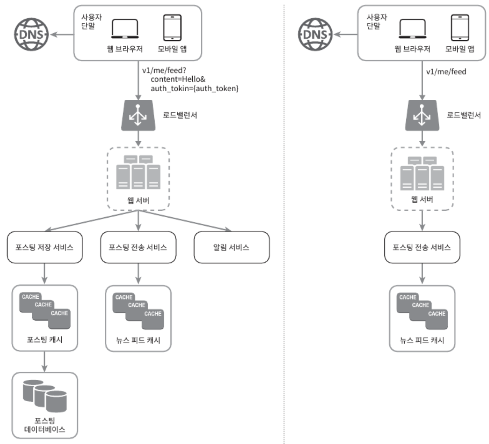

시스템 설계 면접은 두 명의 동료가 모호한 문제를 풀기 위해 협력하여 그 **해결책을 찾아내는 과정에 대한 시뮬레이션**이다.
- 정해진 결말도, 정답도 없다.
- 설계 기술을 시연하고, 설계 과정에서 내린 결정들에 대한 방어 능력을 보이고, 피드백을 건설적인 방식으로 처리할 자질을 보이는 자리다.

시스템 설계 면접은 **설계 능력의 기술적 측면을 평가**하는 것 뿐만 아니라, **협력에 적합한 사람**인지, **압박이 심한 상황도 잘 헤쳐 나갈 자질**이 있는지, **모호한 문제를 건설적으로 해결할 능력**이 있는지, **좋은 질문을 던질 능력**이 있는지 등을 살펴보는 자리다.

**부정적 신호**도 놓치면 안 된다. 설계의 순수성(purity)에 집착한 나머지 타협적 결정(tradeoff)을 도외시하고 과도한 엔지니어링(over-engineering)으로 시스템 전반의 비용이 올라갈 수 있다. 완고함, 편협함도 부정적인 신호에 포함된다.

# 4단계 접근법

시스템 설계 면접에서 절차나 범위에는 공통적인 부분이 있다.

## 1단계: 문제 이해 및 설계 범위 확정

시스템 설계 면접에서 생각 없이 바로 답을 내서는 좋은 점수를 받기 어렵다.
- 요구사항을 완전히 이해하지 않고 답을 내놓는 행위는 엄청난 부정적 신호다.
- 바로 답부터 들이밀지 말고, 속도를 늦추자.
- **깊이 생각**하고 **질문**하여 **요구사항과 가정들을 분명히** 하라.

엔지니어가 가져야 할 가장 중요한 기술 중 하나는 **올바른 질문**을 하는 것, **적절한 가정**을 하는 것, **시스템 구축에 필요한 정보**를 모으는 것이다.

**요구사항을 정확히 이해하는 데 필요한 질문들**
- 구체적으로 어떤 기능들을 만들어야 하나❓
- 제품 사용자 수는 얼마나 되나❓
- 회사 규모는 얼마나 빨리 커리리라 예상하나? 석 달, 여섯 달, 일년 뒤의 규모는❓
- 회사가 주로 사용하는 기술 스택은 무엇인가❓
- 설계를 단순화하기 위해 활용할 수 있는 기존 서비스로는 어떤 것을이 있는가❓

> 요구사항을 이해하고 모호함을 없애는 게 이 단계에서 가장 중요하다.

## 2단계: 개략적인 설계안 제시 및 동의 구하기

개략적인 설계안을 제시하고 면접관의 동의를 얻는 단계. 면접관과 협력하며 진행하면 좋다.

.

✅ **설계안에 대한 최초 청사진을 제시하고 의견을 구하자.**
- 면접관을 팀원처럼 대하자. 훌륭한 면접관들은 지원자들과 대화하고 설계 과정에 개입하기를 즐긴다.

✅ **화이트보드나 종이에 핵심 컴포넌트를 포함하는 다이어그램을 그리자.**
- 클라이언트(MW, WEB), API, 웹 서버, 데이터 저장소, 캐시, CDN, 메시지 큐 등이 포함

✅ **이 최초 설계안이 시스템 규모에 관계된 제약사항들을 만족하는지를 개략적으로 계산하자.**
- 계산 과정은 소리 내어 설명하자. 개략적인 추청이 필요한지는 면접관에게 미리 물어보자.

✅ **가능하다면 시스템의 구체적 사용 사례도 몇 가지 살펴보자.**
- 고려하지 못한 에지 케이스(edge case)를 발견하는 데도 도움이 될 것이다.

.

**예제**

뉴스 피드 시스템을 설계를 계략적으로 보면 두 가지 처리 플로(flow)로 나눠 생각해 볼 수 있다.
- 피드 발행(feed publishing): 사용자가 포스트를 올리면 관련된 데이터가 캐시/데이터베이스에 기록되고, 해당 사용자의 친구 뉴스 피드에 노출
- 피드 생성(feed building): 어떤 사용자의 뉴스 피드는 해당 사용자 친구들의 포스트를 시간 역순(최신 포스터부터)으로 정렬하여 생성

피드 발행과 피드 생성 플로를 각각 개략적으로 그린 예시

<figure><figcaption></figcaption></figure>

## 3단계: 상세 설계

## 4단계: 마무리