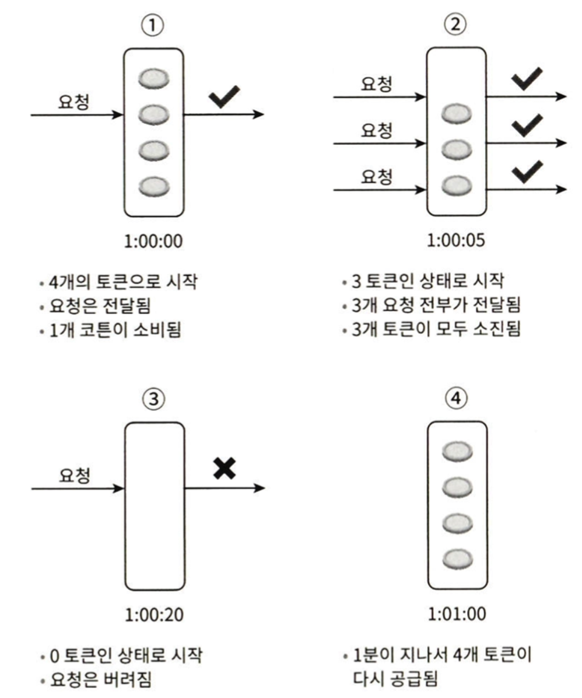

네트워크 시스템에서 처리율 제한 장치(rate limiter)는 **클라이언트 또는 서비스가 보내는 트래픽의 처리율(rate)을 제어하기 위한 장치**다.
- HTTP를 예로 들면 특정 기간 내에 전송되는 **클라이언트의 요청 횟수를 제한**
- API 요청 횟수가 제한 장치에 정의된 임계치(threshold)를 넘어서면 추가로 도달한 모든 호출은 처리가 중단(block)
- 처리율 제한 장치 적용 사례
  - 사용자는 초당 2회 이상 새 글을 올릴 수 없다.
  - 같은 IP 주소로 하루에 10개 이상의 계정을 생성할 수 없다.
  - 같은 디바이스로는 주당 5회 이상 리워드를 요청할 수 없다.

API에 처리율 제한 장치를 두면 좋은 점
- **DoS(Denial of Service) 공격에 의한 자원 고갈**(resource starvation) 방지
- **비용 절감** (적은 서버로 유지할 수 있고, 우선순위가 높은 API에 더 많은 자원 할당)
  - third-party API 사용료를 지불하고 있는 경우 중요
- **서버 과부화 방지**
  - 봇 또는 사용자의 잘못된 이용 패턴으로 유발된 트래픽을 필터링

# 1단계: 문제 이해 및 설계 범위 확정

처리율 제한 장치 구현을 위해 여러 알고리즘을 사용할 수 있는데, 각각 고유한 장단점을 가지고 있다.

**요구사항**
- 설정된 처리율을 초과하는 요청은 정확하게 제한
- 낮은 응답시간: HTTP 응답시간에 나쁜 영향을 주어서는 곤란
- 가능한 한 적은 메모리 사용
- 분산형 처리율 제한(distributed rate limiting): 하나의 처리율 제한 장치를 여러 서버나 프로세스에서 공유 가능
- 예외 처리: 요청 제한 시 사용자에게 분명하게 보여주어야 한다.
- 높은 결함 감내성(fault tolerance): 제한 장치의 장애가 전체 시스템에 영향을 주어서 안 된다.

# 2단계: 개략적 설계안 제시 및 동의 구하기

기본적으로 클라이언트-서버 통신 모델 사용

## 처리율 제한 장치의 위치

직관적으로 클라이언트 측에 둘 수도, 서버 측에 둘 수도 있다.
- `클라이언트 측`에 위치: 일반적으로 클라이언트는 처리율 제한을 **안정적으로 걸 수 있는 장소가 아니다.**
  - 클라이언트 요청은 쉽게 위변조가 가능하여 모든 클라이언트 구현을 통제하는 것이 어려울 수 있다.
- `서버 측`에 위치: 처리율 제한 장치를 **API 서버에 두는 방법**과 **처리율 제한 미들웨어**(middleware)를 만들어 해당 미들웨어로 API 서버로 가는 요청을 통제하도록 할 수도 있다.
  - 처리율 제한 시 HTTP 상태 코드 429(Too many requests) 반환
  - **API 게이트웨이**(처리율 제한을 지원하는 미들웨어)

.

처리율 제한 장치를 `서버`에 두어야 할지 `게이트웨이`에 두어야 할지는 정답이 없다.
- 회사의 기술 스택, 엔지니어링 인력, 우선순위, 목표에 따라 달라질 수 있다.
- 일반적으로 적용될 수 있는 몇 가지 지침
  - ✅ 현재 사용하고 있는 **기술 스택(언어, 캐시 서비스 등) 점검**
    - 사용하는 언어가 서버 측 구현을 지원하기 충분할 정도로 효율이 높은지 확인
  - ✅ 사업 필요에 맞는 **처리율 제한 알고리즘 탐색**
    - 서버 측에서 구현한다면 알고리즘을 자유롭게 선택할 수 있지만 제3 사업자 제공 게이트웨이를 사용한다면 선택지는 제한도리 수 있음
  - ✅ 설계가 마이크로서비스에 기반하고, 사용자 인증이나 IP 허용목록 관리 등을 처리하기 위해 **API 게이트웨이를 설계에 포함**시켰다면 처리율 제한 기능 또한 게이트웨이에 포함시켜야 할 수 있다.
  - ✅ 처리율 제한 장치 구현에 충분한 시간, 인력이 없다면 **상용 API 게이트웨이** 사용이 바람직한 방법

## 처리율 제한 알고리즘

처리율 제한을 실현하는 알고리즘은 여러 가지가 있다. 그중 널리 알려진 인기 알고리즘의 장단점을 간단하게 알아보자.
- `토큰 버킷`(token bucket)
- `누출 버킷`(leaky bucket)
- `고정 윈도 카운터`(fixed window counter)
- `이동 윈도 로그`(sliding window log)
- `이동 위도 카운터`(sliding window counter)

### 토큰 버킷 알고리즘

**처리율 제한에 폭넓게 이용되는 알고리즘**
- 간단하고, 알고리즘에 대한 세간의 이해도도 높은 편
- 인터넷 기업(아마존, 스트라이프)들이 보편적으로 사용

**동작 원리.**
- 지정된 용량을 갖는 컨테이너로 버킷에는 **사전 설정된 양의 토큰이 주기적으로 채워지고, 토큰이 꽉 찬 버킷에는 더 이상의 토큰은 추가되지 않는다.**
- 각 요청은 **처리될 떄마다 하나의 토큰을 사용**
  - 요청이 도착하면 버킷에 충분한 토큰이 있는지 검사. 충분할 경우 버킷에서 토큰 하나를 꺼낸 후 요청을 시스템에 전달. 토큰이 없을 경우 해당 요청은 버려짐.

<figure><figcaption></figcaption></figure>

토큰 버킷 알고리즘은 2개 인자를 받는다.
- 버킷 크기: 버킷에 담을 수 있는 토큰의 최대 개수 (ex. 4)
- 토큰 공급률: 초당 몇 개의 토큰이 버킷에 공급되는가 (ex. 4)

**버킷을 몇 개나 사용해야 하는지**는 공급 제한 규칙에 따라 달라진다.
- 통상 API 엔드포인트마다 별도의 버킷을 둔다.
- IP 주소별로 처리율 제한을 적용해야 한다면 IP 주소마다 버킷을 하나씩 할당
- 시스템 처리율을 초당 10,000개요청으로 제한하고 싶다면, 모든 요청이 하나의 버킷을 공유

**장점.**
- 쉬운 구현
- 메모리 사용 측면에서 효율적
- 짧은 시간에 집중되는 트래픽 처리 가능(버킷에 남은 토큰이 있기만 하면 요청은 시스템으로 전달)

**단점.**
- 버킷 크기와 토큰 공급률이라는 두 개의 인자를 적절하게 튜닝해야 하는 까다로움

# 3단계: 상세 설계

# 4단계: 마무리