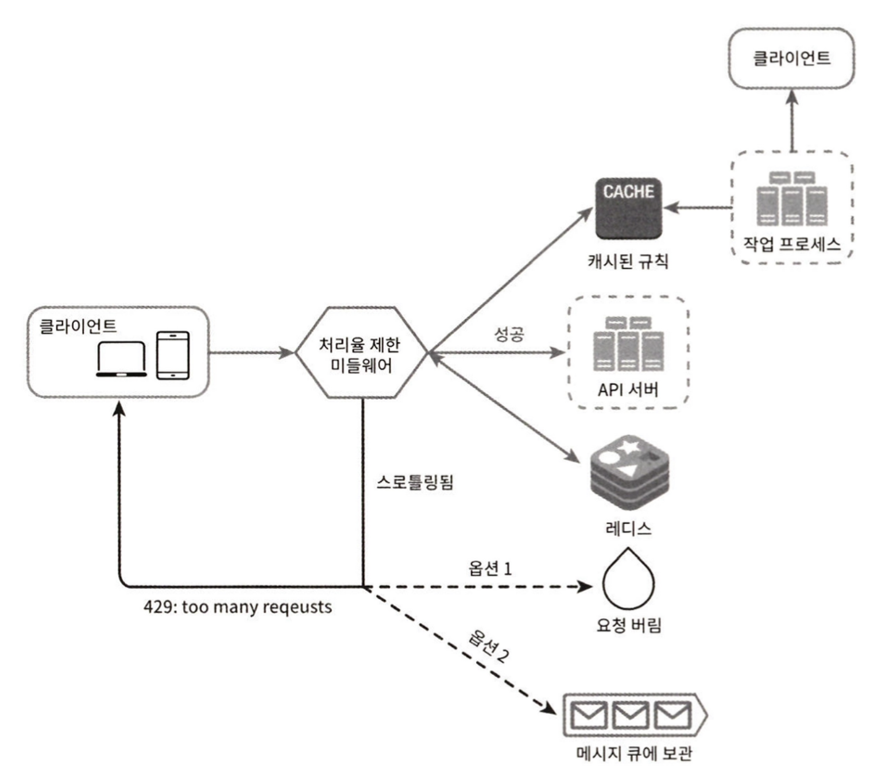
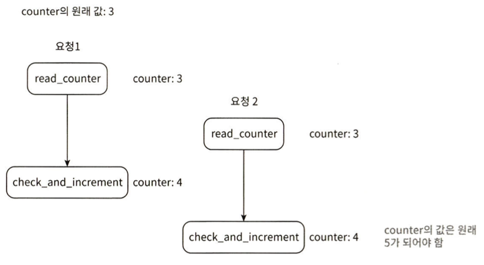
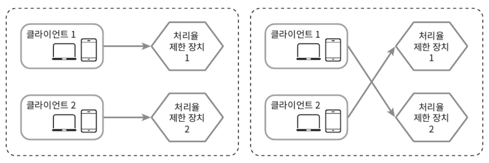
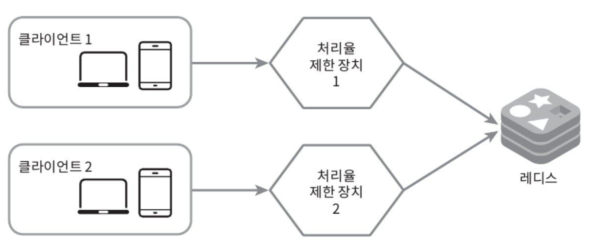

네트워크 시스템에서 처리율 제한 장치(rate limiter)는 **클라이언트 또는 서비스가 보내는 트래픽의 처리율(rate)을 제어하기 위한 장치**다.
- HTTP를 예로 들면 특정 기간 내에 전송되는 **클라이언트의 요청 횟수를 제한**
- API 요청 횟수가 제한 장치에 정의된 임계치(threshold)를 넘어서면 추가로 도달한 모든 호출은 처리가 중단(block)
- 처리율 제한 장치 적용 사례
  - 사용자는 초당 2회 이상 새 글을 올릴 수 없다.
  - 같은 IP 주소로 하루에 10개 이상의 계정을 생성할 수 없다.
  - 같은 디바이스로는 주당 5회 이상 리워드를 요청할 수 없다.

API에 처리율 제한 장치를 두면 좋은 점
- **DoS(Denial of Service) 공격에 의한 자원 고갈**(resource starvation) 방지
- **비용 절감** (적은 서버로 유지할 수 있고, 우선순위가 높은 API에 더 많은 자원 할당)
  - third-party API 사용료를 지불하고 있는 경우 중요
- **서버 과부화 방지**
  - 봇 또는 사용자의 잘못된 이용 패턴으로 유발된 트래픽을 필터링

# 1단계: 문제 이해 및 설계 범위 확정

처리율 제한 장치 구현을 위해 여러 알고리즘을 사용할 수 있는데, 각각 고유한 장단점을 가지고 있다.

**요구사항**
- 설정된 처리율을 초과하는 요청은 정확하게 제한
- 낮은 응답시간: HTTP 응답시간에 나쁜 영향을 주어서는 곤란
- 가능한 한 적은 메모리 사용
- 분산형 처리율 제한(distributed rate limiting): 하나의 처리율 제한 장치를 여러 서버나 프로세스에서 공유 가능
- 예외 처리: 요청 제한 시 사용자에게 분명하게 보여주어야 한다.
- 높은 결함 감내성(fault tolerance): 제한 장치의 장애가 전체 시스템에 영향을 주어서 안 된다.

# 2단계: 개략적 설계안 제시 및 동의 구하기

기본적으로 클라이언트-서버 통신 모델 사용

## 처리율 제한 장치의 위치

직관적으로 클라이언트 측에 둘 수도, 서버 측에 둘 수도 있다.
- `클라이언트 측`에 위치: 일반적으로 클라이언트는 처리율 제한을 **안정적으로 걸 수 있는 장소가 아니다.**
  - 클라이언트 요청은 쉽게 위변조가 가능하여 모든 클라이언트 구현을 통제하는 것이 어려울 수 있다.
- `서버 측`에 위치: 처리율 제한 장치를 **API 서버에 두는 방법**과 **처리율 제한 미들웨어**(middleware)를 만들어 해당 미들웨어로 API 서버로 가는 요청을 통제하도록 할 수도 있다.
  - 처리율 제한 시 HTTP 상태 코드 429(Too many requests) 반환
  - **API 게이트웨이**(처리율 제한을 지원하는 미들웨어)

.

처리율 제한 장치를 `서버`에 두어야 할지 `게이트웨이`에 두어야 할지는 정답이 없다.
- 회사의 기술 스택, 엔지니어링 인력, 우선순위, 목표에 따라 달라질 수 있다.
- 일반적으로 적용될 수 있는 몇 가지 지침
  - ✅ 현재 사용하고 있는 **기술 스택(언어, 캐시 서비스 등) 점검**
    - 사용하는 언어가 서버 측 구현을 지원하기 충분할 정도로 효율이 높은지 확인
  - ✅ 사업 필요에 맞는 **처리율 제한 알고리즘 탐색**
    - 서버 측에서 구현한다면 알고리즘을 자유롭게 선택할 수 있지만 제3 사업자 제공 게이트웨이를 사용한다면 선택지는 제한도리 수 있음
  - ✅ 설계가 마이크로서비스에 기반하고, 사용자 인증이나 IP 허용목록 관리 등을 처리하기 위해 **API 게이트웨이를 설계에 포함**시켰다면 처리율 제한 기능 또한 게이트웨이에 포함시켜야 할 수 있다.
  - ✅ 처리율 제한 장치 구현에 충분한 시간, 인력이 없다면 **상용 API 게이트웨이** 사용이 바람직한 방법

## 처리율 제한 알고리즘

처리율 제한을 실현하는 알고리즘은 여러 가지가 있다. 그중 널리 알려진 인기 알고리즘의 장단점을 간단하게 알아보자.
- `토큰 버킷`(token bucket)
- `누출 버킷`(leaky bucket)
- `고정 윈도 카운터`(fixed window counter)
- `이동 윈도 로그`(sliding window log)
- `이동 위도 카운터`(sliding window counter)

### 토큰 버킷 알고리즘

**처리율 제한에 폭넓게 이용되는 알고리즘**
- 간단하고, 알고리즘에 대한 세간의 이해도도 높은 편
- 인터넷 기업(`아마존`, `스트라이프`)들이 보편적으로 사용

**동작 원리.**
- 지정된 용량을 갖는 컨테이너로 버킷에는 **사전 설정된 양의 토큰이 주기적으로 채워지고, 토큰이 꽉 찬 버킷에는 더 이상의 토큰은 추가되지 않는다.**
- 각 요청은 **처리될 떄마다 하나의 토큰을 사용**
  - 요청이 도착하면 버킷에 충분한 토큰이 있는지 검사. 충분할 경우 버킷에서 토큰 하나를 꺼낸 후 요청을 시스템에 전달. 토큰이 없을 경우 해당 요청은 버려짐.

<figure><figcaption></figcaption></figure>

토큰 버킷 알고리즘은 2개 인자를 받는다.
- 버킷 크기: 버킷에 담을 수 있는 토큰의 최대 개수 (ex. 4)
- 토큰 공급률: 초당 몇 개의 토큰이 버킷에 공급되는가 (ex. 4)

**버킷을 몇 개나 사용해야 하는지**는 공급 제한 규칙에 따라 달라진다.
- 통상 API 엔드포인트마다 별도의 버킷을 둔다.
- IP 주소별로 처리율 제한을 적용해야 한다면 IP 주소마다 버킷을 하나씩 할당
- 시스템 처리율을 초당 10,000개요청으로 제한하고 싶다면, 모든 요청이 하나의 버킷을 공유

**장점.**
- 쉬운 구현
- 메모리 사용 측면에서 효율적
- 짧은 시간에 집중되는 트래픽 처리 가능(버킷에 남은 토큰이 있기만 하면 요청은 시스템으로 전달)

**단점.**
- 버킷 크기와 토큰 공급률이라는 두 개의 인자를 적절하게 튜닝해야 하는 까다로움

### 누출 버킷 알고리즘

토큰 버킷 알고리즘과 비슷하지만 요청 처리율이 고정되어 있는 점이 다르다.
- 보통 FIFO 큐로 구현
- 전자상거래 기업인 `Shopify` 사용

**동작 원리.**
- 요청이 도착하면 큐가 가득 차 있는지 확인. 빈 자리가 있다면 큐에 요청을 추가
- 큐가 가득 차 있을 경우 새 요청은 버림
- 지정된 시간마다 큐에서 요청을 꺼내어 처리

<figure><figcaption></figcaption></figure>

누출 버킷 알고리즘은 두 인자를 사용
- 버킷 크기: 큐 사이즈와 같은 값 (큐에는 처리될 항목들이 보관)
- 처리율: 지정된 시간당 몇 개의 항목을 처리할지 지정하는 값 (보통 초 단위로 표현)

**장점.**
- 큐의 크기가 제한되어 메모리 사용량 측면에서 효율적
- 고정된 처리율을 가지므로 안정적 출력(stable outflow rate)이 필요한 경우 적합

**단점.**
- 단시간에 많은 트래픽이 몰릴 경우 큐에 오래된 요청들이 쌓이고, 그 요청들을 제때 처리 못하면 최신 요청들은 버려짐
- 두 개 인자를 올바르게 튜닝하기 까다로울 수 있음

### 고정 윈도 카운터 알고리즘

**동작 원리.**
- 타임라인을 고정된 간격의 윈도로 나누고, 각 윈도마다 카운터를 붙인다.
- 요청이 접수될 때마다 이 카운터의 값은 1씩 증가.
- 이 카운터의 값이 사전에 설정된 임계치에 도달하면 새로운 요청은 새 윈도가 열릴 때까지 버려진다.

<figure><figcaption></figcaption></figure>

- 타임라인 시간 단위: 1초
- 시스템은 초당 3개까지의 요청만 허용
- 매초마다 열리는 윈도에 3개 이상의 요청이 밀려오면 초과분은 버려진다.

**장점.**
- 좋은 메모리 효율
- 이해하기 쉬움
- 윈도가 닫히는 시점에 카운터를 초기화하는 방식은 특정한 트래픽 패턴을 처리하기에 적합

**단점.**
- 윈도 경계 부근에서 일시적으로 많은 트래픽이 몰려들 경우, 기대했던 시스템 처리 한도보다 많은 양의 요청을 처리

    <figure><figcaption></figcaption></figure>

### 이동 윈도 로그 알고리즘

고정 윈도 카운터 알고리즘의 단점을 해결하는 알고리즘

**동작 원리.**

- 요청의 타임스탬프를 추적. 타임스탬프 데이터는 보통 레디스의 정렬 집합 같은 캐시에 보관.
- 새 요청이 오면 만료된 타임스탬프는 제거. (만료된 타임스탬프는 그 값이 현재 윈도의 시작 시점보다 오래된 타임스탬프를 말한다)
- 새 요청의 타임스탬프를 로그에 추가
- 로그의 크기가 허용치보다 같거나 작으면 요청을 시스템에 전달. 그렇지 않은 경우 처리를 거부

<figure><figcaption></figcaption></figure>

- 분당 2개 요청이 한도인 시스템

**장점.**
- 이동 윈도 로그 알고리즘이 구현하는 처리율 제한 매커니즘은 아주 정교하다.
- 어느 순간의 윈도를 보더라도 허용되는 요청 개수는 시스템의 처리율 한도를 넘지 않는다.

**단점.**
- 거부된 요청의 타임스템프도 보관하므로 다량의 메모리를 사용한다.

### 이동 위도 카운터 알고리즘

고정 윈도 카운터 알고리즘과 이동 윈도 로깅 알고리즘을 결한한 알고리즘

<figure><figcaption></figcaption></figure>

**동작 원리.**

처리율 제한 장치의 한도가 분당 7개 요청으로 설정되어 있을 경우. 이전 1분 동안 5개 요청, 그리고 현재 1분의 30% 시점에 3개의 요청이 왔다고 가정
- 현재 1분간의 요청 수 + 직전 1분간의 요청 수 X 이동 윈도와 직전 1분이 겹치는 비율
- `3 + 5 X 70%` = `6.5` 개 (반올림 또는 내림하여 사용)
- 처리율 제한 한도는 분당 7개 이므로 신규 요청은 시스템으로 전달되고, 그 직후에는 한도에 도달하였으므로 더 이상의 요청은 받을 수 없다.
- 또 한 가지 구현법. [System Design — Rate limiter and Data modelling](https://medium.com/@saisandeepmopuri/system-design-rate-limiter-and-data-modelling-9304b0d18250)

**장점.**
- 이전 시간대의 평균 처리율에 따라 현재 윈도의 상태를 계산하므로 짧은 시간에 몰리는 트래픽에도 대응
- 메모리 효율이 좋음

**단점.**
- 직전 시간대에 도착한 요청이 균등하게 분포되어 있다고 가정한 상태에서 추정치를 계산하므로 다소 느슨
- 이 문제는 생각만큼 심각하지 않지만 클라우드플레어가 실시했던 실험에 따르면 40억 개의 요청 가운데 시스템 실제 상태와 맞지 않게 허용되거나 버려진 요청은 0.003%에 불과
- [How we built rate limiting capable of scaling to millions of domains](https://blog.cloudflare.com/counting-things-a-lot-of-different-things)

### 개략적인 아키텍처

처리율 제한 알고리즘의 기본 아이디어는 단순하다.
- 얼마나 많은 요청이 접수되었는지를 **추적할 수 있는 카운터를 추적 대상별**(사용자별로? IP주소별로? API 엔드포인트나 서비스 단위로?)로 두고, 이 카운터의 값이 어떤 한도를 넘어서면 **한도를 넘어 도착한 요청은 거부**하는 것

카운터는 **어디에 보관**할 것인가?
- DB는 디스트 접근 때문에 늘리므로, **메모리상에서 동작하는 캐시**가 바람직하다.
  - 빠르고 시간에 기반한 만료 정책을 지원하기 떄문이다.
- **레디스**는 처리율 제한 장치를 구현할 때 자주 사용되는 메모리 기반 저장장치다.
  - INCR, EXPIRE 두 명령어를 지원한다.
  - INCR: 메모리에 저장된 카운터 값을 1만큼 증가
  - EXPIRE: 카운터에 타임아웃 값을 설정(설정된 시간이 지나면 카운터는 자동 삭제)

**처리율 제한 장치의 개략적 구조**

<figure><figcaption></figcaption></figure>

- 클라이언트가 처리율 제한 미들웨어에게 요청
- 처리율 제한 미들웨어는 레디스의 지정 버킷에서 카운터를 가져와 한도에 도달했는지 검사
  - 한도에 도달한 요청은 거부
  - 한도에 도달하지 않은 요청은 API 서버로 전달. 미들웨어는 카운터를 증가시킨 후 다시 레디스에 저장

# 3단계: 상세 설계

## 처리율 제한 규칙

[리프트(Lyft)](https://github.com/envoyproxy/ratelimit)는 처리율 제한에 오픈 소스를 사용

규칙들은 모통 설정 파일 형태로 디스크에 저장

```yaml
-- 시스템이 처리할 수 있는 마케팅 메시지의 최대치를 하루 5개로 제한한 예시
domain: messaging
descriptors:
  - key: message_type
    value: marketing
    rate_limit:
        unit: day
        requests_per_unit: 5

-- 클라이언트가 분당 5회 이상 로그인 할 수 없도록 제한
domain: auth
descriptors:
  - key: auth_key
    value: login
    rate_limit:
        unit: minute
        requests_per_unit: 5
```

## 처리율 한도 초과 트래픽 처리

어떤 요청이 한도 제한에 걸리면 API는 **HTTP 429 응답**(too many request)을 클라이언트에게 보낸다.
- 경우에 따라 한도 제한에 걸린 메시지를 나중에 처리하기 위해 큐에 보관할 수도 있다.

**처리율 제한 장치가 사용하는 HTTP 헤더**

HTTP 응답 헤더를 통해 클라이언트는 자기 요청이 처리율 제한에 걸리고 있는지, 처리율 제한에 걸리기까지 얼마나 많은 요청을 보낼 수 있는지 알 수 있다.
- `X-Ratelimit-Remaining`: 윈도 내 남은 처리 가능 요청 수
- `X-Ratelimit-Limit`: 매 윈도마다 클라이언트가 전송할 수 있는 요청의 수
- `X-Ratelimit-Retry-After`: 한도 제한에 걸리지 않기 위해 몇 초 뒤에 요청을 다시 보내야 하는지 알림

사용자가 너무 많은 요청을 보내면 429 too many requests 오류를 `X-Ratelimit-Retry-After` 헤더와 함께 반환하도록 한다.

## 상세 설계

처리율 제한 규칙은 디스크에 보관하고, **작업 프로세스**는 수시로 규칙을 디스크에서 읽어 캐시에 저장한다.

<figure><figcaption></figcaption></figure>

- 클라이언트가 요청을 서버에 보내면 요청은 먼저 **처리율 제한 미들웨어**에 도달
- 처리율 제한 미들웨어는 **제한 규칙을 캐시**에서 가져온다. 
  - 카운터 및 마지막 요청의 타임스탬프를 **레디스 캐시**에서 가져온다. 
  - 가져온 값들에 근거하여 해당 미들웨어는 아래 결정을 내린다.
    - 해당 요청이 처리율 제한에 걸리지 않은 경우 **API 서버**로 보낸다.
    - 해당 요청이 처리율 제한에 걸렸다면 429 too many requests 에러를 클라이언트에 보낸다. 해당 요청은 버릴 수도, 메시키 쥬에 보관할 수도 있다.

## 분산 환경에서의 처리율 제한 장치의 구현

여러 대의 서버와 병렬 스레드를 지원하도록 시스템을 확장하는 것은 또 다른 문제.

다음 두 가지 어려운 문제를 풀어야 한다.
- `경쟁 조건`(race condition)
- `동기화`(synchronization)

---

**경쟁 조건**

병행성이 심한 환경에서는 경쟁 조건 이슈가 발생할 수 있다.
- 레디스에서 카운터 값 읽기
- 카운터 값에 1을 더한 값이 임계치를 넘는지 확인
- 넘지 않았다면 레디스에 보관된 카운터 값을 1 증가

<figure><figcaption></figcaption></figure>

경쟁 조건 문제를 해결하는 가장 널리 알려진 해결책은 Lock 이다.
- 락은 시스템 성능을 상당히 떨어뜨리는 문제가 있다.
- 락 대신 쓸 수 있는 해결책은 `루아 스크립트`(Lua script), `정렬 집합`(sorted set)이라 불리는 레디스 자료구조를 사용하는 것이다.
  - [Better Rate Limiting With Redis Sorted Sets](https://engineering.classdojo.com/blog/2015/02/06/rolling-rate-limiter/)
  - [Scaling your API with rate limiters](https://stripe.com/blog/rate-limiters)

---

**동기화 이슈**

동기화는 분산 환경에서 고려해야 할 또 다른 중요한 요소이다.
- 처리율 제한 장치 서버를 여러 대 두게 되면 동기화가 필요해진다.
- 웹 계층은 무상태이므로 동기화하지 않으면 제한 장치 1은 클라이언트 2에 대해 아무것도 모르므로 처리율 제한을 올바르게 수행할 수 없다.

<figure><figcaption></figcaption></figure>

이에 대한 해결책으로 고정 세션(sticky session)을 활용하는 것이다.
- 같은 클라이언트로부터의 요청은 항상 같은 처리율 제한 장치로 보낼 수 있도록 하는 방법
- 하지만, 이 방법은 규모면에서 확장 가능하지 않고 유연하지 않으므로 추천하지 않는다.

더 나은 해결책으로 `레디스` 같은 **중앙 집중형 데이터 저장소**를 쓰는 것이다.

<figure><figcaption></figcaption></figure>

---

**성능 최적화**

지금까지의 설계에서 두 가지 지점에서 개선이 가능하다.

(1) 여러 데이터센터를 지원하는 문제
- 데이터센터애서 멀리 떨어진 사용자를 지원하려다 보면 지연시간(latency)이 증가할 수밖에 없다.
- 대부분의 클라우드 서비스 사업자는 세계 곳곳에 에지 서버(edge server)를 심어놓고 있다.
- 사용자의 트래픽을 가장 가까운 에지 서버로 전달하여 지연시간을 줄일 수 있다.

(2) 제한 장치 간에 데이터를 동기화할 때 **최종 일관성 모델**(eventual consistency model) 사용

---

**모니터링**

처리율 제한 장치를 설치한 이후 효과적으로 동작하는지 데이터를 모을 필요가 있다.


# 4단계: 마무리