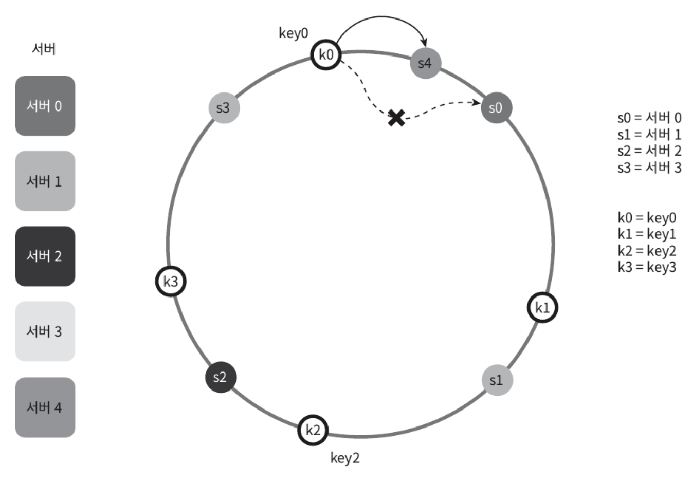
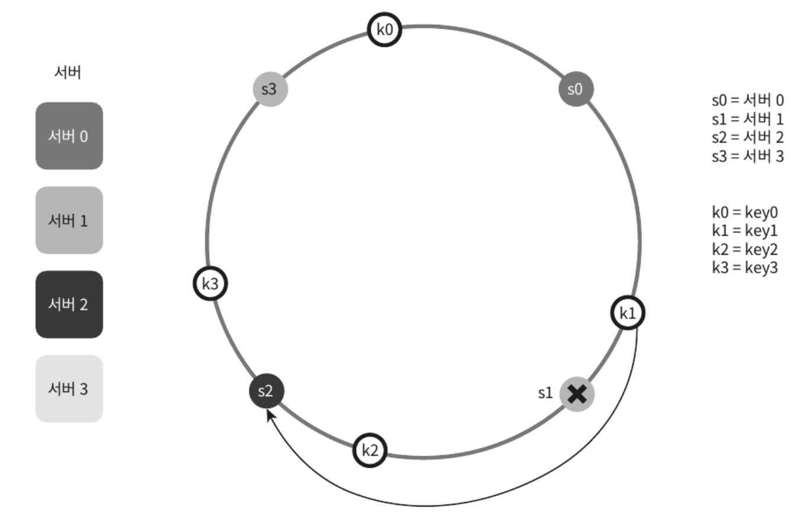
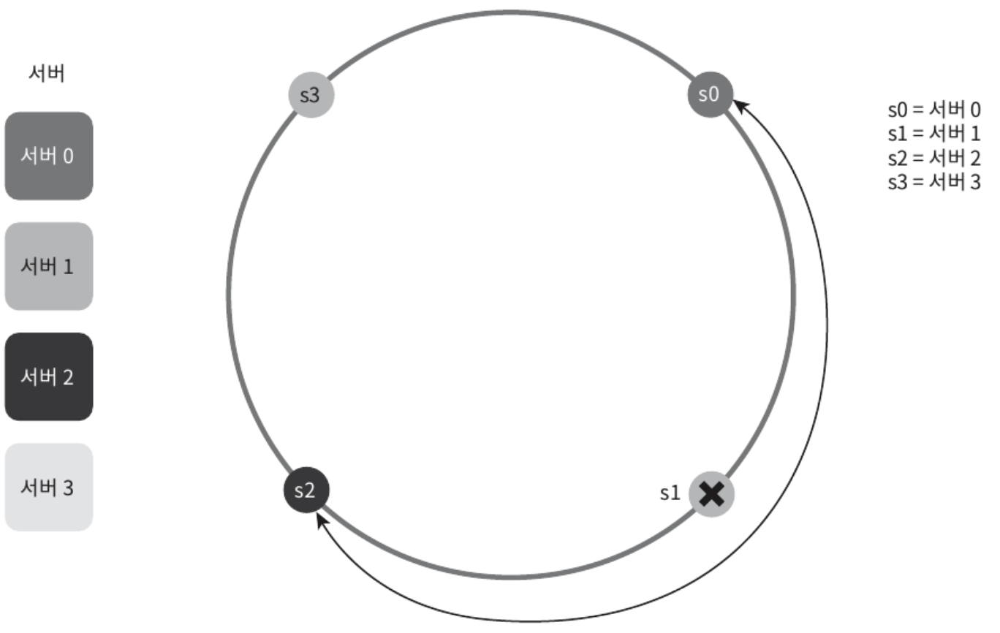
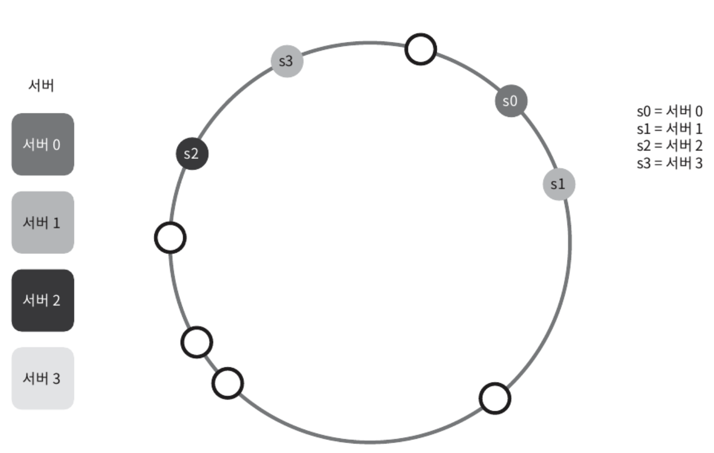
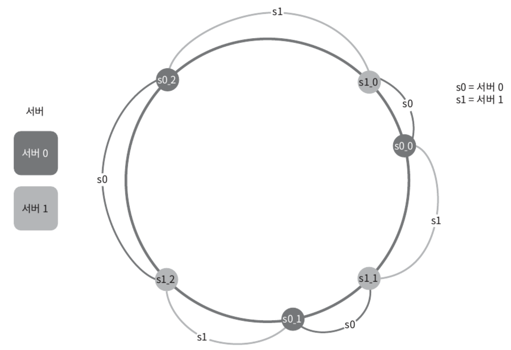
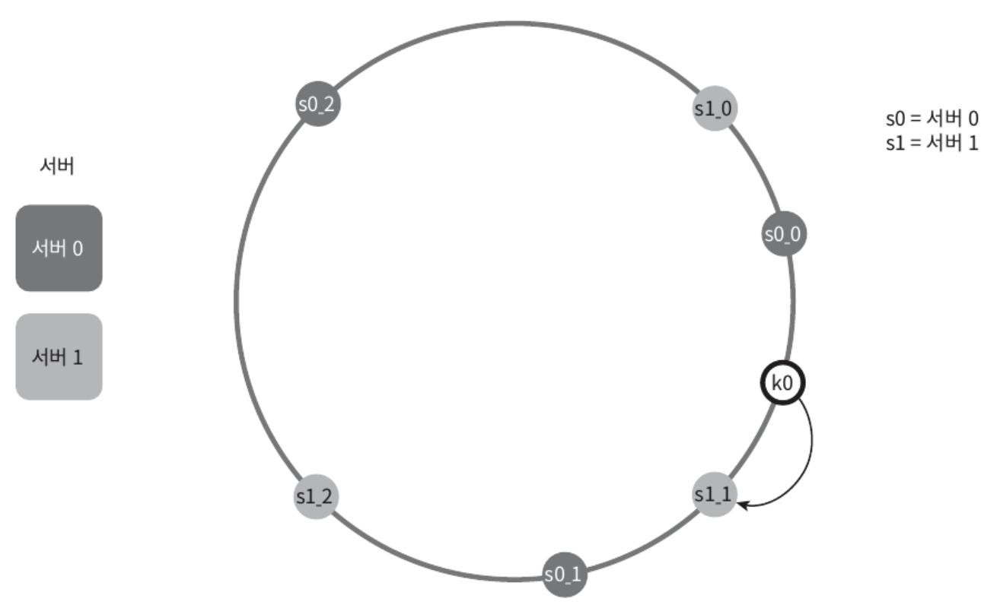

수평적 규모 확장성을 달성하기 위해 요청 또는 데이터를 서버에 균등하게 나누는 것이 중요하다.
- **안정 해시**는 이 목표를 달성하기 위해 **보편적으로 사용하는 기술**이다.

# 해시 키 재배치 문제

N개의 캐시 서버가 있다면, 서버들에 부하를 균등하게 나누는 보편적인 방법은 하시 함수를 사용하는 것이다.

`serverIndex = hash(key) % N` (N은 서버 개수)

총 4대의 서버를 사용한다면 각 키에 대한 해시 값과 서버 인덱스를 계산하면 아래와 같다.

<figure><figcaption></figcaption></figure>

특정 키가 보관된 서버를 알아내기 위해 나머지 연산을 `f(key) % 4` 적용
- hash(key0) % 4 = 1 이면, 클라이언트는 캐시에 보관된 데이터를 가져오기 위해 서버 1에 접속

이 방법은 서버 풀(server pool) 크기가 고정되어 있고, 데이터 분포가 균등할 때는 잘 동작하지만, 서버가 추가되거나 기존 서버가 삭제되면 문제가 생긴다.
- 나머지 연산을 적용하여 계산한 서버 인덱스 값이 달려져서 대부분의 키가 재분배되고, 캐시 클라이언트가 데이터가 없는 엉뚱한 서버에 접속하게 된다.
- 결과적으로 대규모 캐시 미스가 발생하게 될 것이다.
  
> 안정 해시는 이 문제를 효과적으로 해결하는 기술이다.

# 안정 해시

> 안정 해시
>
> 해시 테이블 크기가 조정될 때 평균적으로 오직 k/n개의 키만 재배치하는 해시 기술 (k: 키의 개수, n: 슬롯 개수)

(이와 달리 대부분의 전통 해시 테이블은 슬롯의 수가 바뀌면 거의 대부분 키를 재배치)

## 해시 공간과 해시 링

안정 해시의 동작 원리
- 해시 함수 f로는 SHA-1을 사용한다고 하고, 그 함수의 출력 값 범위는 x0, x1, x2, x3, ...xn과 같다고 하자.
- SHA-1의 해시 공간(hash space) 범위는 0부터 2^160 - 1까지라고 알려져 있다.
- 따라서 x0은 0, xn은 2^160 - 1이며, 나머지 x1부터 xn-1까지는 그 사이의 값을 갖게 된다.

<figure><figcaption></figcaption></figure>

이 해시 공간의 양 쪽을 구부려 접으면 해시 링(hash ring)이 만들어진다.

<figure><figcaption></figcaption></figure>

## 해시 서버

이 해시 함수 f를 사용하면 서버 IP나 이름을 링 위의 어떤 위치에 대응시킬 수 있다.
- 4개의 서버를 이 해시 링 위에 배치한 결과

<figure><figcaption></figcaption></figure>

## 해시 키

여기 사용된 해시 함수는 "해시 키 재배치 문제" 언급된 함수와 다르며, 나머지 연산 %은 사용하지 않고 있다.
- 캐시할 키 key0, key1, key2, key3 또한 해시 링 위의 어느 지점에 배치할 수 있다.

<figure><figcaption></figcaption></figure>

## 서버 조회

어떤 키가 저장되는 서버는 해당 키의 위치로부터 시계 방향으로 링을 탐색해 나가면서 만나는 첫 번째 서버
- key0은 서버 0에 저장되고 key1은 서버 1에, key2는 서버 2, key3은 서버 3에 저장

<figure><figcaption></figcaption></figure>

## 서버 추가

서버를 추가하더라도 키 가운데 일부만 재배치하면 된다.
- 서버 4가 추가된 뒤 key0만 서버 4로 재배치되고 다른 키들은 유지
- key0의 위치에서 시계 방향으로 순회했을 때 처음으로 만나게 되는 서버가 서버 4

<figure><figcaption></figcaption></figure>

## 서버 제거

하나의 서버가 제거되면 키 가운데 일부만 재배치
- 서버 1이 삭제되었을 때 key1만 서버 2로 재배치
- 나머지 키에는 영향 없음

<figure><figcaption></figcaption></figure>

## 기본 구현법의 두 가지 문제

**기본 절차**
- 서버와 키를 균등 분포 해시 함수를 사용해 해시 링에 배치
- 키의 위치에서 링을 시계 방향으로 탐색하다 만나는 최초의 서버가 키가 저장될 서버

.

**문제점**

(1) 서버가 추가되거나 삭제되는 상황을 감안하면 파티션의 크기를 균등하게 유지하는 게 불가능
- 파티션은 인접한 서버 사이의 해시 공간
- 서버 1이 삭제되어 서버 2의 파티션이 다른 파티션 대비 두 배로 커지는 상황

<figure><figcaption></figcaption></figure>

(2) 키의 균등 분포를 달성하기 어려움
- 서버 1과 서버 3은 아무 데이터도 갖지 않는 반면, 대부분의 키는 서버 2에 보관

<figure><figcaption></figcaption></figure>

> 이 문제를 해결하기 위해 제안된 기법이 가상 노드(virtual node) 또는 복제(replica)라 불리는 기법

## 가상 노드

가상 노드는 **실제 노드** 또는 **서버를 가리키는 노드**
- 하나의 서버는 링 위에 여러 개의 가상 노드를 가질 수 있음
- 아래 예시를 보면 서버 0과 서버 1은 3개의 가상 노드를 갖는다. (실제 시스템에서는 그보다 훨씬 큰 값을 사용)
- 각 서버는 하나가 아닌 여러 개 파티션을 관리해야 한다.

<figure><figcaption></figcaption></figure>

키의 위치로부터 시계방향으로 링을 탐색하다 만나는 가상 노드가 해당 키에 저장될 서버가 된다.
- k0가 저장되는 서버는 s1_1, 즉 서버 1

<figure><figcaption></figcaption></figure>

가상 노드 개수를 늘리면 키의 분포는 점점 더 균등해진다.
- **표준 편차**(standard deviation)가 작아져서 데이터가 고르게 분포되기 때문
  - 표준 편차: 데이터가 어떻게 퍼져 나갔는지 보이는 척도
  - 100~200개의 가상 노드를 사용했을 경우 표준 편차 값은 평균의 5%에서 10% 사이
  - 가상 노드의 개수를 더 늘리면 표준 편차의 값은 더 떨어지지만 가상 노드 데이터를 저장할 공간은 더 많이 필요할 것이다.
  - [Consistent Hashing](https://tom-e-white.com/2007/11/consistent-hashing.html)
- **타협적 결정**(tradeoff)이 필요하니 시스템 요구사항에 맞도록 가상 노드 개수를 적절히 조정해야 함

# 마치며