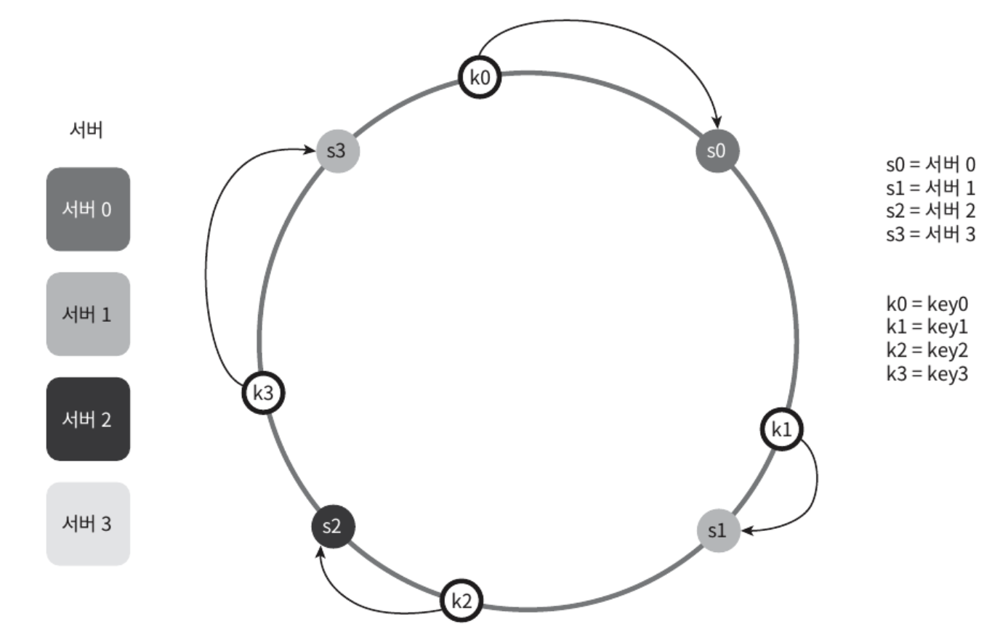

수평적 규모 확장성을 달성하기 위해 요청 또는 데이터를 서버에 균등하게 나누는 것이 중요하다.
- **안정 해시**는 이 목표를 달성하기 위해 **보편적으로 사용하는 기술**이다.

# 해시 키 재배치 문제

N개의 캐시 서버가 있다면, 서버들에 부하를 균등하게 나누는 보편적인 방법은 하시 함수를 사용하는 것이다.

`serverIndex = hash(key) % N` (N은 서버 개수)

총 4대의 서버를 사용한다면 각 키에 대한 해시 값과 서버 인덱스를 계산하면 아래와 같다.

<figure><figcaption></figcaption></figure>

특정 키가 보관된 서버를 알아내기 위해 나머지 연산을 `f(key) % 4` 적용
- hash(key0) % 4 = 1 이면, 클라이언트는 캐시에 보관된 데이터를 가져오기 위해 서버 1에 접속

이 방법은 서버 풀(server pool) 크기가 고정되어 있고, 데이터 분포가 균등할 때는 잘 동작하지만, 서버가 추가되거나 기존 서버가 삭제되면 문제가 생긴다.
- 나머지 연산을 적용하여 계산한 서버 인덱스 값이 달려져서 대부분의 키가 재분배되고, 캐시 클라이언트가 데이터가 없는 엉뚱한 서버에 접속하게 된다.
- 결과적으로 대규모 캐시 미스가 발생하게 될 것이다.
  
> 안정 해시는 이 문제를 효과적으로 해결하는 기술이다.

# 안정 해시

> 안정 해시
>
> 해시 테이블 크기가 조정될 때 평균적으로 오직 k/n개의 키만 재배치하는 해시 기술 (k: 키의 개수, n: 슬롯 개수)

(이와 달리 대부분의 전통 해시 테이블은 슬롯의 수가 바뀌면 거의 대부분 키를 재배치)

## 해시 공간과 해시 링

안정 해시의 동작 원리
- 해시 함수 f로는 SHA-1을 사용한다고 하고, 그 함수의 출력 값 범위는 x0, x1, x2, x3, ...xn과 같다고 하자.
- SHA-1의 해시 공간(hash space) 범위는 0부터 2^160 - 1까지라고 알려져 있다.
- 따라서 x0은 0, xn은 2^160 - 1이며, 나머지 x1부터 xn-1까지는 그 사이의 값을 갖게 된다.

<figure><figcaption></figcaption></figure>

이 해시 공간의 양 쪽을 구부려 접으면 해시 링(hash ring)이 만들어진다.

<figure><figcaption></figcaption></figure>

## 해시 서버

이 해시 함수 f를 사용하면 서버 IP나 이름을 링 위의 어떤 위치에 대응시킬 수 있다.
- 4개의 서버를 이 해시 링 위에 배치한 결과

<figure><figcaption></figcaption></figure>

## 해시 키

여기 사용된 해시 함수는 "해시 키 재배치 문제" 언급된 함수와 다르며, 나머지 연산 %은 사용하지 않고 있다.
- 캐시할 키 key0, key1, key2, key3 또한 해시 링 위의 어느 지점에 배치할 수 있다.

<figure><figcaption></figcaption></figure>

## 서버 조회

어떤 키가 저장되는 서버는 해당 키의 위치로부터 시계 방향으로 링을 탐색해 나가면서 만나는 첫 번째 서버
- key0은 서버 0에 저장되고 key1은 서버 1에, key2는 서버 2, key3은 서버 3에 저장

<figure><figcaption></figcaption></figure>

# 마치며