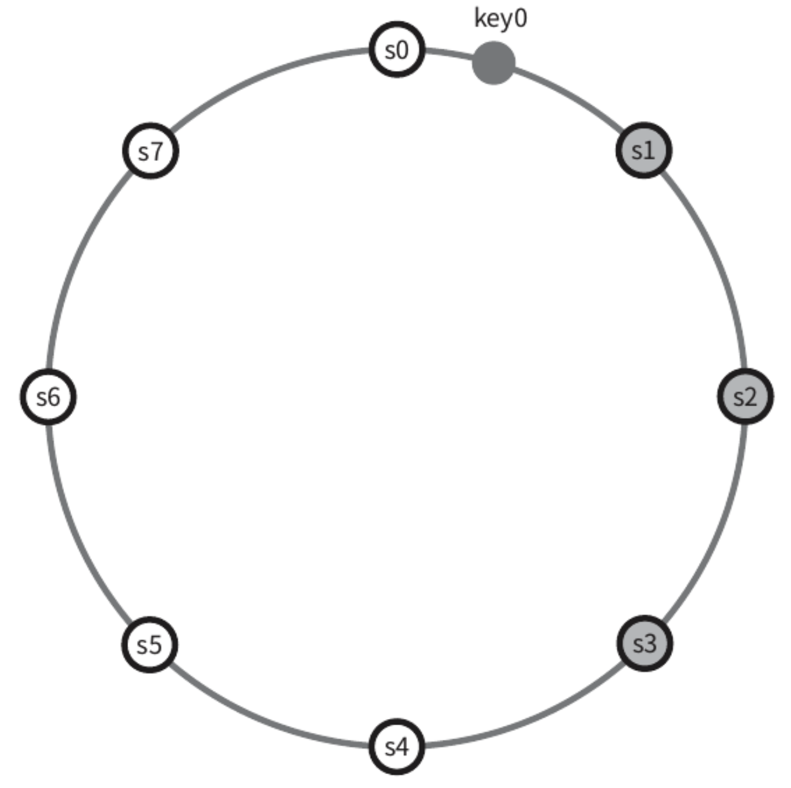
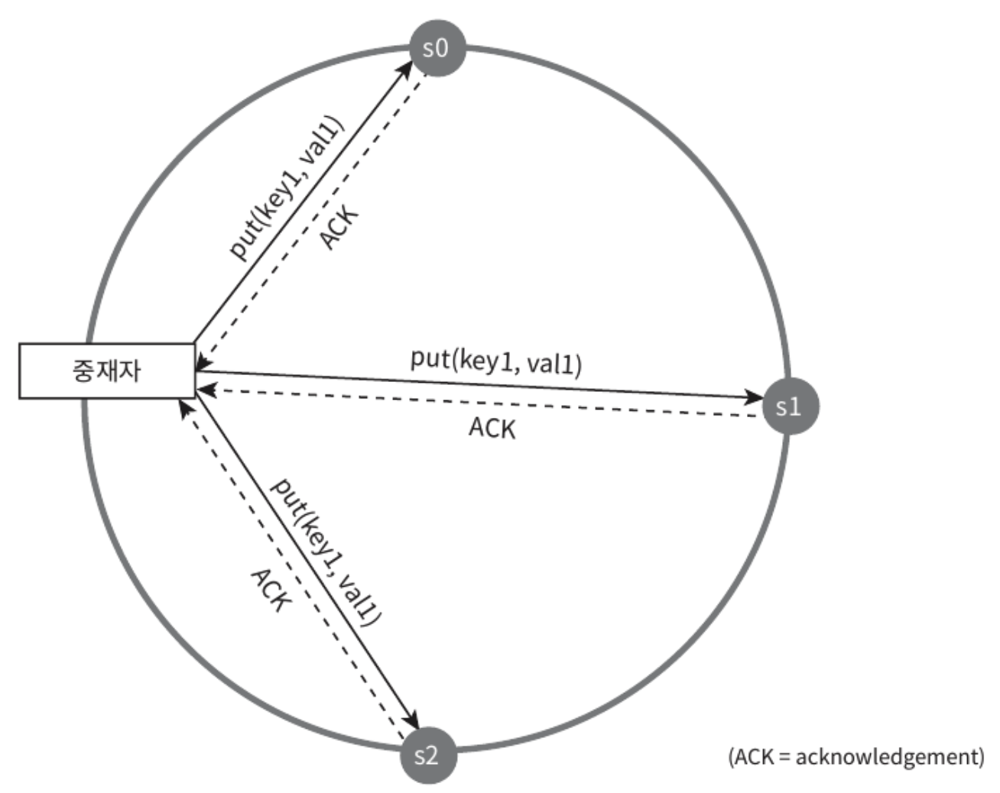
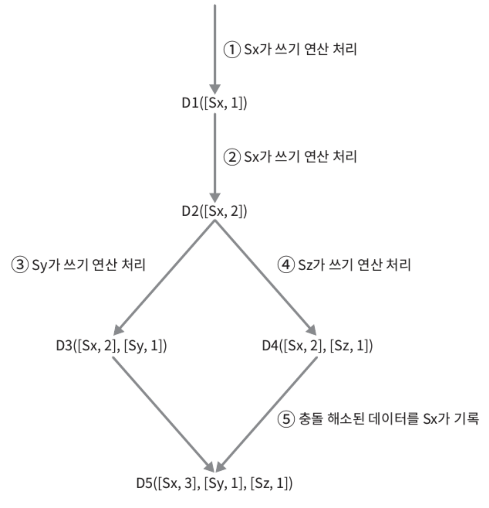
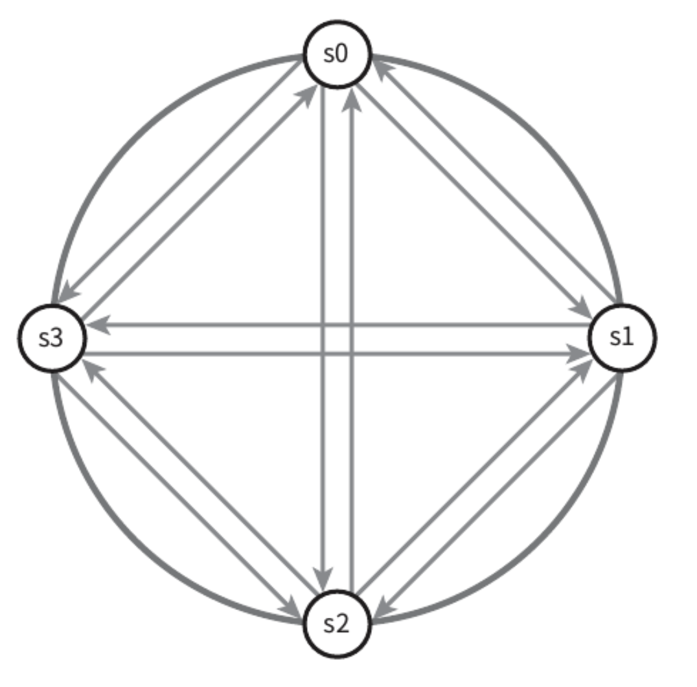
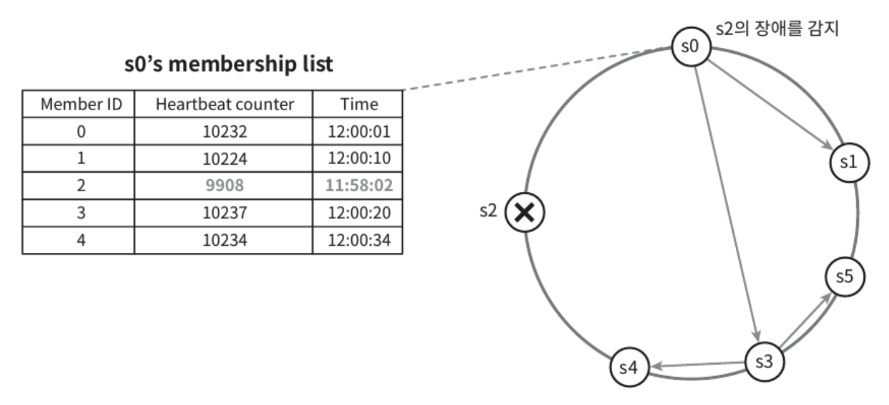
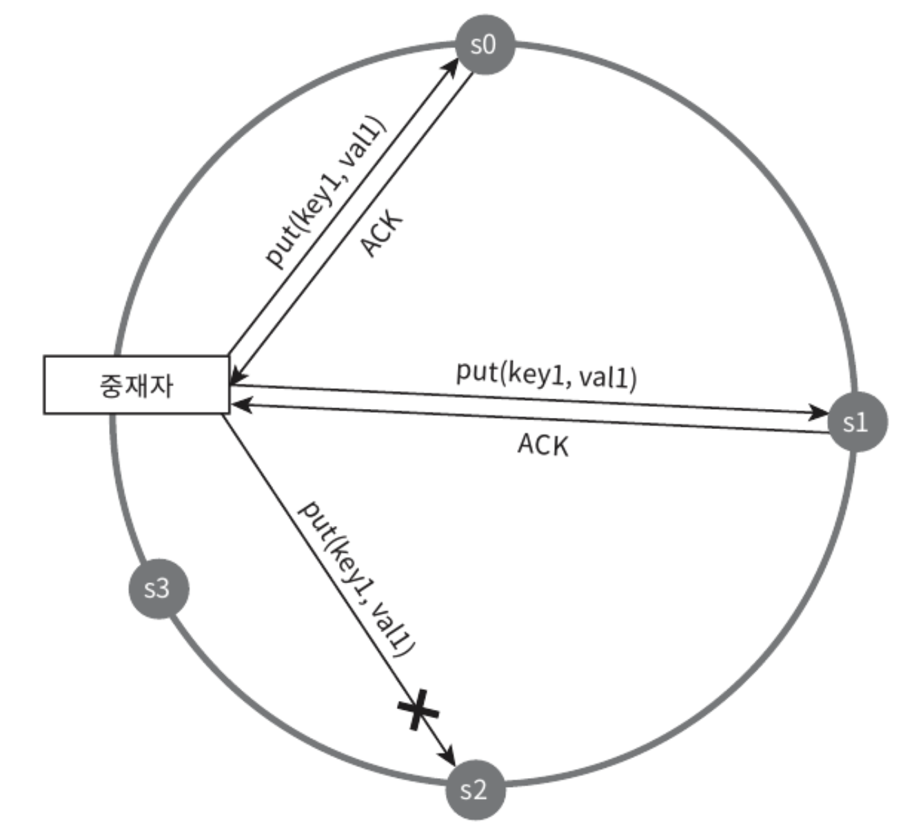

카-값 저장소(key-value store)는 키-값 데이터베이스라고도 불리는 **비 관계형 데이터베이스**이다.
- 이 저장소에 저장되는 값은 **고유 식별자**(identifier)를 키로 가져야 한다.
- 키와 값 사이의 이런 연결 관계를 `key-value` pair 라고 지칭한다.

키-값 쌍에서의 **키는 유일**해야 하며 **해당 키에 매달린 값은 키를 통해서만 접근 가능**하다.
- 키는 일반 텍스트일 수도, 해시 값일 수도 있다.
- 성능상 키는 짧을 수록 좋다.

키-값 쌍에서의 값은 문자열일 수도, 리스트 일 수도, 객체일 수도 있다.
- 키-값 저장소는 보통 값으로 무엇이 오든 상관하지 않는다.
- 널리 알려진 키-값 저장소로는 `Amazon Dynamo`, `memcached`, `redis` 등이 있다.

# 문제 이해 및 설계 범위 확정

- 키-값 쌍의 크기는 **10KB 이하**
- **큰 데이터**를 저장할 수 있어야 한다.
- **높은 가용성**을 제공해야 한다.(시스템은 장애가 있더라도 빠르게 응답해야 한다.)
- **높은 규모 확장성**을 제공해야 한다.(트래픽 양에 따라 자동적으로 서버 증설/삭제가 이루어져야 한다.)
- **데이터 일관성 수준**은 조정이 가능해야 한다.
- **응답 지연시간**(latency)이 짧아야 한다.

# 단일 서버 키-값 저장소

한 대 서버만 사용하는 키-값 저장소를 설계하는 것은 쉽다.
- 가장 직관적인 방법은 키-값 쌍을 전부 메모리에 해시 테이블로 저장하는 것
- 속도는 빠르지만 모든 데이터를 메모리에 저장하는 것은 불가능
- **데이터 압축**과 **자주 쓰이는 데이터만 메모리에 두고 나머지는 디스크에 저장**하는 방법이 있다.

언젠가 한 대의 서버로는 부족하여 많은 데이터를 저장하려면 분산 키-값 저장소(distributed key-value store)를 만들 필요가 있다.

# 분산 키-값 저장소

분산 키-값 저장소는 **키-값 쌍을 여러 서버에 분산**시켜서 `분산 해시 테이블`이라고도 불린다.
- 분산 시스템을 설계할 때는 `CAP 정리`(Consistency, Availability, Partition Tolerance theorem)를 이해해야 한다.

## CAP 정리

데이터 일관성(Consistency), 가용성(Availability), 파티션 감내(Partition tolerance)라는 세 가지 요구사항을 동시에 만족하는 분산 시스템을 설계하는 것은 불가능하다는 정리
- `데이터 일관성`: 분산 시스템에 접속하는 모든 클라이언트는 어떤 노드에 접속했느냐에 관계없이 **언제나 같은 데이터를 보게 되어야 한다.**
- `가용성`: 분산 시스템에 접속하는 클라이언트는 **일부 노드에 장애가 발생하더라도 항상 응답을 받을 수 있어야 한다.**
- `파티션 감내`: 파티션은 **두 노드 사이에 통신 장애가 발생하였음을 의미**한다. 파티션 감내는 네트워크에 파티션이 생기더라도 **시스템은 계속 동작하여야 한다**는 것을 뜻한다.

CAP 정리는 어떤 두 가지를 충족하려면 나머지 하나는 반드시 희생되어야 한다는 것을 의미한다.

<figure><figcaption></figcaption></figure>

세 가지 요구사항 가운데 어느 두 가지를 만족하느냐에 따라 다음과 같이 분류할 수 있다.

- `CP 시스템`: 일관성과 파티션 감내를 지원하는 키-값 저장소. (가용성을 희생)
- `AP 시스템`: 가용성과 파티션 감내를 지원하는 키-값 저장소. (데이터 일관성을 희생)
- `CA 시스템`: 일관성과 가용성을 지원하는 키-값 저장소. (파티션 감내는 미지원)
  - 통상 네트워크 장애는 피할 수 없으므로 분산 시스템은 반드시 파티션 문제를 감내할 수 있도록 설계되어야 한다.
  - 실세계에 존재하지 않는 시스템

**이상적 상태**

이상적인 환경이라면 네트워크가 파티션(두 노드 사이에 통신 장애가 발생)되는 상황은 절대로 일어나지 않을 것이다.
- n1에 기록된 데이터는 자동적으로 n2, n3에 복제
- 데이터 일관성과 가용성 만족

<figure><figcaption></figcaption></figure>

**실세계의 분산 시스템**

분산 시스템은 파티션 문제를 피할 수 없다.
- 파티션 문제가 발생하면 일관성과 가용성 사이에서 하나를 선택해야 한다.

<figure><figcaption></figcaption></figure>

가용성 대신 일관성을 선택(CP 시스템)한다면 데이터 불일치 문제를 피하기 위해 n1, n2에 대해 **쓰기 연산을 중단**시켜야 하는데, 그러면 가용성이 깨진다.
- 은행권 시스템은 보통 데이터 일관성을 양보하지 않음
- 네트워크 파티션으로 일관성이 깨질 수 있는 상황이 발생하면 해결 전까지는 오류를 반환해야 한다.

일관성 대신 가용성을 선택(AP 시스템)하면 **낡은 데이터를 반환할 위험성이 있더라도 계속 읽기 연산을 허용**해야 한다.
- n1, n2는 계속 쓰기 연산을 허용하고, 파티션 문제 해결 뒤 새 데이터를 n3에 전송

> 분산 키-값 저장소를 만들 때 요구사항에 맞도록 CAP 정리를 적용해야 한다.

## 시스템 컴포넌트

키-값 저장소 구현에 사용될 핵심 컴포넌트 및 기술
- 데이터 파티션
- 데이터 다중화(replication)
- 일관성(consistency)
- 일관성 불일치 해소(inconsistency resolution)
- 장애 처리
- 시스템 아키텍처 다이어그램
- 쓰기 경로(write path)
- 읽기 경로(read path)

### 데이터 파티션

대규모 애플리케이션은 전체 데이터를 작은 파티션들로 분할한 다음 여러 대의 서버에 저장해야 한다. 여기서 데이터를 파티션 단위로 나눌 때 두 가지 문제를 중요하게 따져야 한다.
- 데이터를 여러 서버에 고르게 분산할 수 있는가?
- 노드가 추가되거나 삭제될 때 데이터의 이동을 최소화할 수 있는가?

<a href="https://jihunparkme.gitbook.io/docs/book/system-design-interview/05" target="_blank">안정 해시(consistent hash)</a>는 이러한 문제를 푸는 데 적합한 기술이다.

안정 해시를 사용하여 데이터를 파티션하면 좋은 점
- 규모 확장 자동화(automatic scaling): 시스템 부하에 따라 서버가 자동으로 추가되거나 삭제되도록 만들 수 있음
- 다양성(heterogeneity): 각 서버의 용량에 맞게 가상 노도 수 조정 가능

### 데이터 다중화

높은 가용성과 안정성을 확보하기 위해 데이터를 N개 서버에 비동기적으로 다중화할 필요가 있다.

N개 서버를 선장하는 방법
- 어떤 키를 해시 링 위에 배치 후, 그 지점으로부터 시계 방향으로 링을 순회하면서 만나는 첫 N개 서버에 데이터 사본을 보관

<figure><figcaption></figcaption></figure>

단, 가상 노드를 사용한다면 N개의 노드가 대응될 실제 물리 서버의 개수가 N보다 작아질 수 있다. 
- 이 문제를 피하려면 노드 선택 시 같은 물리 서버를 중복 선택하지 않도록 해야 한다.
- 자연재해 등의 문제를 동시에 겪는 일을 막고, 안정성 담보를 위해 데이터 사본은 다른 센터의 서버에 보관하고 센터들은 고속 네트워크로 연결한다.

### 데이터 일관성

여러 노드에 다중화된 데이터는 적절히 동기화되어야 한다. 정족수 합의(Quorum Consensus) 프로토콜을 사용하면 읽기/쓰기 연산 모두에 일관성을 보장할 수 있다.
- `N`: 사본 개수
- `W`: 쓰기 연산에 대한 정족수
  - 쓰기 연산 성공으로 간주되려면 적어도 W개의 서버로부터 쓰기 연산 성공 응답을 받아야 함.
- `R`: 읽기 연산에 대한 정족수
  - 읽기 연산 성공으로 간주되려면 적어도 R개의 서버로부터 쓰기 읽기 성공 응답을 받아야 함.

<figure><figcaption></figcaption></figure>

W가 1일 경우
- 쓰기 연산 성공 판단을 위해 중재자(coordinator)는 최소 한 대 서버로부터 쓰기 성공 응답을 받아야 한다.
- s1으로부터 성공 응답을 받았다면 s0, s2로부터 응답은 기다릴 필요가 없다.
- 중재자는 클라이언트와 노드 사이의 프락시 역할을 한다.

W, R, N 값을 정하는 것은 응답 지연과 데이터 일관성 사이의 타협점을 찾는 전형적인 과정이다.
- W = 1 또는 R = 1 구성의 경우, 중재자 응답 속도는 빠를 것이다.
- W > 1 또는 R > 1 구성의 경우, 데이터 일관성 수준은 향상될 것이지만 중재자 응답 속도는 가장 느린 서버로부터의 응답을 기다려야 하므로 느려질 것이다.
- W + R > N 인 경우, 강한 일관성이 보장된다.
  - 일관성을 보증할 최신 데이터를 가진 노드가 최소 하나는 겹칠 것이기 떄문.

N, W, R 값을 정하는 몇 가지 구성
- `R = 1, W = N`: 빠른 읽기 연산에 최적화된 시스템
- `W = 1, R = N`: 빠른 쓰기 연산에 최적화된 시스템
- `W + R > N`: 강한 일관성이 보장됨(보통 N=3, W=R=2)
- `W + R <= N`: 강한 일관성이 보장되지 않음

> 요구되는 일관성 수준에 따라 W, R, N 값을 조정하자.

.

**일관성 모델**

**키-값 저장소 설계 시 고려해야 할 중요한 요소.** 일관성 모델은 데이터 일관성의 수준을 결정하는데, 종류가 다양하다.
- **강한 일관성**(strong consistency): 모든 읽기 연산은 가장 최근에 갱신된 결과를 반환
- **약한 일관성**(weak consistency): 읽기 연산은 가장 최근에 갱신된 결과를 반환하지 못할 수 있음
- **결과적 일관성**(eventual consistency): 약한 일관성의 한 형태. 갱신 결과가 결국 모든 사본에 반영되는 모델
  - 다이나모, 카산드라 같은 저장소에서 사용

강한 일관성을 달성하는 일반적인 방법은 모든 사본에 현재 쓰기 연산의 결과가 반영될 때까지 해당 데이터에 대한 읽기/쓰기를 금지하는 것이지만, 고가용성 시스템에는 적합하지 않다.

결과적 일관성 모델을 따를 경우 쓰기 연산이 병렬적으로 발생하여 시스템에 저장된 값의 일관성이 깨질 수 있는데, 이 문제는 클라이언트가 해결해야 한다.
- 클라이언트 측에서 데이터의 버전 정보를 활용해 일관성이 깨진 데이터를 읽지 않도록 하는 **데이터 버저닝** 기법이 있다.

### 일관성 불일치 해소

**데이터 버저닝(비 일관성 해소 기법)**

데이터를 다중화하면 가용성은 높아지지만 사본 간 일관성이 깨질 가능성은 높아진다.
- `버저닝`(versioning), `벡터 시계`(vector clock)는 이 문제를 해결하기 위해 등장한 기술이다.
- `버저닝`은 데이터를 변경할 때마다 해당 데이터의 새로운 버전을 만드는 것을 의미한다. 
- 따라서 각 버전의 데이터는 변경 불가능하다.

마지막 두 버전 사이의 충돌을 해결하려면, 충돌을 발견하고 자동으로 해결해 낼 버저닝 시스템이 필요하다.
- `벡터 시계`는 이런 문제를 푸는데 보편적으로 사용되는 기술이다.

.

**벡터 시계**

벡터 시계는 [서버, 버전] 순서쌍을 데이터에 매단 것이다.
- 어떤 버전이 선행 버전인지, 후행 버전인지, 다른 버전과 충돌이 있는지 판별
- 벡터 시계는 D([S1, v1], [S2, v2] ... [Sn, vn])와 같이 표현한다고 가정
- D는 데이터, vi는 버전 카운터, si는 서버 번호
- 만일 데이터 D를 서버 Si에 기록하면, 시스템은 아래 작업 가운데 하나를 수행
  - [Si, vi]가 있다면 vi 증가
  - 그렇지 않으면 새 항목[Si, 1] 생성

추상적 로직 수행 사례

<figure><figcaption></figcaption></figure>

벡터 시계를 사용하면 어떤 어전 X가 버전 Y의 이전 버전인지 쉽게 판단이 가능하다.
- 버전 Y에 포함된 모든 구성요소의 값이 X에 포함된 모든 구성요소의 값보다 같거나 큰지 보면 된다.
- ex. `D([S0, 1], [s1, 1])`은 `D([s0, 1], [s1, 2])`의 이전 버전
  - 따라서 두 데이터 사이에 충돌은 없다.

X, Y 사이에 충돌이 있는지 보려면 Y의 벡터 시계 구성요소 가운데 X의 벡터 시계 동일 서버 구성요소보다 작은 값을 갖는 것이 있는지 보면 된다.
- ex. `D([S0, 1], [s1, 2])`와 `D([s0, 2], [s1, 1])`는 서로 충돌
- 모든 구성요소가 작은 경우에는 Y는 X의 이전 버전

그러나, 이 방식에는 두 가지 분명한 단점이 존재
- (1) **충돌 감지 및 해소 로직이 클라이언트에 들어가야 하므로, 클라이언트 구현이 복잡**
- (2) **[서버:버전] 순서쌍 개수가 굉장히 빠르게 증가**
  - 해결을 위해 임계치를 설정하고, 임계치 이상으로 길이가 길어지면 오래된 순서쌍을 벡터 시계에서 제거해야 한다.
  - 단, 버전 간 선후 관계가 정확하게 결정될 수 없으므로 충돌 해소 과정에서 효율성이 낮아지게 된다.
  - 하지만, <a href="https://www.allthingsdistributed.com/files/amazon-dynamo-sosp2007.pdf" target="_blank">Dynamo: Amazon’s Highly Available Key-value Store</a> 문헌에 따르면 실제 서비스에서 이러한 문제가 벌어지는 것을 발견한 적이 없다고 하여 **대부분의 기업에서 벡터 시계는 적용해도 괜찮은 솔루션**으로 확인되었다.

### 장애 처리

장애는 불가피하기만 한 것이 아니라 아주 흔한게 벌어지는 사건이다.
- 장애를 어떻게 처리할 것이냐 하는 것은 굉장히 중요한 문제다.
- 장애 감지(failure detection) 기법과 장애 해소(failure resolution) 전략 짚어보기

**장애 감지**

분산 시스템에서는 보통 두 대 이상의 서버가 똑같이 서버 A의 장애를 보고해야 해당 서버에 실제로 장애가 발생했다고 간주하게 된다.
- 모든 노드 사이에 멀티캐스팅 채널을 구축하는 것이 서버 장애를 감지하는 가장 손쉬운 방법이지만, 서버가 많을 때는 비효율적이다.

<figure><figcaption></figcaption></figure>

**가십 프로토콜**(gossip protocol) 같은 **분산형 장애 감지**(decentralized failure detection) 솔루션을 채택하는 편이 보다 효율적이다.

가십 프로토콜의 동작 원리
- 각 노드는 멤버십 목록을 유지. 멤버십 목록은 각 멤버 ID와 그 박동 카운터 쌍의 목록
- 각 노드는 주기적으로 자신의 박동 카운터를 증가
- 각 노드는 무작위로 선정된 노드들에게 주기적으로 자기 박동 카운터 목록을 전송
- 박동 카운터 목록을 받은 노드는 멤버십 목록을 최신 값으로 갱신
- 어떤 멤버의 박동 카운터 값이 지정된 시간 동안 갱신되지 않으면 해당 멤버는 장애(offline) 상태로 간주

<figure><figcaption></figcaption></figure>

- (1) 노드 s0은 테이블과 같은 멤버십 목록을 가진 상태
- (2) s0은 s2(멤버ID=2)의 박동 카운터가 오랫동안 증가되지 않았다는 것을 발견
- (3) s0은 s2를 포함하는 박동 카운터 목록을 무작위로 선택된 다른 노드에게 전달
- (4) s2의 박동 카운터가 오랫동안 증가되지 않았음을 발견한 모든 노드는 해당 노드를 장애 노드로 표시

.

**일시적 장애 처리**

가십 프로토콜로 장애를 감지한 시스템은 가용성 보장을 위해 필요한 조치가 필요
- 엄격한 정족수(strict quorum) 접근법은 읽기와 쓰기 연산을 금지해야 함
- 느슨한 정족수(sloppy quorum) 접근법은 이 조건을 완화하여 가용성을 향상
  - 정족수 요구사항을 강제하는 대신, 쓰기 연산을 수행할 W개의 건강한 서버와 읽기 연산을 수행할 R개의 건강한 서버를 해시 링에서 선택 (장애 상태 서버는 무시)

네트워크나 서버 문제로 장애 상태인 서버로 가는 요청은 다른 서버가 잠시 맡아 처리
- 그동안 발생한 변경사항은 해당 서버 복구 이후 일괄 반영하여 데이터 일관성 보존
- 임시로 쓰기 연산을 처리한 서버에는 관련 단서를 기록
- 이러한 장애 처리 방안을 단서 후 임시 위탁(hinted handoff) 기법이라 부른다.

<figure><figcaption></figcaption></figure>

장애 상태인 노드 s2에 대한 읽기/쓰기 연산을 일시적으로 노드 s3가 처리
- s2가 복구되면 s3는 갱신된 데이터를 s2로 인계

.

**영구 장애 처리**

.

**데이터 센터 장애 처리**

### 시스템 아키텍처 다이어그램

### 쓰기 경로

### 읽기 경로
