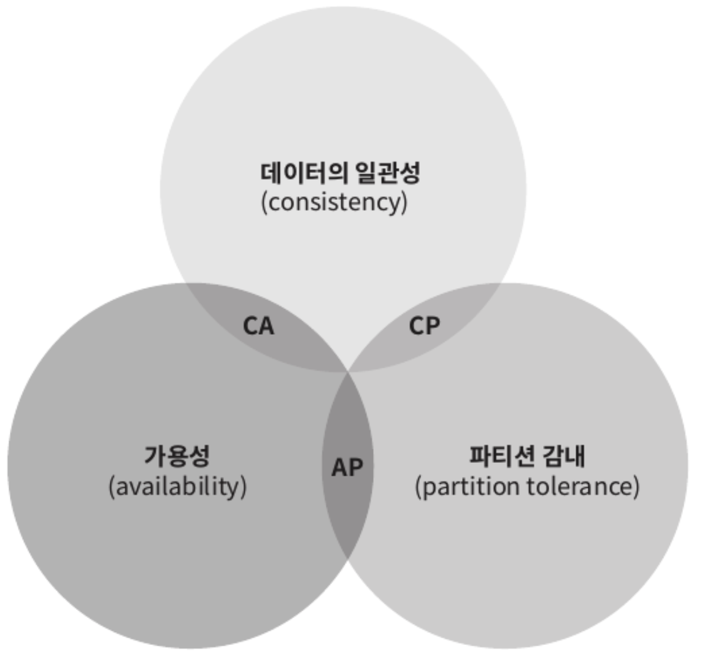
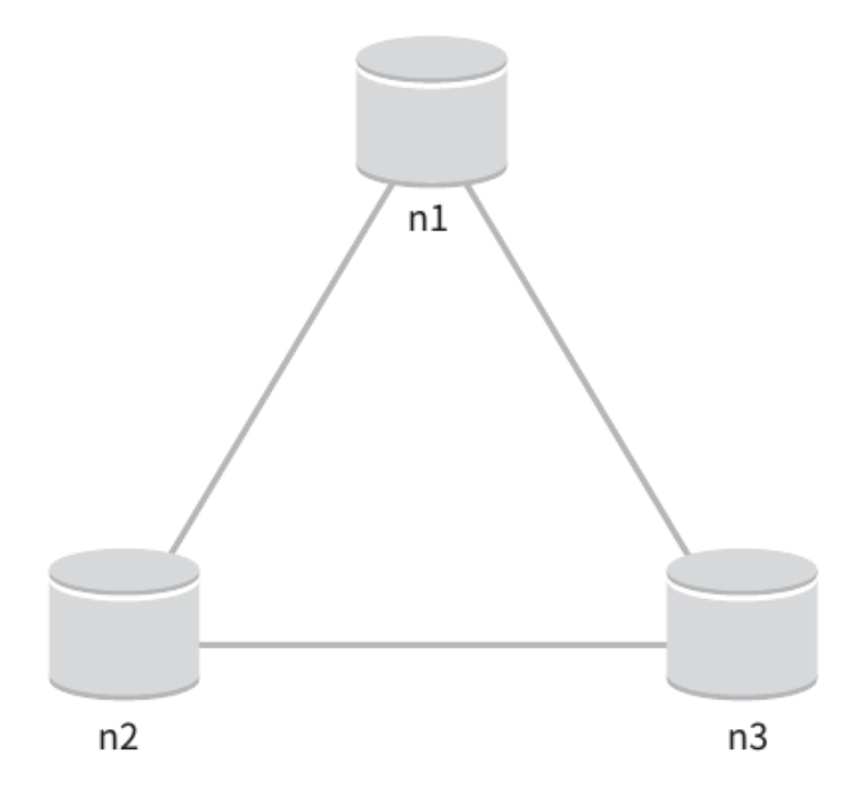

카-값 저장소(key-value store)는 키-값 데이터베이스라고도 불리는 **비 관계형 데이터베이스**이다.
- 이 저장소에 저장되는 값은 **고유 식별자**(identifier)를 키로 가져야 한다.
- 키와 값 사이의 이런 연결 관계를 `key-value` pair 라고 지칭한다.

키-값 쌍에서의 **키는 유일**해야 하며 **해당 키에 매달린 값은 키를 통해서만 접근 가능**하다.
- 키는 일반 텍스트일 수도, 해시 값일 수도 있다.
- 성능상 키는 짧을 수록 좋다.

키-값 쌍에서의 값은 문자열일 수도, 리스트 일 수도, 객체일 수도 있다.
- 키-값 저장소는 보통 값으로 무엇이 오든 상관하지 않는다.
- 널리 알려진 키-값 저장소로는 `Amazon Dynamo`, `memcached`, `redis` 등이 있다.

# 문제 이해 및 설계 범위 확정

- 키-값 쌍의 크기는 **10KB 이하**
- **큰 데이터**를 저장할 수 있어야 한다.
- **높은 가용성**을 제공해야 한다.(시스템은 장애가 있더라도 빠르게 응답해야 한다.)
- **높은 규모 확장성**을 제공해야 한다.(트래픽 양에 따라 자동적으로 서버 증설/삭제가 이루어져야 한다.)
- **데이터 일관성 수준**은 조정이 가능해야 한다.
- **응답 지연시간**(latency)이 짧아야 한다.

# 단일 서버 키-값 저장소

한 대 서버만 사용하는 키-값 저장소를 설계하는 것은 쉽다.
- 가장 직관적인 방법은 키-값 쌍을 전부 메모리에 해시 테이블로 저장하는 것
- 속도는 빠르지만 모든 데이터를 메모리에 저장하는 것은 불가능
- **데이터 압축**과 **자주 쓰이는 데이터만 메모리에 두고 나머지는 디스크에 저장**하는 방법이 있다.

언젠가 한 대의 서버로는 부족하여 많은 데이터를 저장하려면 분산 키-값 저장소(distributed key-value store)를 만들 필요가 있다.

# 분산 키-값 저장소

분산 키-값 저장소는 **키-값 쌍을 여러 서버에 분산**시켜서 `분산 해시 테이블`이라고도 불린다.
- 분산 시스템을 설계할 때는 `CAP 정리`(Consistency, Availability, Partition Tolerance theorem)를 이해해야 한다.

## CAP 정리

데이터 일관성(Consistency), 가용성(Availability), 파티션 감내(Partition tolerance)라는 세 가지 요구사항을 동시에 만족하는 분산 시스템을 설계하는 것은 불가능하다는 정리
- `데이터 일관성`: 분산 시스템에 접속하는 모든 클라이언트는 어떤 노드에 접속했느냐에 관계없이 **언제나 같은 데이터를 보게 되어야 한다.**
- `가용성`: 분산 시스템에 접속하는 클라이언트는 **일부 노드에 장애가 발생하더라도 항상 응답을 받을 수 있어야 한다.**
- `파티션 감내`: 파티션은 **두 노드 사이에 통신 장애가 발생하였음을 의미**한다. 파티션 감내는 네트워크에 파티션이 생기더라도 **시스템은 계속 동작하여야 한다**는 것을 뜻한다.

CAP 정리는 어떤 두 가지를 충족하려면 나머지 하나는 반드시 희생되어야 한다는 것을 의미한다.

<figure><figcaption></figcaption></figure>

세 가지 요구사항 가운데 어느 두 가지를 만족하느냐에 따라 다음과 같이 분류할 수 있다.

- `CP 시스템`: 일관성과 파티션 감내를 지원하는 키-값 저장소. (가용성을 희생)
- `AP 시스템`: 가용성과 파티션 감내를 지원하는 키-값 저장소. (데이터 일관성을 희생)
- `CA 시스템`: 일관성과 가용성을 지원하는 키-값 저장소. (파티션 감내는 미지원)
  - 통상 네트워크 장애는 피할 수 없으므로 분산 시스템은 반드시 파티션 문제를 감내할 수 있도록 설계되어야 한다.
  - 실세계에 존재하지 않는 시스템

**이상적 상태**

이상적인 환경이라면 네트워크가 파티션(두 노드 사이에 통신 장애가 발생)되는 상황은 절대로 일어나지 않을 것이다.
- n1에 기록된 데이터는 자동적으로 n2, n3에 복제
- 데이터 일관성과 가용성 만족

<figure><figcaption></figcaption></figure>

**실세계의 분산 시스템**

분산 시스템은 파티션 문제를 피할 수 없다.
- 파티션 문제가 발생하면 일관성과 가용성 사이에서 하나를 선택해야 한다.

<figure><figcaption></figcaption></figure>

가용성 대신 일관성을 선택(CP 시스템)한다면 데이터 불일치 문제를 피하기 위해 n1, n2에 대해 **쓰기 연산을 중단**시켜야 하는데, 그러면 가용성이 깨진다.
- 은행권 시스템은 보통 데이터 일관성을 양보하지 않음
- 네트워크 파티션으로 일관성이 깨질 수 있는 상황이 발생하면 해결 전까지는 오류를 반환해야 한다.

일관성 대신 가용성을 선택(AP 시스템)하면 **낡은 데이터를 반환할 위험성이 있더라도 계속 읽기 연산을 허용**해야 한다.
- n1, n2는 계속 쓰기 연산을 허용하고, 파티션 문제 해결 뒤 새 데이터를 n3에 전송

> 분산 키-값 저장소를 만들 때 요구사항에 맞도록 CAP 정리를 적용해야 한다.

## 시스템 컴포넌트

키-값 저장소 구현에 사용될 핵심 컴포넌트 및 기술
- 데이터 파티션
- 데이터 다중화(replication)
- 일관성(consistency)
- 일관성 불일치 해소(inconsistency resolution)
- 장애 처리
- 시스템 아키텍처 다이어그램
- 쓰기 경로(write path)
- 읽기 경로(read path)

### 데이터 파티션

대규모 애플리케이션은 전체 데이터를 작은 파티션들로 분할한 다음 여러 대의 서버에 저장해야 한다. 여기서 데이터를 파티션 단위로 나눌 때 두 가지 문제를 중요하게 따져야 한다.
- 데이터를 여러 서버에 고르게 분산할 수 있는가?
- 노드가 추가되거나 삭제될 때 데이터의 이동을 최소화할 수 있는가?

<a href="https://jihunparkme.gitbook.io/docs/book/system-design-interview/05" target="_blank">안정 해시(consistent hash)</a>는 이러한 문제를 푸는 데 적합한 기술이다.

안정 해시를 사용하여 데이터를 파티션하면 좋은 점
- 규모 확장 자동화(automatic scaling): 시스템 부하에 따라 서버가 자동으로 추가되거나 삭제되도록 만들 수 있음
- 다양성(heterogeneity): 각 서버의 용량에 맞게 가상 노도 수 조정 가능

### 데이터 다중화

### 일관성

### 일관성 불일치 해소

### 장애 처리

### 시스템 아키텍처 다이어그램

### 쓰기 경로

### 읽기 경로
