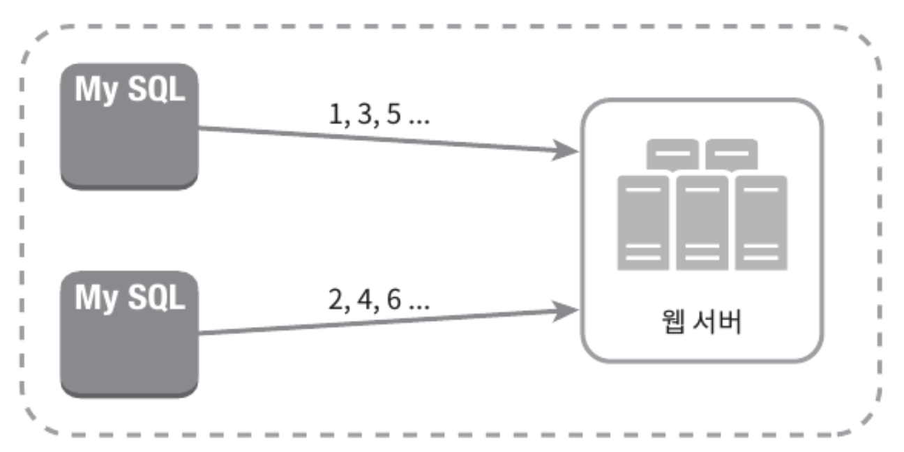
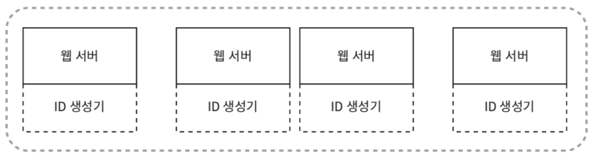
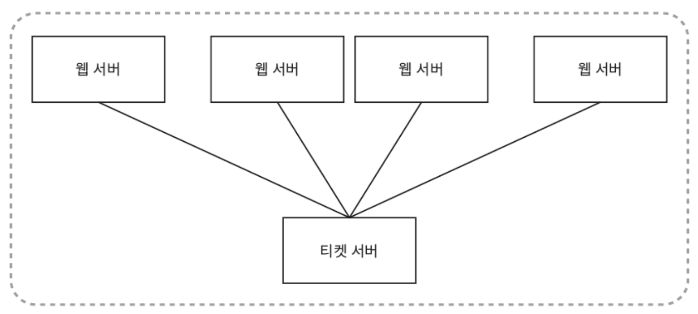

분산 시스템에 사용될 유일 ID 생성기 설계

보통 "auto_increment 속성이 설정된 RDB 기본 키를 사용하면 되지 않을까?"라는 생각을 할 것이다.
- 하지만 분산 환경에서 이 접근법은 통하지 않는다.
- DB 서버 한 대로는 요구를 감당할 수 없고, 여러 DB 서버 사용 시 지연 시간을 낮추가 힘들 것이다.

# 1단계: 문제 이해 및 설계 범위 확인

요구사항
- ID는 유일해야 한다.
- ID는 숫자로만 구성되어야 한다.
- ID는 64비트로 표현될 수 있는 값이어야 한다.
- ID는 발급 날짜에 따라 정렬 가능해야 한다.
- 초당 10,000개의 ID를 만들 수 있어야 한다.

# 2단계: 개략적 설계안 제시 및 동의 구하기

분산 시스템에서 유일성이 보장되는 ID를 만드는 방법은 어려 가지다.
- 다중 마스터 복제(multi-master replication)
- UUID(Universally Unique Identifier)
- 티켓 서버(ticket server)
- 트위터 스노플레이크(twitter snowflake) 접근법

## 다중 마스터 복제

다중 마스터 복제(multi-master replication)은 대략 아래와 같은 구성을 갖는다.

<figure><figcaption></figcaption></figure>

이 접근법은 데이터베이스의 **auto_increment 기능을 활용**한다.
- 다만 다음 ID 값을 구할 때 1이 아닌 **k만큼 증가**시킨다. (k는 현재 사용 중인 DB 서버의 수)
- 데이터베이스 수를 늘리면 초당 생산 가능 ID 수도 늘릴 수 있으므로. 규모 확장성 문제를 어느 정도 해결 가능하다.
- 하지만, 이 방법은 **중대한 단점**을 가지고 있다.
  - 여러 데이터 센터에 걸쳐 규모를 늘리기 어렵다.
  - ID의 유일성은 보장되겠지만 그 값이 시간 흐름에 맞추어 커지도록 보장할 수는 없다.
  - 서버를 추가하거나 삭제할 때도 잘 동작하도록 만들기 어렵다.

## UUID

`550e8400-e29b-41d4-a716-446655440000`

UUID는 유일성이 보장되는 ID를 만드는 또 하나의 간단한 방법이다.
- 컴퓨터 시스템에 저장되는 정보를 유일하게 식별하기 위한 128비트짜리 수
- UUID 값은 충돌 가능성이 지극히 낮다. (중복 UUID가 1개 생길 확률을 50%로 끌어 올리려면 초당 10억 개의 UUID를 100년 동안 계속해서 만들어야 한다.)
- UUID는 서버 간 조율 없이 독립적으로 생성 가능하다.

<figure><figcaption></figcaption></figure>

이 구조에서 각 웹 서버는 별도의 ID 생성기를 사용해 독립적으로 ID를 만들어낸다.

장점.
- UUID 생성은 단순하다.(동기화 이슈도 없음)
- 각 서버가 자기가 쓸 ID를 알아서 만드는 구조이므로 규모 확장이 쉽다.

단점.
- ID가 128비트로 길다.
- ID를 시간순으로 정렬할 수 없다.
- ID에 숫자 아닌 값이 포함될 수 있다.

## 티켓 서버

유일성이 보장되는 ID를 만들어 내는데 쓰일 수 있는 또 하나의 흥미로운 방법
- 플리커(Flickr)는 분산 기본 키를 만들어 내기 위해 이 기술을 이용하였다.

동작 방법

<figure><figcaption></figcaption></figure>

이 아이디어의 핵심은 auto_increment 기능을 갖춘 데이터베이스 서버, 즉 티켓 서버를 중앙 집중형으로 하나만 사용하는 것이다.

장점.
- 유일성이 보장되는 오직 숫자로만 구성된 ID를 쉽게 만들 수 있다.
- 구현하기 쉽고, 중소 규모 애플리케이션에 적합하다.

단점.
- 티켓 서버가 SPOF(Single-Point-of-Failure)가 된다.
  - 이 서버에 장애가 발생하면, 해당 서버를 이용하는 모든 시스템이 영향을 받는다.
- 티켓 서버를 여러 개 둘 수도 있지만, 데이터 동기화 같은 새로운 문제가 발생한다.

## 트위터 스노플레이크

# 3단계: 상세 설계

# 4단계: 마무리