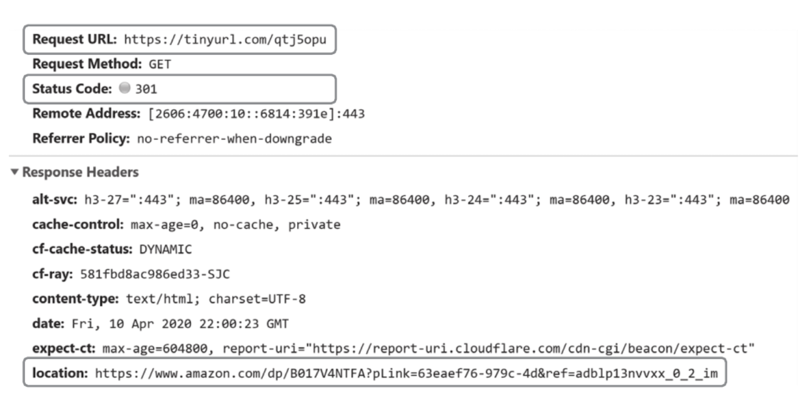
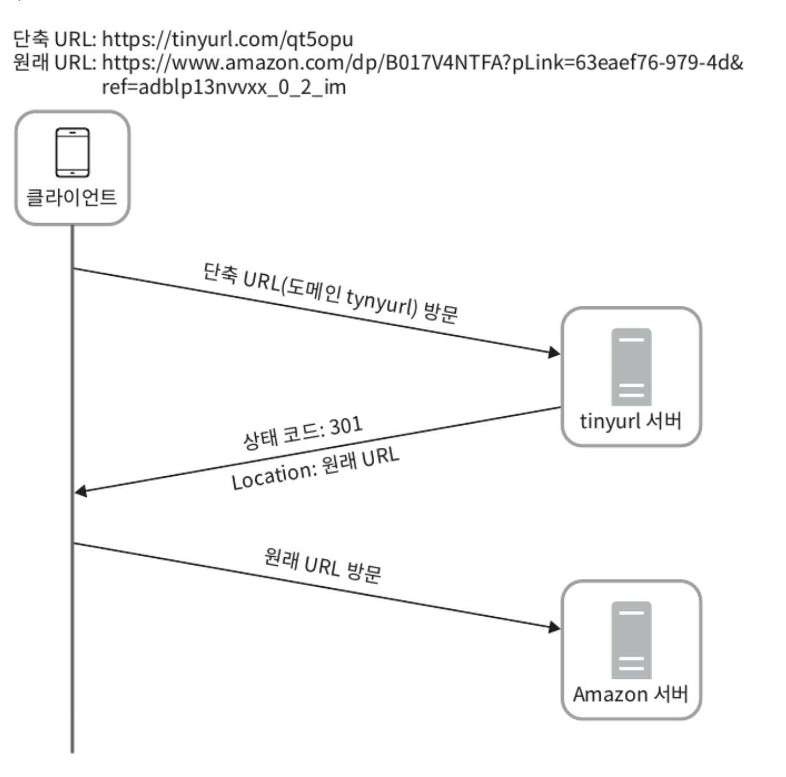

`https://www.systeminterview.com/q=chatsystem&c=loggedin&v=v3&l=long`이 입력으로 주어지면 `https://tinyurl.com/y7ke-ocwj`와 같은 단축 URL을 제공하고 해당 URL 접속 시 원래 URL로 갈 수 있는 URL 단축기

# 1단계: 문제 이해 및 설계 범위 확정

**시슽메의 기본적인 기능**
- URL 단축: 주어진 긴 URL을 훨씬 짧게 줄인다.
- URL 리디렉션(redirection): 축약된 URL로 HTTP 요청이 오면 원래 URL로 안내
- 높은 가용성과 규모 확장성, 그리고 장애 감내가 요구

**개략적 추정**
- 쓰기 연산: 매일 `1억 개`의 단축 URL 생성
- 초당 쓰기 연산: 1억(100million)/24/3600 = `1160`
- 읽기 연산: 읽기 연산과 쓰기 연산 비율은 10:1이라고 하면, 읽기 연산은 초당 `11,600회 발생`한다.(1160x10=11,600)
- URL 단축 서비스를 10년간 운영한다고 가정하면 1억(100million) x 365 x 10 = `3650억`(365billion) 개의 레코드를 보관해야 한다.
- 축약 전 URL의 평균 길이는 100이라고 가정
- 10년 동안 필요한 저장 용량은 3650억(365billion) x 100byte = 36.5TB

# 2단계: 개략적 설계안 제시 및 동의 구하기

`API Endpoint`, `URL Ridirection`, `URL Tiny Flow` 에 대해 살펴보자.

## API Endpoint

클라이언트는 서버가 제공하는 API 엔드포인트를 통해 서버와 통신한다.
- 엔드포인트는 REST 스타일로 설계
- URL 단축기는 기본적으로 두 개의 엔드포인트를 필요

**1) URL 단축용 엔드포인트**
- 새 단축 URL을 생성하고자 하는 클라이언트는 이 엔드포인트에 단축할 URL을 인자로 실어 POST 요청
```http
POST /api/v1/data/shorten
request: {longURL: longURLString}
respnse: 단축 URL
```

**2) URL 리디렉션용 엔드포인트**
- 단축 URL에 대해서 HTTP 요청이 오면 원래 URL로 보내주기 위한 용도의 엔드포인트
```http
GET /api/v1/shortUrl
respnse: HTTP 리디렉션 목적지가 될 원래 URL
```

## URL Ridirection

브라우저에 단축 URL 입력 시 예시

<figure><figcaption></figcaption></figure>

단축 URL을 받은 서버는 그 URL을 원래 URL로 바꿔서 301응답의 Location 애더에 넣어 반환한다.

<figure><figcaption></figcaption></figure>

유의할 점은 301 응답과 302 응답의 차이이다.(둘다 리디렉션 응답이지만 차이가 있다)

**301 Permanently Moved**
- 이 응답은 해당 URL에 대한 HTTP 요청의 처리 책임이 `영구적`으로 Location 헤더에 반환된 URL로 이전되었다는 응답
- 영구적으로 이전되었으므로, 브라우저는 이 응답을 캐시

**302 Found**
- 이 응답은 해당 URL로의 요청이 `일시적`으로 Location 헤더가 지정하는 URL에 의해 처리되어야 한다는 응답
- 클라이언트의 요청은 언제나 단축 URL 서버에 먼저 보내진 후 원래 URL로 리디렉션

## URL Tiny Flow

# 3단계: 상세 설계

# 4단계: 마무리