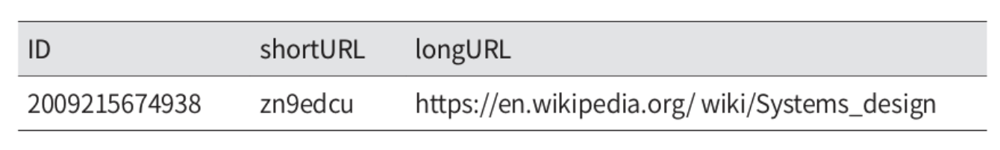

`https://www.systeminterview.com/q=chatsystem&c=loggedin&v=v3&l=long`이 입력으로 주어지면 `https://tinyurl.com/y7ke-ocwj`와 같은 단축 URL을 제공하고 해당 URL 접속 시 원래 URL로 갈 수 있는 URL 단축기

# 1단계: 문제 이해 및 설계 범위 확정

**시슽메의 기본적인 기능**
- URL 단축: 주어진 긴 URL을 훨씬 짧게 줄인다.
- URL 리디렉션(redirection): 축약된 URL로 HTTP 요청이 오면 원래 URL로 안내
- 높은 가용성과 규모 확장성, 그리고 장애 감내가 요구

**개략적 추정**
- 쓰기 연산: 매일 `1억 개`의 단축 URL 생성
- 초당 쓰기 연산: 1억(100million)/24/3600 = `1160`
- 읽기 연산: 읽기 연산과 쓰기 연산 비율은 10:1이라고 하면, 읽기 연산은 초당 `11,600회 발생`한다.(1160x10=11,600)
- URL 단축 서비스를 10년간 운영한다고 가정하면 1억(100million) x 365 x 10 = `3650억`(365billion) 개의 레코드를 보관해야 한다.
- 축약 전 URL의 평균 길이는 100이라고 가정
- 10년 동안 필요한 저장 용량은 3650억(365billion) x 100byte = 36.5TB

# 2단계: 개략적 설계안 제시 및 동의 구하기

`API Endpoint`, `URL Ridirection`, `URL Tiny Flow` 에 대해 살펴보자.

## API Endpoint

클라이언트는 서버가 제공하는 API 엔드포인트를 통해 서버와 통신한다.
- 엔드포인트는 REST 스타일로 설계
- URL 단축기는 기본적으로 두 개의 엔드포인트를 필요

**1) URL 단축용 엔드포인트**
- 새 단축 URL을 생성하고자 하는 클라이언트는 이 엔드포인트에 단축할 URL을 인자로 실어 POST 요청
```http
POST /api/v1/data/shorten
request: {longURL: longURLString}
respnse: 단축 URL
```

**2) URL 리디렉션용 엔드포인트**
- 단축 URL에 대해서 HTTP 요청이 오면 원래 URL로 보내주기 위한 용도의 엔드포인트
```http
GET /api/v1/shortUrl
respnse: HTTP 리디렉션 목적지가 될 원래 URL
```

## URL Ridirection

브라우저에 단축 URL 입력 시 예시

<figure><figcaption></figcaption></figure>

단축 URL을 받은 서버는 그 URL을 원래 URL로 바꿔서 301응답의 Location 애더에 넣어 반환한다.

<figure><figcaption></figcaption></figure>

유의할 점은 301 응답과 302 응답의 차이이다.(둘다 리디렉션 응답이지만 차이가 있다)

**301 Permanently Moved**
- 이 응답은 해당 URL에 대한 HTTP 요청의 처리 책임이 `영구적`으로 Location 헤더에 반환된 URL로 이전되었다는 응답
- 영구적으로 이전되었으므로, 브라우저는 이 응답을 캐시

**302 Found**
- 이 응답은 해당 URL로의 요청이 `일시적`으로 Location 헤더가 지정하는 URL에 의해 처리되어야 한다는 응답
- 클라이언트의 요청은 언제나 단축 URL 서버에 먼저 보내진 후 원래 URL로 리디렉션

## URL Tiny Flow

단축 URL이 `www.tinyurl.com/{hashValue}` 형태라고 해 보자.
- 중요한 것은 긴 URL을 이 해시 값으로 대응시킬 해시 함수 fx를 찾는 일이다.

<figure><figcaption></figcaption></figure>

이 해시 함수는 다음 요구사항을 만족해야 한다.
- 입력으로 주어지는 긴 URL이 다른 값이면 해시 값도 달라야 한다.
- 계산된 해시 값은 원래 입력으로 주어졌던 긴 URL로 복원될 수 있어야 한다.

# 3단계: 상세 설계

## 데이터 모델

개략적 설계에서 모든 것을 해시 테이블에 두었는데 초기 전략으로는 괜찮지만, 메모리의 유한하고 비싼 특성으로 실제 시스템에 쓰기 곤란하다.
- 더 나은 방법으로 <단축 URL, 원래 URL> 순서쌍을 RDB에 저장하는 것이다.
- `id`, `shortURL`, `longURL` 세 개의 컬럼

## 해시 함수

원래 URL을 단축 URL로 변환하는 데 쓰인다.

.

**해시 값 길이**

hashValue는 [0-9, a-z, A-Z]의 문자들로 구성된다.
- 사용할 수 있는 문자의 개수는 10 + 26 + 26 = 62개
- hashValue 길이를 정하기 위해 62^n >= 3650억인 n의 최소값을 찾아야 한다.
- 3650억 개의 URL을 만들어 내야 한다면, n=7이 될 수 있다.

<figure><figcaption></figcaption></figure>

해시 함수 구현에 쓰일 기술로 `해시 후 충돌 해소`방법과 `base-62 변환`법이 존재한다.

.

**해시 후 충돌 해소**

긴 URL을 줄이려면, 원래 URL을 7글자 문자열로 줄이는 해시 함수가 필요하다.
- 쉽게 `CRC32`, `MD5`, `SHA-1`과 같이 잘 알려진 해시 함수를 이용할 수 있다.
- 함수들을 사용하여 `https://en.wikipedia.org/wiki/Systems_design`을 축약한 결과
 
<figure><figcaption></figcaption></figure>

여기서 가장 짧은 해시값은 `CRC32` 함수를 적용한 것인데, 더 짧게 만들고 싶다면 두 방법이 존재한다.

(1) 처음 7개 글자만 이용하기
- 해시 결과가 서로 충돌할 확률이 높아진다.
- 충돌이 발생했을 경우, 충돌이 해소될 때까지 사전에 정한 문자열을 해시값이 덧붙인다.
- 이 방법으로 충돌을 해결할 수 있지만 단축 URL 생성 시 한 번 이상 DB 질의를 해야 하므로 오버헤드가 크다.
- DB 대신 블룸 필터를 사용하면 성능을 높일 수 있다.
  - [블룸 필터](https://ko.wikipedia.org/wiki/%EB%B8%94%EB%A3%B8_%ED%95%84%ED%84%B0): 어떤 집합에 특정 원소가 있는지 검사할 수 있도록 하는, 확률론에 기초한 공간 효율이 좋은 기술

<figure><figcaption></figcaption></figure>

.

**base-62 변환**

`진법 변환`(base conversion)은 URL 단축기를 구현할 때 흔히 사용되는 접근법 중 하나다.
- 수의 표현 방식이 다른 두 시스템이 같은 수를 공유해야 하는 경우 유용
- 62진법을 쓰는 이유는 hashValue에 사용할 수 있는 문자 개수가 62개이기 때문
- 10진수 11157을 62진수로 변환하면 `2TX`가 된다.
  - 단축 URL: `https:/tinyurl.com/2TX`

.

**두 접근법 비교**

<figure><figcaption></figcaption></figure>

## URL 단축기 상세 설계

URL 단축기는 시스템의 핵심 컴토넌트이므로, 그 처리 흐름이 논리적으로는 단순해야 하고 기능적으로는 언제나 동작하는 상태로 유지되어야 한다.

<figure><figcaption></figcaption></figure>

- (1) 입력으로 긴 URL을 받는다.
- (2) DB에 해당 URL이 있는지 검사한다.
- (3) DB에 있다면 해당 URL에 대한 단축 URL을 만든 적이 있는 것.
  - 따라서 DB에서 해당 단축 URL을 가져와서 클라이언트에게 반환
- (4) DB에 없는 경우 해당 URL은 새로 접수된 것이므로 유일한 ID 생성. 이 ID는 DB의 기본 키로 사용
- (5) 62진법 변환 적용. ID를 단축 URL로 만든다.
- (6) `ID`, `단축 URL`, `원래 URL`로 새 DB 레코드 생성 후 단축 URL을 클라이언트에 전달

<figure><figcaption></figcaption></figure>

이 생성기의 주된 용도는, 단축 URL을 만들 때 사용할 ID를 만드는 것이고, 이 ID는 전역적 유일성이 보장되는 것이어야 한다.
- 고도로 분산된 환경에서는 분산 ID 생성기를 구현해 보자.

## URL 리디렉션 상세 설계

URL 리디렉션 메커니즘의 상세한 설계
- 쓰기보다 읽기를 더 자주 하는 시스템으로 `<단축 URL, 원래 URL>` 쌍을 캐시에 저장하여 성능 향상

<figure><figcaption></figcaption></figure>

로드 밸런서의 동작 흐름
- (1) 사용자가 단축 URL 클릭
- (2) 로드밸런서가 해당 클릭으로 발생한 요청을 웹 서버에 전달
- (3) 단축 URL이 이미 캐시에 있는 경우 원래 URL을 바로 꺼내서 클라이언트에게 전달
- (4) 캐시에 해당 단축 URL이 없는 경우 DB에서 꺼내고, DB에 없다면 사용자가 잘못된 단축 URL을 입력한 경우
- (5) DB에서 꺼낸 URL을 캐시에 넣은 후 사용자에게 반환

# 4단계: 마무리

추가로 설계해볼 수 있는 주제

**처리율 제한 장치(rate limiter)**
- 엄청난 양의 URL 단축 요청이 밀려들 경우 무력화될 수 있다.
- 처리율 제한 장치를 두면 IP 주소를 비롯한 필터링 규칙들을 이용해 요청을 걸러낼 수 있다.
- [04.처리율 제한 장치 설계](https://jihunparkme.gitbook.io/docs/book/system-design-interview/04)

**웹 서버의 규모 확장**
- 이번 설계에 포함된 웹 계층은 무상태 계층이므로, 웹 서버를 자유로이 증설하거나 삭제가 가능하다.

**DB의 규모 확장**
- DB를 다중화하거나 샤딩하여 규모 확장성을 달성할 수 있다.

**데이터 분석 솔루션**
- URL 단축기에 데이터 분석 솔루션을 통합해 두면 어떤 링크를 얼마나 많은 사용자가 클릭했는지, 언제 주로 클릭했는지 등의 중요한 정보를 알아낼 수 있다.

**가용성, 데이터 일관성, 안정성**
- 대규모 시스템이 성공적으로 운영되기 위해 반드시 갖추어야 할 속성들
- [01.사용자 수에 따른 규모 확장성](https://jihunparkme.gitbook.io/docs/book/system-design-interview/01)
