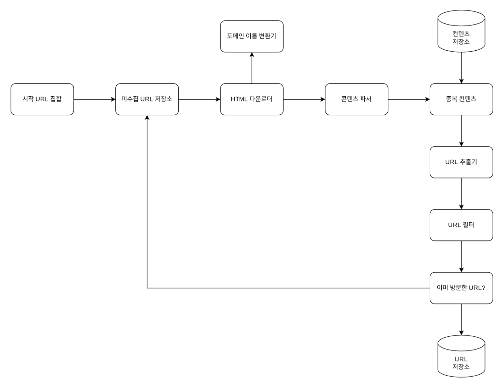
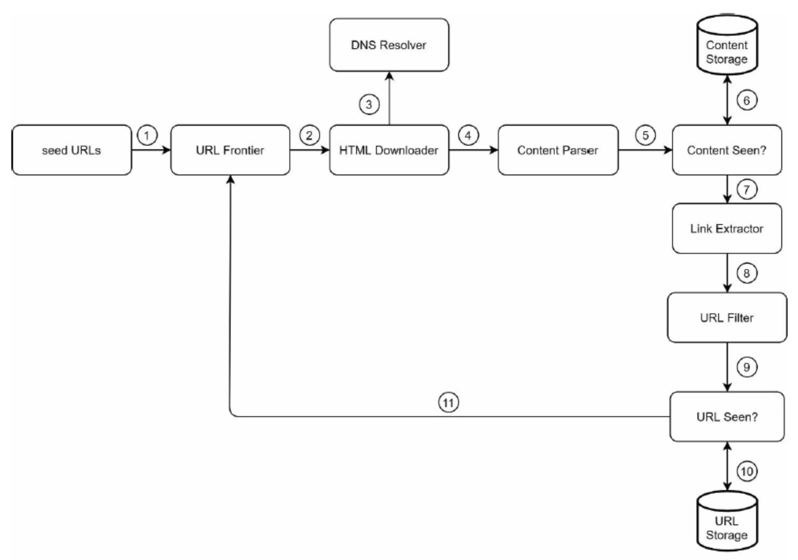
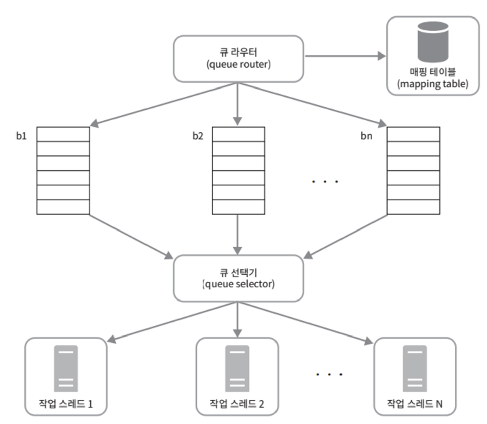
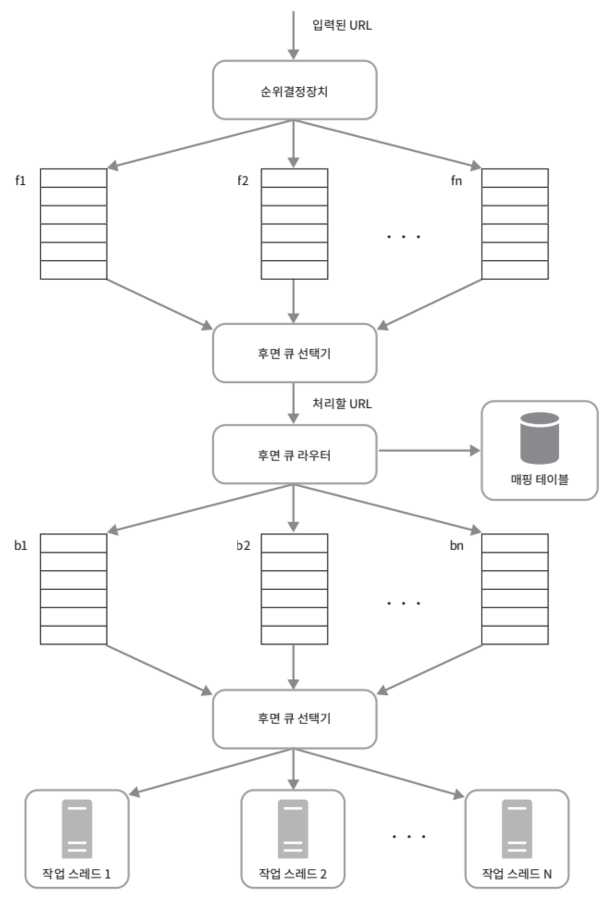
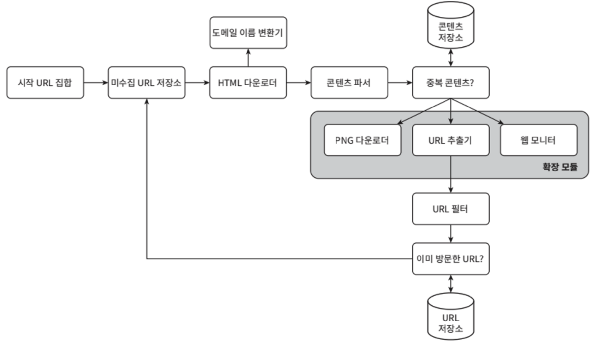

웹 크롤러는 **검색 엔진에서 널리 쓰이는 기술**로, **웹에 새로 올라오거나 갱신된 콘텐츠를 찾아내는 것이 주된 목적**이다.
- 웹 크롤러는 몇 개의 웹 페이지에서 시작하여 **그 링크를 따라 나가면서 새로운 콘텐츠를 수집**한다.

크롤러는 다양하게 이용된다.
- `search engine indexing`
  - 크롤러의 가장 보편적인 용례
  - 크롤러는 웹 페이지를 모아 검색 엔진을 위한 로컬 인덱스를 만든다.
- `web archiving`
  - 나중에 사용할 목적으로 장기보관하기 위해 웹에서 정보를 모으는 절차
  - 많은 국립 도서관이 수행
- `web mining`
  - 웹 마이닝을 통해 인터넷에서 유용한 지식을 도출해 낼 수 있다.
  - 유명 금융 기업들은 크롤러를 사용해 주주 총회 자료나 연차 보고서를 다운받아 기업의 핵심 사업 방향을 알아내기도 한다.
- `web monitoring`
  - 인터넷에서 저작권이나 상표권이 침해되는 사례를 모니터링할 수 있다.

웹 크롤러의 복잡도는 웹 크롤러가 처리해야 하는 데이터의 규모에 따라 달라진다.

# 1단계. 문제 이해 및 설계 범위 확정

웹 크롤러의 기본 알고리즘
- (1) URL 집합이 입력으로 주어지면, 해당 URL들이 가리키는 모든 웹 페이지를 다운로드
- (2) 다운받은 웹 페이지에서 URL들을 추출
- (3) 추출된 URL들을 다운로드할 URL 목록에 추가하고 위의 과정을 반복

좋은 웹 크롤러가 만족시켜야 할 속성
- `규모 확장성`: 병행성을 활용하면 보다 효과적으로 웹 크롤링을 할 수 있다.
- `안정성(robustness)`: 잘못 작성된 HTML, 아무 반응 없는 서버, 장애, 악성 코드 링크 등 비정상적 입력이나 환경에 잘 대응할 수 있어야 한다.
- `예절(politeness)`: 크롤러는 수집 대상 사이트에 짧은 시간 동안 너무 많은 요청을 보내서는 안 된다.
- `확장성(extensibility)`: 새로운 콘텐츠(이미지, 동영상 등)를 지원하기 쉬워야 한다.

.

**개략적 규모 측정**

- 매달 `10억 개`의 웹 페이지를 다운로드
- QPS = 10억(1billion, 즉 1,000,000,000)/30일/24시간/3600초 = 약 400 페이지/초
- 최대(Peak) QPS = 2 X QPS = 800
- 웹 페이지의 크기 평균은 500k 라고 가정
- 10억 페이지 x 500k = 500TB/월
- 5년치 데이터 = 500TB x 12 개월 x 5년 = 30PB 저장용량

# 2단계. 개략적 설계안 제시 및 동의 구하기

<figure><figcaption></figcaption></figure>

.

**시작 URL 집합**
- 웹 크롤러가 크롤링을 시작하는 출발점
- 도메인 이름이 붙은 모든 페이지를 URL을 시작 URL로 쓰는 것.
- 전체 웹을 크롤링해야 하는 경우 시작 URL을 고를 때 좀 더 창의적일 필요가 있다.
- 일반적으로 전체 URL 공간을 작은 부분집합으로 나누는 전략을 사용(나라/지역별 특색, 주제 등)

.

**미수집 URL 저장소**

- 대부분의 웹 크롤러는 크롤링 상태를 `다운로드할 URL`, `다운로드된 URL` 두 가지로 나누어 관리
- 여기서 다운로드할 URL을 저장관리하는 컴포넌트를 미수집 URL 저장소로 부른다.

.

**HTML 다운로더**
- 인터넷에서 웹 페이지를 다운로드하는 컴포넌트
- 다운로드할 페이지의 URL은 미수집 URL 저장소가 제공

.

**도메인 이름 변환기**
- 웹 페이지를 다운받으려면 URL을 IP 주소로 변환하는 절차가 필요
- HTML 다운로더는 도메인 이름 변환기를 사용하여 URL에 대응되는 IP 주소를 알아낸다.

.

**콘텐츠 파서**
- 웹 페이지를 다운로드하면 파싱(parsing)과 검증(validation) 절차를 거쳐야 한다.
- 이상한 웹 페이지는 문제를 발생할 수 있고, 저장 공간을 낭비하게 된다.
- 콘텐츠 파서는 크롤링을 느리게 만들 수 있으므로 독립된 컴포넌트로 생성

.

**중복 콘텐츠인가?**
- 29% 가량의 웹 페이지 콘텐츠는 중복이다.
- 자료 구조를 도입하여 데이터 중복을 줄이고 데이터 처리에 소요되는 시간을 줄일 수 있다.
- 두 HTML 문서를 비교하는 가장 단순한 방법은 그 두 문서를 문자열로 보고 비교하는 것이지만, 비교 대상 문서 수가 10억에 달하는 경우 느리고 비효율적이다.
- 효과적인 방법은 웹 페이지의 해시 값을 비교하는 것이다.
  
.

**콘텐츠 저장소**
- HTML 문서를 보관하는 시스템
- 저장소를 구현하는 데 쓰일 기술을 고를 때, 저장할 데이터의 유형, 크기, 저장소 접근 빈도, 데이터의 유효 기간 등을 종합적으로 고려해야 한다.
- 여기서는 디스크와 메모리를 동시에 사용하는 저장소를 선택
  - 데이터 양이 너무 많으므로 대부분 콘텐츠는 디스크에 저장
  - 인기 콘텐츠는 메모리에 두어 접근 지연시간 단축

.

**URL 추출기**
- HTML 페이지를 파싱하여 링크들을 골라내는 역할
- 상대 경로는 절대 경로로 변환

.

**URL 필터**
- 특정한 콘텐츠 타입이나 파일 확장자를 갖는 URL, 접속 시 오류가 발생하는 URL, 접근 제외 목록에 포함된 URL 등 크롤링 대상에서 배제하는 역할

.

**이미 방문한 URL?**
- 이미 방문한 URL, 미수집 URL 저장소에 보관된 URL을 추적할 수 있도록 하는 자료 구조를 사용
  - bloom filter, hash table
- 이미 방문한 URL 추적을 통해 같은 URL을 여러 번 처리하는 일을 방지하여 서버 부하를 줄이고, 시스템이 무한 루프에 빠지는 일을 방지

.

**URL 저장소**
- 이미 방문한 URL을 보관하는 저장소

## 웹 크롤러 작업 흐름

<figure><figcaption></figcaption></figure>

- (1) 시작 URL들을 미수집 URL 저장소에 저장
- (2) HTML 다운로더는 미수집 URL 저장소에 URL 목록을 가져옴
- (3) HTML 다운로더는 도메인 이름 변환기를 사용하여 URL의 IP 주소를 알아내고, 해당 IP 주소로 접속하여 웹 페이지를 다운
- (4) 콘텐츠 파서는 다운된 HTML 페이지를 파싱하여 올바른 형식을 갖춘 페이지인지 검증
- (5) 콘텐츠 파싱과 검증이 끝나면 중복 콘텐츠인지 확인하는 절차를 개시
- (6) 중복 콘텐츠인지 확인하기 위해 해당 페이지가 이미 저장소에 있는지 확인
  - 이미 저장소에 있는 경우 처리하지 않고 버리기
  - 저장소에 없는 경우 저장소에 저장한 후 URL 추출기로 전달
- (7) URL 추출기는 해당 HTML 페이지에서 링크를 골라냄
- (8) 골라낸 링크를 URL 필터로 전달
- (9) 필터링이 끝나고 남은 URL만 중복 URL 판별 단계로 전달
- (10) 이미 처리한 URL인지 확인을 위해 URL 저장소에 보관된 URL인지 살피고, 이미 저장소에 있는 URL은 버림
- (11) 저장소에 없는 URL은 URL 저장소에 저장하고, 미수집 URL 저장소에도 전달

# 3단계. 상세 설계

컴포넌트와 그 구현 기술들

## DFS vs BFS

웹은 유향 그래프와 같다.(페이지=노드, 하이퍼링크=에지)
- 크롤링 프로세스는 유향 그래프를 에지를 따라 탐색하는 과정이다.
- DFS를 적용하기에는 그래프 크기가 클 경우 어느 정도로 깊숙이 가게 될지 가늠하기 어렵다.
- 웹 크롤러는 보통 BFS(너비 우선 탐색법)을 사용한다.

하지만, 이 구현법에는 두 가지 문제점이 있다.
- (1) 한 페이지에서 나오는 링크의 상당수는 같은 서버로 되돌아간다.
  - 같은 호스트에 속한 많은 링크를 병렬로 처리하다보면 서버는 과부하에 걸릴 것이다.
  - 이런 크롤러는 보통 예의 없는(impolite) 크롤러로 간주된다.
- (2) 표준적 BFS 알고리즘은 URL 간에 우선순위를 두지 않는다.
  - 페이지 순위, 사용자 트래픽 양, 업데이트 빈도 등 여러 가지 척도에 비추어 처리 우선순위를 구별하는 것이 좋을 것이다.

> 이 문제들은 미수집 URL 저장소를 활용하여 좀 쉽게 해결할 수 있다.

## 미수집 URL 저장소

이 저장소를 잘 구현하면 예의(politeness)를 갖춘 크롤러, URL 사이의 우선순위와 신선도를 구별하는 크롤러를 구현할 수 있다.
- [Web Crawling](http://infolab.stanford.edu/~olston/publications/crawling_survey.pdf)
- [Web Crawling](https://ics.uci.edu/~djp3/classes/2009_01_02_INF141/Lectures/Lecture05.pdf)

.

**예의**

수집 대상 서버로 짧은 시간 안에 너무 많은 요청을 보내는 것은 삼가야 한다.
- 너무 많은 요청을 보내는 것은 무례한 일이고, Dos 공격으로 간주되기도 한다.

예의 바른 크롤러가 되기 위해 동일 웹 사이트에 대해서는 한 번에 한 페이지만 요청해야 한다.
  - 같은 웹 사이트 작업은 시간차를 두고 실행하자.
- 웹 사이트의 호스트명과 다운로드를 수행하는 작업 스레드 사이의 관계를 유지하자.
- 각 다운로드 스레드는 별도 FIFO 큐를 가지고 있어서, 해당 큐에서 꺼낸 URL만 다운로드 한다.

<figure><figcaption></figcaption></figure>

- `queue router`: 같은 호스트에 속한 URL은 언제나 같은 큐로 가도록 보장하는 역할
- `mapping table`: 호스트 이름과 큐 사이의 관계를 보관하는 테이블
- `FIFO queue`: 같은 호스트에 속한 URL은 언제나 같은 큐에 보관
- `queue selector`: 큐들을 순회하면서 큐에서 URL을 꺼내 해당 큐에서 나온 URL을 다운로드하도록 지정된 작업 스레드에 전달하는 역할
- `worker thread`: 전달된 URL을 다운로드하는 작업을 수행

.

**우선순위**

유용성에 따라 URL의 우선순위를 나눌 때는 PageRank, 트래픽 양, Update Frequency 등 다양한 척도를 사용할 수 있다.
- 순위결정장치(prioritizer)는 URL 우선순위를 정하는 컴포넌트다.

URL 우선순위를 고려한 설계

<figure><figcaption></figcaption></figure>

- `순위결정장치`: URL을 입력받아 우선순위를 계산
- `큐`: 우선순위별로 큐가 하나씩 할당(우선순위가 높으면 선택 확룔도 증가)
- `큐 선택기`: 임의 큐에서 처리할 URL을 꺼내는 역할을 담당(순위가 높은 큐에서 더 자주 꺼내도록)
- `전면 큐`: 우선순위 결정 과정을 처리(처리할 URL 전 단계)
- `후면 큐`: 크롤러가 예의 바르게 동작하도록 보증

.

**신선도**
- 웹 페이지는 수시로 추가/삭제/변경된다.
- 데이터의 신선함을 유지하기 위해 이미 다운로드한 페이지라고 해도 주기적으로 재수집할 필요가 있다.
- 모든 URL을 재수집하는 작업을 최적화하기 위한 전략
  - 웹 페이지의 변경 이력 활용
  - 우선순위를 활용하여 중요한 페이지는 좀 더 자주 재수집

.

**미수집 URL 저장소를 위한 지속성 저장장치**
- 수억개의 URL을 메모리에 보관하는 것은 안정성이나 규모 확장성 측면에서 바람직하지 않다.
- 전부 디스크에 저장하는 것도 느려서 쉽게 성능 병목지점이 되어 좋은 방법은 아니다.
- 절충안으로 대부분의 URL은 디스크에 두지만 IO 비용을 줄이기 위해 메모리 버퍼에 큐를 둘 수 있다.
  - 버퍼에 있는 데이터는 주기적으로 디스크에 기록

## HTML 다운로더

HTTP 프로토콜을 통해 웹 페이지를 내려 받는다.

.

**Robots.txt**

로봇 제외 프로토콜로 웹 사이트가 크롤러와 소통하는 표준적 방법
- 이 파일에는 크롤러가 수집해도 되는 페이지 목록이 존재
- 따라서, 웹 사이트를 긁어 가기 전에 크롤러는 해당 파일에 나열된 규칙을 먼저 확인해야 한다.
- 이 파일은 주기적으로 다시 다운받아 캐시에 보관하면 좋다. 

.

**성능 최적화**

HTML 다운로더 설계 시 성능최적화도 아주 중요한데, 사용할 수 있는 성능 최적화 기법들을 살펴보자.

(1) 분산 크롤링
- 성능을 높이기 위해 크롤링 작업을 여러 서버에 분산하는 방법
- 각 서버는 여러 스레드를 돌려 다운로드 작업을 처리
- 미수집 URL 저장소는 각 다운로드 서버에 URL을 배분한다.

(2) 도메인 이름 변환 결과 캐시
- DNS Resolver는 크롤러 성능의 병목 중 하나
  - 이는 DNS 요청을 보내고 결과를 받는 작업의 동기적 특성 때문
  - DNS 조회 결과로 얻어진 도메인 이름과 IP 주소 사이의 관계를 캐시에 보관해 놓고 cron job 등을 돌려 주기적으로 갱신하도록 해 놓으면 성능을 효과적으로 높일 수 있다.

(3) 지역성
- 크롤링 작업을 수행하는 서버를 지역별로 분산하는 방법
- 지역성을 활용하는 전략은 크롤 서버, 캐시, 큐, 저장소 등 대부분의 컴포넌트에 적용 가능

(4) 짧은 타임아웃
- 응답이 느리거나 응답이 없을 경우 대기 시간이 길어지면 좋지 않다.
- 최대 얼마나 기다릴지 미리 정해두는 것이 좋다.
- 특정 시간 동안 서버가 응답하지 않으면 크롤러는 해당 페이지 다운로드를 중단하고 다음 페이지로 넘어간다.

.

**안정성**

최적화된 성능뿐 아니라 안정성도 다운로더 설계 시 중요하게 고려해야 할 부분이다.

시스템 안정성 향상을 위한 접근법 중 중요한 몇 가지.
- `안정 해시`: 다운로더 서버들에 부하를 분산할 때 적용 가능한 기술
  - 다운로더 서버를 쉽게 추가하고 삭제할 수 있다.
  - [05.안정 해시 설계](https://jihunparkme.gitbook.io/docs/book/system-design-interview/05)
- `크롤링 상태 및 수집 데이터 저장`: 장애 발생 시 쉽게 복구할 수 있도록 크롤링 상태와 수집된 데이터를 지속적 저장장치에 기록해 주는 것이 바람직하다.
- `예외 처리`: 예외가 발생해도 전체 시스템이 중단되는 일 없이 그 작업을 우아하게 이어나갈 수 있어야 한다.
- `데이터 검증`: 시스템 오류를 방지하기 위한 중요 수단 가운데 하나

.

**확장성**

시스템을 설계할 때 새로운 형태의 콘텐츠를 쉽게 지원할 수 있도록 신경써야 한다.
- 새운 모듈을 끼워 넣어 새로운 형태의 콘텐츠를 지원할 수 있도록 설계할 수 있다.

<figure><figcaption></figcaption></figure>

- PNG 다운로더는 PNG 파일을 다운로드하는 plug-in 모듈
- 웹 모니터는 웹을 모니터링하여 저작권이나 상표권이 침해되는 일을 막는 모듈

.

**문제 있는 콘텐츠 감지 및 회피**

중복이거나 의미 없는, 유해한 콘텐츠를 감지하고 시스템으로부터 차단하는 방법

(1) 중복 콘텐츠

- 웹 콘텐츠의 30% 가량은 중복이다.
- 해시나 체크섬을 사용하면 중복 콘텐츠를 보다 쉽게 탐지할 수 있다.
- [Space/Time Trade-offs in Hash Coding with Allowable Errors](https://crystal.uta.edu/~mcguigan/cse6350/papers/Bloom.pdf)

(2) 거미 덫(spider trap)

- 크롤러를 무한 루프에 빠뜨리도록 설계한 웹 페이지
- 덫을 자동으로 피해가는 알고리즘을 만들어 내는 것은 까다롭다.
- 사람이 수작업으로 덫을 확인하고 찾아낸 후 제외하거나 필터 목록에 걸어두는 방법이 있다.

(3) 데이터 노이즈

- 광고, 스크립트 코드, 스팸 URL 등 가치가 없는 콘텐츠는 가능하다면 제외하자.

## 안정성 확보 전략

## 확장성 확보 전략

## 문제 있는 콘텐츠 감지 및 회피 전략

# 4단계. 마무리