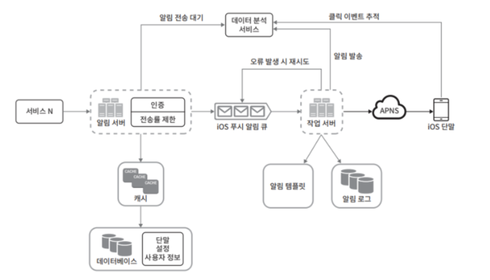

알림 시스템(notification system) 기능을 갖춘 애플리케이션 프로그램은 최신 뉴스, 제품 업데이트, 이벤트, 선물 등 **고객에게 중요할 만한 정보를 비동기적으로 제공**한다.

알림 시스템은 `모바일 푸시 알림`, `SNS 메시지`, `이메일` 세 가지로 분류할 수 있다.

# 1단계: 문제 이해 및 설계 범위 확정

하루에 백만 건 이상의 알림을 처리하는 확장성 높은 시스템을 구축하는 것은 쉬운 과제가 아니다.

요구사항
- 푸시 알림, SMS 메시지, 이메일
- 연성 실시간 시스템
- IOS, Android, Laptop/Desktop
- 미알림 설정
- 하루 천만 건의 모바일 푸시 알림, 백만 건의 SMS 메시지, 5백만 건의 이메일

# 2단계: 개략적 설계안 제시 및 동의 구하기

## 알림 지원별 지원 방안

**IOS 푸시 알림**

IOS 에서 푸시 알림을 보내기 위해 세 가지 컴포넌트가 필요하다.

<center></center>

- `알림 제공자`(provider): 알림 요청을 만들어 애플 푸시 알림 서비스(APNS)로 보내는 주체
  - 알림 요청을 만들기 위해 아래 데이터가 필요
  - device token: 알림 요청을 보내는 데 필요한 고유 식별자
  - payload: 알림 내용을 담은 JSON 딕셔너리
- `APNS`(Apple Push Notification Service): 애플이 제공하는 원격 서비스
  - 푸시 알림을 IOS 장치로 보내는 역할을 담당
- `IOS 단말`(IOS Device): 푸시 알림을 수신하는 사용자 단말

.

**Android 푸시 알림**

안드로이드 푸시 알림도 IOS와 비슷한 절차로 전송된다.
- APNS 대신 `FCM`(Firebase Cloud Messaging)

<center></center>

.

**SMS 메시지**

SMS 메시지를 보낼 떄 보통 `Twilio`, `Nexmo` 같은 제 3사업자의 서비스를 많이 이용한다.

<center></center>

.

**이메일**

상용 이메일 서비스로 유명한 서비스는 `Sendgrid`, `Mailchimp`가 있다.
- 전송 성공률도 높고, 데이터 분석 서비스도 제공한다.

<center></center>

.

**알림 유형 전부를 한 시스템으로 묶으면 아래와 같다.**

<center></center>

## 연락처 정보 수집 절차

알림을 보내기 위해 모바일 단말 토큰, 전화번호, 이메일 주소 등의 정보가 필요하다.
- 사용자가 앱을 설치하거나 처음으로 계정을 등록하면 API 서버는 해당 사용자의 정보를 수집하여 데이터베이스에 저장한다.

<center></center>

DB에 연락처 정보를 저장할 테이블 구조는 아래와 같다.
- 필수 정보만 담은 개략적인 설계안이고, 이메일 주소와 전화번호는 user 테이블에, 단말 토큰은 device 테이블에 저장한다.

<center></center>

## 알림 전송 및 수신 절차

<center></center>

(1) 1~N 까지의 서비스
- 각 서비스는 마이크로서비스일 수도 있고, 크론잡일 수도 있고, 분산 시스템 컴포넌트일 수도 있다.
- 알림 시스템 서버의 API를 통해 알림을 보낼 서비스들

(2) 알림 서버
- **알림 전송 API**: 스팸 방지를 위해 보통 사내 서비스 또는 인증된 클라이언트만 이용 가능
- **알림 검증**: 이메일 주소, 전화번호 등에 대한 기본적인 검증을 수행
- **데이터베이스 또는 캐시 질의**: 알림에 포함시킬 데이터를 가져오는 기능
- **알림 전송**: 알림 데이터를 메시지 큐에 삽입
    ```http
    POST https://api.example.com/v1/sms/send

    {
        "to": [
            {
                "user_id": 123456
            }
        ],
        "from": {
            "email": "xxx@gmail.com"
        },
        "subject": "Hello!",
        "content": [
            {
                "type": "text/plain",
                "value": "Hello~"
            }
        ]
    }
    ```

(3) 캐시
- 사용자 정보, 단말 정보, 알림 템플릿 등을 캐시

(4) DB
- 사용자, 알림, 설정 등 다양한 정보를 저장

(5) 메시지 큐
- 시스템 컴포넌트 간 의존성을 제거하기 위해 사용
- 다량의 알림 전송 시 버퍼 역할

(6) 작업 서버
- 메시지 큐에서 전송할 알림을 꺼내서 제3자 서비스로 전달하는 역할을 담당하는 서버

(3) 제3자 서비스
- 사용자에게 알림을 실제로 전달하는 역할
- 쉽게 새로운 서비스를 통합하거나 기존 서비스를 제거할 수 있는 확장성이 중요하다.

(4) iOS, Android, SMS, Email 단말
- 사용자는 자기 단말에서 알림을 수신

.

**알림 전송 플로우**

1. API를 호출하여 알림 서버로 알림 전송.
2. 알림 서버는 사용자 정보, 단말 토큰, 알림 설정 같은 메타데이터를 캐시나 DB에서 조회.
3. 알림 서버는 전송할 알림에 맞는 이벤트를 만들어서 해당 이벤트를 위한 큐에 삽입.
4. 작업 서버는 메시지 큐에서 알림 이벤트를 꺼냄.
5. 작업 서버는 알림을 제3자 서비스로 전송
6. 제3자 서비스는 사용자 단말로 알림을 전송

# 3단계: 상세 설계

## 안정성

분산 환경에서 운영될 알림 시스템을 설계할 떄는 안정성 확보를 위한 몇 가지 사항을 고려해야 합니다.

.

**데이터 손실 방지**

- 알림이 지연되거나 순서가 틀려도 되지만 어떤 상황에서도 알림이 소실되면 안 된다.
- 알림 시스템은 알림 데이터를 DB에 보관하고 재시도 메커니즘을 구현해야 한다.
- 알림 로그 DB를 유지하는 것이 한 가지 방법이다.

<center></center>

.

**알림 중복 전송 방지**

- 같은 알림이 여러 번 반복되는 것을 완전히 막는 것은 어렵다.
- 대부분은 알림이 딱 한 번 전송되지만, 분산 시스템의 경우 특성상 가끔 같은 알림이 중복되어 전송되기도 한다.
- 그 빈도를 줄이려면 중복 탐지 메커니즘을 도입하고, 오류를 신중하게 처리해야 한다.
  - 예로, 보내야 할 알림이 도착하면 그 이벤트 ID를 검사하여 이전에 본 적이 있는 이벤트인지 확인하고, 중복되 이벤트일 경우 버리고, 그렇지 않을 경우 알림을 발송한다.
- [You Cannot Have Exactly-Once Delivery](https://bravenewgeek.com/you-cannot-have-exactly-once-delivery/)

## 추가로 필요한 컴포넌트 및 고려사항

**알림 템플릿**

- 알림 템플릿은 대부분의 알림 메시지 형식이 비슷한 유사성을 고려하여, 알림 메시지의 모든 부분을 처음부터 다시 만들 필요가 없도록 해 준다.
- parameter, style, tracking link 조정으로 사전에 지정한 형식에 맞춰 알람을 만들어 내는 틀이다.
- 템플릿을 사용하면 전송될 알림 형식을 일관성있게 유지할 수 있고, 오류 가능성과 알림 작성에 드는 시간을 줄일 수 있다.

```text
본문:
여러분이 꿈꿔온 그 상품을... [item_name]이 다시 입고되었습니다! [date]까지만 주문 가능합니다.
...
지금 [item_name]을 주문 또는 예약하세요!
```

.

**알림 설정**

- 사용자가 알림 설정을 상세히 조정할 수 있도록 해야 한다.
- 이 정보는 알림 설정 테이블에 보관된다.

|user_id |bigint| |
|---|---|---|
|channel|varchar|	# 알림이 전송될 채널, 푸시 알림, 이메일, SMS 등등|
|opt_in|	boolean|	# 해당 채널로 알림을 받을 것인지 여부|

.

**전송률 제한**

- 사용자에게 많은 알림을 보내지 않도록 하기 위한 방법 중 하나는, 한 사용자가 받을 수 있는 알림의 빈도를 제한하는 것이다.
- 알림을 너무 많이 보내기 시작하면 사용자가 알림을 꺼 버릴 수 있다..

.

**재시도 메커니즘**

- 제3자 서비스가 알림 전송에 실패하면, 해당 알림을 재시도 전용 큐에 넣는다.
- 같은 문제가 계속 발생하면 개발자에게 통지한다.

.

**푸시 알림과 보안**

- iOS, Android 앱의 경우, 알림 전송 API는 appKey, appSecret을 사용하여 보안을 유지한다.
- 인증(authenticated), 승인(verified)된 클라이언트만 해당 API를 사용하여 알림을 보낼 수 있다.

.

**큐 모니터링**

- 알림 시스템 모니터링에서 중요한 메트릭 중 하나는 큐에 쌓인 알림의 개수이다.
- 이 수가 크면 작업 서버들이 이벤트를 빠르게 처리하고 있지 못하다는 뜻이다.
- 이 경우 작업 서버를 증설하는 것이 바람직하다.

.

**이벤츠 추적**

- 알림 확인율, 클릭율, 실제 앱 사용으로 이어지는 비율 같은 메트릭은 사용자를 이해하는데 중요하다.
- 보통 알림 시스템을 만들면 데이터 분석 서비스와도 통합해야 한다.
- 데이터 분석 서비스를 통해 추적하게 될 알림 시스템 이벤트의 사례

<center></center>

## 개선된 설계안

지금까지의 내용을 모두 반영하여 개선된 설계안

<center></center>

- 알림 서버에 `인증`(authentication)과 `전송률 제한`(rate-limiting) 기능이 추가
- 전송 실패에 대응하기 위한 `재시도 기능`이 추가
  - 전송 실패 알림은 다시 큐에 넣고 지정된 횟수 만큼 재시도
- `전송 템플릿`을 사용하여 알림 생성 과정을 단순화하고 알림 내용의 일관성을 유지
- `모니터링`과 `추적 시스템`을 추가하여 시스템 상태를 확인하고 추후 시스템을 개선하기 쉽도록 구성

# 4단계: 마무리

알림은 중요 정보를 계속 알려주는 점에서 **필요불가결한 기능**이다.
- 신작 영화 출시 정보
- 신규 상품 할인 쿠폰 이메일
- 온라인 쇼핑 결제 확정 메시지
- ..

시스템 컴포넌트 사이의 결합도를 낮추기 위해 `메시지 큐`를 적극적으로 사용할 수 있다.

핵심 주제 정리
- `안정성`: 메시지 전송 실패율을 낮추기 위해 안정적인 재시도 메커니즘을 도입
- `보안`: 인증된 클라이언트만이 알림을 보낼 수 있도록 appKey, appSecret 등의 메커니즘을 이용
- `이벤트 추적 및 모니터링`: 알림이 만들어진 후 성공적으로 전송되기까지 과정을 추적하고, 시스템 상태를 모니터링하기 위해 알림 전송의 각 단계마다 이벤트를 추적하고 모니터링할 수 있는 시스템을 통합
- `사용자 설정`: 사용자가 알림 수신 설정을 조정. 알림 전송 전에 반드시 해당 설정을 확인
- `전송률 제한`: 사용자에게 알림을 보내는 빈드를 제한