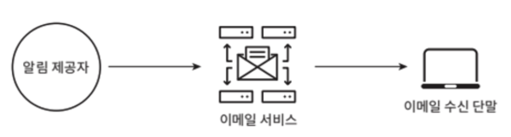

알림 시스템(notification system) 기능을 갖춘 애플리케이션 프로그램은 최신 뉴스, 제품 업데이트, 이벤트, 선물 등 **고객에게 중요할 만한 정보를 비동기적으로 제공**한다.

알림 시스템은 `모바일 푸시 알림`, `SNS 메시지`, `이메일` 세 가지로 분류할 수 있다.

# 1단계: 문제 이해 및 설계 범위 확정

하루에 백만 건 이상의 알림을 처리하는 확장성 높은 시스템을 구축하는 것은 쉬운 과제가 아니다.

요구사항
- 푸시 알림, SMS 메시지, 이메일
- 연성 실시간 시스템
- IOS, Android, Laptop/Desktop
- 미알림 설정
- 하루 천만 건의 모바일 푸시 알림, 백만 건의 SMS 메시지, 5백만 건의 이메일

# 2단계: 개략적 설계안 제시 및 동의 구하기

## 알림 지원별 지원 방안

**IOS 푸시 알림**

IOS 에서 푸시 알림을 보내기 위해 세 가지 컴포넌트가 필요하다.

<center></center>

- `알림 제공자`(provider): 알림 요청을 만들어 애플 푸시 알림 서비스(APNS)로 보내는 주체
  - 알림 요청을 만들기 위해 아래 데이터가 필요
  - device token: 알림 요청을 보내는 데 필요한 고유 식별자
  - payload: 알림 내용을 담은 JSON 딕셔너리
- `APNS`(Apple Push Notification Service): 애플이 제공하는 원격 서비스
  - 푸시 알림을 IOS 장치로 보내는 역할을 담당
- `IOS 단말`(IOS Device): 푸시 알림을 수신하는 사용자 단말

.

**Android 푸시 알림**

안드로이드 푸시 알림도 IOS와 비슷한 절차로 전송된다.
- APNS 대신 `FCM`(Firebase Cloud Messaging)

<center></center>

.

**SMS 메시지**

SMS 메시지를 보낼 떄 보통 `Twilio`, `Nexmo` 같은 제 3사업자의 서비스를 많이 이용한다.

<center></center>

.

**이메일**

상용 이메일 서비스로 유명한 서비스는 `Sendgrid`, `Mailchimp`가 있다.
- 전송 성공률도 높고, 데이터 분석 서비스도 제공한다.

<center></center>

.

**알림 유형 전부를 한 시스템으로 묶으면 아래와 같다.**

<center></center>

## 연락처 정보 수집 절차

알림을 보내기 위해 모바일 단말 토큰, 전화번호, 이메일 주소 등의 정보가 필요하다.
- 사용자가 앱을 설치하거나 처음으로 계정을 등록하면 API 서버는 해당 사용자의 정보를 수집하여 데이터베이스에 저장한다.

<center></center>

DB에 연락처 정보를 저장할 테이블 구조는 아래와 같다.
- 필수 정보만 담은 개략적인 설계안이고, 이메일 주소와 전화번호는 user 테이블에, 단말 토큰은 device 테이블에 저장한다.

<center></center>

## 알림 전송 및 수신 절차

<center></center>

(1) 1~N 까지의 서비스
- 각 서비스는 마이크로서비스일 수도 있고, 크론잡일 수도 있고, 분산 시스템 컴포넌트일 수도 있다.
- 알림 시스템 서버의 API를 통해 알림을 보낼 서비스들

(2) 알림 서버
- **알림 전송 API**: 스팸 방지를 위해 보통 사내 서비스 또는 인증된 클라이언트만 이용 가능
- **알림 검증**: 이메일 주소, 전화번호 등에 대한 기본적인 검증을 수행
- **데이터베이스 또는 캐시 질의**: 알림에 포함시킬 데이터를 가져오는 기능
- **알림 전송**: 알림 데이터를 메시지 큐에 삽입
    ```http
    POST https://api.example.com/v1/sms/send

    {
        "to": [
            {
                "user_id": 123456
            }
        ],
        "from": {
            "email": "xxx@gmail.com"
        },
        "subject": "Hello!",
        "content": [
            {
                "type": "text/plain",
                "value": "Hello~"
            }
        ]
    }
    ```

(3) 캐시
- 사용자 정보, 단말 정보, 알림 템플릿 등을 캐시

(4) DB
- 사용자, 알림, 설정 등 다양한 정보를 저장

(5) 메시지 큐
- 시스템 컴포넌트 간 의존성을 제거하기 위해 사용
- 다량의 알림 전송 시 버퍼 역할

(6) 작업 서버
- 메시지 큐에서 전송할 알림을 꺼내서 제3자 서비스로 전달하는 역할을 담당하는 서버

(3) 제3자 서비스
- 사용자에게 알림을 실제로 전달하는 역할
- 쉽게 새로운 서비스를 통합하거나 기존 서비스를 제거할 수 있는 확장성이 중요하다.

(4) iOS, Android, SMS, Email 단말
- 사용자는 자기 단말에서 알림을 수신

.

**알림 전송 플로우**

1. API를 호출하여 알림 서버로 알림 전송.
2. 알림 서버는 사용자 정보, 단말 토큰, 알림 설정 같은 메타데이터를 캐시나 DB에서 조회.
3. 알림 서버는 전송할 알림에 맞는 이벤트를 만들어서 해당 이벤트를 위한 큐에 삽입.
4. 작업 서버는 메시지 큐에서 알림 이벤트를 꺼냄.
5. 작업 서버는 알림을 제3자 서비스로 전송
6. 제3자 서비스는 사용자 단말로 알림을 전송

# 3단계: 상세 설계

# 4단계: 마무리