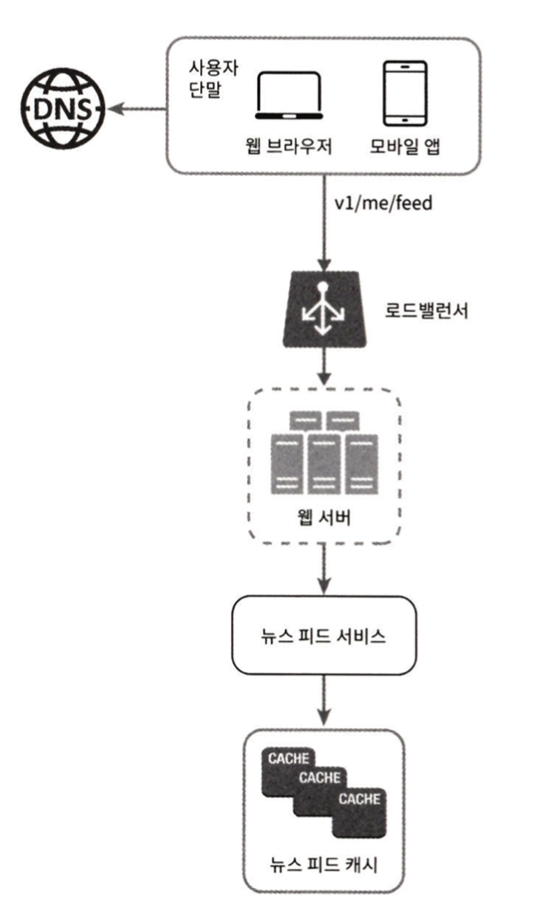

뉴스 피드(news feed)

> 뉴스 피드는 여러분의 홈 페이지 중앙에 지속적으로 업데이트되는 스토리들로, 사용자 상태 정보 업데이트, 사진, 비디오, 링크, 앱 활동, 그리고 여러분이 페이스북에서 팔로하는 사람들, 페이지, 또는 그룹으로부터 나오는 '좋아요'등을 포함한다.
>
> \- 페이스북 \-

# 1단계: 문제 이해 및 설계 범위 확정

지원해야 하는 기능
- 모바일 앱, 웹 동시 지원
- 사용자는 뉴스 피드 페이지에 새로운 스토리를 올릴 수 있어야 하고, 친구들이 올리는 스토리를 볼 수도 있어야 함.
- 스토리 순서는 단순히 시간 흐름 역순
- 한 명의 사용자는 최대 5000명의 친구를 가질 수 있음
- 트래픽 규모는 매일 천만 명이 방문하는 것으로 가정(10 million DAU)
- 스토리에는 이미지나 비디오 등의 미디어 파일이 포함될 수 있음.

# 2단계: 개략적 설계안 제시 및 동의 구하기

뉴스 피드 시스템 설계안은 `피드 발행`(feed publishing)과 `뉴스 피드 생성`(news feed building) 두 가지 부분으로 나눈다.

- `피드 발생`: 사용자가 스토리를 포스팅하면 해당 데이터를 캐시와 데이터배이스에 기록
- `뉴스 피드 생성`: 뉴스 피드는 모든 친구의 포스팅을 시간 흐름 역순으로 모아서 만드는 것으로 가정

## 뉴스 피드 API

클라이언트가 서버와 통신하기 위해 사용하는 수단
- HTTP 프로토콜 기반, 상태 정보 업데이트, 뉴스 피드 가져오기, 친구 추가 등의 다양한 작업을 수행하는 데 사용

.

**피드 발행 API**

새 스토리를 포스팅하기 위한 API. HTTP POST 형태로 요청을 전송
- `POST /v1/me/feed`
- body: 포스팅 내용에 해당
- Authorization header: API 호출을 인증하기 위해 사용

.

**피드 읽기 API**

뉴스 피드를 가져오는 API
- `GET /v1/me/feed`
- Authorization header: API 호출을 인증하기 위해 사용

## 피드 발행

피드 발행 시스템의 개략적 형태

<figure><figcaption></figcaption></figure>

- `사용자`: 모바일 앱이나 브라우저에서 새 포스팅을 올리는 주체
  - `POST /v1/me/feed` API 사용
- `로드밸런서`(load balancer): 트래픽을 웹 서버들로 분산
- `웹 서버`: HTTP 요청을 내부 서비스로 중계하는 역할을 담당
- `포스팅 저장 서비스`(post service): 새 포스팅을 DB와 캐시에 저장
- `포스팅 전송 서비스`(fanout service): 새 포스팅을 친구의 뉴스 피드에 푸시. 뉴스 피드 데이터는 캐시에 보관하여 빠르게 읽어갈 수 있도록 한다.
- `알림 서비스`(notification service): 친구들에게 새 포스팅이 올라왔음을 알리거나, 푸시 알림을 보내는 역할을 담당

## 뉴스 피드 생성

뉴스 피드 생성의 개략적인 설계

<figure><figcaption></figcaption></figure>

- `사용자`: 뉴스 피드를 읽는 주체. `POST /v1/me/feed` API 이용
- `로드밸런서`: 트래픽을 웹 서버들로 분산
- `웹 서버`: 트래픽을 뉴스 피드 서비스로 전달
- `뉴스 피드 서비스`(news feed service): 캐시에서 뉴스 피드를 가져오는 서비스
- `뉴스 피드 캐시`(news feed cache): 뉴스 피드를 렌더링할 때 필요한 피드 ID 보관

# 3단계: 상세 설계

피드 발행 흐름의 상세 설계안

<figure><figcaption></figcaption></figure>

## 피드 발행 흐름 상세 설계

### 웹 서버

- 클라이언트와 통신뿐 아니라 인증이나 처리율 제한 등의 기능도 수행
- 올바른 인증 토큰을 Authorization 헤더에 넣고 API를 호출하는 사용자만 포스팅할 수 있도록 제한
- 특정 기간 동안 한 사용자가 올릴 수 있는 포스팅 수에 제한

.

### 포스팅 전송(fanout service) 서비스

어떤 사용자의 새 포스팅을 그 사용자와 친구 관계에 있는 모든 사용자에게 전달하는 과정
팬아웃에는 두 가지 모델이 존재
- `쓰기 시점에 팬 아웃`(fanout-on-write, push model)
- `읽기 시점에 팬아웃`(fanout-on-read, pull model)

.

**쓰기 시점에 팬아웃하는 푸시 모델**

- 새로운 포스팅을 기록하는 시점에 뉴스 피드를 갱신
- 포스팅이 완료되면 바로 해당 사용자의 캐시에 해당 포스팅을 기록
- 장점)
  - 뉴스 피드가 실시간으로 갱신되며, 친구 목록에 있는 사용자에게 즉시 전송
  - 새 포스팅이 기록되는 순간에 뉴스 피드가 이미 갱신되므로 뉴스 피드 로딩 시간 단축
- 단점)
  - 친구가 많은 사용자의 경우 뉴스 피드 갱신에 많은 시간 소요(hotkey 문제 발생)
  - 서비스를 자주 이용하지 않는 사용자 피드까지 갱신해야 하므로 컴퓨팅 자원 낭비

.

**읽기 시점에 팬아웃하는 풀 모델**

- 피드를 읽어야 하는 시점에 뉴스 피드를 갱신. 요청 기반 모델(on-demand model)
- 사용자가 홈페이지나 타임라인을 로딩하는 시점에 새로운 포스트를 가져오게 된다.
- 장점)
  - 비활성 사용자 또는 서비스에 거의 로그인하지 않는 사용자의 경우 이 모델이 유리(로그인하기까지 어떠한 컴퓨팅 자원도 소모하지 않음)
  - 데이터를 친구 각각에 푸시하는 작업이 없으므로 hotkey 문제도 발생하지 않음
- 단점)
  - 뉴스 피드를 읽는 데 많은 시간이 소요될 수 있음

.

**두 가지 방법(쓰기 시점, 읽기 시점)을 결합하여 장점은 취하고 단점은 버리는 전략**

- 뉴스 피드를 빠르게 가져올 수 있도록 하는 것은 중요하므로, 대부분의 사용자에 대해서는 `푸시 모델`을 사용
- 친구나 팔로어가 많은 사용자의 경우 팔로어로 하여금 해당 사용자의 포스팅을 필요할 때 가져가도록 하는 `풀 모델` 사용으로 시스템 과부하 방지
- `안정 해시`(consistent hashing)을 통해 요청과 데이터를 보다 고르게 분산하여 `hotkey` 문제를 줄이기

.

**두 모델을 결합한 팬아웃 서비스**

<figure><figcaption></figcaption></figure>

- (1) 그래프 DB에서 친구 ID 목록 가져오기.
  - (그래프 DB는 친구 관계나 친구 추천을 관리하기 적합)
- (2) 사용자 정보 캐시에서 친구 정보 가져오기.
  - 사용자 설정에 따라 친구 가운데 일부 걸러내기(피드 업데이트 무시, 일부 사용자에게 공유 설정..)
- (3) 친구 목록과 새 스토리의 포스팅 ID를 메시지 큐에 삽입
- (4) 팬아웃 작업 서버가 메시지 큐에서 데이터를 꺼내어 뉴스 피드 데이터를 뉴스 피드 캐시에 삽입
  - 뉴스 피드 캐시는 <포스팅ID, 사용자ID> 순서쌍을 보관하는 매핑 테이블
  - 메모리 요구량이 지나치게 늘어나는 것을 방지하기 위해 사용자, 포스팅 ID만 저장
  - 대부분 사용자가 보려 하는 것은 최신 스토리이므로 캐시 미스가 일어날 확률은 낮음

## 피드 읽기 흐름 상세 설계

<figure><figcaption></figcaption></figure>

- 이미지나 비디오 같은 미디어 콘텐츠는 CDN에 저장하여 빨리 읽어갈 수 있도록 세팅
- (1) 사용자가 뉴스 피드를 읽으려는 요청 전송
  - `/v1/me/feed`로 전송
- (2) 로드밸런서가 요청을 **웹 서버** 가운데 하나로 **전송**
- (3) 웹 서버는 피드를 가져오기 위해 **뉴스 피드 서비스 호출**
- (4) 뉴스 피드 서비스는 **뉴스 피드 캐시**에서 포스팅 ID 목록 조회
- (5) 뉴스 피드에 표시할 사용자 이름, 사진, 포스팅 콘텐츠, 이미지 등을 **사용자 캐시**와 **포스팅 캐시**에서 가져와 완전한 뉴스 피드 생성
- (5) 생성된 뉴스 피드를 JSON 형태로 **클라이언트에게 전송**. 클라이언트는 해당 피드를 렌더링

# 4단계: 마무리