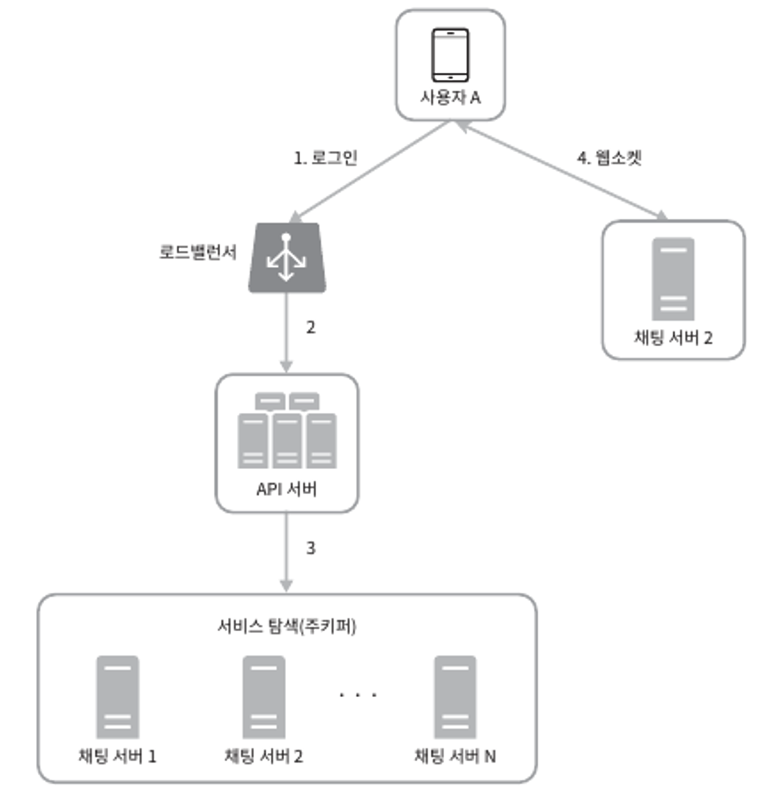
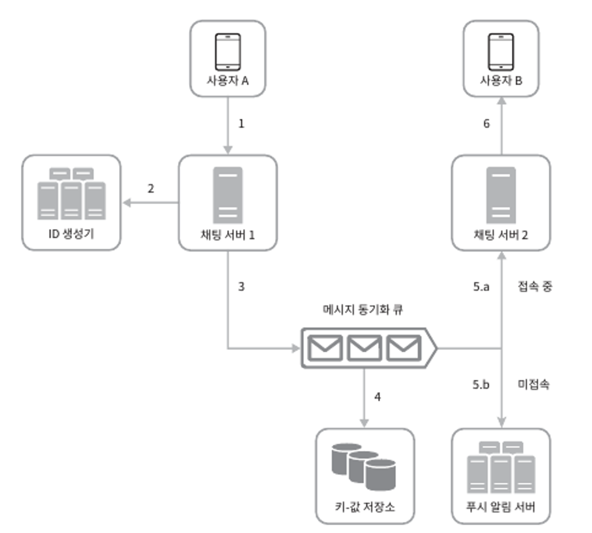

현재 시장에서 가장 널리 쓰이고 있는 채팅 시스템 몇 가지..
- Whatsapp (왓츠앱)
- Facebook messenger
- Wechat (위챗)
- Line
- Google Hangout
- Discord

# 1단계: 문제 이해 및 설계 범위 확정

지원해야 하는 기능

- 1:1, 그룹 채팅 모두 지원하는 앱(응답지연이 낮은 일대일 채팅 기능)
- 모바일, 웹 모두 지원
- 일별 능동 사용자 수(DAU, Daily Active User) 기준 5천만(50million)명 처리
- 최대 100명까지 그룹 채팅 참여 가능
- 1:1 채팅, 그룹 채팅, 사용자 접속상태 표시 지원
- 메시지 길이는 100,000자 이하
- 채팅 이력은 영원히 보관
- 다양한 단말 지원, 하나의 계정으로 여러 단말에 동시 접속 지원
- 푸시 알림

# 2단계: 개략적 설계안 제시 및 동의 구하기

기본적으로 채팅 서비스는 아래 기능을 제공해야 한다.

- 클라이언트들로부터 메시지 수신
- 메시지 수신자 결정 및 전달
- 수신자가 접속 상태가 아닌 경우 접속할 때까지 해당 메시지 보관

클라이언트(메시지 송/수신 클라이언트)와 채팅 서비스 사이의 관계

<figure><figcaption></figcaption></figure>

**메시지 송신 클라이언트**

- 채팅을 시작하려는 클라이언트는 **네트워크 통신 프로토콜**을 사용하여 서비스에 접속
  - 어떤 통신 프로토콜을 사용할 것인가도 중요한 문제
- 메시지 송신 클라이언트는 **클라이언트/서버 애플리케이션에서 요청**을 보내는 역할
- 송신 클라이언트는 메시지를 채팅 서비스에 보낼 때 오랜 세월 검증된 **HTTP 프로토콜**을 사용
  - HTTP는 메시지 전송 용도로 좋은 선택
  - 페이스북 같은 대부분 대중적 채팅 프로그램이 초기에 HTTP 사용
- 채팅 서비스와의 접속에는 **keepalive 헤더**를 사용하면 효율적
  - 클라이언트 서버 사이의 연결을 끊지 않고 계속 유지할 수 있음
  - TCP 접속 과정에서 ㅂ라생하는 핸드셰이크 횟수를 줄일 수도 있음

**메시지 수신 클라이언트**

- HTTP는 클라이언트가 연결을 만드는 프로토콜
  - 서버에서 클라이언트로 임의 시점에 메시지를 보내는 데는 쉽게 쓰일 수 없음
- 서버가 연결을 만드는 것처럼 동작할 수 있도록 하기 위해 많은 기법이 제안
  - polling, long polling, webSocket..

## 폴링

**클라이언트가 주기적으로 서버에게** 새 메시지가 있는지 물어보는 방법

- 폴링 비용은 폴링을 자주하면 할수록 올라간다.
- 답해줄 메시지가 없는 경우 서버 자원이 불필요하게 낭비되는 문제가 존재

<figure><figcaption></figcaption></figure>

## 롱 폴링

Long Polling: 폴링의 여러 가지 비효율적인 부분을 보안한 기법

<figure><figcaption></figcaption></figure>

클라이언트는 **새 메시지가 반환되거나 타임아웃 될 때까지 연결을 유지**한다.
- 클라이언트는 새 메시지를 받으면 기존 연결을 종료하고 서버에 새로운 요청을 보내어 모든 절차를 다시 시작

하지만, 이 기법에도 약점이 존재
- 메시지를 보내는 클라이언트와 수신하는 클라이언트가 같은 채팅 서버에 접속하게 되지 않을 수 있다.
  - HTTP 서버들은 보통 무상태 서버
  - 로드밸런싱을 위해 라운드 로빈 알고리즘을 사용하는 경우, 메시지를 받은 서버는 해당 메시지를 수신할 클라이언트와의 롱 폴링 연결을 가지고 있지 않은 서버일 수 있다.
- 서버 입장에서 클라이언트가 연결을 해제했는지 아닌지 알 수 있는 방법이 없다.
- 메시지를 많이 받지 않는 클라이언트도 타임아웃이 일어날 때마다 **주기적으로 서버에 다시 접속하여 비효율적**

## 웹소켓

WebSocket은 서버가 클라이언트에게 비동기(async) 메시지를 보낼 때 가장 널리 사용하는 기술

<figure><figcaption></figcaption></figure>

- 웹소켓 연결은 클라이언트가 시작
  - 한 번 맺어진 연결은 항구적이며 **양방향**
  - 처음에는 HTTP 연결이지만 **특정 핸드셰이크 절차**를 거져 웹소켓 연결로 업그레이드
  - 항구적인 연결이 만들어지고 나면 **서버는 클라이언트에게 비동기적으로 메시지를 전송**할 수 있음
- 방화벽이 있는 환경에서도 잘 동작
  - 80, 443 처럼 HTTP 혹은 HTTPS 프로토콜이 사용하는 기본 포트번호를 그대로 사용
- 웹소켓은 양방향 메시지 전송까지 가능하므로 HTTP를 고집할 이유는 없다.

.

웹소켓을 이용하면 메시지를 보낼 때나 받을 때 동일한 프로토콜을 사용할 수 있음
- 설계뿐 아니라 구현도 단순하고 직관적
- 웹소켓 연결은 항구적으로 유지되어야 하므로 서버 측에서 연결 관리를 효율적으로 해야 함

## 개략적 설계안

대부분의 기능(회원가입, 로그인, 사용자 프로파일 등)은 일반적으로 HTTP상에서 구현

전체 시스템의 개략적 설계안

<figure><figcaption></figcaption></figure>

**무상태 서비스**

무상태 서비스는 로그인, 회원가입, 사용자 프로파일 표시 등을 처리하는 전통적인 요청/응답 서비스
- 많은 웹사이트와 앱이 보편적으로 제공하는 기능
- 요청을 경로에 맞는 서비스로 전달하는 로드밸런서 뒤에 위치

.

**상태 유지 서비스**

유일하게 상태 유지가 필요한 서비스는 채팅 서비스
- 각 클라이언트가 채팅 서버와 독립적인 네트워크 연결을 유지해야 하기 때문
- 클라이언트는 보통 서버가 살아 있는 한 다른 서버로 연결을 변경하지 않음

.

**제3자 서비스 연동**

채팅 앱에서 가장 중요한 푸시 알림
- 새 메시지를 받았다면 앱이 실행 중이지 않더라도 알림을 받아야 한다.

.

**규모 확장성**

트래픽 규모가 얼마 되지 않을 때는 위에 모든 기능을 서버 한 대로 구현 가능하다.
- 대량의 트래픽을 처리해야 하는 경우 서버 한 대로 얼마나 많은 접속을 허용할 수 있는지 따져봐야 한다.
- 동시 접속자가 1M이라면, 접속당 10K의 서버 메모리가 필요하다.
- 이 경우, 10GB 메모리만 있으면 모든 연결을 다 처리할 수 있다.
- 하지만, SPOF(Single Point Of Failure)뿐만 아니라 대량의 트래픽을 서버 한 대로 처리하기 어려울 것이다.

지금까지의 내용을 하나로 묶은 개략적 설계안이다.

<figure><figcaption></figcaption></figure>

실시간으로 메시지를 주고받기 위해 클라이언트는 채팅 서버와 웹소켓 연결을 끊지 않고 유지해야 한다.
- 채팅 서버는 클라이언트 사이에 메시지를 중계하는 역할을 담당
- 접속상태 서버(presence server)는 사용자의 접속 여부를 관리
- API 서버는 로그인, 회원가입, 프로파일 변경 등 그 외 나머지 전부를 처리
- 알림 서버는 푸시 알림을 전송
- key-value store에는 채팅 이력을 보관
  - 시스템에 접속한 사용자는 이전 채팅 이력을 전부 조회

.

**저장소**

어떤 데이터베이스를 사용하느냐가 중요하다.
- RDB? NoSQL?
- 데이터 유형과 읽기/쓰기 연산의 패턴을 중요하게 따져보아야 한다.

채팅 시스템이 다루느느 데이터는 보통 두 가지가 있다.

(1) **사용자 프로파일, 설정, 친구 목록처럼 일반적인 데이터**
- 이런 데이터는 안정성을 보장하는 관계형 데이터베이스에 보관
- Replication, Sharding은 이런 데이터의 가용성과 규모확장성을 보증하기 위해 보편적으로 사용되는 기술

(2) **채팅 시스템에 고유한 데이터. (채팅 이력)**
- 채팅 이력 데이터의 양은 방대하다. (페이스북 메신저, 왓츠앱은 매일 600억개의 메시지를 처리)
- 빈번하게 사용되는 것은 주로 최근에 주고 받은 메시지
- 검색 기능, 특정 사용자가 언급된 메시지, 특정 메시지로 점프, 무작위 데이터 접근 등의 기능도 지원 필요
- 1:1 채팅 앱의 경우 읽기:쓰기 비율은 대략 1:1

이 모두를 지원하기 위해 `key-value store`를 추천
- 수평적 규모확장이 쉽다.
- 데이터 접근 지연시간이 낮다.
- RDB는 데이터 가운데 롱 테일에 해당하는 부분을 잘 처리하지 못 하는 경향이 있다.
  - 인덱스가 커지면 데이터에 대한 무작위 접근을 처리하는 비용의 증가
- 이미 많은 안정적인 채팅 시스템이 key-value store 채택

## 데이터 모델

메시지 데이터를 어떻게 보관할 것인가?

**1:1 채팅을 위한 메시지 테이블**

|column|type|
|:---|---:|
|message_id|bigint|
|message_to|bigint|
|content|text|
|created_at|timestamp|

기본키로 message_id를 사용하고 메시지 순서를 쉽게 정할 수 있도록 하는 역할도 담당한다.
- created_at으로는 서로 다른 두 메시지가 동시에 만들어질 수 있으므로 순서를 정할 수 없다.

.

**그룹 채팅을 위한 메시지 테이블**

|column|type|
|:---|---:|
|channel_id|bigint|
|message_id|bigint|
|message_to|bigint|
|content|text|
|created_at|timestamp|

(channel_id, message_id)의 복합키를 기본 키로 사용
- channel == channel_group
- channel_id는 partition key로도 사용

.

**메시지 ID**

message_id를 만드는 기법은 흥미로운 주제다.

메시지들의 순서도 표현할 수 있어야 하므로 아래 속성을 만족해야 한다.

- message_id 값은 고유해야 한다.(uniqueness)
- ID 값은 정렬 가능해야 하며 시간 순서와 일치해야 한다.

두 조건을 만족시키기 위한 방법

(1) RDBMS를 사용할 경우 auto_increment 사용

- 하지만, NoSQL은 보통 해당 기능을 제공하지 않음.

(2) [스노플레이크](https://blog.twitter.com/engineering/en_us/a/2010/announcing-snowflake)같은 전역적 64-bit 순서 번호(sequence number) 생성기 사용

- [07.유일 ID 생성기 설계](https://jihunparkme.gitbook.io/docs/book/system-design-interview/07)

(3) 지역적 순서 번호 생성기(local sequence number generator) 사용

- 지역적이라 함은, ID의 유일성은 같은 그룹 안에서만 보증하면 충분하다는 것
- 메시지 사이의 순서는 같은 채널, 혹은 같은 채팅 세션 안에서만 유지되면 충분하므로 적용 가능
- 전역적 ID 생성기에 비해 구현이 쉬운 접근법

# 3단계: 상세 설계

서비스 탐색, 메시지 전달 흐름, 사용자 접속 상태 표시 방법을 자세히 살펴보자.

## 서비스 탐색

서비스 탐색의 주된 역할은 **클라이언트에게 가장 적합한 채팅 서버를 추천하는 것**이다.
- 클라이언트의 위치, 서버 용량 등이 기준이 될 수 있다.
- 서비스 탐색 기능 구현에는 오픈 소스 솔루션으로 `Apache Zookeeper` 같은 것이 있다.
- 사용 가능한 모든 채팅 서버를 등록하고, 클라이언트가 접속하면 기준이 따라 최적의 채팅 서버를 골라주면 된다.

<figure><figcaption></figcaption></figure>

- (1) 사용자 A가 시스템에 로그인 시도
- (2) 로드밸런서가 로그인 요청을 API 서버 가운데 하나로 전송
- (3) API 서버가 사용자 인증을 처리하고 나면 서비스 탐색 기능이 동작하여 해당 사용자를 서비스할 최적의 채팅 서버 탐색
- (4) 사용자는 선택된 채팅 서버와 웹소켓 연결

## 메시지 전달 흐름

1:1 채팅 메시지의 처리 흐름과 여러 단말 간 메시지 동기화과정, 그룹 채팅 메시지의 처리 흐름을 살펴보자.

### 1:1 채팅 메시지 처리 흐름

<figure><figcaption></figcaption></figure>

- (1) 사용자 A가 채팅 서버 1로 메시지 전송
- (2) 채팅 서버 1은 ID 생성기를 사용해 해당 메시지의 ID 결정
- (3) 채팅 서버 1은 해당 메시지를 메시지 동기화 큐로 전송
- (4) 메시지가 키-값 저장소에 보관
- (5) (a) 사용자 B가 접속중인 경우 메시지는 사용자 B가 접속 중인 채팅 서버로 전송
  - (b) 접속 중이 아닐 경우 푸시 알림 메시지를 푸시 알림 서버로 전송
- (6) 채팅 서버 2는 메시지를 사용자 B에게 전송. 사용자 B와 채팅 서버 2 사이에는 연결되어있는 웹소켓을 이용

## 사용자 접속 상태 표시

# 4단계: 마무리