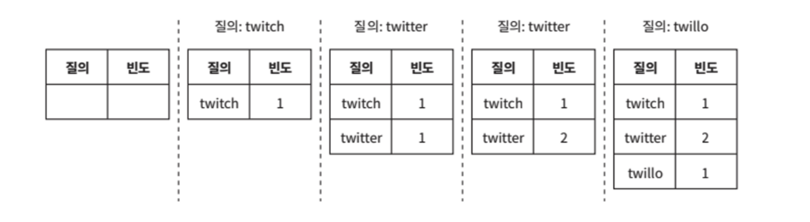
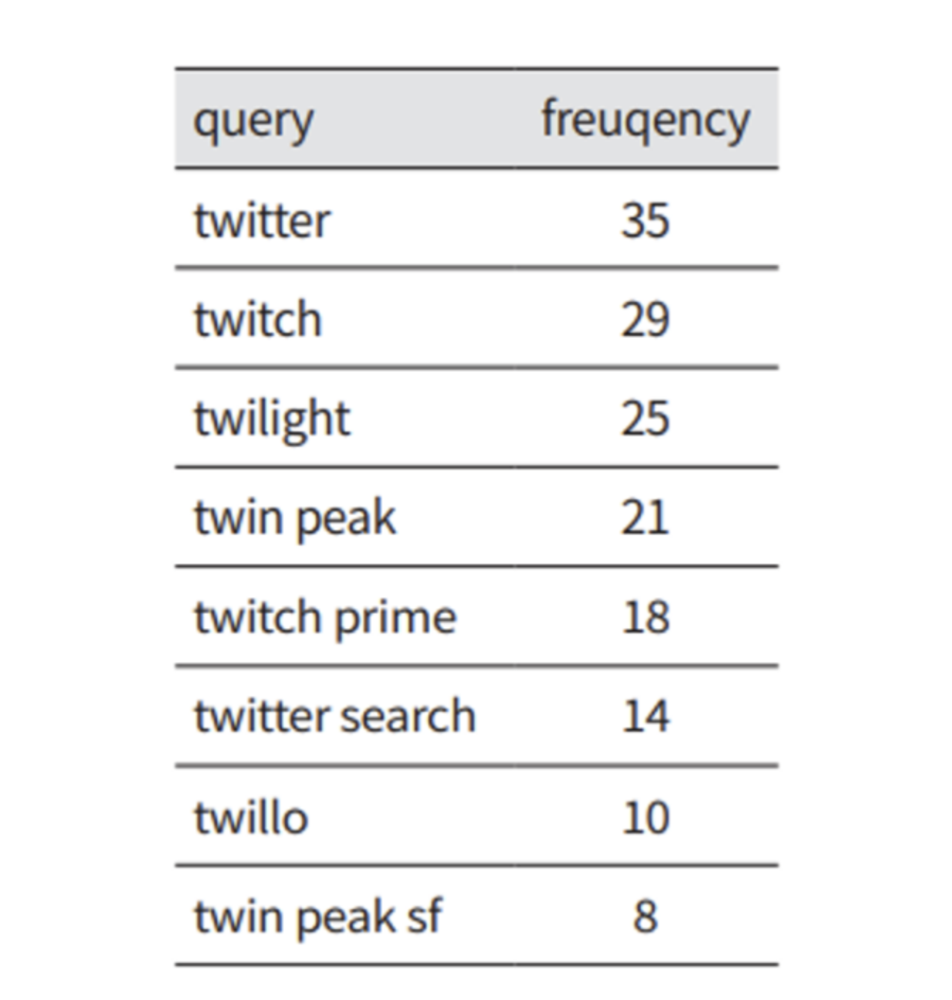
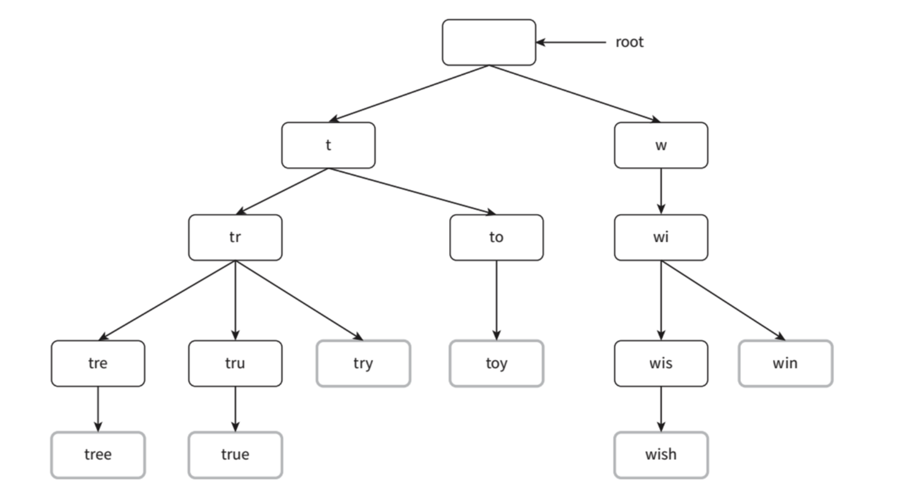
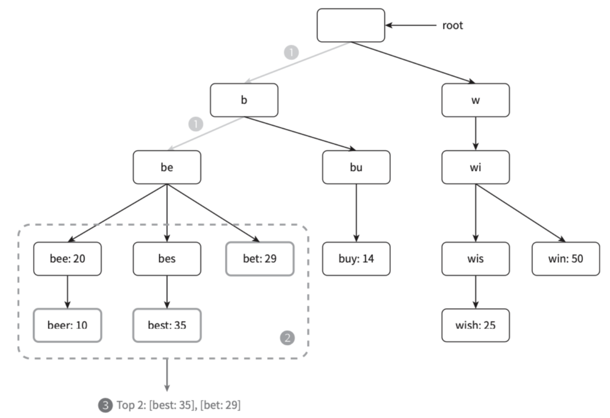

검색어 자동 완성
- autocomplete
- typehead
- search-as-you-type
- incremental search

> 많이 이용된 검색어 k개를 자동완성하여 출력하는 시스템 설계

# 1단계: 문제 이해 및 설계 범위 확정

- 사용자 입력 단어는 자동완성될 검색어의 첫 부분
- 5개의 자동완성 검색이 표시
- 5개는 질의 빈도에 따러 정해지는 검색어 인기 순위 기준
- 맞춤법 검사나 자동수정은 미지원
- 질의는 영어 + 다국어
- 모든 질의는 영어 소문자
- 일간 능동 사융자(DAU) 천만(10million)

## 요구사항

**빠른 응답 속도**

- 페이스북 검색어 자동완성 시스템에 관한 문서를 보면 시스템 응답속도는 100밀리초 이내여야 한다. 그렇지 않으면 시스템이 불편해진다.

**연관성**

- 자동완성되어 출력되는 검색어는 사용자가 입력한 단어와 연관된 것이어야 한다.

**정렬**

- 시스템의 계산 결과는 인기도, 등의 순위 모델에 의해 정렬

**규모 확장성**

- 시스템은 많은 트래픽을 감당할 수 있도록 확장 가능해야 한다.

**고가용성**

- 시스템의 일부에 장애가 발생하거나, 느려지거나, 예상치 못한 네트워크 문제가 생겨도 시스템은 계속 사용 가능해야 한다.

## 개략적 규모 추정

- 일간 능동 사용자(DAU)는 천만 명으로 가정
- 평균적으로 한 사용자는 매일 10건의 검색을 수행한다고 가정
- 질의할 떄마다 평균적으로 20바이트의 데이터를 입력한다고 가정
  - 문자 인코딩 방법으로 ASCII를 사용 (1문자=1byte)
  - 질의문은 평균적으로 4개 단어로 이루어진다.(각 단어는 평균적으로 다섯 글자)
  - 질의당 평균 4x5=20 byte
- 검색창에 글자를 입력할 때마다 클라이언트는 검색어 자동완성 백엔드에 요청을 보낸다.
  - 평균적으로 1회 검색당 20건의 요청이 백엔드로 전달
  - 검색창에 dinner라고 입력 시 예시
    ```text
    search?q=d
    search?q=di
    search?q=din
    search?q=dinn
    search?q=dinne
    search?q=dinner
    ```
- 대략 초당 24,000건의 질의(QPS) 발생 (=10,000,000사용자 x 10질의/일 x 20자/24시간/3600초)
- 최대 QPS = QPS x 2 = 대략 48,000
- 질의 가운데 20% 정도는 신규 검색어라고 가정
  - 대략 0.4GB (=10,000,000사용자 x 10질의/일 x 20자 x 20%)

# 2단계: 개략적 설계안

개략적으로 시스템은 두 부분으로 나뉜다.

**데이터 수집 서비스**

- 사용자가 입력한 질의를 실시간으로 수집하는 시스템
- 실시간은 데이터가 많은 애플리케이션에 바람직하지 않지만 설계안의 출발점으로 적합

**질의 서비스**

- 주어진 질의에 다섯 개의 인기 검색어를 정렬해 내놓는 서비스

## 데이터 수집 서비스

질의문과 사용빈도를 저장하는 `빈도 테이블`이 있다고 가정해 보자.

<figure><figcaption></figcaption></figure>

## 질의 서비스

<figure><figcaption></figcaption></figure>

- query: 질의문을 저장하는 필드
- frequency: 질의문이 사용된 빈도를 저장하는 필드

"top 5"는 빈도 테이블에 기록된 수치를 사용해 계산한다고 가정
- 데이터 양이 적을 때는 SQL 질의문을 사용해 계산할 수 있지만, 데이터가 많아지면 DB 병목이 될 수 있다.

```sql
SELECT *
FROM frequency_table
WHERE query Like 'prefix%'
ORDER BY frequency DESC
LIMIT 5
```

# 3단계: 상세 설계

## 트라이 자료구조

관계형 데이터베이스를 이용해 가장 인기 있는 질의문을 골라내는 방안은 효율적이지 않다.
- 이 문제를 `트라이`(trie, 접두어 트리, prefix tree)를 사용해 해결할 수 있다.

트라이는 문자열들을 간략하게 저장할 수 있는 자료구조이다.
- retrieval. 문자열을 꺼내는 연산에 초점을 맞추어 설계된 자료구조

트라이 자료구조의 핵심 아이디어
- 트라이는 트리 형태의 자료구조
- 루트 노드는 빈 문자열
- 각 노드는 글자 하나를 저장하며, 26개(다음에 등잘할 수 있는 모든 글자 개수)의 자식 노드를 가질 수 있음
- 각 트리 노드는 하나의 단어, 또는 접두어 문자열을 나타냄

<figure><figcaption></figcaption></figure>

기본 트라이 자료구조는 노드에 문자들을 저장
- 이용 빈도에 따라 정렬된 결과를 내놓기 위해 노드에 빈드 정보까지 저장

.

**검색어 자동완성 구현하기**

알고리즘에 사용되는 용어
- p: 접두어
- n: 트라이 안에 있는 노드 개수
- c: 주어진 노드의 자식 노드 개수

가장 많이 사용된 k개를 찾는 방법
- 해당 접두어를 표현하는 노드 찾기. O(p)
- 해당 노드부터 시작하는 하위 트리를 탐색하여 모든 유효 노드 찾기. O(c)
  - 유효한 검색 문자열을 구성하는 노드가 유효 노드
- 유효 노드들을 정렬하여 가장 인기 있는 검색어 k개 찾기. O(clogc)

<figure><figcaption></figcaption></figure>

k=2, 검색창에 'be' 입력했을 경우 알고리즘 동작
- (1) 접두어 노드 'be' 찾기
- (2) 해당 노드부터 시작하는 하위 트리를 탐색하여 모든 유효 노드 찾기
  - 'beer', 'best', 'bet'
- (3) 유효 노드를 정렬하여 2개만 골라내기

이 알고리즘의 시간 복잡도는 각 단계에 소요된 시간의 합이다.
- `O(p) + O(c) + O(clogc)`
- 최악의 경우에는 k개의 결과를 얻기 위해 전체 트라이를 다 검색해야 하는 일이 생길 수 있다.
- 이 문제의 해결 방법으로 두 가지가 존재한다.
  - 접두어의 최대 길이 제한
  - 각 노드에 인기 검색어를 캐시

## 데이터 수집 서비스

## 질의 서비스

## 규모 확장이 가능한 저장소

## 트라이 연산


# 4단계: 마무리