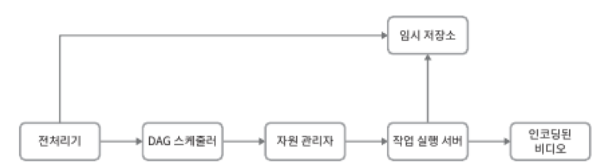

2020년에 조사된 놀라운 통계 자료를 먼저 살펴보자.

- 월간 능동 사용자 수: 2십 억 (2billion)
- 매일 재생되는 비디오 수: 5십 억 (5billion)
- 미국 성인 가운데 73%가 유튜브 이용
- 5천만 명의 창작자
- 유튜브의 광고 수입은 2018 -> 2019 150억 달러로 36% 증가
- 모바일 인터넷 트래픽 가운데 37%를 유튜브가 점유
- 80개의 언어로 이용 가능

**Reference**

- [YouTube by the Numbers](https://www.omnicoreagency.com/youtube-statistics/)
- [YouTube Demographics](https://blog.hubspot.com/marketing/youtube-demographics)

# 1단계: 문제 이해 및 설계 범위 확정

유튜브는 비디오 재생 말고도 댓글, 공유, 좋아요, 재생목록, 구독 등 많은 기능을 제공하므로 적절한 설계 범위 측정이 필요하다.

- 중요 기능은 비디오 업로드, 시청 기능
- 모바일 앱, 웹 브라우저, 스마트 TV 지원
- 일간 능동 상요자 수는 5백만(5million)
- 사용자의 평균 소비 시간은 30분
- 다국어 지원
- 현존하는 비디오 종류와 해상도 대부분을 지원
- 암호화 지원
- 비디오 크기는 최대 1GB로 제한
- 클라우드 서비스 활용

아래 기능을 갖춘 설계에 초점

- 빠른 비디오 업로드
- 원활한 비디오 재생
- 재생 품질 선택 가능
- 낮은 인프라 비용
- 높은 가용성과 규모 확장성, 안정성
- 모바일 앱, 웹 브라우저, 스마트 TV 지원

**개략적 규모 측정**

- 일간 능동 사용자(DAU, Daily Activie User) 수는 5백만(5million)
- 한 사용자는 하루에 평균 5개의 비디오 시청
- 10% 사용자가 하루에 1비디오 업로드
- 비디오 평균 크기는 300MB
- 비디오 저장을 위해 매일 새로 요구되는 저장용량 = 5백만 x 10% x 300MB = 150TB
- CDN 비용(아마존 사용시) = 5백만 x 5비디오 x 0.3GB x $0.02 = $150,000

CDN을 통해 비디오를 서비스하면 비용이 엄청나므로 비용 절감 대안이 필요하다.

# 2단계: 개략적 설계안

개략적으로 설계할 시스템은 세 개 컴포넌트로 구성된다.

**단말(client)**
- 컴퓨터, 모바일, 스마트 TV를 통해 유튜브를 시청할 수 있다.
  
**CDN**
- 비디오는 CDN에 저장
- 재생 버튼을 누르면 CDN으로부터 스트리밍

**API 서버**
- 비디오 스트리밍을 제외한 모든 요청은 API 서버가 처리
- 피드 추천, 비디오 업로드 URL 생성, 메타데이터 DB, 캐시 갱신, 사용자 가입 등

## 비디오 업로드 절차

비디오 업로드 절차의 개략적 설계안

<figure><figcaption></figcaption></figure>

- `사용자`: 컴퓨터나 모바일, 스마트 TV를 통해 유튜브를 시청하는 이용자
- `로드밸런서`: API 서버 각각으로 고르게 요청을 분산하는 역할 담당
- `API` 서버: 비디오 스트리밍을 제외한 다른 모든 요청 처리
- `메타데이터 데이터베이스`: 비디오의 메타데이터 보관
  - 샤딩, 다중화를 적용하여 성능 및 가용성 요구사항 충족
- `메타데이터 캐시`: 성능 향상을 위해 비디오 메타데이터와 사용자 객체 캐시
- `원본 저장소`: 원본 비디오를 보관할 대형 이진 파일 저장소(BLOB)
- `트랜스코딩 서버`: 비디오 트랜스코딩은 비디오 인코딩이라 부르기도 하는 절차
  - 비디오의 포맷을 변환하는 절차
  - 단말이나 대역폭 요구사항에 맞는 최적의 비디오 스트림 제공을 위해 필요
- `트랜스코딩 비디오 저장소`: 트랜스코딩이 완료된 비디오를 저장하는 BLOB 저장소
- `CDN`: 비디오를 캐시하는 역할을 담당
  - 사용자가 재생 버튼을 누르면 비디오 스트리밍은 CDN을 통해 처리
- `트랜스코딩 완료 큐`: 비디오 트랜스코딩 완료 이벤트를 보관할 메시지 큐
- `트랜스코딩 완료 핸들러`: 트랜스코딩 완료 큐에서 이벤트 데이터를 꺼내어 메타데이터 캐시와 데이터베이스를 갱신할 작업 서버들

비디오 업로드는 아래 두 프로세스가 병렬적으로 수행된다.
- a. 비디오 업로드
- b. 비디오 메타데이터 갱신
  - 비디오 URL, 크기, 해상도, 포맷, 사용자 정보 포함

### a. 비디오 업로드

<figure><figcaption></figcaption></figure>

- (1) 비디오를 원본 저장소에 업로드
- (2) 트랜스코딩 서버는 원본 저장소에서 해당 비디오를 가져와 트랜스코딩 시작
- (3) 트랜스 코딩이 완료되면 아래 두 절차가 병렬적으로 수행
  - (3a) 완료된 비디오를 트랜스코딩 비디오 저장소로 업로드
  - (3b) 트랜스코딩 완료 이벤트를 트랜스코딩 완료 큐에 삽입
    - (3a.1) 트랜스코딩이 끝난 비디오를 CDN에 올린다.
    - (3b.1) 완료 핸들러가 이벤트 데이터를 큐에서 꺼낸다.
    - (3b.1.a)(3b.1.b) 완료 핸들러가 메타데이터 데이터베이스와 캐시를 갱신
- (4) API 서버가 단말에게 비디오 업로드가 끝나서 스트리밍 준비가 되었음을 알린다.

### b. 비디오 메타데이터 갱신

원본 저장소에 파일이 업로드되는 동안, 단말은 병렬적으로 비디오 메타데이터 갱신 요청을 API 서버에 보낸다.
- 메타데이터에는 파일 이름, 크기, 포맷 등의 정보가 들어 있다.
- 이 정보로 메타데이터 캐시와 데이터베이스를 업데이트한다.

## 비디오 스트리밍 절차

비디오 스트리밍이 이루어지는 절차에 앞서 `스트리밍 프로토콜(streaming protocol)`이라는 개념을 알아 두어야 한다.
- 비디오 스트리밍을 위해 **데이터를 전송할 때 쓰이는 표준화된 통신방법**
- `MPEG-DASH` : MPEG(Moving Picture Experts Group), DASH(Dynamic Adaptive Streaming over HTTP)
- `Apple HLS` : HLS(HTTP Live Streaming)
- `Microsoft Smooth Streaming`
- `Adobe HTTP Dynamic Streaming, HDS`

프로토콜마다 지원하는 비디오 인코딩이 다르고 플레이어도 다르다.
- 비디오 스트리밍 서비스 설계 시 서비스의 용례에 맞는 프로토콜을 잘 골라야 한다.
- [Streaming Protocols for Live Broadcasting](https://www.dacast.com/blog/streaming-protocols/)

비디오는 CDN에서 바로 스트리밍된다.
- 사용자 단말에 가장 가까운 CDN edge server가 비디오 전송을 담당한다.

# 3단계: 상세 설계

비디오 업로드, 비오 스트리밍 담당 부분을 최적화 방안과 함께 더 상세히 다듬고 오류 처리 메커니즘을 살펴보자.

## 비디오 트랜스코딩

비디오를 녹화하면 단말은 해당 비디오를 특정 포맷으로 저장한다.
- 해당 비디오가 다른 단말에서도 재생되려면 다른 단말과 호환되는 비트레이트(bitrate)와 포맷으로 저장되어야 하다.

**비트레이트(bitrate)**
- 비디오를 구성하는 비트가 얼마나 빨리 처리되어야 하는지를 나타내는 단위
- 비트레이트가 높은 비디오는 일반적으로 고화질 비디오
- 비트레이트가 높은 비디오 스트림을 정상 재생하려면 보다 높은 성능의 컴퓨팅 파워가 필요하고, 인터넷 회신 속도도 빨라야 한다.
  
**비디오 트랜스코딩이 중요한 이유**
- 가공되지 않는 원본 비디오는 저장 공간을 많이 차지
- 상당수의 단말과 브라우저는 특정 종류의 비디오 포맷만 지원
  - 호환을 위해 여러 포맷으로 인코딩 필요
- 사용자에게 끊김 없는 고화질 비디오 재생을 보장하기 위해, 네트워크 대역폭이 충분하지 않은 사용자에게는 저화질 비디오를, 대역폭이 충분한 사용자에게는 고화질 비디오를 보내는 것이 바람직
- 모바일 단말의 경우 네트워크 상황이 수시로 달라질 수 있다.
  - 끊김 현상을 예방하기 위해 비디오 화질을 자동으로 변경하거나 수동으로 변경할 수 있도록 하는 것이 바람직

**인코딩 포맷**
- `container`: 비디오, 파일, 오디오, 메타데이터를 담는 바구니
  - 컨테이너 포맷은 .avi, .mov, .map4 같은 파일 확장자를 보면 알 수 있음
- `codec`: 비디오 화질은 보존하면서 파일 크기를 줄일 목적으로 고안된 압축/해제 알고리즘
  - H.264, VP9, HEVC

## 유향 비순환 그래프(DAG) 모델

비디오를 트랜스코딩하는 것은 **컴퓨팅 자원**을 많이 소모할 뿐 아니라 **시간**도 많이 드는 작업이다.

각기 다른 유형의 비디오 프로세싱 파이프라인(워터마크, 섬네일 이미지, 화질)을 지원하는 한편 처리 과정의 병렬성을 높이기 위해서는 **적절한 수준의 추상화**를 도입하여 클라이언트 프로그래머로 하여금 **실행할 작업을 손수 정의**할 수 있도록 해야 한다.

유향 비순환 그래프(DAG: Directed Acyclic Graph) 프로그래밍 모델을 도입하면, 작업을 단계별로 배열할 수 있도록 하여 해당 **작업들이 순차적으로 또는 병렬적으로 실행**될 수 있도록 하고 있다.
- ex. 페이스북의 스트리밍 비디오 엔진

.

**비디오 트랜스코딩을 위해 채택한 DAG 모델**

<figure><figcaption></figcaption></figure>

원본 비디오는 비디오, 오디오, 메타데이터의 세 부분으로 나뉘어 처리된다.

비디오 부분에 적용되는 작업
- `검사`(inspection): 좋은 품질의 비디오인지 손상은 없는지 확인하는 작업
- `비디오 인코딩`(video encoding): 비디오를 다양한 해상도, 코덱, 비트레이트 조합으로 인코딩
  - 360p.mp4, 480p.mp4, 7200p.mp4, .. 4k.mp4
- `섬네일`(thumbnail): 사용자가 업로드한 이미지나 비디오에서 자동 추출된 이미지로 섬네일을 만드는 작업
- `워터마크`(watermark): 비디오에 대한 식별정보를 이미지 위에 오버레이 형태로 띄워 표시하는 작업

## 비디오 트랜스코딩 아키텍처

클라우드 서비스를 활용한 비디오 트랜스코딩 아키텍처를 아래와 같이 정의

<figure><figcaption></figcaption></figure>

전처리기, DAG 스케줄러, 자원 관리자, 작업 실행 서버, 임시 저장소의 주요 컴포넌트로 구성
- 이 아키텍처가 동작한 결과로 인코딩된 비디오가 만들어진다.

### 전처리기

전처리기가 하는 일은 세 가지가 있다.

- (1) `비디오 분할`: 비디오 스트림을 GOP(Group of Pictures) 단위로 쪼갠다.
  - GOP는 특정 순서로 배열된 프레임 그룹
  - 하나의 GOP는 독립적으로 재생 가능하며, 길이는 보통 몇 초 정도
- (2) `DAG 생성`: 클라이언트가 작성한 설정 파일에 따라 DAG 생성
- (3) `데이터 캐시`: 전처리기는 분할된 비디오의 캐시이기도 하다.
  - 안정성을 높이기 위해 전처리기는 GOP와 메타데이터를 임시 저장소에 보관
  - 비디오 인코딩 실패 시 보관된 데이터를 활용해 인코딩 재개

### DAG 스케줄러

DAG 그래프를 몇 개의 단계로 분할한 다음에 그 각각을 자원 관리자의 작업 큐에 넣는다.

아래 DAG 스케줄러 동작의 사례는 하나의 DAG 그래프를 두 개 작업 단계로 쪼갠 사례이다.
- 첫 단계에서는 비디오, 오디오, 메타데이터를 분리
- 두 번째 단계에서는 해당 비디오 파일을 인코딩, 섬네일 추출, 오디오 인코딩 수행

<figure><figcaption></figcaption></figure>

### 자원 관리자

자원 배분을 효과적으로 수행하는 역할을 담당
- 세 개의 큐와 작업 스케줄러로 구성

<figure><figcaption></figcaption></figure>

**자원 관리자의 구성**

- `작업 큐`: 실행할 작업이 보관되어 있는 우선순위 큐
- `작업 서버 큐`: 작업 서버의 가용 상태 정보가 보관되어 있는 우선순위 큐
- `실행 큐`: 현재 실행 중인 작업 및 작업 서버 정보가 보관되어 있는 큐
- `작업 스케줄러`: 최적의 작업/서버 조합을 골라, 해당 작업 서버가 작업을 수행하도록 지시하는 역할

**작업 관리자의 동작**

- 작업 관리자는 작업 큐에서 **가장 높은 우선순위의 작업**을 꺼낸다.
- 작업 관리자는 해당 작업을 **실행하기 적합합 작업 서버**를 고른다.
- 작업 스케줄러는 해당 작업 서버에게 **작업 실행을 지시**
- 작업 스케줄러는 해당 작업이 **어떤 서버에게 할당되었는지에 관한 정보**를 실행 큐에 넣는다.
- 작업 스케줄러는 작업이 완료되면 **해당 작업을 실행 큐에서 제거**

### 작업 서버

DAG에 정의된 작업을 수행
- 작업 종류에 따라 작업 서버도 구분하여 관리
- 작업 서버: 워터마크, 인코딩, 섬네일, 병합 ..

### 임시 저장소

임시 저장소 구현은 저장할 데이터 유형, 크기, 이용 빈도, 데이터 유효기간 등에 따라 시스템의 선택이 달라진다.
- 크기가 작은 메타데이터는 작업 서버가 빈번히 참조하므로 메모리에 캐시하면 좋다.
- 크기가 큰 비디오/오디오 데이터는 BLOB 저장소에 두고 것이 좋다.
- 임시 저장소에 보관한 데이터는 비디오 프로세싱이 완료되면 삭제한다.

### 인코딩된 비디오

인코딩 파이프라인의 최종 결과물
- video_1040p.mp4

## 시스템 최적화

### 속도 최적화

#### 비디오 병렬 업로드

비디오 전부를 한 번의 업로드로 올리는 것은 비효율적이다.
- 하나의 비디오는 작은 **GOP들로 분리**할 수 있다.

<figure><figcaption></figcaption></figure>

분할한 GOP를 병렬적으로 업로드하면 일부가 실패해도 빠르게 업로드를 재개할 수 있다.
- 비디오 GOP 경계에 맞춰 분할하는 작업을 단말이 수행하면 업로드 속도를 높일 수 있다.

#### 업로드 센터를 사용자 근거리에 지정

업로드 속도를 개선하기 위해 업로드 센터를 여러 곳에 두는 방법도 있다.
- 이를 위해 CDN을 업로드 센터로 이용할 수 있다.

#### 모든 절차를 병렬화

**느슨하게 결합된 시스템**을 만들어서 병렬성을 높일 수 있다.

아래와 같이 이전 단계의 결과물을 입력으로 사용(의존성)하게 되면 병렬성을 높이기 어렵다.

<figure><figcaption></figcaption></figure>

시스템의 결합도를 낮추기 위해 **메시지 큐**를 도입할 수 있다.
- 메시지 큐에 보관된 이벤트 각각을 인코딩 모듈은 병렬적으로 처리할 수 있다.

<figure><figcaption></figcaption></figure>

### 안정성 최적화

#### 미리 사인된 업로드 URL

허가반은 사용자만이 올바른 장소에 비디오를 업로드할 수 있도록 하기 위해 미리 사인된 업로드 URL을 이용

<figure><figcaption></figcaption></figure>

**변경된 업로드 절차**

- (1) 클라이언트는 HTTP 서버에 POST 요청을 하여 미리 사인된 URL 획득
  - 해당 URL이 가리키는 객체에 대한 접근 권한이 이미 주어져 있는 상태
- (2) API 서버는 미리 사인된 URL을 돌려준다.
- (3) 클라이언트는 해당 URL이 가리키는 위치에 비디오를 업로드

#### 비디오 보호

비디오 저작권 보호를 위해 세 가지 선택지가 있다.

- `디지털 저작권 관리`(DRM: Digital Rights Management) 시스템 도입
  - Apple FairPlay, Google Widevine, MS PlayReady
- `AES 암호화`
  - 비디오를 암호화하고 접근 권한을 설정하는 방식
  - 암호화된 비디오는 재생 시에만 복호화
  - 허락된 사용자만 암호화된 비디오 시청 가능
- `워터마크`(watermark)
  - 비디오 위에 소유자 정보를 포함하는 이미지 오버레이를 올리는 것

# 4단계: 마무리