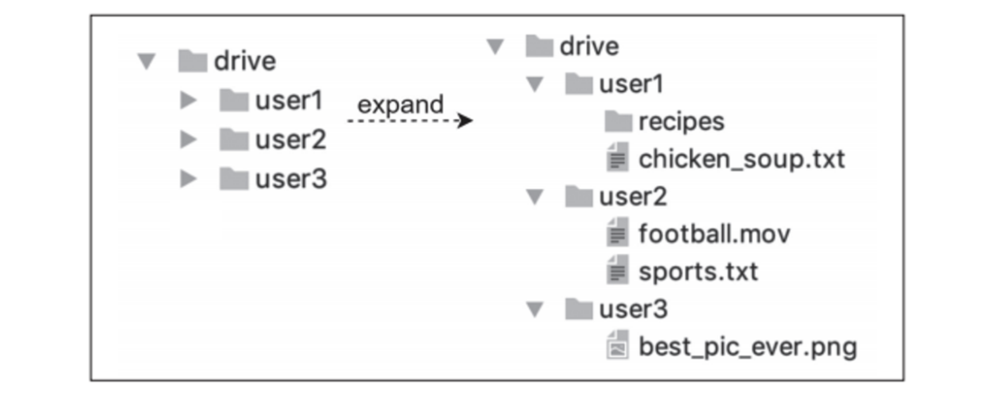
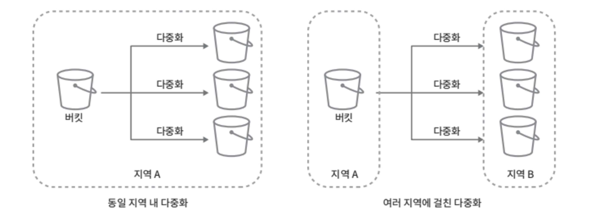
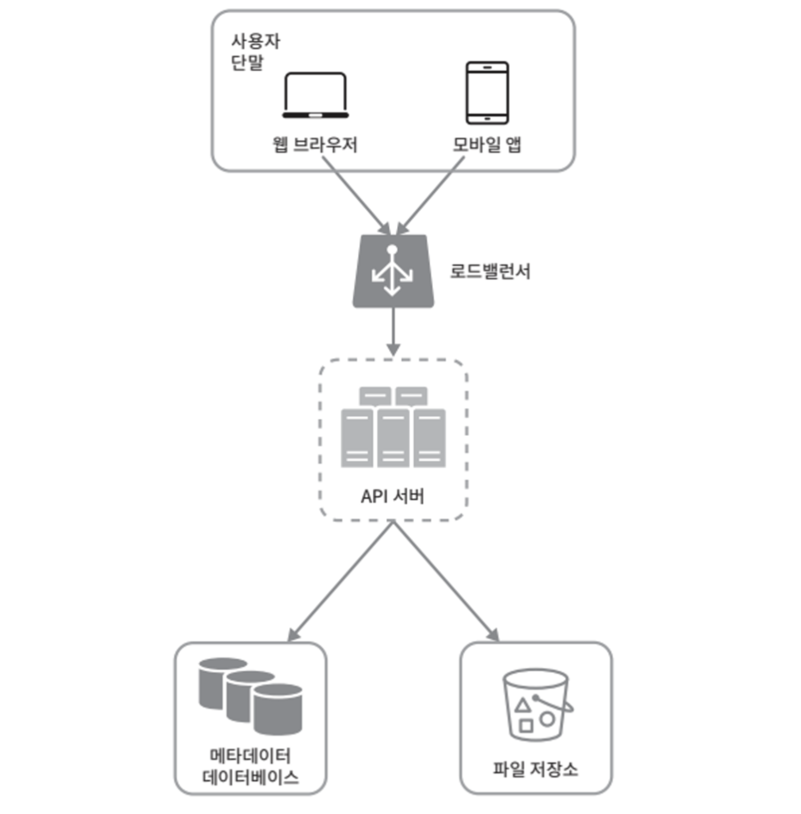
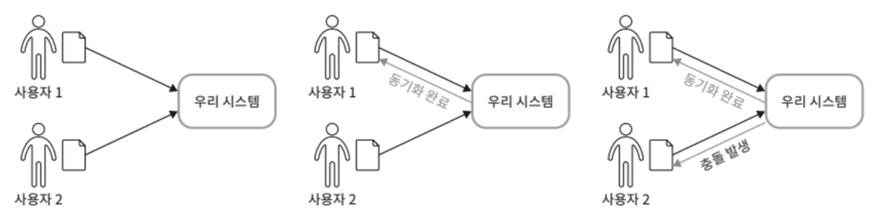
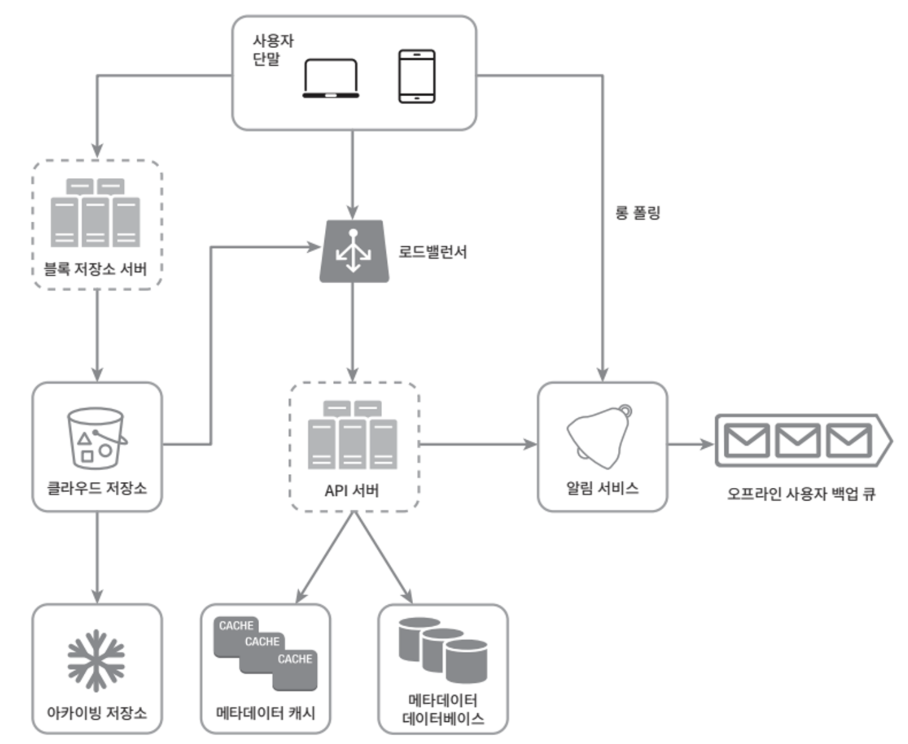
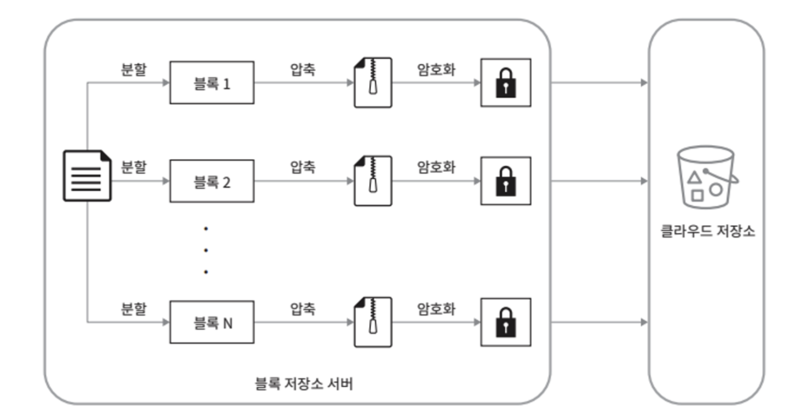
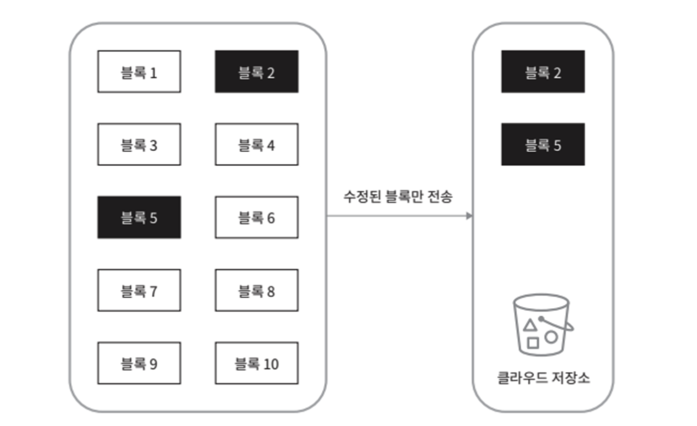

# 1단계: 문제 이해 및 설계 범위 확정

**설계 범위**

- 파일 추가
  - 가장 쉬운 방법은 파일을 구글 드라이브 안으로 drag-and-grop 하기
- 파일 다운로드
- 여러 단말에 파일 동기화
  - 한 단말에서 파일을 추갛면 다른 단말에도 자동으로 동기화
- 파일 갱신 이력 조회
- 파일 공유
- 파일 편집/삭제 혹은 공유 시 알림 표시

**논의하지 않을 내용**

- 구글 문서 편집 및 협업 기능

**비-기능적 요구사항**

- 안정성
  - 데이터 손실이 발생하면 안 된다.
- 빠른 동기화 속도
  - 파일 동기화에 시간이 너무 많이 걸리면 사용자는 인내심을 잃고 해당 제품을 더 이상 사용하지 않을 수있다.
- 네트워크 대역폭
  - 네트워크 대역폭을 불필요하게 많이 소모하면 사용자가 좋아하지 않을 것이다.
- 규모 확장성
  - 아주많은 양의 트래픽도 처리 가능해야 한다.
- 높은 가용성
  - 일부 서버에 장애가 발생하거나, 느려지거나, 네트워크 일부가 끊겨도 시스템은 계속 사용 가능해야 한다.

**개략적 추정치**

- 가입 사용자는 오천만(50million) 명이고 천만 명의 DAU 사용자가 있다고 가정
- 모든 사용자에게 10GB의 무료 저장공간 할당
- 매일 각 사용자가 평균 2개의 파일을 업로드한다고 가정
  - 각 파일의 평균 크기는 500KB
- 읽기:쓰기 비율은 1:1
- 필요한 저장 공간 총량 : 5천만 사용자 x 10GB = 500PB
- 업로드 API QPS = 1천만 사용자 x 2회 업로드 / 24시간 / 3600초 = 약 240
- 최대 QPS = QPS x 2 = 480

# 2단계: 개략적 설계안

모든 것을 담은 한 대 서버에서 출발해 점진적으로 천만 사용자 지원이 가능한 시스템으로 발전시켜 나가 보자.

- 파일을 올리고 다운로드 하는 과정을 처리할 **웹 서버**
- 사용자 데이터, 로그인 정보, 파일 정보 등의 메타데이터를 보관할 **데이터베이스**
- 파일을 저장할 저장소 시스템, 파일 저장을 위해 **1TB의 공간을 사용**

<figure><figcaption></figcaption></figure>

## API

이 시스템은 기본적으로 세 가지의 API가 필요하다.

**`파일 업로드 API`**

- 단순 업로드: 파일 크기가 작을 때 사용
- 이어 올리기: 파일 사이즈가 크고 네트워크 문제로 업로드가 중단될 가능성이 높다고 생각될 때 사용

```http
https://api.example.com/files/upload?uploadType=resumable
```

인자
- uploadType=resumable
- data : 업로드할 로컬 파일

이어 올리기의 3단계 절차
- (1) 이어 올리기 URL을 받기 위한 최초 요청 전송
- (2) 데이터를 업로드하고 업로드 상태 모니터링
- (3) 업로드에 장애가 발생하면 장애 발생 시점부터 업로드를 재시작

.

**`파일 다운로드 API`**

```http
https://api.example.com/files/download
```

인자
- path : 다운로드할 파일의 경로

    ```json
    {
        "path" : "/recipes/soup/best_soup.txt"
    }
    ```

.

**`파일 갱신 히스토리 API`**

```http
https://api.example.com/files/list revisions
```

인자
- path : 갱신 히스토리를 가져올 파일의 경로
- limit : 히스토리 길이의 최대치
  
  ```json
  {
      "path" : "/recipes/soup/best_soup.txt",
      "limit" : 20
  }
  ```

> 모든 API는 사용자 인증을 필요로 하고 HTTPS 프로토콜을 사용해야 한다.
>
> SSL(Secure Socket Layer)를 지원하는 프로토콜을 이용하는 이유는 클아이언트와 백엔드 서버가 주고 받는 데이터를 보호하기 위함이다.

## 한 대 서버 제약 극복

업로드되는 파일이 많아지다 보면 결국 파일 시스템은 가득 차게 된다.

가장 먼저 떠오르는 해결책은 데이터를 샤딩하여 여러 서버에 나누어 저장하는 것이다.
- user_id 기준으로 샤딩한 예제

<figure><figcaption></figcaption></figure>

시장 주도 기업(넷플릭스, 에어비엔비)들은 저장소로 아마존 S3를 사용한다.
- AWS S3(Simple Storage Service)는 업계 최고 수준의 규모 확장성, 가용성, 보안, 성능을 제공하는 객체 저장소 서비스이다.

데이터 다중화는 같은 지역 안에서만 할 수도, 여러 지역에 걸쳐 할 수도 있다.
- 여러 지역에 걸쳐 다중화하면 데이터 손실을 막고 가용성을 최대한 보장할 수 있다.

<figure><figcaption></figcaption></figure>

추가로 연구해볼 수 있는 개선점
- `로드밸런서`: 네트워크 트래픽을 분산하기 위해 로드밸런서를 사용
  - 로드밸런서는 트래픽을 고르게 분산할 수 있을 뿐 아니라, 특정 웹 서버에 장애가 발생하면 자동으로 해당 서버를 우회
- `웹 서버`: 로드밸런서를 추가하고 나면 더 많은 웹 서버를 손쉽게 추가할 수 있다.
  - 트래픽이 폭중해도 쉽게 대응 가능
- `메타데이터 데이터베이스`: 데이터베이스를 파일 저장 서버에서 분리하여 SPOF(Single Point of Failuer)를 회피
  - 다중화 및 샤딩 정책을 적용하여 가용성과 규모 확장성 요구사항에 대응
- `파일 저장소`: S3를 파일 저장소로 사용하고 가용성과 데이터 무손실을 보장하기 위해 두 개 이상의 지역에 데이터를 다중화

<figure><figcaption></figcaption></figure>

## 동기화 충돌

대형 저장소 시스템의 두 명 이상의 사용자가 같은 파일이나 폴더를 동시에 업데이트하려고 할 경우 때때로 동기화 충돌이 발생할 수 있다.

이 경우, 먼저 처리되는 변경은 성공, 나중에 처리되는 변경을 충돌이 발생한 것으로 표시하여 해소할 수 있다.

<figure><figcaption></figcaption></figure>

**충돌로 발생한 오류를 해결하는 방법**
- 오류가 발생한 시점에 이 시스템에는 같은 파일의 두 가지 버전이 존재하게 된다.
  - 사용자 2가 가지고 있는 로컬 사본과 서버에 있는 최신 버전
- 이 상태에서 사용자는 두 파일을 하나로 합칠지, 둘 중 하나를 다른 파일로 대체할지 결정해야 한다.
- [Differential Synchronization](https://neil.fraser.name/writing/sync/)

## 개략적 설계안

구글 드라이브의 개략적 설계안

<figure><figcaption></figcaption></figure>

`사용자 단말`: 사용자가 이용하는 웹브라우저나 모바일 앱 등의 클라이언트

`블록 저장소 서버`(block server): 파일 블록을 클라우드 저장소에 업로드하는 서버
- 블록 수준 저장소라고도 하며, 클라우드 환경에서 데이터 파일을 저장하는 기술
- 파일을 여러개의 블록으로 나눠 저장하며, 각 블록에는 고유한 해시값이 할당
- 해시값은 메타데이터 데이터베이스에 저장
- 각 블록(4MB)은 독립적인 객체로 취급되며 클라우드 저장소 시스템에 보관
- 파일을 재구성하려면 블록들을 원래 순서대로 합쳐야 한다.

`클라우드 저장소`: 파일은 블록 단위로 나눠져 클라우드 저장소에 보관

`아카이빙 저장소`: 오랫동안 사용되지 않은 비활성 데이터를 저장하기 위한 컴퓨터 시스템

`로드밸런서`: 요청을 모든 API 서버에 고르게 분산하는 구실

`API 서버`: 파일 업로드 외에 거의 모든 것을 담당하는 서버
- 사용자 인증, 사용자 프로파일 관리, 파일 메타데이터 갱신 등에 사용

`메타데이터 데이터베이스`: 사용자, 파일, 블록, 버전 등의 메타데이터 정보를 관리
- 실제 파일은 클라우드에 보관하며, 이 데이터베이스에는 오직 메타데이터만 둔다.

`메타데이터 캐시`: 성능을 높이기 위해 자주 쓰이는 메타데이터는 캐시

`알림 서비스`: 특정 이벤트가 발생했음을 클라이언트에게 알리는데 쓰이는 발생/구독 프로토콜 기반 시스템
- 파일 추가/편집/삭제 알림 등

`오프라인 사용자 백업 큐`: 클라이언트가 접속 중이 아니라서 파일의 최신 상태를 확인할 수 없을 때는 해당 정보를 이 큐에 두어 나중에 클라이언트가 접속했을 때 동기화될 수 있도록 한다.

# 3단계: 상세 설계

## 블록 저장소 서버

정기적으로 갱신되는 큰 파일들은 업데이트가 일어날 때마다 전체 파일을 서버로 보내면 네트워크 대역폭을 많이 잡아먹게 된다.
- 이를 최적화하는 방법은 두 가지 정도가 있다.

`델타 동기화`(delta sync)
- 파일이 수정되면 전체 파일 대신 수정이 일어난 블록만 동기화

`압축`(compression)
- 블록 단위로 압축해 두면 데이터 크기를 많이 줄일 수 있다.
- 압축 알고리즘은 파일 유형에 따라 정한다.

**블록 저장소 서버는 파일 업로드에 관계된 힘든 일을 처리하는 컴포넌트**
- 클라이언트가 보낸 파일을 블록 단위로 나누고
- 각 블록에 압축 알고리즘을 적용하고
- 암호화까지 진행
- 전체 파일을 저장소 시스템으로 보내는 대신 수정된 블록만 전송

**새 파일이 추가되었을 때 블록 젖아소 서버의 동작**

<figure><figcaption></figcaption></figure>

- 주어진 파일을 작은 블록들로 분할
- 각 블록을 압축
- 클라우드 저장소로 보내기 전에 암호호
- 클라우드 저장소로 전송

**델타 동기화 전략의 동작**

<figure><figcaption></figcaption></figure>

델타 동기화 전략과 압축 알고리즘으로 네트워크 대역폭 사용량을 절감할 수 있다.

## 높은 일관성 요구사항

이 시스템은 강한 일관성 모델을 기본으로 지원
- 같은 파일이 단말이나 사용자에 따라 다르게 보이는 것은 허용할 수 없음
- 메타데이터 캐시와 데이터베이스 계층에도 같은 원칙 적용

메모리 캐시는 보통 결과적 일관성 모델을 지원, 따라서 강한 일관성을 달성하려면 아래 사항을 보장
- 캐시에 보관된 사본과 데이터베이스에 있는 원본이 일치
- 데이터베이스에 보관된 원본에 변경이 발생하면 캐시에 있는 사본을 무효화

관계형 데이터베이스는 ACID(Atomicity, Consistency, Isolation, Durability)를 보장하므로 강한 일관성을 보장하기 쉽다.
- 하지만, NoSQL은 이를 기본으로 지원하지 않으므로, 동기화 로직 안에 프로그램해 넣어야 한다.

## 메타데이터 데이터베이스

## 업로드 절차

## 다운로드 절차

## 알림 서비스

## 파일 저장소 공간

## 장애 처리 흐름

# 4단계: 마무리