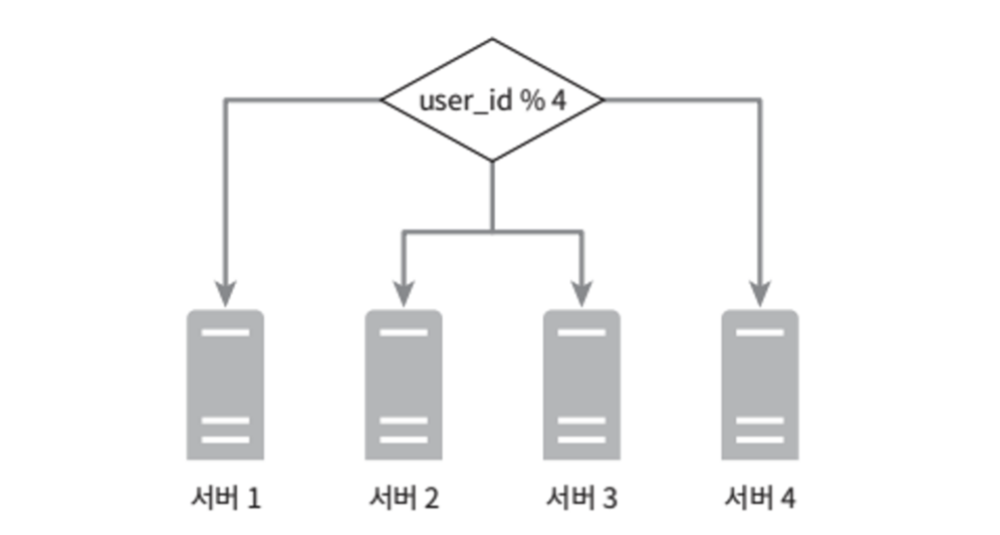

# 1단계: 문제 이해 및 설계 범위 확정

**설계 범위**

- 파일 추가
  - 가장 쉬운 방법은 파일을 구글 드라이브 안으로 drag-and-grop 하기
- 파일 다운로드
- 여러 단말에 파일 동기화
  - 한 단말에서 파일을 추갛면 다른 단말에도 자동으로 동기화
- 파일 갱신 이력 조회
- 파일 공유
- 파일 편집/삭제 혹은 공유 시 알림 표시

**논의하지 않을 내용**

- 구글 문서 편집 및 협업 기능

**비-기능적 요구사항**

- 안정성
  - 데이터 손실이 발생하면 안 된다.
- 빠른 동기화 속도
  - 파일 동기화에 시간이 너무 많이 걸리면 사용자는 인내심을 잃고 해당 제품을 더 이상 사용하지 않을 수있다.
- 네트워크 대역폭
  - 네트워크 대역폭을 불필요하게 많이 소모하면 사용자가 좋아하지 않을 것이다.
- 규모 확장성
  - 아주많은 양의 트래픽도 처리 가능해야 한다.
- 높은 가용성
  - 일부 서버에 장애가 발생하거나, 느려지거나, 네트워크 일부가 끊겨도 시스템은 계속 사용 가능해야 한다.

**개략적 추정치**

- 가입 사용자는 오천만(50million) 명이고 천만 명의 DAU 사용자가 있다고 가정
- 모든 사용자에게 10GB의 무료 저장공간 할당
- 매일 각 사용자가 평균 2개의 파일을 업로드한다고 가정
  - 각 파일의 평균 크기는 500KB
- 읽기:쓰기 비율은 1:1
- 필요한 저장 공간 총량 : 5천만 사용자 x 10GB = 500PB
- 업로드 API QPS = 1천만 사용자 x 2회 업로드 / 24시간 / 3600초 = 약 240
- 최대 QPS = QPS x 2 = 480

# 2단계: 개략적 설계안

모든 것을 담은 한 대 서버에서 출발해 점진적으로 천만 사용자 지원이 가능한 시스템으로 발전시켜 나가 보자.

- 파일을 올리고 다운로드 하는 과정을 처리할 **웹 서버**
- 사용자 데이터, 로그인 정보, 파일 정보 등의 메타데이터를 보관할 **데이터베이스**
- 파일을 저장할 저장소 시스템, 파일 저장을 위해 **1TB의 공간을 사용**

<figure><figcaption></figcaption></figure>

## API

이 시스템은 기본적으로 세 가지의 API가 필요하다.

**`파일 업로드 API`**

- 단순 업로드: 파일 크기가 작을 때 사용
- 이어 올리기: 파일 사이즈가 크고 네트워크 문제로 업로드가 중단될 가능성이 높다고 생각될 때 사용

```http
https://api.example.com/files/upload?uploadType=resumable
```

인자
- uploadType=resumable
- data : 업로드할 로컬 파일

이어 올리기의 3단계 절차
- (1) 이어 올리기 URL을 받기 위한 최초 요청 전송
- (2) 데이터를 업로드하고 업로드 상태 모니터링
- (3) 업로드에 장애가 발생하면 장애 발생 시점부터 업로드를 재시작

.

**`파일 다운로드 API`**

```http
https://api.example.com/files/download
```

인자
- path : 다운로드할 파일의 경로

    ```json
    {
        "path" : "/recipes/soup/best_soup.txt"
    }
    ```

.

**`파일 갱신 히스토리 API`**

```http
https://api.example.com/files/list revisions
```

인자
- path : 갱신 히스토리를 가져올 파일의 경로
- limit : 히스토리 길이의 최대치
  
  ```json
  {
      "path" : "/recipes/soup/best_soup.txt",
      "limit" : 20
  }
  ```

> 모든 API는 사용자 인증을 필요로 하고 HTTPS 프로토콜을 사용해야 한다.
>
> SSL(Secure Socket Layer)를 지원하는 프로토콜을 이용하는 이유는 클아이언트와 백엔드 서버가 주고 받는 데이터를 보호하기 위함이다.

## 한 대 서버 제약 극복

업로드되는 파일이 많아지다 보면 결국 파일 시스템은 가득 차게 된다.

가장 먼저 떠오르는 해결책은 데이터를 샤딩하여 여러 서버에 나누어 저장하는 것이다.
- user_id 기준으로 샤딩한 예제

<figure><figcaption></figcaption></figure>

시장 주도 기업(넷플릭스, 에어비엔비)들은 저장소로 아마존 S3를 사용한다.
- AWS S3(Simple Storage Service)는 업계 최고 수준의 규모 확장성, 가용성, 보안, 성능을 제공하는 객체 저장소 서비스이다.

# 3단계: 상세 설계

# 4단계: 마무리