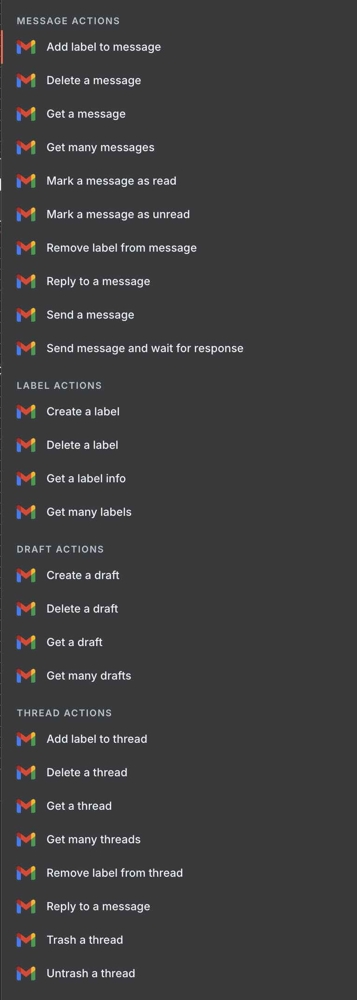
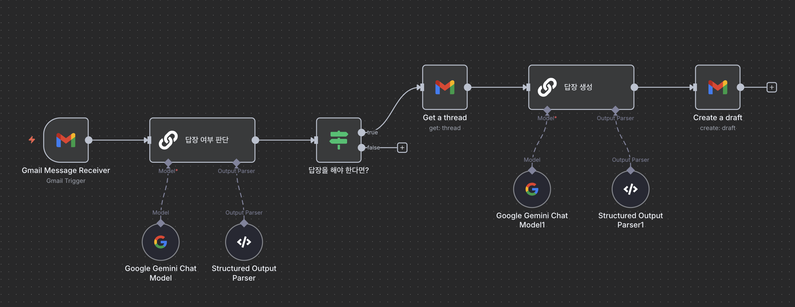
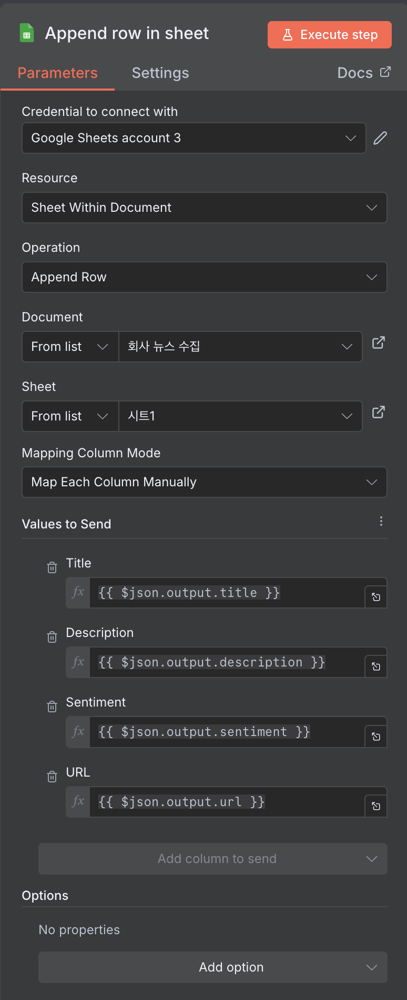
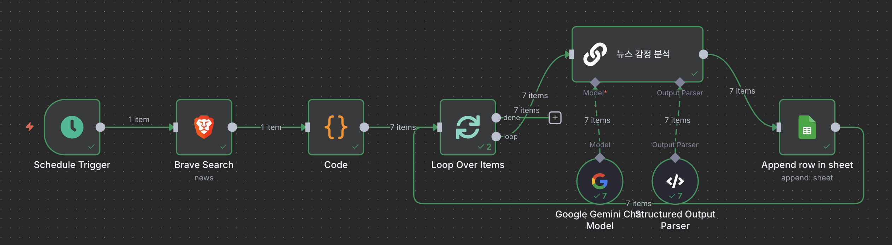
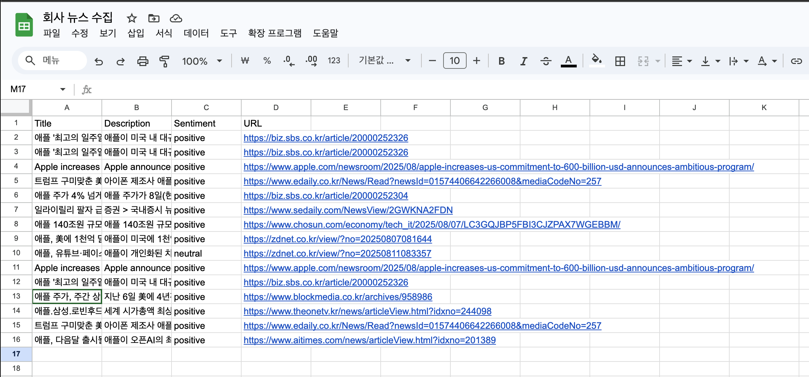
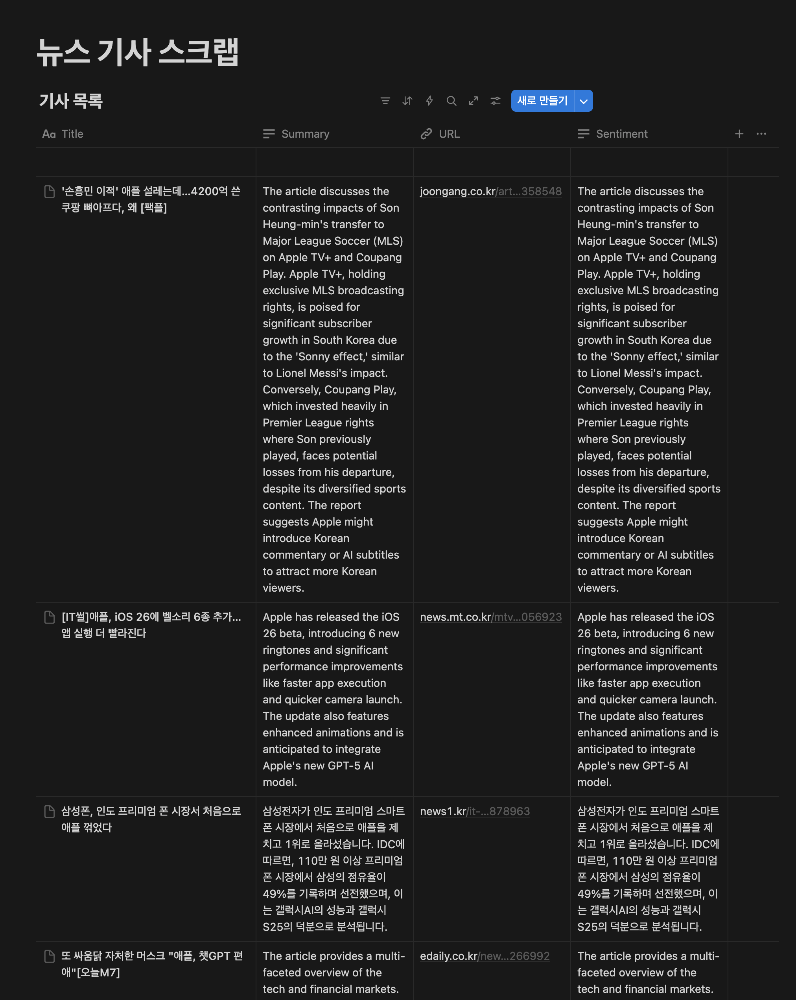
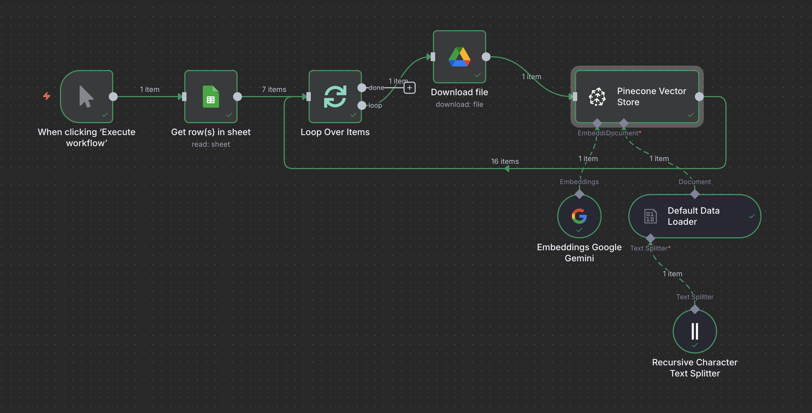
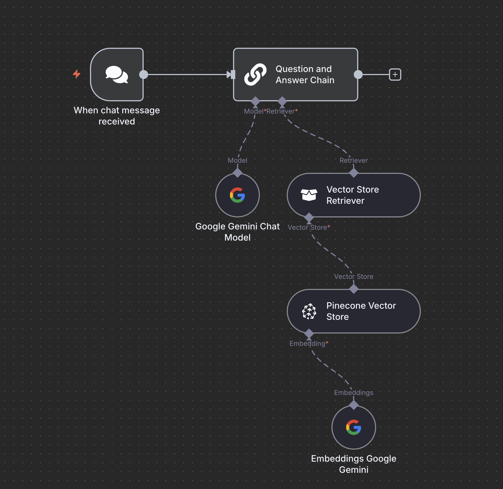
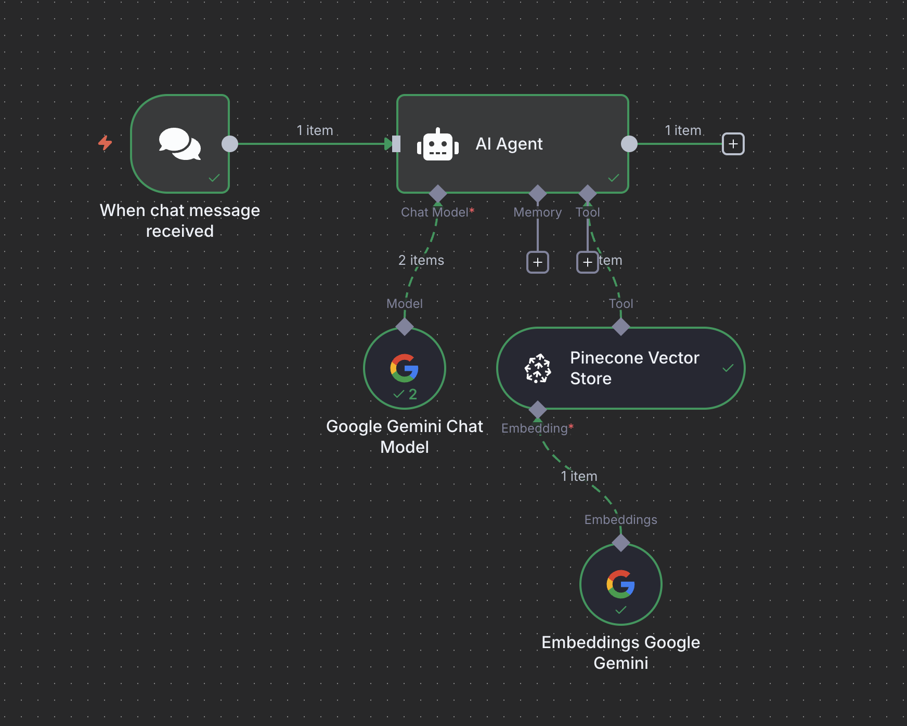

# AI agent

[회사에서 바로 쓰는 업무자동화 AI 에이전트 (w. n8n, LangGraph)](https://www.inflearn.com/course/%ED%9A%8C%EC%82%AC%EC%97%90%EC%84%9C-%EB%B0%94%EB%A1%9C%EC%93%B0%EB%8A%94-%EC%97%85%EB%AC%B4%EC%9E%90%EB%8F%99%ED%99%94-ai%EC%97%90%EC%9D%B4%EC%A0%84%ED%8A%B8) 강의를 요약한 내용입니다.

## n8n

[n8n](https://n8n.io/)

> Flexible AI workflow automation
>
> 다양한 웹 서비스, 앱, API들을 연결하여 자동화 워크플로우를 만드는 오픈소스 통합 플랫폼

n8n은 워크플로우를 구성하는 노드(Node)들로 이루어져 있으며, 각 노드는 특정 작업을 수행합니다.

👉🏻 **n8n 컨테이너 구동**

```bash
docker volume create n8n_data

docker run -d -it --rm --name n8n -p 5678:5678 -v n8n_data:/home/node/.n8n docker.n8n.io/n8nio/n8n
```

## Email Agent

### 👉🏻 Gmail Actions

**Gmail API 사용하기**

- [GCP console](https://cloud.google.com/cloud-console) → API 및 서비스 → API 및 서비스 사용 설정 → Gmail API -> 활성화
- 사용자 인증 정보 만들기 → OAuth 클라이언트 ID 만들기 

Gmail API로 이용할 수 있는 다양한 action, trigger 기능을 연동 가능

<figure><figcaption></figcaption></figure>

### 👉🏻 Basic LLM Chain

#### 답장 여부 판단

**모델 연결 → Prompt →**

```text
"=아래 이메일 내용을 보고, 답장이 필요한 이메일인지 판단해주세요. 만약 당신의 오판으로 제가 이메일에 답장을 하지 못하게되면 업무상 차질이 생길 수 있으니 주의해주세요.\n\n1. 업무 협업 메일에는 가급적이면 답장을 해야합니다. \n2. 마케팅이나 뉴스레터의 경우에는 답장을 할 필요가 없습니다.\n\n이메일 내용:\n {{ $json.text }}",
```

**Chat Messages**

```text
"당신의 업무는 이메일에 답장을 해야하는지 말아야하는지 결정하는 것입니다. 답장이 필요하다면 true, 답장이 필요 없다면 false를 리턴해주세요"
```

**Require Specific Output Format**

```json
{
	"type": "object",
	"properties": {
		"need_reply": {
			"type": "boolean"
		}
	}
}
```

#### 이메일 답장 작성

**Prompt**

```text
"=아래 이메일을 보고 답장을 작성해주세요\n\n최근 메일:\n{{ $('Gmail Trigger').item.json.text }}\n\n이메일 히스토리:\n{{ $json.messages.filter(item => item.snippet) }}",
```

**Require Specific Output Format**

```json
{
	"type": "object",
	"properties": {
		"title": {
			"type": "string"
		},
        "content": {
			"type": "string"
		}
	}
}
```

<figure><figcaption></figcaption></figure>

#### 이메일 작성 봇

**System Messages**

```text
"당신은 이메일 작성 도우미입니다. 사용자의 질문을 바탕으로, 사용자에게 필요한 이메일을 작성해주세요 \n\n당신이 이메일을 작성하는데 필요한 모든 정보를 얻을 때까지 사용자에게 질문을 한 후에, 필요한 정보를 모두 얻고 나서 이메일을 작성해주세요"
```

## News Agent (Brave Search API)

### 👉🏻 **Schedule Trigger**

워크플로우를 특정 시간에 자동으로 시작시키는 노드
- 지정된 시간 간격(예: 매일 오전 9시, 매주 월요일, 15분마다 등)에 맞춰 다음 노드로 데이터를 전달하며 워크플로우를 실행
- America/New_York Timezone 이므로 한국 시간대 계산이 필요

### 👉🏻 **Brave Search**

Brave Search 엔진을 이용해 웹 검색을 수행하고, 그 결과를 n8n 워크플로우로 가져오는 노드
- 검색 결과를 JSON 형태로 받아와서 다른 노드에서 활용
- [Brave Search API](https://brave.com/search/api/)

### 👉🏻 **Code**

워크플로우 내에서 JavaScript 코드를 직접 실행할 수 있는 노드
- n8n의 기본 노드만으로는 해결하기 어려운 복잡한 로직을 구현하거나, 데이터를 특정 형태로 가공해야 할 때 유용
- n8n의 모든 노드에서 전달받은 데이터를 코드 노드에서 처리 가능
	
	```javascript
	return $input.first().json.results
	```

### 👉🏻 **Loop Over Items**

워크플로우가 배열(리스트) 형태의 데이터 아이템들을 하나씩 순회하며 반복 작업을 수행하도록 하는 노드
- 각 아이템에 대해 동일한 일련의 작업을 적용 가능
- Batch Size 지정

### 👉🏻 **Basic LLM Chain**

LangChainJS 라이브러리를 기반으로 LLM과 상호작용하는 노드
- 복잡한 코딩 없이도 프롬프트 템플릿과 LLM을 연결하여 텍스트를 생성하거나, 질문-답변 기능을 워크플로우에 통합 가능

**Prompt**

```text
"Categorize below news article by reading the description into \"positive,\" \"negative,\", \"neutral\":\n\nNews Article:\nTitle: {{ $json.title }}\nDescription: {{ $json.description }}\nURL: {{ $json.url }}",
```

**Chat Messages**

```text
"Your job is to analyze the sentiment of a news article from a user every morning and report to the executives and share with my colleagues\n\nAfter analyzing the sentiment, use the Google Sheet Tool provided to you to insert the analysis into the spreadsheet for other colleagues to see"
```

**Require Specific Output Format**

```json
{
	"type": "object",
	"properties": {
		"sentiment": {
			"type": "string"
		},
      "title": {
			"type": "string"
		},
      "description": {
			"type": "string"
		},
      "url": {
			"type": "string"
		}
	}
}
```

### 👉🏻 **Append row in sheet**

Google Sheets, Excel 등 스프레드시트 서비스에 새로운 행을 추가하는 노드
- 워크플로우에서 처리된 데이터를 최종적으로 스프레드시트에 정리할 때 사용

**Google Drive & Google Sheets API**

- [GCP console](https://cloud.google.com/cloud-console) → API 및 서비스 → API 및 서비스 사용 설정
  - Google Drive API
  - Google Sheets API
- 사용자 인증 정보 만들기 → OAuth 클라이언트 ID 만들기 (기존 ID 사용 가능)
- 시트에 헤더 추가 → Document & Sheet 선택 → 헤더 정보 입력

<figure><figcaption></figcaption></figure>

### Result

<figure><figcaption></figcaption></figure>

- Brave News 추출 (Brave Search)
- 추출된 정보를 JSON 형태로 변환 (Code)
- Loop Over Items
- 뉴스 감정 분석 (Basic LLM Chain)
- 결과를 시트에 추가 (Sheets)

<figure><figcaption></figcaption></figure>

## News Agent (Naver HTTP Request)

### 👉🏻 HTTP Request

웹에서 데이터를 가져오거나 보내는 가장 기본적인 노드
- 특정 URL로 HTTP 요청(GET, POST, PUT, DELETE 등)을 보내고, 그 응답을 받아 워크플로우에 통합
- API와의 상호작용은 대부분 이 노드를 통해 이루어짐

### 👉🏻 HTML

HTML 문서에서 특정 데이터를 추출하는 데 사용
- 웹 스크래핑(Web Scraping)의 핵심 노드
- CSS 셀렉터(Selector)를 이용해 원하는 태그나 클래스, 아이디를 가진 요소를 선택하고 그 안의 텍스트나 속성 값을 추출

### 👉🏻 Filter

데이터를 특정 조건에 따라 걸러내는 노드
- 입력 데이터가 설정된 조건을 만족하는지 확인하여, 조건을 만족하는 데이터만 다음 노드로 전달
- 조건은 등호, 부등호, 포함 여부, 정규식 등 다양하게 설정

### 👉🏻 Notion

Notion 데이터베이스 또는 페이지와 상호작용하는 노드
- Notion 계정과 연결하여 데이터베이스에 새로운 항목을 추가하거나, 기존 페이지의 내용을 업데이트하거나, 특정 데이터를 검색하는 등의 작업을 수행

**Notion Credential**

[notion integration](https://developers.notion.com/docs/create-a-notion-integration) → 
View my integrations → New API integration → Notion 옵션 → 연결 → API integration 연결

### Result

<figure><figcaption></figcaption></figure>

- 기사 목록 요청 (HTTP Request)
- Loop Over Items
- 기사 제목 & URL 추출 (HTML)
- 추출된 정보를 JSON 형태로 변환 (Code)
- Loop Over Items
- 기사 URL 요청 (HTTP Request)
- 기사 내용 추출 (HTML)
- 연관성 파악 (Basic LLM Chain)
- 연관성이 있는지 필터링 (Filter)
- 뉴스 감정 분석 (Basic LLM Chain)
- 노션 데이터베이스에 추가 (Notion)

<figure><figcaption></figcaption></figure>

## n8n을 활용한 사내 QnA Bot

### 데이터 저장

#### 👉🏻 Get rows in sheet

Google Sheets, Excel 등 스프레드시트에서 특정 행들을 읽어오는 노드
- 필터링 조건을 설정하여 특정 행만 선택적으로 가져올 수 있으며, 가져온 데이터는 워크플로우의 다음 노드로 전달되어 가공되거나 활용
- ex) 파일 링크 목록 가져오기

#### 👉🏻 Download file

특정 URL에서 파일을 다운로드하여 워크플로우로 가져오는 노드
- 다운로드된 파일은 다음 노드에서 처리할 수 있는 형태로 변환
- ex) 추출된 파일 링크를 읽고 해당 파일을 다운로드

#### 👉🏻 Pinecone Vector Store

전문 벡터 데이터베이스에 데이터를 저장하거나 검색
- LLM 애플리케이션에서 방대한 양의 비정형 데이터를 효율적으로 검색하고 관리하는 데 사용
- [create API Key](https://app.pinecone.io/)

**Gemini**
- Pinecone Vector Store 노드와 함께 사용되는 Gemini 노드는 Google의 Gemini AI 모델을 사용하여 텍스트 데이터를 벡터로 변환하는 역할을
- 벡터화된 데이터는 Pinecone 데이터베이스에 저장되어 유사도 검색에 사용

**Default Data Loader**
- 다양한 소스(웹사이트, PDF, CSV 파일 등)에서 데이터를 불러와서 처리 가능한 형태로 변환하는 역할
- 이 노드는 특히 LLM 워크플로우에서 외부 데이터를 모델에 입력하기 전에 전처리하는 데 사용
- Recursive Character Text Splitter
  - 길고 복잡한 텍스트를 LLM이 한 번에 처리하기 적합한 크기의 '덩어리(chunk)'로 나누는 역할
  - 특정 문자(예: '\n\n', '\n', '.' 등)를 기준으로 텍스트를 재귀적으로 분할하여, 의미 있는 단위가 손상되지 않도록 함

<figure><figcaption></figcaption></figure>

### Bot using LLM Chain

#### 👉🏻 When Chat message received
- 텔레그램, 슬랙 등 특정 메신저 채널에서 새로운 메시지가 수신되었을 때 워크플로우를 자동으로 시작하는 트리거 노드
- 채팅 기반의 자동화 워크플로우를 구축하는 데 필수적

#### 👉🏻 Basic LLM Chain
- 복잡한 문서나 데이터 소스를 바탕으로 질문에 대한 답변을 생성하는 고급 노드
- 사용자의 질문을 입력으로 받아, 연결된 데이터 소스에서 관련 정보를 찾아내고, 이를 바탕으로 LLM이 자연어 답변을 생성
- RAG(Retrieval Augmented Generation) 기술을 구현하는 데 사용

**Vector Store Retriever**
- 질문과 관련된 정보를 벡터 데이터베이스에서 효율적으로 검색하는 역할
- 사용자의 질문을 벡터로 변환한 후, 이 벡터와 유사한 의미를 가진 기존 문서 벡터들을 데이터베이스에서 탐색
- 이 노드를 통해 LLM은 방대한 데이터 속에서 필요한 정보만 '검색'

**Pinecone Vector Store**
- 벡터 데이터베이스의 한 종류로, Vector Store Retriever 노드와 함께 사용
- 이곳에 저장된 문서 벡터들을 기반으로 검색
- LLM이 학습하지 않은 최신 데이터나 전문 문서에 대한 질의응답 기능을 구현할 때 주로 활용

**Embeddings Google Gemini**
- 텍스트 데이터를 구글의 Gemini AI 모델을 사용하여 벡터로 변환하는 역할
- 질문과 문서 모두 이 노드를 거쳐 벡터화되며, 이 벡터는 Vector Store Retriever 노드를 통해 Pinecone 데이터베이스에 저장되거나 검색에 사용

<figure><figcaption></figcaption></figure>


<figure><figcaption></figcaption></figure>


AI Agent

System Message

```text
You are a helpful assistant. Use the tools that are available to you in order to answer the user's question
```


tool description

```text
The documents within this knowledge base contains information about company's policy such as HR, IT Support, and so on
```