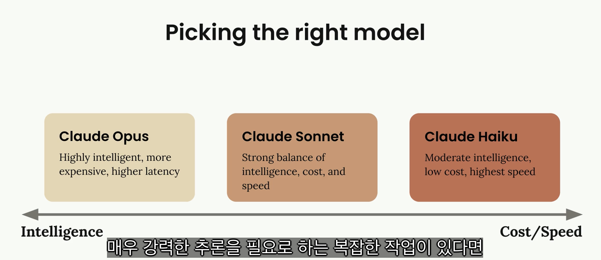

# Anthropic overview

## Overview of Claude models

<figure><figcaption></figcaption></figure>

세 모델 모두 Claude의 핵심 기능을 공유
- 텍스트 생성, 코딩, 이미지 분석 및 기타 여러 작업을 처리
- 실제적 차이는 최적화 방식
  - 지능 중점
  - 속도와 비용 효율성
  - 지능과 속도 사이의 균형

### Opus

Cluade의 가장 뛰어난 모델
- 가장 높은 수준의 지능을 제공
- 몇 시간 동안 지속될 수 있는 복잡한 프로젝트를 독립적으로 수행
- 추론을 지원(간단한 작업에 빠른 응답, 더 복잡한 작업을 위해 시간을 할애)
- 단점: 중간 정도의 지연 시간과 더 높은 비용
  - 매우 높은 지능을 얻는 대신, 요청마다 약간의 추가 시간과 비용이 부과

### Sonnet

Cluade의 스위트 스팟 모델
- 대부분 실용적인 사용 사례에 매우 유용하게 만드는 지능, 속도 및 비용의 좋은 균형
- 강력한 코딩 능력과 빠른 텍스트 생성

### Haiku

Cluade에서 가장 빠른 모델
- 응답 시간이 매우 중요한 애플리케이션을 위해 특별히 제작
- Opus와 Sonnet이 가진 추론 기능을 지원하지 않음
- 대신, 속도와 비용 효율성에 최적화
- 실시간 상호 작용이 필요한 사용자 대면 앱에 매우 좋은 선택

<figure><figcaption></figcaption></figure>

# Accessing Claude with the API

## Accessing the API

사용자가 채팅 인터페이스에서 "보내기"를 클릭하는 순간부터 Claude의 응답이 화면에 나타날 때까지 어떤 일이 일어나는지의 과정

**5단계 요청 흐름**

Claude와의 모든 상호작용은 **서버에 대한 요청**, **Anthropic API에 대한 요청**, **모델 처리**, **서버에 대한 응답**, **클라이언트에 대한 응답**이라는 5가지 단계로 구성된 예측 가능한 패턴을 따릅니다.


### Request to Server

<figure><figcaption></figcaption></figure>

**서버가 필요한 이유**  
클라이언트 측 코드에서 Anthropic API에 직접 요청을 보내면 안 되므로 서버가 필요
- API 요청에는 인증을 위한 비밀 API 키가 필요
- 클라이언트 코드에서 이 키를 노출하면 심각한 보안 취약점이 발생
- 누구든지 키를 추출하고 허가 없이 요청 가능

대신, 서버에 요청을 보내고, 해당 서버는 안전하게 저장된 키를 사용하여 Anthropic API와 통신

### Request to Anthropic API

서버가 Anthropic API에 접속하면 공식 SDK를 사용하거나 일반 HTTP 요청을 가능
- Anthropic은 `Python`, `TypeScript`, `JavaScript`, `Go`, `Ruby`용 SDK를 제공

<figure><figcaption></figcaption></figure>


모든 요청에는 다음과 같은 필수 필드가 포함
- API 키: Anthropic에 대한 개발자의 요청을 식별
- 모델: 사용할 모델의 이름(ex: "claude-3-sonnet")
- 메시지: 사용자 입력 텍스트가 포함된 목록
- 최대 토큰: Claude가 생성할 수 있는 토큰 수 제한

### Model Processing

<figure><figcaption></figcaption></figure>

**토큰화**  
클로드는 먼저 입력 텍스트를 토큰이라는 작은 단위로 나눔
- 토큰은 단어 전체, 단어의 일부, 공백 또는 기호일 수 있음
- 편의상 `각 단어를 하나의 토큰`이라고 생각하면 됨

**임베딩**  
- 각 토큰은 임베딩으로 변환
- 임베딩은 해당 단어의 모든 가능한 의미를 나타내는 긴 숫자 목록
- 임베딩은 `의미적 관계를 포착하는 숫자 정의`라고 생각하면 됨

<figure><figcaption></figcaption></figure>

단어는 종종 여러 의미를 갖습니다. 예를 들어, "quantum"은 다음과 같은 의미를 가질 수 있습니다.
- 물리량의 이산적인 단위(물리학)
- 양자 역학 또는 양자 물리학 개념
- 매우 작거나 아원자적인 것
- 양자 컴퓨팅 응용 프로그램

**문맥화**
- Claude는 주변 단어를 기반으로 각 임베딩을 세분화하여 맥락에서 가장 가능성 있는 의미를 파악
- 이 과정을 통해 수치적 표현을 조정하여 적절한 정의를 강조

<figure><figcaption></figcaption></figure>

**세대**
- 문맥화된 임베딩은 다음 단어가 나올 확률을 계산하는 출력 계층을 통과
- Claude는 항상 확률이 가장 높은 단어를 선택하는 것은 아님
- 확률과 통제된 무작위성을 혼합하여 자연스럽고 다양한 반응을 생성

<figure><figcaption></figcaption></figure>

Claude는 각 단어를 선택한 후 이를 시퀀스에 추가하고 다음 단어에 대해 전체 과정을 반복

**클로드가 생성을 멈추면**
- 각 토큰 후에 Claude는 계속할지 여부를 결정하기 위해 여러 조건을 확인

<figure><figcaption></figcaption></figure>

- 최대 토큰에 도달했습니다. 지정한 한도에 도달했습니까?
- 자연스러운 결말. 시퀀스 끝 토큰을 생성했나요?
- 정지 시퀀스. 미리 정의된 정지 문구를 만났나요?

### Response to Server

**API 응답**  
생성이 완료되면 API는 다음을 포함하는 구조화된 응답을 다시 보냅니다.
- 메시지: 생성된 텍스트
- 사용: 입력 및 출력 토큰 수
- 정지 이유: 세대가 종료된 이유

<figure><figcaption></figcaption></figure>

### Request to Client

개발자의 서버는 이 응답을 받고 생성된 텍스트를 개발자의 클라이언트 애플리케이션으로 다시 전달
- 클라이언트 애플리케이션에서는 이 텍스트가 사용자 인터페이스에 표시

<figure><figcaption></figcaption></figure>

## Making a request

**API 키 받기**

1️⃣ [Getting an API key](https://console.anthropic.com/)

.

**환경 설정**

1️⃣ 필요한 종속성을 설치

```bash
pip install anthropic python-dotenv
```

2️⃣ 동일 디렉토리에 `.env` 파일을 만들어 API 키를 안전하게 저장
- `.gitignore` 파일에 `.env` 저장 

```python
ANTHROPIC_API_KEY="your-api-key-here"
```

3️⃣ 환경 변수를 로드하고 API 클라이언트 생성

```python
from dotenv import load_dotenv
load_dotenv()

from anthropic import Anthropic

client = Anthropic()
model = "claude-sonnet-4-0"
```
