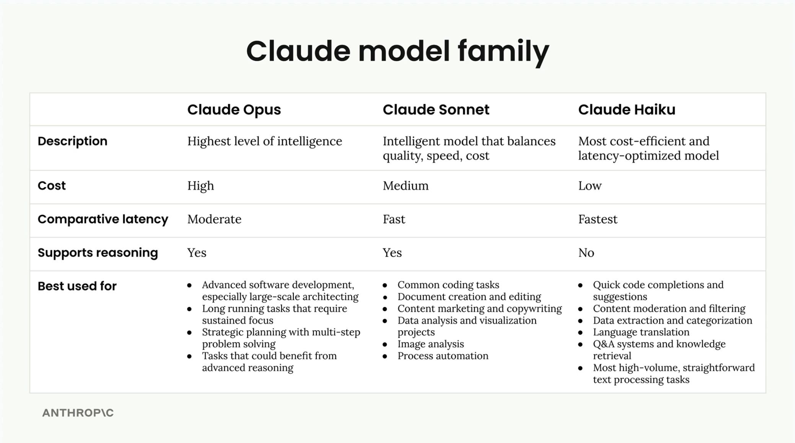
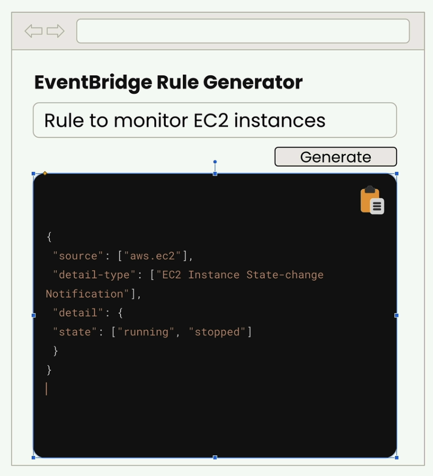

# Anthropic overview

## Overview of Claude models

<figure><figcaption></figcaption></figure>

세 모델 모두 Claude의 핵심 기능을 공유
- 텍스트 생성, 코딩, 이미지 분석 및 기타 여러 작업을 처리
- 실제적 차이는 최적화 방식
  - 지능 중점
  - 속도와 비용 효율성
  - 지능과 속도 사이의 균형

### Opus

Cluade의 가장 뛰어난 모델
- 가장 높은 수준의 지능을 제공
- 몇 시간 동안 지속될 수 있는 복잡한 프로젝트를 독립적으로 수행
- 추론을 지원(간단한 작업에 빠른 응답, 더 복잡한 작업을 위해 시간을 할애)
- 단점: 중간 정도의 지연 시간과 더 높은 비용
  - 매우 높은 지능을 얻는 대신, 요청마다 약간의 추가 시간과 비용이 부과

### Sonnet

Cluade의 스위트 스팟 모델
- 대부분 실용적인 사용 사례에 매우 유용하게 만드는 지능, 속도 및 비용의 좋은 균형
- 강력한 코딩 능력과 빠른 텍스트 생성

### Haiku

Cluade에서 가장 빠른 모델
- 응답 시간이 매우 중요한 애플리케이션을 위해 특별히 제작
- Opus와 Sonnet이 가진 추론 기능을 지원하지 않음
- 대신, 속도와 비용 효율성에 최적화
- 실시간 상호 작용이 필요한 사용자 대면 앱에 매우 좋은 선택

<figure><figcaption></figcaption></figure>

# Accessing Claude with the API

## Accessing the API

사용자가 채팅 인터페이스에서 "보내기"를 클릭하는 순간부터 Claude의 응답이 화면에 나타날 때까지 어떤 일이 일어나는지의 과정

**5단계 요청 흐름**

Claude와의 모든 상호작용은 **서버에 대한 요청**, **Anthropic API에 대한 요청**, **모델 처리**, **서버에 대한 응답**, **클라이언트에 대한 응답**이라는 5가지 단계로 구성된 예측 가능한 패턴을 따릅니다.


### Request to Server

<figure><figcaption></figcaption></figure>

**서버가 필요한 이유**  
클라이언트 측 코드에서 Anthropic API에 직접 요청을 보내면 안 되므로 서버가 필요
- API 요청에는 인증을 위한 비밀 API 키가 필요
- 클라이언트 코드에서 이 키를 노출하면 심각한 보안 취약점이 발생
- 누구든지 키를 추출하고 허가 없이 요청 가능

대신, 서버에 요청을 보내고, 해당 서버는 안전하게 저장된 키를 사용하여 Anthropic API와 통신

### Request to Anthropic API

서버가 Anthropic API에 접속하면 공식 SDK를 사용하거나 일반 HTTP 요청을 가능
- Anthropic은 `Python`, `TypeScript`, `JavaScript`, `Go`, `Ruby`용 SDK를 제공

<figure><figcaption></figcaption></figure>


모든 요청에는 다음과 같은 필수 필드가 포함
- API 키: Anthropic에 대한 개발자의 요청을 식별
- 모델: 사용할 모델의 이름(ex: "claude-3-sonnet")
- 메시지: 사용자 입력 텍스트가 포함된 목록
- 최대 토큰: Claude가 생성할 수 있는 토큰 수 제한

### Model Processing

<figure><figcaption></figcaption></figure>

**토큰화**  
클로드는 먼저 입력 텍스트를 토큰이라는 작은 단위로 나눔
- 토큰은 단어 전체, 단어의 일부, 공백 또는 기호일 수 있음
- 편의상 `각 단어를 하나의 토큰`이라고 생각하면 됨

**임베딩**  
- 각 토큰은 임베딩으로 변환
- 임베딩은 해당 단어의 모든 가능한 의미를 나타내는 긴 숫자 목록
- 임베딩은 `의미적 관계를 포착하는 숫자 정의`라고 생각하면 됨

<figure><figcaption></figcaption></figure>

단어는 종종 여러 의미를 갖습니다. 예를 들어, "quantum"은 다음과 같은 의미를 가질 수 있습니다.
- 물리량의 이산적인 단위(물리학)
- 양자 역학 또는 양자 물리학 개념
- 매우 작거나 아원자적인 것
- 양자 컴퓨팅 응용 프로그램

**문맥화**
- Claude는 주변 단어를 기반으로 각 임베딩을 세분화하여 맥락에서 가장 가능성 있는 의미를 파악
- 이 과정을 통해 수치적 표현을 조정하여 적절한 정의를 강조

<figure><figcaption></figcaption></figure>

**세대**
- 문맥화된 임베딩은 다음 단어가 나올 확률을 계산하는 출력 계층을 통과
- Claude는 항상 확률이 가장 높은 단어를 선택하는 것은 아님
- 확률과 통제된 무작위성을 혼합하여 자연스럽고 다양한 반응을 생성

<figure><figcaption></figcaption></figure>

Claude는 각 단어를 선택한 후 이를 시퀀스에 추가하고 다음 단어에 대해 전체 과정을 반복

**클로드가 생성을 멈추면**
- 각 토큰 후에 Claude는 계속할지 여부를 결정하기 위해 여러 조건을 확인

<figure><figcaption></figcaption></figure>

- 최대 토큰에 도달했습니다. 지정한 한도에 도달했습니까?
- 자연스러운 결말. 시퀀스 끝 토큰을 생성했나요?
- 정지 시퀀스. 미리 정의된 정지 문구를 만났나요?

### Response to Server

**API 응답**  
생성이 완료되면 API는 다음을 포함하는 구조화된 응답을 다시 보냅니다.
- 메시지: 생성된 텍스트
- 사용: 입력 및 출력 토큰 수
- 정지 이유: 세대가 종료된 이유

<figure><figcaption></figcaption></figure>

### Request to Client

개발자의 서버는 이 응답을 받고 생성된 텍스트를 개발자의 클라이언트 애플리케이션으로 다시 전달
- 클라이언트 애플리케이션에서는 이 텍스트가 사용자 인터페이스에 표시

<figure><figcaption></figcaption></figure>

## Making a request

**API 키 받기**

1️⃣ [Getting an API key](https://console.anthropic.com/)

.

**환경 설정**

1️⃣ 필요한 종속성을 설치

```bash
pip install anthropic python-dotenv
```

2️⃣ 동일 디렉토리에 `.env` 파일을 만들어 API 키를 안전하게 저장
- `.gitignore` 파일에 `.env` 저장 

```python
ANTHROPIC_API_KEY="your-api-key-here"
```

3️⃣ 환경 변수를 로드하고 API 클라이언트 생성

```python
from dotenv import load_dotenv
load_dotenv()

from anthropic import Anthropic

client = Anthropic()
model = "claude-sonnet-4-0"
```

.

**생성 함수**

```python
client.messages.create(
  model=model,
  max_tokens=1000,
  messages=[
    # List of message to send
  ]
)
```

API 요청의 핵심은 `client.messages.create()함`
- 이 함수에는 세 가지 주요 매개변수가 필요
  - 모델: 사용하려는 클로드 모델의 이름
  - max_tokens: 응답 길이에 대한 안전 제한(목표가 아님)
  - 메시지: 클로드에게 보내는 대화 기록

`max_tokens` 매개변수는 안전 메커니즘으로 작용
- 1000으로 설정하면 더 많은 토큰이 있어도 1000개 이후에는 생성을 중지
- Claud는 이 한계에 도달하려고 하지 않고 적절하다고 생각하는 것을 작성하고 최대값에 도달하면 중지

.

**메시지 이해하기**

메시지는 채팅 애플리케이션과 유사하게 사용자와 claude 간의 대화를 표현  
메시지에는 두 가지 유형이 존재
- User messages: 클로드에게 보내고 싶은 콘텐츠
- Assistant messages: 클로드가 생성한 응답

각 메시지는 역할("User" 또는 "Assistant")과 내용(실제 텍스트)이 포함된 사전

.

**첫 번째 요청하기**

클로드에게 요청하는 예시

```python
message = client.messages.create(
  model=model,
  max_tokens=1000,
  messages=[
    {
      "role": "user",
      "content": "What is quantum computing? Answer in one sentence"
    }
  ]
)
```

이 코드를 실행하면 클로드가 요청을 처리하고 요청에 대한 메타데이터와 함께 생성된 텍스트가 포함된 응답 객체를 반환

.

**응답 추출**

응답 개체에는 많은 정보가 포함되어 있지만 일반적으로 생성된 텍스트만 필요

```python
# 깨끗하고 읽기 쉬운 출력을 얻는 방법
message.content[0].text
```

## Multi-Turn conversations

Anthropic API와 Claude를 사용할 때 이해해야 할 중요한 개념  
Claude는 사용자의 대화 기록을 저장하지 않음. 사용자가 요청하는 각 요청은 이전 교환에 대한 기억 없이 완전히 독립적
- 즉, Claude가 이전 메시지의 맥락을 기억하는 multi-turn 대화를 원한다면 대화 상태를 직접 처리해야 함.

**상태 비저장 대화의 문제**

클로드에게 "양자 컴퓨팅이란 무엇인가요?"라고 물어보고 좋은 반응을 얻었다고 가정
- 그런 다음 "다른 문장을 써보세요"로 후속작을 요청
- Claude는 당신이 무엇을 가리키는지 전혀 모르는 상태
- 양자 컴퓨팅 논의에 대한 기억이 없기 때문에 완전히 무작위적인 내용의 문장을 작성

.

**Multi-Turn 대화 작동 방식**  
대화 맥락을 유지하려면 두 가지를 해야 합니다.
- 코드의 모든 메시지 목록을 수동으로 유지 관리
- 모든 요청에 전체 메시지 기록 보내기

<figure><figcaption></figcaption></figure>

실제로 작동하는 흐름
- 클로드에게 초기 사용자 메시지 보내기
- 클로드의 답변을 받아 메시지 목록에 보조 메시지로 추가
- 후속 질문을 다른 사용자 메시지로 추가
- 전체 대화 기록을 클로드에게 전송

.

**Building Helper Functions**  
대화 관리를 더 쉽게 하기 위해 세 가지 도우미 기능을 만들 수 있습니다:

```python
def add_user_message(messages, text):
    user_message = {"role": "user", "content": text}
    messages.append(user_message)

def add_assistant_message(messages, text):
    assistant_message = {"role": "assistant", "content": text}
    messages.append(assistant_message)

def chat(messages):
    message = client.messages.create(
        model=model,
        max_tokens=1000,
        messages=messages,
    )
    return message.content[0].text
```

**Putting It All Together**  
다음은 이러한 기능을 사용하여 대화를 유지하는 방법입니다:


```python
# Start with an empty message list
messages = []

# Add the initial user question
add_user_message(messages, "Define quantum computing in one sentence")
# Get Claude's response
answer = chat(messages)
# Add Claude's response to the conversation history
add_assistant_message(messages, answer)
# Add a follow-up question
add_user_message(messages, "Write another sentence")
# Get the follow-up response with full context
final_answer = chat(messages)
```

이제 클로드는 "Write another sentence"가 양자 컴퓨팅 정의를 확장하는 것을 의미한다는 것을 이해하게 될 것입니다. 왜냐하면 당신이 완전한 대화 맥락을 제공했기 때문
- 이러한 도우미 기능은 클로드와의 작업 전반에 걸쳐 유용할 것이며, 여러 교환을 통해 의미 있는 대화를 유지할 수 있는 애플리케이션을 훨씬 쉽게 구축 가능

## System prompts

`System prompts`는 클로드가 사용자 입력에 어떻게 반응하는지 사용자 지정하는 강력한 방법  
일반적인 답변 대신 클로드의 톤, 스타일, 접근 방식을 구체적인 사용 사례에 맞게 조정

**Why System Prompts Matter**

수학 과외 챗봇을 만드는 것을 고려해 보세요. 한 학생이 "x의 5x + 2 = 3을 어떻게 풀 수 있나요?"라고 물으면 클로드가 답을 뱉는 것이 아니라 실제 과외 선생님처럼 행동하기를 원합니다. 좋은 수학 과외 선생님은 이렇게 해야 합니다:
- 처음에는 완전한 해결책보다는 힌트를 제공
- 인내심을 가지고 학생들이 문제를 차근차근 해결해 나감
- 유사한 문제에 대한 해결책을 예제로 보여줌

클로드가 아래와 같이 하는 것을 절대 원하지 않을 것임
- 즉시 직접 답변 제공
- 학생들에게 계산기만 사용하라고 말함

.

**How System Prompts Work**

시스템 프롬프트는 클로드에게 응답 방법에 대한 지침을 제공
- 이를 일반 문자열로 정의하고 생성 함수 호출에 전달
- 주요 이점
  - 시스템 프롬프트는 클로드에게 응답 방법에 대한 지침을 제공
  - 클로드는 특정 역할을 맡은 사람이 응답하는 것과 같은 방식으로 응답하려고 노력
  - 클로드를 계속 과정을 수행하는 데 도움

```python
# 기본 구조
system_prompt = """
You are a patient math tutor.
Do not directly answer a student's questions.
Guide them to a solution step by step.
"""

client.messages.create(
    model=model,
    messages=messages,
    max_tokens=1000,
    system=system_prompt
)
```

.

**Seeing the Difference**

시스템 프롬프트가 없으면 클로드는 즉시 완전한 단계별 솔루션을 제공
- 도움이 될 수 있지만 학생이 직접 문제를 생각하도록 장려하지는 않음.
- 수학 튜터 시스템 프롬프트를 통해 클로드의 반응은 극적으로 변화
  - 클로드는 전체 솔루션을 제공하는 대신 "x를 분리하는 좋은 첫 번째 단계는 무엇이라고 생각하시나요? 용어 이동을 시작하려면 양쪽에서 어떤 작업을 수행해야 할지 고려해 보세요."와 같은 안내 질문을 던짐.

.

**Building a Flexible Chat Function**

시스템 프롬프트를 하드코딩하는 대신, 시스템 프롬프트를 매개변수로 받아 채팅 기능을 더 재사용할 수 있게 만들기

```python
def chat(messages, system=None):
    params = {
        "model": model,
        "max_tokens": 1000,
        "messages": messages,
    }
    
    if system:
        params["system"] = system
    
    message = client.messages.create(**params)
    return message.content[0].text
```

이 접근 방식은 중요한 세부 사항을 처리
- Claude의 API는 `system=none`를 허용하지 않으므로 시스템 매개변수가 제공될 때만 조건부로 포함

```python
# Without system prompt
answer = chat(messages)

# With system prompt
system = """
You are a patient math tutor.
Do not directly answer a student's questions.
Guide them to a solution step by step.
"""
answer = chat(messages, system=system)
```

시스템 프롬프트는 의도한 목적에 맞게 일관되고 적절하게 작동하는 AI 애플리케이션을 만드는 데 필수적
- 일반적인 AI 응답을 전문화되고 역할에 적합한 상호 작용으로 변환

## Temperature

`Temperature`는 클로드의 반응이 얼마나 예측 가능하거나 창의적일지를 제어하는 강력한 매개변수
- 효과적으로 사용하는 방법을 이해하면 AI 애플리케이션을 획기적으로 개선 가능

**How Claude Generates Text**

`Temperature`로 들어가기 전에 클로드의 텍스트 생성 과정을 이해하기
- 클로드에게 "What do you think?"와 같은 프롬프트를 보내면 세 가지 주요 단계를 거칩니다
  1. 토큰화: 입력을 더 작은 덩어리로 나누기
  2. 예측: 가능한 다음 단어에 대한 확률 계산
  3. 샘플링: 해당 확률을 기반으로 토큰 선택

<figure><figcaption></figcaption></figure>

이 예제에서 클로드는 30% 확률을 "about", 20% 확률을 "would", 10% 확률을 "of" 등으로 할당할 수 있습니다. 그런 다음 모델은 하나의 토큰을 선택하고 이 전체 과정을 반복하여 완전한 문장을 만듭니다.

<figure><figcaption></figcaption></figure>

.

**What Temperature Does**

`Temperature`는 0과 1 사이의 소수점 값으로 이러한 선택 확률에 직접적인 영향을 미칩니다. 
- 마치 클로드의 응답에 대한 `creativity dial`을 조정하는 것과 같다.

<figure><figcaption></figcaption></figure>

- 낮은 온도(0에 가까운)에서 클로드는 항상 거의 가장 높은 확률의 토큰을 선택할 정도로 매우 결정론적이 됩니다. 
- 높은 온도(1에 가까운 온도)에서 클로드는 옵션 간에 확률을 더 고르게 분배하여 더 다양하고 창의적인 결과를 도출합니다.

.

**Interactive Temperature Demo**

클로드의 Interactive demo를 통해 `Temperature`가 작동하는 것을 볼 수 있습니다. - 온도 슬라이더를 조정할 때 확률 분포가 어떻게 변하는지 지켜보자.

<figure><figcaption></figcaption></figure>

- `Temperature` 0.0에서 "about"은 100% 확률로 완전히 결정론적
- `Temperature` 1.0에서는 확률이 모든 가능한 토큰에 더 고르게 분포되어 무작위성과 창의성을 도입

.

**Choosing the Right Temperature**

다양한 작업은 서로 다른 온도 범위를 요구

<figure><figcaption></figcaption></figure>

Low Temperature (0.0 - 0.3)
- 사실적 응답
- 코딩 지원
- 데이터 추출
- 콘텐츠 중재

Medium Temperature (0.4 - 0.7)
- 요약
- 교육 콘텐츠
- 문제 해결
- 제약이 있는 창의적인 글쓰기

High Temperature (0.8 - 1.0)
- 브레인스토밍
- 창의적 글쓰기
- 마케팅 콘텐츠
- 농담 생성

.

**Implementing Temperature in Code**

채팅 기능에 `Temperature` 지원을 추가하는 것은 간단

```python
def chat(messages, system=None, temperature=1.0):
    params = {
        "model": model,
        "max_tokens": 1000,
        "messages": messages,
        "temperature": temperature # temperature 지원
    }
    
    if system:
        params["system"] = system
    
    message = client.messages.create(**params)
    return message.content[0].text
```

주요 변경 사항은 `temperature=1.0`을 매개변수로 추가하고 `temperature`를 포함

.

**Testing Temperature Effects**

작동 중인 `temperature`를 확인하려면 다양한 설정으로 영화 아이디어를 만들어 보자

```python
# Low temperature - more predictable
answer = chat(messages, temperature=0.0)

# High temperature - more creative  
answer = chat(messages, temperature=1.0)
```

- `temperature=0.0`에서는 "시간 여행을 하는 고고학자는 고대 유물이 도난당하는 것을 막아야 한다"와 같은 반응을 지속적으로 얻을 수 있습니다. 
- `temperature=1.0`에서는 테마, 캐릭터, 플롯 요소에서 훨씬 더 다양한 것을 볼 수 있습니다.

.

**Key Takeaways**

`temperature`가 다른 출력을 보장하는 것은 아니며, 단지 **출력을 얻을 확률**만 변경한다는 점을 기억하자.
- 높은 temperature에서도 클로드는 때때로 비슷한 반응을 보일 수 있습니다. 
- 핵심은 사용자의 temperature 선택을 특정 용도에 맞추는 것
  - 일관되고 사실적인 응답이 필요합니까? Use low temperature
  - 창의적인 브레인스토밍을 원하시나요? Dial up the temperature
  - 중간 정도? 중간 온도는 대부분의 일반적인 작업에 잘 작동

> `temperature`는 클로드의 행동을 특정 요구에 맞게 미세 조정하기 위해 조정할 수 있는 가장 실용적인 매개변수 중 하나

.

## Response streaming

클로드와 채팅 애플리케이션을 구축할 때는 상당한 사용자 경험 문제가 있습니다. 
- 응답을 생성하는 데 10~30초가 걸릴 수 있어 사용자가 loading spinner를 응시하게 됩니다. 
- 솔루션은 응답 스트리밍으로, 클로드가 텍스트를 생성할 때 사용자가 텍스트를 청크 단위로 표시하여 훨씬 더 반응적인 느낌을 줄 수 있습니다.

<figure><figcaption></figcaption></figure>

.

**The Problem with Standard Responses**

일반적인 채팅 설정에서는 서버가 클로드에게 사용자 메시지를 보내고 응답이 완료될 때까지 기다렸다가 클라이언트에게 무언가를 다시 보냅니다. 
- 이렇게 하면 사용자가 아무런 피드백도 받지 못하는 어색한 지연이 발생합니다.

<figure><figcaption></figcaption></figure>

.

**How Streaming Works**

스트리밍이 활성화되면 클로드는 요청을 수신했음을 나타내는 초기 응답을 즉시 전송하고 텍스트를 생성하기 시작했음을 알립니다. 
- 그런 다음 각 이벤트에는 전체 응답의 작은 부분이 포함된 일련의 이벤트가 표시됩니다.

<figure><figcaption></figcaption></figure>

서버는 이러한 텍스트 청크가 도착하면 클라이언트 애플리케이션으로 전달하여 사용자가 응답이 한 단어씩 쌓이는 것을 확인할 수 있습니다.
- 이 모든 이벤트는 클로드에 대한 단일 요청의 일부입니다.

.

**Understanding Stream Events**

스트리밍을 활성화하면 클로드는 여러 유형의 이벤트를 전송

- MessageStart: 새 메시지가 전송
- ContentBlockStart: 텍스트, 도구 사용 또는 기타 콘텐츠를 포함하는 새 블록 시작
- ContentBlockDelta: 실제 생성된 텍스트의 일부
- ContentBlockStop: 현재 콘텐츠 블록이 완료
- MessageDelta: 현재 메시지가 완료
- MessageStop: 현재 메시지에 대한 정보 종료

<figure><figcaption></figcaption></figure>

ContentBlockDelta 이벤트에는 사용자에게 표시하려는 실제 생성된 텍스트가 포함

.

**Basic Streaming Implementation**

스트리밍을 활성화하려면 메시지에 `stream=True` 추가하기

```python
messages = []
add_user_message(messages, "Write a 1 sentence description of a fake database")

stream = client.messages.create(
    model=model,
    max_tokens=1000,
    messages=messages,
    stream=True # 스트리밍을 활성화
)

for event in stream:
    print(event)
```

.

**Simplified Text Streaming**

이벤트를 수동으로 구문 분석하는 대신 텍스트 콘텐츠만 추출하는 SDK의 간소화된 스트리밍 인터페이스를 사용할 수 있습니다:

```python
with client.messages.stream(
    model=model,
    max_tokens=1000,
    messages=messages
) as stream:
    for text in stream.text_stream:
        print(text, end="")
```

이 접근 방식은 일반적으로 사용자에게 응답을 표시하는 데 필요한 실제 텍스트 내용을 제외한 모든 내용을 자동으로 필터링합니다.

.

**Getting the Complete Message**

개별 청크를 스트리밍하는 것은 사용자 경험에 큰 도움이 되지만, 저장 또는 추가 처리를 위해 전체 메시지가 필요한 경우가 많습니다. 스트리밍이 완료되면 조립된 최종 메시지를 받을 수 있습니다:

```python
with client.messages.stream(
    model=model,
    max_tokens=1000,
    messages=messages
) as stream:
    for text in stream.text_stream:
        # Send each chunk to your client
        pass
    
    # Get the complete message for database storage
    final_message = stream.get_final_message()
```

이는 사용자를 위한 실시간 스트리밍과 애플리케이션 로직을 위한 완전한 메시지 객체라는 두 가지 장점을 모두 제공합니다.

## Controlling model output

더 나은 프롬프트를 만드는 것 외에도 클로드의 출력을 제어하는 두 가지 강력한 기술이 있습니다:
- 미리 채워진 어시스턴트 메시지와 중지 시퀀스입니다. 
- 이러한 방법을 사용하면 클로드가 응답하는 방식과 텍스트 생성을 중지하는 시점을 정확하게 제어할 수 있습니다.

**Prefilled Assistant Messages**

메시지 prefilling을 통해 클로드의 응답을 시작할 수 있으며, 그 시작 지점부터 계속됩니다. 
- 이 기술은 클로드를 특정 방향으로 조종하는 데 매우 유용합니다.

<figure><figcaption></figcaption></figure>

사용자 메시지만 보내는 대신 메시지 목록 끝에 어시스턴트 메시지를 추가합니다. 클로드는 이 어시스턴트 메시지를 보고 "이미 이 질문에 답하기 시작했으니 중단했던 부분부터 계속해야 한다"고 생각합니다.

<figure><figcaption></figcaption></figure>

예를 들어, 미리 채우지 않고 "아침 식사에 차가 더 나을까요, 커피가 더 나을까요?"라고 물으면 클로드는 일반적으로 두 가지 옵션을 모두 언급하며 균형 잡힌 답변을 내립니다. 하지만 "커피가 더 낫기 때문에"라는 어시스턴트 메시지를 추가하면 클로드는 거기서부터 커피를 위한 케이스를 만들 수 있습니다.

이해해야 할 중요한 점은 클로드가 미리 채워진 텍스트(prefilling)가 정확히 끝나는 지점부터 계속된다는 것입니다. "커피가 더 낫기 때문에"라고 쓰면 클로드는 그 텍스트를 반복하지 않고 "왜냐하면" 직후에 생각을 완성합니다.

```python
messages = []
add_user_message(messages, "Is tea or coffee better at breakfast?")
add_assistant_message(messages, "Coffee is better because")
answer = chat(messages)
```

이 기술을 사용하면 클로드를 어느 방향으로든 조종할 수 있습니다
- 커피를 선호합니다: "커피가 더 좋은 이유는"
- 좋아하는 차: "차가 더 좋은 이유는"
- 반대 입장을 취하세요: "둘 다 별로 좋지 않은 이유는 다음과 같습니다."

.

**Stop Sequences**

중지 시퀀스는 특정 문자열을 생성하면 클로드가 즉시 응답을 종료하도록 강제합니다. 이는 응답의 길이나 끝점을 제어하는 데 완벽합니다.

<figure><figcaption></figcaption></figure>

개념은 간단합니다: 문자열 목록을 제공하면 클로드가 해당 문자열을 생성하자마자 즉시 응답을 멈춥니다. 정지 시퀀스 자체는 최종 응답에 포함되지 않습니다.

예를 들어, 클로드에게 정지 순서가 "5"인 "1에서 10까지 세기"를 요청하면 다음과 같은 결과를 얻을 수 있습니다:

```text
1, 2, 3, 4, 
```

생성은 "5" 바로 앞에서 멈춥니다. 왜냐하면 그것이 당신의 정지 순서이기 때문입니다.

중지 시퀀스를 구현하려면 채팅 기능을 수정하여 중지 시퀀스 매개변수를 허용해야 합니다:

```python
def chat(messages, stop_sequences=[]):
    # Add stop_sequences to your API call parameters

messages = []
add_user_message(messages, "Count from 1 to 10")
answer = chat(messages, stop_sequences=["5"])
```

정지가 발생하는 위치를 정확하게 미세 조정할 수 있습니다. 후행 구두점을 피하려면 "5" 대신 ", 5"와 같은 보다 구체적인 정지 시퀀스를 사용하세요.

.

**Practical Applications**

이 기술이 유용하게 사용될 수 있는 사례
- 일관된 형식 지정: prefilling을 사용하여 응답이 항상 특정 구조로 시작되도록 설정
- 제어된 길이: 정지 시퀀스를 사용하여 자연스러운 중단점에서 응답을 제한
- 편향된 응답: 클로드가 중립적이지 않고 특정 입장을 취해야 할 때
- 구조화된 출력: 두 가지 기법을 결합하여 특정 템플릿에 맞는 응답을 생성

> 미리 채워진 메시지와 중지 시퀀스는 모두 클로드의 행동을 세밀하게 제어할 수 있게 해주며, 신뢰할 수 있는 AI 애플리케이션을 구축하는 데 필수적인 도구가 됩니다.

## Structured data

Claude가 JSON, Python 코드 또는 글머리 기호 목록과 같은 구조화된 데이터를 생성해야 할 때, 종종 공통적인 문제에 직면하게 됩니다: Claude는 도움을 주고 콘텐츠에 설명 텍스트를 추가하고 싶어 합니다. 이는 일반적으로 훌륭하지만, 때로는 다른 정보 없이 원시 데이터만 필요할 때도 있습니다.

AWS EventBridge 규칙을 생성하는 웹 앱을 만드는 것을 고려해 보세요. 사용자는 설명을 입력하고 생성 버튼을 클릭하면 깨끗한 JSON을 즉시 복사하고 사용할 수 있습니다. Claude가 설명 텍스트가 포함된 마크다운 코드 블록으로 감싼 JSON을 반환하면 사용자는 전체 응답을 단순히 복사할 수 없으며, JSON 부분만 수동으로 선택해야 합니다.

<figure><figcaption></figcaption></figure>

.

**The Problem with Default Responses**

기본적으로 클로드에게 JSON을 생성하라고 요청하면 다음과 같은 결과가 나올 수 있습니다:

```json
// ```json
{
  "source": ["aws.ec2"],
  "detail-type": ["EC2 Instance State-change Notification"],
  "detail": {
    "state": ["running"]
  }
// ```
```

이 규칙은 인스턴스가 실행되기 시작할 때 EC2 인스턴스 상태 변경 사항을 캡처합니다.
- JSON은 맞지만 마크다운 형식으로 포장되어 있으며 설명 텍스트가 포함되어 있습니다. 
- 사용자가 원본 JSON을 복사해야 하는 웹 앱의 경우 사용자 경험에 마찰이 발생합니다.

.

**The Solution: Assistant Message Prefilling + Stop Sequences**

`assistant message prefilling`과  `stop sequences`를 결합하여 원하는 콘텐츠를 정확하게 얻을 수 있습니다. 

작동 방식은 다음과 같습니다:

```python
messages = []

add_user_message(messages, "Generate a very short event bridge rule as json")
add_assistant_message(messages, "```json")

text = chat(messages, stop_sequences=["```"])
```

이 기술은 다음을 통해 작동합니다:

1. 사용자 메시지는 클로드에게 생성할 내용을 알려줍니다
2. 미리 채워진 어시스턴트 메시지는 클로드가 이미 마크다운 코드 블록을 시작했다고 생각하게 만듭니다
3. 클로드는 JSON 콘텐츠만 작성하여 계속합니다
4. 클로드가 코드 블록을 "```"로 닫으려고 하면 중지 시퀀스가 즉시 생성을 종료합니다

<figure><figcaption></figcaption></figure>

결과적으로 추가 포맷 없이 깨끗한 JSON이 생성됩니다.

```python
{
  "source": ["aws.ec2"],
  "detail-type": ["EC2 Instance State-change Notification"],
  "detail": {
    "state": ["running"]
  }
}
```

이 기술은 JSON 생성에만 국한되지 않고, 구조화된 데이터가 필요할 때 주석 없이 언제든지 사용할 수 있다.
- 파이썬 코드 스니펫
- 글머리 기호 목록
- CSV 데이터
- 설명이 아닌 콘텐츠만 원하는 형식의 콘텐츠

핵심은 클로드가 콘텐츠를 자연스럽게 감싸려는 내용을 식별한 다음 이를 Prefilling 및 Stop Sequences로 사용하는 것입니다. 코드의 경우 일반적으로 마크다운 코드 블록입니다. 목록의 경우 다른 형식 지정 마커일 수 있습니다.

이 접근 방식은 클로드의 출력 형식을 정확하게 제어할 수 있게 하여, 깨끗하고 구조화된 데이터가 필수적인 애플리케이션에 AI 생성 콘텐츠를 훨씬 더 쉽게 통합할 수 있게 해줍니다.