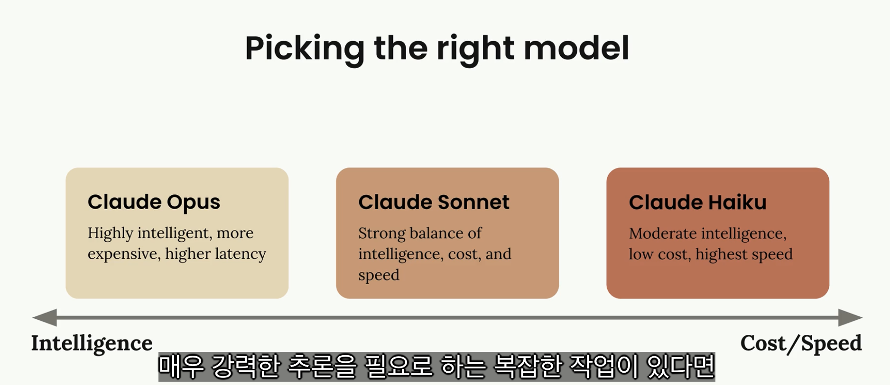

# Claude with the Anthropic API

## Overview of Claude models

<figure><figcaption></figcaption></figure>

세 모델 모두 Claude의 핵심 기능을 공유
- 텍스트 생성, 코딩, 이미지 분석 및 기타 여러 작업을 처리
- 실제적 차이는 최적화 방식
  - 지능 중점
  - 속도와 비용 효율성
  - 지능과 속도 사이의 균형

### Opus

Cluade의 가장 뛰어난 모델
- 가장 높은 수준의 지능을 제공
- 몇 시간 동안 지속될 수 있는 복잡한 프로젝트를 독립적으로 수행
- 추론을 지원(간단한 작업에 빠른 응답, 더 복잡한 작업을 위해 시간을 할애)
- 단점: 중간 정도의 지연 시간과 더 높은 비용
  - 매우 높은 지능을 얻는 대신, 요청마다 약간의 추가 시간과 비용이 부과

### Sonnet

Cluade의 스위트 스팟 모델
- 대부분 실용적인 사용 사례에 매우 유용하게 만드는 지능, 속도 및 비용의 좋은 균형
- 강력한 코딩 능력과 빠른 텍스트 생성

### Haiku

Cluade에서 가장 빠른 모델
- 응답 시간이 매우 중요한 애플리케이션을 위해 특별히 제작
- Opus와 Sonnet이 가진 추론 기능을 지원하지 않음
- 대신, 속도와 비용 효율성에 최적화
- 실시간 상호 작용이 필요한 사용자 대면 앱에 매우 좋은 선택

<figure><figcaption></figcaption></figure>