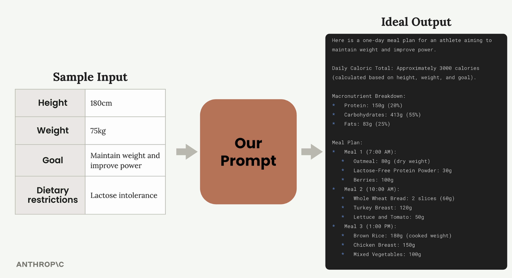

# Prompt engineering techniques

## Prompt enginerring

프롬프트 엔지니어링은 작성한 프롬프트를 가져와 더 신뢰할 수 있고 고품질의 출력을 얻기 위해 개선하는 것입니다. 이 프로세스는 기본 프롬프트로 시작하여 **성능을 평가한 다음 엔지니어링 기법을 체계적으로 적용하여 개선**하는 반복적인 정제 과정을 포함합니다.

<figure><figcaption></figcaption></figure>

### The Iterative Improvement Process

이 접근 방식은 원하는 결과를 얻을 때까지 반복할 수 있는 명확한 주기를 따릅니다:

1. **목표 설정** - 프롬프트에서 달성하고자 하는 목표 정의

2. **초기 프롬프트 작성** - 기본 첫 시도 만들기

3. **프롬프트 평가** - 기준에 맞게 테스트합

4. **신속한 엔지니어링 기법 적용** - 성능 향상을 위해 특정 방법 사용

5. **재평가** - 변경 사항이 실제로 결과를 개선했는지 확인

성능에 만족할 때까지 마지막 두 단계(4-5)를 반복합니다. 각 반복마다 평가 점수가 눈에 띄게 향상되어야 합니다.

### Setting Up Your Evaluation Pipeline

이 과정을 시연하기 위해 운동선수를 위한 일일 식단을 생성하는 프롬프트를 만드는 실용적인 예를 들어보겠습니다. 프롬프트는 운동선수의 키, 체중, 목표 및 식이 제한을 고려한 다음 종합적인 식단을 작성해야 합니다.

<figure><figcaption></figcaption></figure>

평가 설정은 **데이터셋 생성** 및 **모델 등급을 처리**하는 `PromptEvaluator` 클래스를 사용합니다. 평가자 인스턴스를 생성할 때 `max_concurrent_tasks` 매개변수와의 동시성을 제어할 수 있습니다:

```python
evaluator = PromptEvaluator(max_concurrent_tasks=5)
```

속도 제한 오류를 방지하려면 낮은 동시성 값(like 3)부터 시작하세요. API 할당량이 더 빠른 처리를 가능하게 한다면 이 값을 늘릴 수 있습니다.

### Generating Test Data

평가 시스템은 프롬프트 요구 사항에 따라 테스트 케이스를 자동으로 생성할 수 있습니다. 프롬프트에 필요한 입력을 정의합니다:

```python
dataset = evaluator.generate_dataset(
    task_description="Write a compact, concise 1 day meal plan for a single athlete",
    prompt_inputs_spec={
        "height": "Athlete's height in cm",
        "weight": "Athlete's weight in kg", 
        "goal": "Goal of the athlete",
        "restrictions": "Dietary restrictions of the athlete"
    },
    output_file="dataset.json",
    num_cases=3
)
```

개발 중 테스트 케이스 수를 낮게 유지(2~3개)하여 반복 주기를 단축하세요. 최종 검증을 위해 이를 늘릴 수 있습니다.

### Writing Your Initial Prompt

간단하고 순진한 프롬프트로 시작하여 기준선을 설정하세요. 의도적으로 기본적인 첫 번째 시도의 예는 다음과 같습니다:

```json
def run_prompt(prompt_inputs):
    prompt = f"""
What should this person eat?

- Height: {prompt_inputs["height"]}
- Weight: {prompt_inputs["weight"]}
- Goal: {prompt_inputs["goal"]}
- Dietary restrictions: {prompt_inputs["restrictions"]}
"""
    
    messages = []
    add_user_message(messages, prompt)
    return chat(messages)
```

이 기본 프롬프트는 좋지 않은 결과를 초래할 가능성이 높지만, 개선을 측정할 수 있는 출발점을 제공합니다.