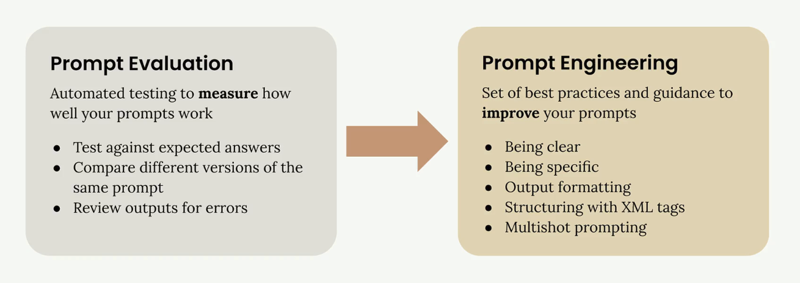

# Prompt engineering techniques

## Prompt enginerring

프롬프트 엔지니어링은 작성한 프롬프트를 가져와 더 신뢰할 수 있고 고품질의 출력을 얻기 위해 개선하는 것입니다. 이 프로세스는 기본 프롬프트로 시작하여 **성능을 평가한 다음 엔지니어링 기법을 체계적으로 적용하여 개선**하는 반복적인 정제 과정을 포함합니다.

<figure><figcaption></figcaption></figure>

## The Iterative Improvement Process

이 접근 방식은 원하는 결과를 얻을 때까지 반복할 수 있는 명확한 주기를 따릅니다:

1. **목표 설정** - 프롬프트에서 달성하고자 하는 목표 정의

2. **초기 프롬프트 작성** - 기본 첫 시도 만들기

3. **프롬프트 평가** - 기준에 맞게 테스트합

4. **신속한 엔지니어링 기법 적용** - 성능 향상을 위해 특정 방법 사용

5. **재평가** - 변경 사항이 실제로 결과를 개선했는지 확인

성능에 만족할 때까지 마지막 두 단계(4-5)를 반복합니다. 각 반복마다 평가 점수가 눈에 띄게 향상되어야 합니다.

