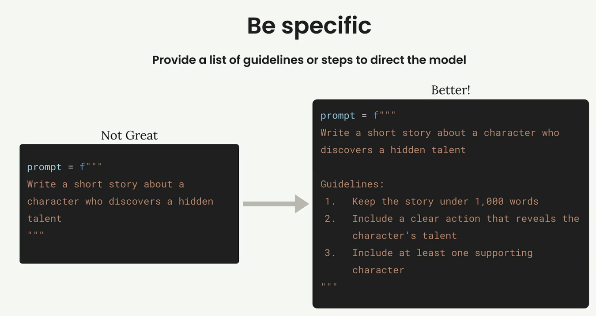

# Prompt engineering techniques

## Prompt enginerring

프롬프트 엔지니어링은 작성한 프롬프트를 가져와 더 신뢰할 수 있고 고품질의 출력을 얻기 위해 개선하는 것입니다. 이 프로세스는 기본 프롬프트로 시작하여 **성능을 평가한 다음 엔지니어링 기법을 체계적으로 적용하여 개선**하는 반복적인 정제 과정을 포함합니다.

<figure><figcaption></figcaption></figure>

### The Iterative Improvement Process

이 접근 방식은 원하는 결과를 얻을 때까지 반복할 수 있는 명확한 주기를 따릅니다:

1. **목표 설정** - 프롬프트에서 달성하고자 하는 목표 정의

2. **초기 프롬프트 작성** - 기본 첫 시도 만들기

3. **프롬프트 평가** - 기준에 맞게 테스트합

4. **신속한 엔지니어링 기법 적용** - 성능 향상을 위해 특정 방법 사용

5. **재평가** - 변경 사항이 실제로 결과를 개선했는지 확인

성능에 만족할 때까지 마지막 두 단계(4-5)를 반복합니다. 각 반복마다 평가 점수가 눈에 띄게 향상되어야 합니다.

### Setting Up Your Evaluation Pipeline

이 과정을 시연하기 위해 운동선수를 위한 일일 식단을 생성하는 프롬프트를 만드는 실용적인 예를 들어보겠습니다. 프롬프트는 운동선수의 키, 체중, 목표 및 식이 제한을 고려한 다음 종합적인 식단을 작성해야 합니다.

<figure><figcaption></figcaption></figure>

평가 설정은 **데이터셋 생성** 및 **모델 등급을 처리**하는 `PromptEvaluator` 클래스를 사용합니다. 평가자 인스턴스를 생성할 때 `max_concurrent_tasks` 매개변수와의 동시성을 제어할 수 있습니다:

```python
evaluator = PromptEvaluator(max_concurrent_tasks=5)
```

속도 제한 오류를 방지하려면 낮은 동시성 값(like 3)부터 시작하세요. API 할당량이 더 빠른 처리를 가능하게 한다면 이 값을 늘릴 수 있습니다.

### Generating Test Data

평가 시스템은 프롬프트 요구 사항에 따라 테스트 케이스를 자동으로 생성할 수 있습니다. 프롬프트에 필요한 입력을 정의합니다:

```python
dataset = evaluator.generate_dataset(
    task_description="Write a compact, concise 1 day meal plan for a single athlete",
    prompt_inputs_spec={
        "height": "Athlete's height in cm",
        "weight": "Athlete's weight in kg", 
        "goal": "Goal of the athlete",
        "restrictions": "Dietary restrictions of the athlete"
    },
    output_file="dataset.json",
    num_cases=3
)
```

개발 중 테스트 케이스 수를 낮게 유지(2~3개)하여 반복 주기를 단축하세요. 최종 검증을 위해 이를 늘릴 수 있습니다.

### Writing Your Initial Prompt

간단하고 순진한 프롬프트로 시작하여 기준선을 설정하세요. 의도적으로 기본적인 첫 번째 시도의 예는 다음과 같습니다:

```json
def run_prompt(prompt_inputs):
    prompt = f"""
What should this person eat?

- Height: {prompt_inputs["height"]}
- Weight: {prompt_inputs["weight"]}
- Goal: {prompt_inputs["goal"]}
- Dietary restrictions: {prompt_inputs["restrictions"]}
"""
    
    messages = []
    add_user_message(messages, prompt)
    return chat(messages)
```

이 기본 프롬프트는 좋지 않은 결과를 초래할 가능성이 높지만, 개선을 측정할 수 있는 출발점을 제공합니다.

### Adding Evaluation Criteria

평가를 실행할 때 채점 모델이 고려해야 할 추가 기준을 지정할 수 있습니다:

```json
results = evaluator.run_evaluation(
    run_prompt_function=run_prompt,
    dataset_file="dataset.json",
    extra_criteria="""
The output should include:
- Daily caloric total
- Macronutrient breakdown  
- Meals with exact foods, portions, and timing
"""
)
```

이는 사용 사례에 중요한 특정 요구 사항에 대해 프롬프트를 평가하는 데 도움이 됩니다.

### Analyzing Results

평가를 실행하면 숫자 점수와 자세한 HTML 보고서를 모두 얻을 수 있습니다. 이 보고서는 각 점수에 대한 모델의 추론을 포함하여 각 테스트 사례가 정확히 어떻게 수행되었는지 보여줍니다.

초기 점수가 낮다고 낙담하지 마세요. 첫 번째 시도에서는 10점 만점에 2.3점이 일반적입니다. 엔지니어링 기법을 적용하면 일관된 개선을 볼 수 있습니다.

자세한 평가 보고서는 프롬프트가 실패하고 있는 부분과 개선이 필요한 부분을 정확히 이해하는 데 도움이 됩니다. 이 피드백을 사용하여 다음 반복을 안내하세요.

### Nest Steps

기준선이 설정되면 특정 프롬프트 엔지니어링 기법을 적용할 준비가 됩니다. 각 기법을 배울 때마다 평가 점수가 눈에 띄게 향상되어 기본 프롬프트가 점차 신뢰할 수 있고 고성능의 도구로 전환될 것입니다.

**신속한 엔지니어링은 반복적인 프로세스**라는 점을 기억하세요. 핵심은 한 번에 하나씩 변경하고 영향을 평가하며 효과가 있는 기술을 기반으로 구축하는 것입니다. 이러한 체계적인 접근 방식을 통해 특정 사용 사례에 가장 큰 가치를 제공하는 기술이 무엇인지 이해할 수 있습니다.

## Being clear and direct

프롬프트의 첫 번째 줄은 전체 요청에서 가장 중요한 부분입니다. 여기서 다음에 나오는 모든 것의 무대를 설정하고 올바르게 설정하면 결과가 극적으로 향상될 수 있습니다.

### Being Clear and Direct

이 중요한 첫 번째 줄을 만들 때는 `명확성(clarity)`과 `직접성(directness)`이라는 두 가지 핵심 원칙에 집중해야 합니다. 즉, 클로드가 원하는 작업에 대해 모호함의 여지를 남기지 않는 간단한 언어를 사용해야 합니다.

### Clear Communication

명확하다는 것의 의미
- 누구나 이해할 수 있는 **간단한 언어** 사용하기
- 덤불 주위를 돌지 않고 **원하는 것을 정확히** 말하
- 클로드의 과제에 대한 **간단한 설명**으로 리드하기

 모호한 말 대신 직설적인 말 사용하기
 - AS-SI: "사람들이 지붕에 태양열을 사용하는 것들에 대해 알아야 해요 - 태양열 패널이라고 부르는 것들 - 에 대해 알고 싶어요"
 - TO-BE: "태양열 패널이 어떻게 작동하는지에 대해 세 단락을 써보세요."

### Direct Instructions

"직접적"이라는 것은 요청을 구성하는 방식에 중점
- 질문이 아닌 **지침 사용**
- "Write", "Create" 또는 "Generate"과 같은 직접 작용 동사로 시작하기

지침을 사용하기
- AS-IS: "재생 에너지와 지열 에너지에 대해 읽고 있었어요. 어떤 나라에서 지열 에너지를 사용하나요?"
- TO-BE: "지열 에너지를 사용하는 세 나라를 식별하세요. 각각에 대한 발전 통계를 포함하세요."

### Putting It Into Practice

이 기술이 실제로 작동하는지 살펴보겠습니다. "이 사람은 무엇을 먹어야 하나요?"라고 묻는 약한 프롬프트부터 시작하여 명확하고 직접적인 접근 방식을 적용할 수 있습니다.

개선된 버전은 다음과 같습니다: 

> 운동선수의 식단 제한을 충족하는 하루 식단 계획을 수립하세요.

이 개정판은 즉시 클로드에게 알립니다:
- 어떤 조치를 취해야 하는지 (생성)
- 무엇을 만들 것인가 (식사 계획)
- 주요 제약 사항 (하루 동안 운동선수가 식이 제한을 충족하는 경우)

### Results Matter

이러한 간단한 변화는 성과에 큰 영향을 미칠 수 있습니다. 이 예시에서 평가 점수는 2.32점에서 3.92점으로 상승했는데, 이는 단순히 오프닝 라인을 재구성한 것보다 크게 개선된 수치입니다.

핵심 요점은 클로드가 원하는 것을 추측해야 하는 사람보다는 **`명확한 방향이 필요한 유능한 조수처럼 대할 때 가장 잘 반응`** 한다는 것입니다. **`직접 행동 동사로 강하게 시작하고 과제에 대해 구체적으로 설명`** 하면 바로 더 나은 결과를 얻을 수 있습니다.

## Structure with XML tags

클로드와 함께 작업할 때 가장 효과적인 결과 개선 방법 중 하나는 **원하는 것에 대해 구체적으로 설명**하는 것입니다. 모든 것을 모델의 해석에 맡기는 대신 **클로드가 원하는 결과물을 얻을 수 있도록 명확한 지침이나 단계를 제공**할 수 있습니다.

이렇게 생각해 보세요: 클로드에게 "숨겨진 재능을 발견한 캐릭터에 대한 짧은 이야기를 써달라"고 요청하면 클로드는 무수히 많은 방향으로 나아갈 수 있습니다. 이야기는 200단어 또는 2,000단어가 될 수 있습니다. 한 명의 캐릭터나 다섯 명의 캐릭터가 등장할 수도 있습니다. 어떤 유형의 재능 발견 시나리오에도 초점을 맞출 수 있습니다.

<figure><figcaption></figcaption></figure>


**구체적인 지침**을 추가하면 클로드에게 더 명확한 목표를 제시할 수 있습니다. 이렇게 하면 출력의 일관성과 품질이 크게 향상됩니다.

### Two Types of Guidelines

프롬프트에서 구체적으로 설명하기 위한 두 가지 주요 접근 방식이 있으며, 전문가용 애플리케이션에서 함께 사용되는 경우를 자주 볼 수 있습니다.

<figure><figcaption></figcaption></figure>

#### Output Quality Guidelines

첫 번째 유형은 `출력물이 갖추어야 할 품질을 나열`하는 데 중점을 둡니다. 다음 지침은 사용자가 제어하는 데 도움이 됩니다.

- 응답 길이
- 구조 및 형식
- 포함할 특정 속성 또는 요소
- 톤 또는 스타일 요구 사항

예를 들어, 이야기가 1,000단어 이하여야 한다고 지정하고, 캐릭터의 재능을 드러내는 명확한 행동을 포함하며, 최소한 하나의 조연 캐릭터를 포함해야 한다고 말할 수 있습니다.

#### Process Steps

두 번째 유형은 `클로드가 따라야 할 구체적인 단계`를 제공합니다. 이 접근 방식은 클로드가 최종 답에 도달하기 전에 문제를 체계적으로 생각하거나 여러 관점을 고려할 때 특히 유용합니다.

글을 쓰는 대신 클로드에게 부탁할 수도 있습니다:
1. 극적인 긴장감을 조성할 세 가지 재능을 브레인스토밍하세요
2. 가장 흥미로운 인재를 선택하세요
3. 재능을 드러내는 중요한 장면을 개략적으로 설명합니다
4. 영향력을 높일 수 있는 캐릭터 유형을 지원하는 브레인스토밍

### Real-World Impact   

특이성의 차이는 극적입니다. 식사 계획 프롬프트를 테스트할 때 지침을 추가하면 평가 점수가 3.92점에서 7.86점으로 향상되어 클로드에게 어떤 요소를 포함해야 하는지 정확히 알려주는 것만으로도 결과의 품질이 두 배 이상 향상되었습니다.

```text
지침:
1. 정확한 일일 칼로리 양 포함
2. 단백질, 지방 및 탄수화물 함량 표시  
3. 각 식사 시간 지정
4. 제한 사항에 맞는 식품만 사용
5. 모든 부분 크기를 그램 단위로 나열합니다
6. 언급된 경우 예산 친화적으로 유지
```

### When to Use Each Approach

다음은 각 유형의 특정성을 언제 사용해야 하는지에 대한 실용적인 가이드입니다:

**항상 출력 지침 사용**
- 작성하는 거의 모든 프롬프트에 품질 지침을 포함시켜야 합니다. 
- 일관되고 유용한 결과를 얻을 수 있는 안전망입니다.

**복잡한 문제에 프로세스 단계 사용**  
다룰 때 단계별 지침을 추가하세요:
- 복잡한 문제 해결
- 의사 결정 시나리오
- 비판적 사고 과제
- 클로드가 여러 각도를 고려하기를 원하는 모든 상황

<figure><figcaption></figcaption></figure>

예를 들어, 클로드에게 영업팀의 성과가 하락한 이유를 분석해 달라고 요청하는 경우, 영업팀이 하나의 잠재적 원인에만 집중하기보다는 시장 지표, 업계 변화, 개인 성과, 조직 변화, 고객 피드백을 검토하도록 안내하는 것이 좋습니다.

### Combining Both Approaches

전문적인 프롬프트에서는 두 가지 기법을 함께 사용하는 경우가 많습니다. **출력 형식과 내용을 제어하는 가이드라인**과 **클로드가 응답하기 전에 문제를 철저히 생각할 수 있도록 하는 단계**가 있을 수 있습니다.

이 조합은 결과의 일관성과 클로드가 결론에 도달하는 데 중요한 모든 요소를 고려했다는 자신감을 제공합니다.

## Structure with XML tags

많은 콘텐츠가 포함된 프롬프트를 만들 때 클로드는 때때로 어떤 텍스트 조각이 서로 속하는지 또는 어떤 섹션을 나타내야 하는지 이해하는 데 어려움을 겪을 수 있습니다. **XML 태그는 특히 대량의 데이터를 보간할 때 프롬프트에 구조와 명확성을 추가하는 간단한 방법을 제공**합니다.

### Why Structure Matters

20페이지에 달하는 판매 기록을 분석해야 하는 프롬프트를 고려해 보세요. 명확한 경계가 없으면 클로드는 사용자의 지침과 분석하고자 하는 실제 데이터를 구분하는 데 어려움을 겪을 수 있습니다.

<figure><figcaption></figcaption></figure>

위의 예는 경계가 불분명하면 클로드가 의도를 분석하기가 얼마나 어려울 수 있는지 보여줍니다. 판매 기록을 `<sales_records>` 및 `</sales_records>`와 같은 XML 태그로 감싸면 클로드가 프롬프트의 구조를 이해하는 데 도움이 되는 명확한 구분 기호를 만들 수 있습니다.

<figure><figcaption></figcaption></figure>

### Practical Example

XML 태그가 중요한 이유에 대한 더 극적인 예는 다음과 같습니다. 클로드에게 제공된 문서를 사용하여 코드를 디버깅하도록 요청하면 모든 것을 함께 섞으면 혼란이 생깁니다:

<figure><figcaption></figcaption></figure>

"Not Great" 버전은 코드와 문서를 구분하는 것이 거의 불가능합니다. "Better" 버전은 명확한 경계를 만들기 위해 `<my_code>`와 `<docs>` 태그를 사용합니다.


## 요약