# Prompt evaluation

## Prompt evaluation

클로드와 함께 일할 때 좋은 프롬프트를 작성하는 것은 시작에 불과합니다. 신뢰할 수 있는 AI 애플리케이션을 구축하려면 `prompt engineering`과 `prompt evaluation`라는 두 가지 중요한 개념을 이해해야 합니다. 

- prompt engineering:
  - 더 나은 프롬프트를 작성하는 기술을 제공
- prompt evaluation
  - 이러한 프롬프트가 실제로 얼마나 잘 작동하는지 측정하는 데 도움

## Prompt Engineering vs Prompt Evaluation

<figure>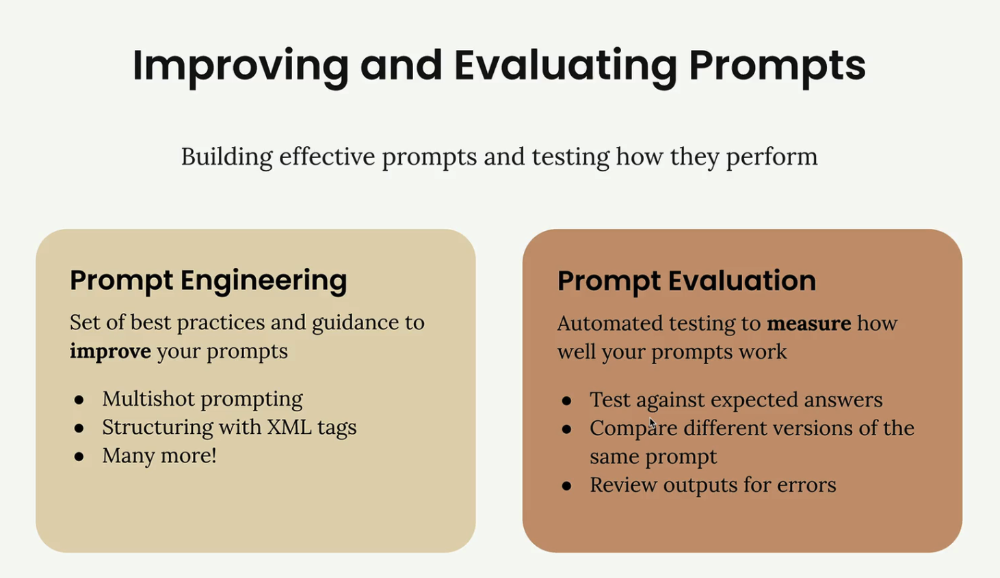<figcaption></figcaption></figure>

`prompt engineering`은 효과적인 프롬프트를 만드는 도구로, 다음과 같은 기술이 포함
- 멀티샷 프롬프트
- XML 태그를 사용한 구조화
- 다른 많은 모범 사례

이 기술들은 클로드가 당신이 무엇을 요구하고 어떻게 반응하기를 원하는지 정확히 이해하는 데 도움

`prompt evaluation`는 다른 접근 방식을 취합니다. 프롬프트를 작성하는 방법에 초점을 맞추는 대신 자동화된 테스트를 통해 프롬프트의 효과를 측정
- 예상된 답변에 대한 테스트
- 동일한 프롬프트의 다양한 버전 비교
- 오류가 있는지 출력 검토

.

**Three Paths After Writing a Prompt**

프롬프트를 작성한 후에는 일반적으로 다음에 수행할 작업에 세 가지 옵션이 있습니다:

<figure>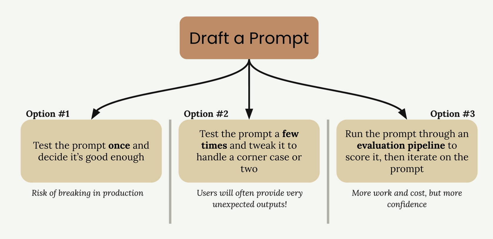<figcaption></figcaption></figure>

- **Option 1**: 프롬프트를 한 번 테스트한 후 충분히 좋다고 판단. 이는 사용자가 예상치 못한 입력을 제공하면 생산에 차질이 생길 위험이 큼.
- **Option 2**: 프롬프트를 몇 번 테스트하고 코너 케이스 한두 개를 처리하도록 조정. 옵션 1보다는 낫지만 사용자가 고려하지 않은 매우 예상치 못한 결과를 제공하는 경우가 많음.
- **Option 3**: 평가 파이프라인을 통해 프롬프트를 실행하여 점수를 매긴 다음 객관적인 지표에 따라 프롬프트를 반복. 이 접근 방식은 더 많은 작업과 비용이 필요하지만 프롬프트의 신뢰성에 대한 신뢰도가 훨씬 높음

.

**Why Most Engineers Fall Into Testing Traps**

옵션 1과 2는 모든 엔지니어가 흔히 접하는 함정. 진지한 애플리케이션에 대한 프롬프트를 작성하고 충분히 테스트하지 않는 것이 당연. 우리는 실제 사용자가 얼마나 많은 엣지 케이스를 마주하게 될지 과소평가하는 경향이 있음.

실제로 프롬프트를 프로덕션에 배포하면 사용자가 예상치 못한 방식으로 프롬프트와 상호 작용할 수 있습니다. 제한된 테스트 중에 견고한 프롬프트처럼 보였던 것은 다양한 실제 입력에 직면하면 빠르게 무너질 수 있습니다.

.

**The Evaluation-First Approach**

옵션 3은 신속한 개발을 위한 보다 체계적인 접근 방식. 평가 파이프라인을 통해 프롬프트를 실행하면 다양한 테스트 사례에서 **프롬프트의 성능에 대한 객관적인 지표**를 획득. 이 데이터 기반 접근 방식을 사용하면 다음과 같은 이점이 존재:
- 생산 문제가 되기 전에 약점 파악하기
- 다양한 프롬프트 버전을 객관적으로 비교하기
- 측정 가능한 개선 사항을 바탕으로 자신 있게 반복
- 더 신뢰할 수 있는 AI 애플리케이션 구축

이 접근 방식은 시간과 테스트 인프라에 더 많은 선불 투자가 필요하지만, 최종 애플리케이션의 신뢰성과 견고성에 대한 배당금을 지급. 목표는 사용자가 문제를 접한 후가 아니라 개발 중에 문제를 파악하는 것.

## A typical eval workflow

일반적인 프롬프트 평가 워크플로우는 객관적인 측정을 통해 프롬프트를 체계적으로 개선하는 데 도움이 되는 다섯 가지 주요 단계를 따름
- 이러한 워크플로우를 구성하는 방법은 다양하며 다양한 오픈 소스 및 유료 도구를 사용할 수 있지만, 핵심 프로세스를 이해하면 작은 규모로 시작하고 필요에 따라 확장 가능

<figure>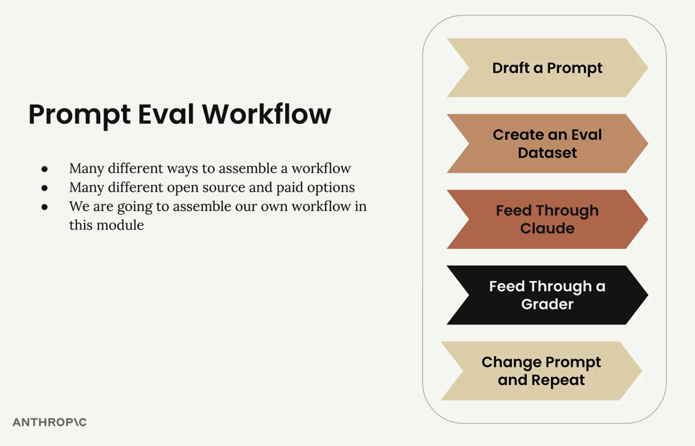<figcaption></figcaption></figure>

.

**Step 1: Draft a Prompt**

개선할 초기 프롬프트를 작성하는 것부터 시작. 이 예제에서는 간단한 프롬프트를 사용:

```python
prompt = f"""
Please answer the user's question:

{question}
"""
```

<figure>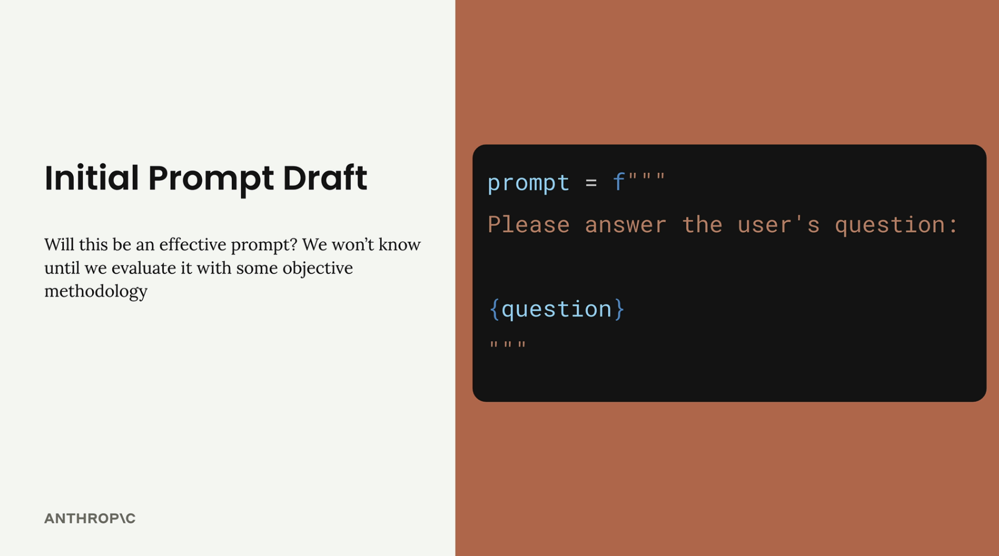<figcaption></figcaption></figure>

이 기본 프롬프트는 테스트 및 개선의 기준이 될 것입니다.

.

**Step 2: Create an Eval Dataset**

평가 데이터셋에는 프롬프트가 프로덕션에서 처리할 질문 또는 요청 유형을 나타내는 샘플 입력이 포함. 데이터셋에는 프롬프트 템플릿에 보간될 질문이 포함되어야 합니다.

<figure>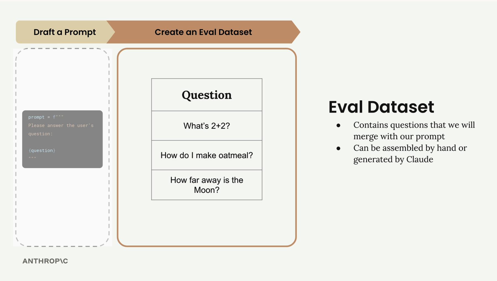<figcaption></figcaption></figure>

예를 들어, 데이터셋에는 세 가지 질문이 포함되어 있습니다:
- 2+2는 무엇인가요?
- 오트밀은 어떻게 만드나요?
- 달은 얼마나 멀리 있나요?

실제 평가에서는 수십, 수백, 심지어 수천 개의 레코드가 있을 수 있습니다. 이러한 데이터 세트를 수작업으로 조립하거나 클로드를 사용하여 생성할 수 있습니다.

.

**Step 3: Feed Through Claude**

데이터셋에서 각 질문을 가져와 프롬프트 템플릿과 병합하여 완전한 프롬프트를 만듭니다. 그런 다음 각 질문을 클로드에게 보내 응답을 얻습니다.

<figure>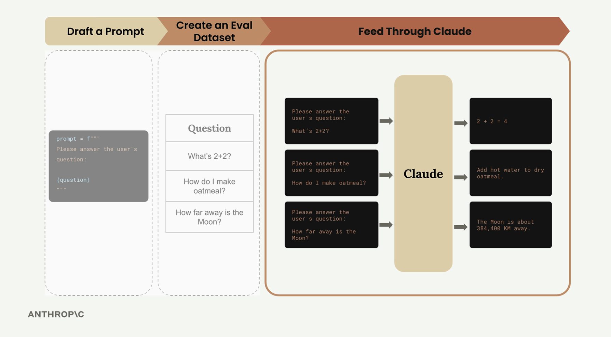<figcaption></figcaption></figure>

예를 들어, 첫 번째 질문은 다음과 같습니다:

```python
Please answer the user's question:
What's 2+2?
```

클로드는 수학 문제에 대해 "2 + 2 = 4"로 대답하고, 두 번째 질문에는 오트밀 요리 지침을 제공하며, 세 번째 질문에는 달까지의 거리를 제공할 수 있습니다.

.

**Step 4: Feed Through a Grader**

채점자는 원래 질문과 클로드의 답변을 모두 검토하여 클로드의 답변의 품질을 평가합니다. 이 단계는 일반적으로 1에서 10까지의 척도로 객관적인 점수를 제공하며, 10점은 완벽한 답변을 나타내고 점수가 낮을수록 개선의 여지가 있음을 나타냅니다.

<figure>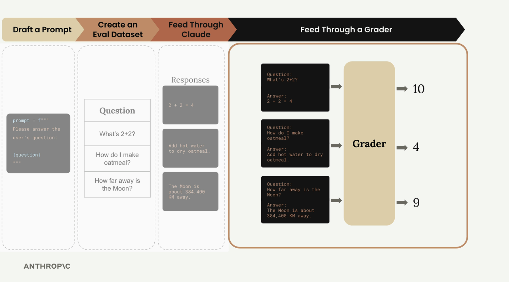<figcaption></figcaption></figure>

예시에서, 채점자는 다음을 할당할 수 있습니다:
- 수학 문제: 10 (완벽한 답)
- 오트밀 질문: 4 (개선 필요)
- 문 질문: 9 (매우 좋은 답변)

모든 질문의 평균 점수는 객관적인 측정을 제공합니다: (10 + 4 + 9) ÷ 3 = 7.66

.

**Step 5: Change Prompt and Repeat**

이제 기본 점수를 얻었으니 프롬프트를 수정하고 전체 프로세스를 다시 실행하여 변경 사항이 성능을 향상시키는지 확인할 수 있습니다.

<figure>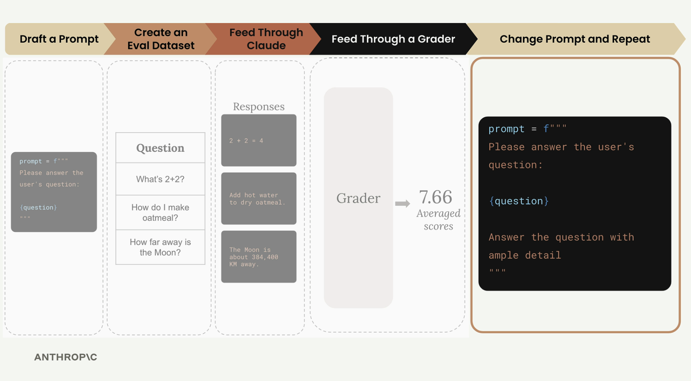<figcaption></figcaption></figure>

```python
prompt = f"""
Please answer the user's question:

{question}

Answer the question with ample detail
"""
```

예를 들어, 프롬프트에 더 많은 안내를 추가할 수 있습니다:

동일한 평가 과정을 통해 개선된 프롬프트를 실행한 후, 평균 점수가 8.7점 더 높아질 수 있으며, 이는 추가 지침이 클로드가 더 나은 응답을 제공하는 데 도움이 되었음을 나타냅니다.

.

**Prompt Scoring**

이 워크플로우의 주요 이점은 신속한 성능을 객관적으로 측정할 수 있다는 점
- 다양한 프롬프트 버전을 수치적으로 비교하기
- 가장 좋은 점수를 받은 버전 사용하기
- 더 나은 접근 방식을 찾기 위해 계속 반복하기

<figure>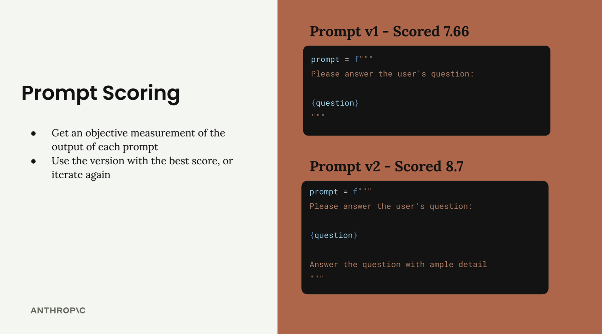<figcaption></figcaption></figure>

이 체계적인 접근 방식은 신속한 엔지니어링에서 추측을 제거하고, 당신의 변화가 단순한 다양한 변형이 아니라 오히려 개선된 것이라는 확신을 줍니다.

## Generating test datasets

사용자 지정 프롬프트 평가 워크플로우를 구축하는 것은 견고한 프롬프트를 만든 다음 테스트 데이터를 생성하여 얼마나 잘 작동하는지 확인하는 것으로 시작.  
사용자가 AWS 전용 코드를 작성하는 데 도움이 되는 프롬프트 평가 시스템을 설정하는 과정을 살펴보자.

.

**Setting Up the Goal**

프롬프트는 사용자가 AWS 사용 사례에 대한 세 가지 특정 유형의 출력을 작성하는 데 도움이 필요
- 파이썬 코드
- JSON 구성 파일
- 정규 표현식

핵심 요구 사항은 사용자가 작업에 대한 도움을 요청할 때 추가 설명, 헤더 또는 바닥글 없이 다음 형식 중 하나로 깨끗한 출력을 반환해야 한다는 것

<figure>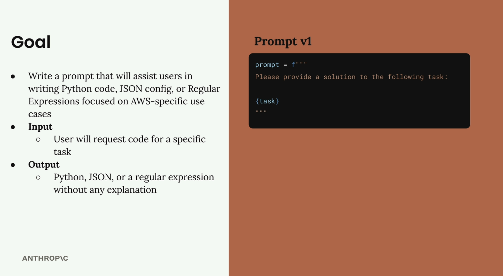<figcaption></figcaption></figure>

시작 프롬프트(버전 1)

```python
prompt = f"""
Please provide a solution to the following task:
{task}
"""
```

.

**Creating an Evaluation Dataset**

평가 데이터셋에는 프롬프트에 입력할 입력이 포함
- 프롬프트와 입력의 각 조합에 대해 프롬프트를 실행하고 결과를 분석

우리의 데이터셋은 JSON 객체들의 배열
- 각 객체는 Claude가 무엇을 성취하기를 원하는지 설명하는 "작업" 속성을 포함
- 우리는 이 데이터셋을 손으로 만들거나 Claude를 사용하여 자동으로 생성 가능

<figure>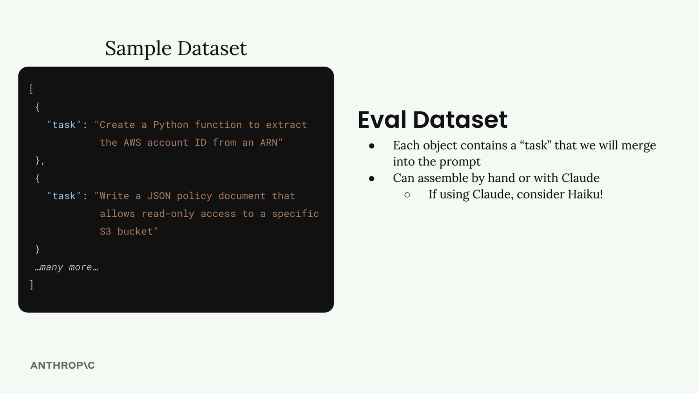<figcaption></figcaption></figure>

테스트 데이터를 생성하고 있기 때문에 전체 클로드 모델 대신 Haiku와 같은 더 빠른 모델을 사용할 수 있는 완벽한 기회

.

**Generating Test Data with Code**

테스트 데이터셋을 자동으로 생성하는 함수를 만들어 보자.  
먼저 클로드와 함께 작업하려면 도우미 함수가 필요:

```python
def add_user_message(messages, text):
    user_message = {"role": "user", "content": text}
    messages.append(user_message)

def add_assistant_message(messages, text):
    assistant_message = {"role": "assistant", "content": text}
    messages.append(assistant_message)

def chat(messages, system=None, temperature=1.0, stop_sequences=[]):
    params = {
        "model": model,
        "max_tokens": 1000,
        "messages": messages,
        "temperature": temperature
    }
    if system:
        params["system"] = system
    if stop_sequences:
        params["stop_sequences"] = stop_sequences
    
    response = client.messages.create(**params)
    return response.content[0].text
```

데이터셋 생성 함수 생성하기

```python
def generate_dataset():
    prompt = """
Generate an evaluation dataset for a prompt evaluation. The dataset will be used to evaluate prompts that generate Python, JSON, or Regex specifically for AWS-related tasks. Generate an array of JSON objects, each representing task that requires Python, JSON, or a Regex to complete.

Example output:
// ```json
[
  {
    "task": "Description of task",
  },
  ...additional
]
// ```

* Focus on tasks that can be solved by writing a single Python function, a single JSON object, or a single regex
* Focus on tasks that do not require writing much code

Please generate 3 objects.
"""
```

JSON 응답을 올바르게 구문 분석하려면 prefilling 및 중지 시퀀스를 사용

```python
messages = []
add_user_message(messages, prompt)
add_assistant_message(messages, "```json")
text = chat(messages, stop_sequences=["```"])
return json.loads(text)
```

.

**Testing the Dataset Generation**

기능을 실행하여 어떤 종류의 테스트 케이스가 나오는지 확인해 보자.

```python
dataset = generate_dataset()
print(dataset)
```

이렇게 하면 Python 함수, JSON 구성, AWS 전용 작업에 대한 정규 표현식 등 목표 출력을 다루는 세 가지 테스트 케이스가 반환

.

**Saving the Dataset**

데이터셋이 확보되면 나중에 평가 중에 쉽게 로드할 수 있도록 파일에 저장

```python
with open('dataset.json', 'w') as f:
    json.dump(dataset, f, indent=2)
```

이렇게 하면 노트북과 동일한 디렉토리에 `data.json` 파일이 생성되며, 신속한 평가를 위해 준비된 작업 목록이 포함

이 기반이 마련됨에 따라 이제 다양한 유형의 AWS 관련 코딩 작업에서 프롬프트가 얼마나 잘 수행되는지 평가하기 위한 테스트 데이터를 체계적으로 생성할 수 있게 되었습니다.

## Running the eval

이제 평가 데이터셋이 준비되었으니 핵심 평가 파이프라인을 구축할 차례
- 여기에는 각 테스트 케이스를 가져와 프롬프트와 병합한 다음, 클로드에게 공급, 그리고 결과를 채점하는 작업이 포함

<figure>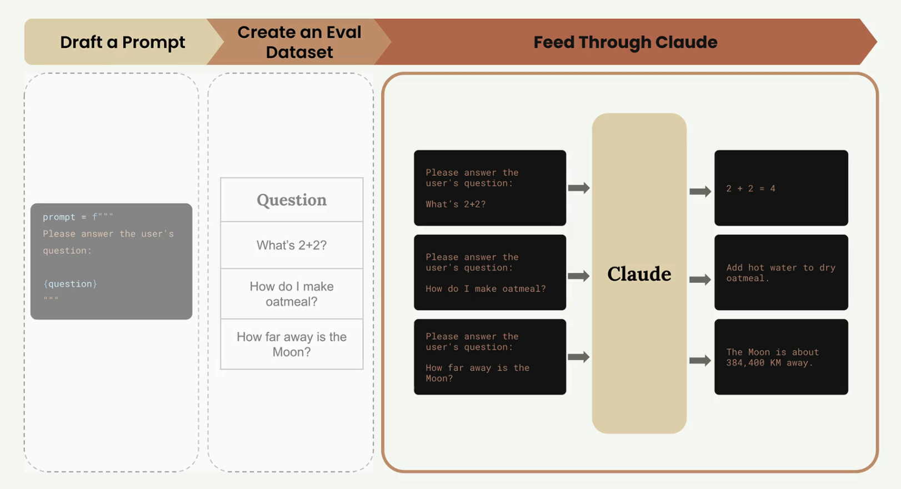<figcaption></figcaption></figure>

평가 과정은 명확한 워크플로우를 따릅니다: 
- 테스트 케이스 데이터셋을 가져와서 각 데이터셋을 프롬프트 템플릿과 결합한 다음 클로드에게 전송하여 처리
- 그 후, grader system을 사용하여 출력을 평가

.

**Building the Core Functions**

평가 파이프라인은 각각 특정 책임이 있는 세 가지 주요 기능으로 구성  
가장 간단한 기능인 개별 프롬프트를 처리하는 기능부터 시작해 보자.

.

**The `run_prompt` Function**

이 함수는 테스트 케이스를 가져와서 프롬프트 템플릿과 병합

```python
def run_prompt(test_case):
    """Merges the prompt and test case input, then returns the result"""
    prompt = f"""
Please solve the following task:

{test_case["task"]}
"""
    
    messages = []
    add_user_message(messages, prompt)
    output = chat(messages)
    return output
```

지금은 프롬프트를 매우 간단하게 유지하고 있습니다. 형식 지정 지침을 포함하지 않기 때문에 클로드는 필요 이상의 장황한 출력을 반환할 가능성이 높습니다. 이는 나중에 프롬프트 디자인을 반복하면서 개선할 것입니다.

.

**The `run_test_case` Function**

이 함수는 단일 테스트 케이스를 실행하고 결과를 평가하는 오케스트레이션을 수행

```python
def run_test_case(test_case):
    """Calls run_prompt, then grades the result"""
    output = run_prompt(test_case)
    
    # TODO - Grading
    score = 10
    
    return {
        "output": output,
        "test_case": test_case,
        "score": score
    }
```

현재로서는 하드코딩된 10점을 사용하고 있습니다.  
채점 논리는 다가오는 섹션에서 상당한 시간을 할애할 수 있지만, 이 `placeholder`를 통해 전체 파이프라인을 테스트할 수 있습니다.

.

**The `run_eval` Function**

이 기능은 전체 평가 과정을 조정합니다:

```python
def run_eval(dataset):
    """Loads the dataset and calls run_test_case with each case"""
    results = []
    
    for test_case in dataset:
        result = run_test_case(test_case)
        results.append(result)
    
    return results
```

이 기능은 데이터셋의 모든 테스트 케이스를 처리하고 모든 결과를 하나의 목록으로 수집합니다.

.

**Running the Evaluation**

평가 파이프라인을 실행하기 위해 데이터셋을 로드하고 함수를 통해 실행합니다:

```python
with open("dataset.json", "r") as f:
    dataset = json.load(f)

results = run_eval(dataset)
```

처음 실행할 때는 클로드 하이쿠를 사용하더라도 전체 데이터 세트를 처리하는 데 약 30초 정도 걸릴 수 있습니다. 최적화 기법에 대해서는 나중에 설명하겠습니다.

.

**Examining the Results**

평가는 각 객체가 하나의 테스트 사례 결과를 나타내는 구조화된 JSON 배열을 반환합니다:

<figure>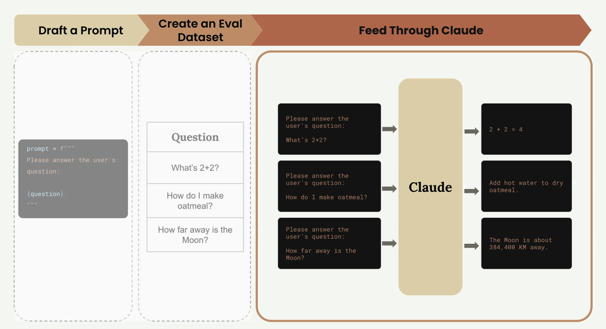<figcaption></figcaption></figure>

각 결과에는 세 가지 주요 정보가 포함되어 있습니다:

- output: 클로드의 완전한 응답
- test_case: 처리된 원래 테스트 케이스
- score: 평가 점수(현재 하드코딩됨)

출력에서 볼 수 있듯이 클로드는 아직 구체적인 형식 지정 지침을 제공하지 않았기 때문에 매우 장황한 응답을 생성합니다. 프롬프트를 세분화하면서 바로 이런 종류의 문제를 다룰 것입니다.

<figure>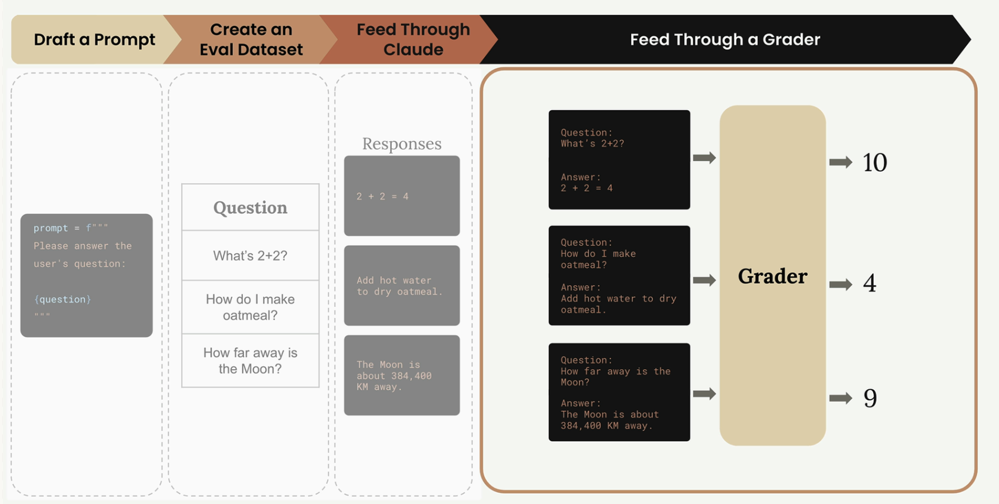<figcaption></figcaption></figure>

.

**What We've Accomplished**

이 시점에서 우리는 **핵심 평가 파이프라인**을 성공적으로 구축했습니다.  
데이터셋을 가져와 클로드를 통해 처리하고 구조화된 결과를 수집할 수 있습니다. 가장 중요한 누락된 부분은 채점 시스템으로, 하드코딩된 10점을 실제 평가 논리로 대체해야 한다는 점입니다.

이 파이프라인은 대부분의 **AI 평가 시스템의 기초**를 나타냅니다. 간단해 보일 수 있지만, 평가 파이프라인이 실제로 수행하는 대부분의 작업을 이제 막 구축한 것입니다. 복잡성은 더 나은 프롬프트, 정교한 채점, 성능 최적화 등 세부 사항에서 비롯됩니다.

다음으로, 우리는 학생들의 중요한 주제에 대해 자세히 다룰 것입니다. 이 주제는 우리의 **하드코딩된 점수를 클로드의 성과에 대한 의미 있는 평가로 변환**할 것입니다.

## Model based grading

신속한 평가 워크플로우를 구축할 때, 채점 시스템은 출력 품질에 대한 객관적인 신호를 제공합니다. 채점자는 모델 출력을 받아 측정 가능한 피드백(일반적으로 1 ~ 10 사이의 숫자)을 반환합니다. 여기서 10은 높은 품질을, 1은 낮은 품질을 나타냅니다.

### Types of Graders

<figure>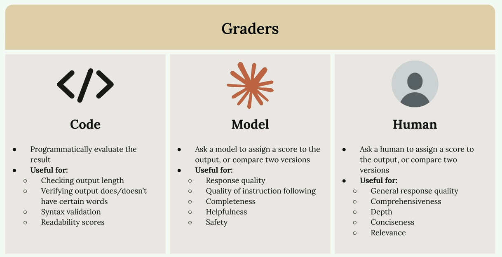<figcaption></figcaption></figure>

모델 출력을 평가하는 데는 세 가지 주요 접근 방식이 있습니다:
- `Code graders`: 맞춤형 논리를 사용하여 출력을 프로그래밍적으로 평가
- `Model graders`: 다른 AI 모델을 사용하여 품질을 평가
- `Human graders`: 사람들이 수동으로 결과물을 검토하고 채점

#### Code graders

Code graders를 사용하면 상상할 수 있는 모든 프로그래밍 검사를 구현할 수 있습니다. 일반적인 용도는 다음과 같습니다:
- 출력 길이 확인
- 출력에 특정 단어가 있는지 확인하기
- JSON, Python 또는 regex에 대한 구문 검증
- 가독성 점수

유일한 요구 사항은 코드가 사용 가능한 신호(보통 1 ~ 10 사이의 숫자)를 반환하는 것입니다.

#### Model Graders

Model Graders는 원본 출력물 평가를 위한 또 다른 API 호출에 입력합니다. 이 접근 방식은 평가에 엄청난 유연성을 제공합니다:
- 응답 품질
- 교육 품질 팔로우
- 완전성
- 유용성
- 안전

#### Human Graders

Human Graders는 유연성을 가장 많이 제공하지만 시간이 많이 걸리고 지루합니다. 평가하는 데 유용합니다:
- 일반 응답 품질
- 포괄성
- 깊이
- 간결함
- 관련성

### Defining Evaluation Criteria

<figure>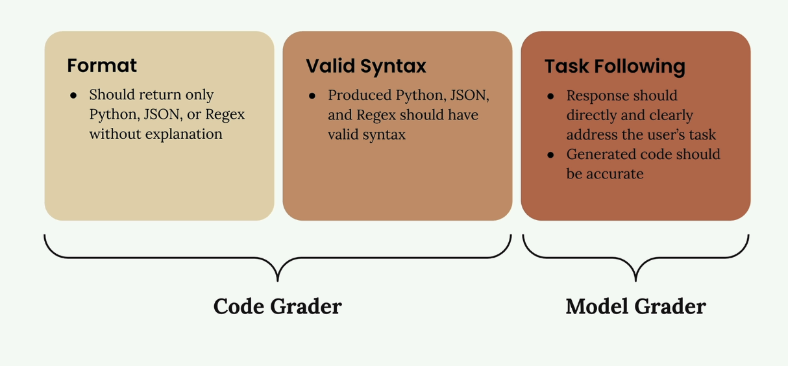<figcaption></figcaption></figure>

채점기를 구현하기 전에 명확한 평가 기준이 필요합니다. 코드 생성 프롬프트를 보려면 다음에 집중할 수 있습니다:
- `Format`: 설명 없이 Python, JSON 또는 Regex만 반환해야 합니다
- `Valid Syntax`: 생성된 코드는 유효한 구문을 가져야 합니다
- `Task Following`: 응답은 사용자의 작업을 정확한 코드로 직접 처리해야 합니다

처음 두 가지 기준은 `Code graders`와 잘 작동하며, Task Following는 유연성 덕분에 `Model Graders`에게 더 적합합니다.

### Implementing a Model Grader

`Model Grader` 함수를 만드는 방법

```python
def grade_by_model(test_case, output):
    # Create evaluation prompt
    eval_prompt = """
    You are an expert code reviewer. Evaluate this AI-generated solution.
    
    Task: {task}
    Solution: {solution}
    
    Provide your evaluation as a structured JSON object with:
    - "strengths": An array of 1-3 key strengths
    - "weaknesses": An array of 1-3 key areas for improvement  
    - "reasoning": A concise explanation of your assessment
    - "score": A number between 1-10
    """
    
    messages = []
    add_user_message(messages, eval_prompt)
    add_assistant_message(messages, "```json")
    
    eval_text = chat(messages, stop_sequences=["```"])
    return json.loads(eval_text)
```

핵심 인사이트는 점수와 함께 강점, 약점, 추론을 묻는 것입니다. 이러한 맥락이 없으면 모델은 기본적으로 6점 내외의 중간 점수를 받는 경향이 있습니다.

### Integrating Grading into Your Workflow

```python
def run_test_case(test_case):
    output = run_prompt(test_case)
    
    # Grade the output
    model_grade = grade_by_model(test_case, output)
    score = model_grade["score"]
    reasoning = model_grade["reasoning"]
    
    return {
        "output": output, 
        "test_case": test_case, 
        "score": score,
        "reasoning": reasoning
    }
```

마지막으로, 모든 시험 사례에서 평균 점수를 계산합니다:

```python
from statistics import mean

def run_eval(dataset):
    results = []
    
    for test_case in dataset:
        result = run_test_case(test_case)
        results.append(result)
    
    average_score = mean([result["score"] for result in results])
    print(f"Average score: {average_score}")
    
    return results
```

이렇게 하면 프롬프트를 반복하면서 추적할 수 있는 객관적인 지표가 제공됩니다. `Model Graders`은 다소 변덕스러울 수 있지만 개선 사항을 측정하기 위한 일관된 기준선을 제공합니다.

## Code based grading

코드를 생성하는 AI 모델을 평가할 때는 단순히 응답이 의미가 있는지 확인하는 것 이상의 것이 필요합니다. 또한 생성된 코드가 실제로 유효한 구문을 가지고 올바른 형식을 따르고 있는지 확인해야 합니다. 여기서 코드 기반 등급이 적용됩니다.

### How Code Grading Works