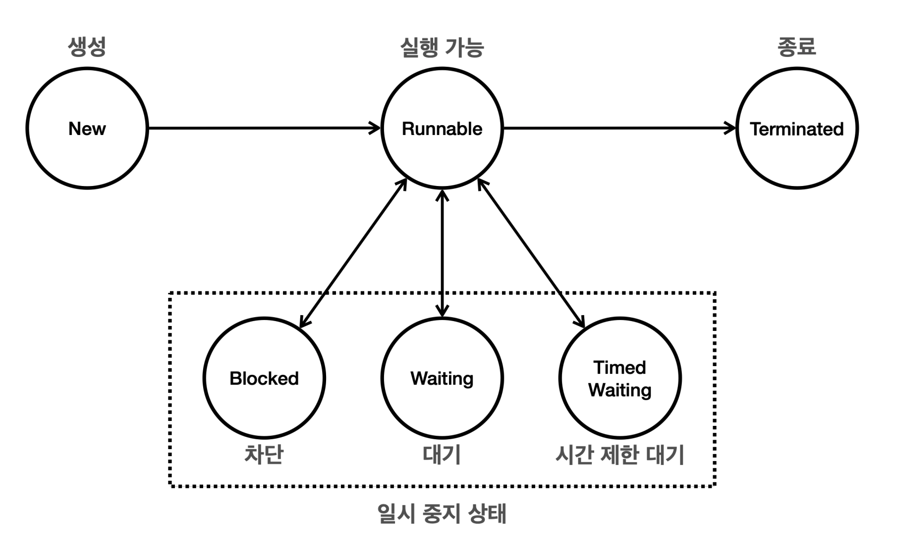

# Multi-Thread And Concurrency

영한님의 [김영한의 실전 자바 - 고급 1편, 멀티스레드와 동시성](https://www.inflearn.com/course/%EA%B9%80%EC%98%81%ED%95%9C%EC%9D%98-%EC%8B%A4%EC%A0%84-%EC%9E%90%EB%B0%94-%EA%B3%A0%EA%B8%89-1/dashboard) 강의를 요약한 내용입니다.

## Process And Thread

### 멀티태스킹과 멀티프로세싱

**프로그램 실행**

> 프로그램을 구성하는 코드를 순서대로 CPU에서 연산(실행)하는 일

- CPU 코어가 하나일 경우, 한 번에 하나의 프로그램 코드만 실행
- 이를 해결하기 위해 하나의 CPU 코어로 여러 프로그램을 동시에 실행하는 `Multitasking` 기술 등장

#### ℹ️ Multitasking

> 하나의 컴퓨터 시스템이 동시에 여러 작업을 수행하는 능력
  - 운영체제가 스케줄링을 수행하고, CPU를 최대한 사용하면서 작업이 골고루 수행될 수
있게 최적화
- 현대의 CPU는 초당 수십억 번 이상의 연산을 수행
  - CPU가 매우 빠르게 두 프로그램의 코드를 번갈아 수행한다면, 사람이 느낄 때 두 프로그램이 동시에 실행되는 것처럼 느껴짐
  - 시분할(Time Sharing) 기법: 프로그램의 실행 시간을 분할해서 마치 동시에 실행되는 것 처럼 하는 기법

...

#### ℹ️ Multiprocessing

> 컴퓨터 시스템에서 둘 이상의 프로세서(CPU Core)를 사용하여 여러 작업을 동시에 처리하는 기술

- 하나의 CPU 안에 보통 2개 이상의 코어
- 멀티프로세싱 시스템은 하나의 CPU 코어만을 사용하는 시스템보다 동시에 더 많은 작업
을 처리

**Multiprocessing VS. Multitasking**

|Multiprocessing|Multitasking|
|---|---|
|여러 CPU(여러 CPU 코어)를 사용하여 동시에 여러 작업을 수행하는 것을 의미|단일 CPU(단일 CPU 코어)가 여러 작업을 동시에 수행하는 것처럼 보이게 하는 것|
|하드웨어 기반으로 성능을 향상|소프트웨어 기반으로 CPU 시간을 분할하여 각 작업에 할당|
|다중 코어 프로세서를 사용하는 현대 컴퓨터 시스템| 현대 운영 체제에서 여러 애플리케이션이 동시에 실행되는 환경|

---

### 프로세스와 스레드

#### ℹ️ Proccess

> 운영체제 안에서 실행중인 프로그램

- 프로세스는 실행 중인 프로그램의 인스턴스
  - 각 프로세스는 독립적인 메모리 공간을 갖고 있으며, 운영체제에서 별도의 작업 단위로 분리해서 관리
  - 프로세스가 서로의 메모리에 직접 접근/간섭할 수 없다
- 자바 언어로 비유를 하자면 클래스는 프로그램이고, 인스턴스는 프로세스

**프로세스의 메모리 구성**
- Code Section: 실행할 프로그램의 코드가 저장되는 부분
- Data Section: 전역 변수 및 정적 변수가 저장되는 부분
- Heap: 동적으로 할당되는 메모리 영역
- Stack: 메서드(함수) 호출 시 생성되는 지역 변수와 반환 주소가 저장되는 영역(스레드에 포함)

...

#### ℹ️ Thread

> 프로세스 내에서 실행되는 작업의 단위

- 프로세스는 하나 이상의 스레드를 반드시 포함
  - 한 프로세스 내에서 여러 스레드가 존재할 수 있으며, 이들은 프로세스가 제공하는 동일한 메모리 공간을 공유(단일 스레드, 멀티 스레드)
  - 프로세스보다 단순하므로 생성 및 관리가 단순하고 가볍
- 하나의 프로그램도 그 안에서 동시에 여러 작업이 필요하므로 멀티스레드가 필요

**메모리 구성**
- 공유 메모리: 같은 프로세스의 코드 섹션, 데이터 섹션, 힙(메모리)은 프로세스 안의 모든 스레드가 공유
- 개별 스택: 각 스레드는 자신의 스택을 보유

`프로세스`는 실행 환경과 자원을 제공하는 컨테이너 역할, `스레드`는 CPU를 사용해서 코드를 하나하나 실행하는 역할

---

### 스레드와 스케줄링

**단일 코어 스케줄링**
- 운영체제는 내부에 스케줄링 큐를 가지고 있고, 각 스레드는 스케줄링 큐에서 대기
- 각 스레드는 번갈아가면서 코드를 실행

**멀티 코어 스케줄링**
- CPU 코어가 2개 이상이면 한 번에 더 많은 스레드를 물리적으로 동시에 실행

**프로세스, 스레드와 스케줄링**
- 멀티태스킹과 스케줄링
  - `멀티태스킹`은 동시에 여러 작업을 수행하는 것을 의미
  - 이를 위해 운영체제는 `스케줄링`이라는 기법을 사용
  - `스케줄링`은 CPU 시간을 여러 작업에 나누어 배분하는 방법
- 프로세스와 스레드
  - `프로세스`는 실행 중인 프로그램의 인스턴스
    - 각 프로세스는 독립적인 메모리 공간을 가지며, 운영체제에서 독립된 실행 단위로 취급
  - `스레드`는 프로세스 내에서 실행되는 작은 단위
    - 여러 스레드는 하나의 프로세스 내에서 자원을 공유하며, 프로세스의 코드, 데이터, 시스템 자원등을 공유
    - 실제로 CPU에 의해 실행되는 단위는 스레드
- 프로세스의 역할
  - `프로세스`는 실행 환경(컨테이너 역할)을 제공
    - 메모리 공간, 파일 핸들, 시스템 자원(네트워크 연결) 등이 포함
  - 프로세스 자체는 운영체제의 스케줄러에 의해 직접 실행되지 않으며, **프로세스 내의 스레드가 실행**
    - 1개의 프로세스 안에 하나의 스레드만 실행되는 경우도 있고, 여러 스레드가 실행되는 경우도 존재

---

### 컨텍스트 스위칭

**컨텍스트 스위칭(context switching)**
- 스레드A를 멈추는 시점에 CPU에서 사용하던 값들을 메모리에 저장해두어야 한다. 
- 그리고 이후에 스레드A를 다시 실행할 때 이 값들을 CPU에 다시 불러오는 과정

**멀티스레드는 대부분 효율적이지만, 컨텍스트 스위칭 과정이 필요하므로 항상 효율적인 것은 아니다**
- 현재 작업하는 문맥이 변하기 때문에 컨텍스트(현재 작업하는 문맥) 스위칭
  - 컨텍스트 스위칭 과정에서 이전에 실행 중인 값을 메모리에 잠깐 저장하고,
  - 이후에 다시 실행하는 시점에 저장한 값을 CPU에 다시 불러와야 한다.
- 컨텍스트 스위칭 과정에는 약간의 비용이 발생
  - 연산 시간 + 컨텍스트 스위칭 시간
- 실제로 컨텍스트 스위칭에 걸리는 시간은 아주 짧지만 스레드가 매우 많다면 이 비용이 커질 수 있음

**CPU와 스레드의 관계**

```text
CPU 4개 / 스레드 2개
스레드의 숫자가 너무 적으면 모든 CPU를 100% 다 활용할 수 없지만, 
스레드가 몇 개 없으므로 컨텍스트 스위칭 비용이 줄어든다.

CPU 4개 / 스레드 100개
스레드의 숫자가 너무 많으면 CPU를 100% 다 활용할 수 있지만 컨텍스트 스위칭 비용이 늘어난다.

CPU 4개 / 스레드 4개
스레드의 숫자를 CPU의 숫자에 맞춘다면 CPU를 100% 활용할 수 있고, 컨텍스트 스위칭 비용도 자주 발생하지 않기 때문에 최적의 상태가 된다. 
이상적으로는 CPU 코어 수 + 1개 정도로 스레드를 맞추면 특정 스레드가 잠시 대기할 때 남은 스레드를 활용할 수 있다.
```

**CPU 바운드 작업 vs I/O 바운드 작업**

각 스레드가 하는 작업은 크게 2가지로 구분

- `CPU-bound tasks`
  - CPU의 연산 능력을 많이 요구하는 작업을 의미
  - 계산, 데이터 처리, 알고리즘 실행 등 CPU의 처리 속도가 작업 완료 시간을 결정
  - ex. 복잡한 수학 연산, 데이터 분석, 비디오 인코딩, 과학적 시뮬레이션 등.
- `I/O-bound tasks`
  - 디스크, 네트워크, 파일 시스템 등과 같은 입출력(I/O) 작업을 많이 요구하는 작업
  - I/O 작업이 완료될 때까지 대기 시간이 많이 발생하며, CPU는 상대적으로 유휴(대기) 상태에 있는 경우가 많음(스레드가 CPU를 사용하지 않고 I/O 작업이 완료될 때 까지 대기)
  - ex. 데이터베이스 쿼리 처리, 파일 읽기/쓰기, 네트워크 통신, 사용자 입력 처리 등.

**스레드 설정**

스레드의 숫자는 CPU-바운드 작업이 많은지, I/O-바운드 작업이 많은지에 따라 다르게 설정이 필요

- `CPU-bound tasks`: CPU 코어 수 + 1개
  - CPU를 거의 100% 사용하는 작업이므로 스레드를 CPU 숫자에 최적화
- `I/O-bound tasks`: CPU 코어 수 보다 많은 스레드를 생성(CPU를 최대한 사용할 수 있는 숫자까지 스레드 생성)
  - CPU를 많이 사용하지 않으므로 성능 테스트를 통해 CPU를 최대한 활용하는 숫자까지 스레드 생성
  - 단, 너무 많은 스레드를 생성하면 컨텍스트 스위칭 비용도 함께 증가하므로 적절한 성능 테스트 필요

> 웹 애플리케이션 서버라도 상황에 따라 CPU 바운드 작업이 많을 수 있다. 
> 
> 이 경우 CPU-바운드 작업에 최적화된 CPU 숫자를 고려

---

## Thread creation and execution

### 자바 메모리 구조

<figure><figcaption></figcaption></figure>

**메서드 영역(Method Area)**
- 메서드 영역은 프로그램을 실행하는데 필요한 공통 데이터를 관리하고, 프로그램의 모든 영역에서 공유
  - 클래스 정보: 클래스의 실행 코드(바이트 코드), 필드, 메서드와 생성자 코드등 모든 실행 코드 존재
  - static 영역: static 변수들을 보관
  - 런타임 상수 풀: 프로그램을 실행하는데 필요한 공통 리터럴 상수를 보관

**스택 영역(Stack Area)**
- 자바 실행 시, 하나의 실행 스택이 생성되고, 각 스택 프레임은 지역 변수, 중간 연산 결과, 메서드 호출 정보 등을 포함
  - 스택 프레임: 스택 영역에 쌓이는 네모 박스가 하나의 스택 프레임. 메서드를 호출할 때 마다 하나의 스택 프레임이 쌓이고, 메서드가 종료되면 해당 스택 프레임이 제거
- 스택 영역은 더 정확히 각 스레드별로 하나의 실행 스택이 생성. 따라서 스레드 수 만큼 스택이 생성

**힙 영역(Heap Area)**
- 객체(인스턴스)와 배열이 생성되는 영역이다
- 가비지 컬렉션(GC)이 이루어지는 주요 영역이며, 더 이상 참조되지 않는 객체는 GC에 의해 제거

---

### extends Thread 

Thread 클래스를 상속 받거나 Runnable 인터페이스를 구현하여 스레드를 생성

[thread start](https://github.com/jihunparkme/inflearn-java-adv1/commit/31e406b4aadea4f26bccb23ab966e4dbec8acea9)

**Thread.start()**
- 스레드 실행 메서드
- HelloThread 스레드가 별도의 스레드에서 run() 메서드를 실행
- main 스레드는 start() 메서드를 통해 Thread-n 스레드에게 실행을 지시
  - main 스레드가 run() 을 호출할 경우 별도의 스레드가 아닌 main 스레드에서 직접 실행

> 스레드는 순서와 실행 기간을 모두 보장하지 않는다.

---

### Daemon Thread

스레드는 User Thread, Daemon Thread 2가지 종류로 구분

**User Thread(non-daemon Thread)**
- 프로그램의 주요 작업을 수행
- 작업이 완료될 때까지 실행
- 모든 user thread가 종료되면 JVM도 종료

**Daemon Thread**
- 백그라운드에서 보조적인 작업을 수행
- 모든 user thread가 종료되면 daemon thread는 자동으로 종료

[Daemon Thread](https://github.com/jihunparkme/inflearn-java-adv1/commit/405718ae09ebcca5a0d1cfd847ded0a704539c60)

---

### implements Runnable

실무에서는 보통 Runnable을 구현하는 방식으로 사용
- 실행 결과는 기존과 동일
- 스레드와 해당 스레드가 실행할 작업이 서로 분리되어 있다는 차이
  - 스레드 객체를 생성할 때, 실행할 작업을 생성자로 전달

[Runnable Thread](https://github.com/jihunparkme/inflearn-java-adv1/commit/4ae155fbcf9f167f2a78ae78ea6d58080385392a)

**Thread 클래스 상속 방식**

`장점`
- 간단한 구현: Thread 클래스를 상속받아 run() 메서드만 재정의

`단점`
- 상속의 제한: 자바는 단일 상속만을 허용
- 유연성 부족: 인터페이스를 사용하는 방법에 비해 유연성 감소

**Runnable 인터페이스를 구현 방식**

`장점`
- 상속의 자유로움: 다른 클래스를 상속받아도 문제없이 구현 가능
- 코드의 분리: 스레드와 실행할 작업을 분리하여 코드의 가독성을 향상
- 여러 스레드가 동일한 Runnable 객체를 공유할 수 있어 자원 관리에 효율적

`단점`
- 코드가 약간 복잡: Runnable 객체를 생성하고 이를 Thread 에 전달하는 과정이 추가

> Runnable 인터페이스를 구현하는 방식을 사용하자. 
> 
> 스레드와 실행할 작업을 명확히 분리하고, 인터페이스를 사용하므로 Thread 클래스를 직접 상속하는 방식보다 더 유연하고 유지보수 하기 쉬운 코드를 만들 수 있다.

---

## 스레드 제어와 생명 주기

### 스레드의 기본 정보

Thread 클래스는 스레드를 생성하고 관리하는 기능을 제공

[스레드 기본 정보](https://github.com/jihunparkme/inflearn-java-adv1/commit/a9f10d6a2300c16db2c14105da715663586943a6)

```java
/** main Thread */
Thread mainThread = Thread.currentThread();
/**
 * Thread[#1,main,5,main]
 * [threadId, threadName, threadPriority, threadGroup]
 */
log("mainThread = " + mainThread);
/**
 * 1
 * 스레드의 고유 식별자를 반환하는 메서드(각 스레드에 대해 유일한 ID) -> ID는 스레드가 생성될 때 할당되며, 직접 지정할 수 없다
 */
log("mainThread.threadId() = " + mainThread.threadId());
/**
 * main
 * 스레드의 이름을 반환하는 메서드
 * 스레드 ID는 중복되지 않지만, 스레드 이름은 중복될 수 있다.
 */
log("mainThread.getName() = " + mainThread.getName());
/**
 * 5
 * 스레드의 우선순위를 반환하는 메서드
 * 우선순위는 1(가장 낮음)에서 10(가장 높음)까지의 값으로 설정할 수 있으며, 기본값은 5
 * setPriority() 메서드를 사용해서 우선순위를 변경 가능
 * 우선순위는 스레드 스케줄러가 어떤 스레드를 우선 실행할지 결정하는 데 사용. 하지만 실제 실행 순서는 JVM 구현과 운영체제에 따라 달라질 수 있다.
 */
log("mainThread.getPriority() = " + mainThread.getPriority());
/**
 * java.lang.ThreadGroup[name=main,maxpri=10]
 * 스레드가 속한 스레드 그룹을 반환하는 메서드
 * 스레드 그룹은 스레드를 그룹화하여 관리할 수 있는 기능을 제공
 * 기본적으로 모든 스레드는 부모 스레드와 동일한 스레드 그룹에 속함
 * 스레드 그룹은 여러 스레드를 하나의 그룹으로 묶어서 특정 작업(예: 일괄 종료, 우선순위 설정 등)을 수행 가능
 * 
 * 부모 스레드(Parent Thread)
 * 새로운 스레드를 생성하는 스레드를 의미
 * 스레드는 기본적으로 다른 스레드에 의해 생성. 이러한 생성 관계에서 새로 생성된 스레드는 생성한 스레드를 부모로 간주
 */
log("mainThread.getThreadGroup() = " + mainThread.getThreadGroup());
/**
 * RUNNABLE
 * 스레드의 현재 상태를 반환하는 메서드
 * 반환되는 값은 Thread.State 열거형에 정의된 상수 중 하나
 * - NEW: 스레드가 아직 시작되지 않은 상태
 * - RUNNABLE: 스레드가 실행 중이거나 실행될 준비가 된 상태
 * - WAITING: 스레드가 다른 스레드의 특정 작업이 완료되기를 기다리는 상태
 * - TIMED_WAITING: 일정 시간 동안 기다리는 상태
 * - BLOCKED: 스레드가 동기화 락을 기다리는 상태이
 * - TERMINATED: 스레드가 실행을 마친 상태
 */
log("mainThread.getState() = " + mainThread.getState());
```

---

### 스레드의 생명 주기

**스레드는 생성하고 시작하고, 종료되는 생명주기를 가진다.**

<figure><figcaption></figcaption></figure>

**ℹ️ New (새로운 상태)**
- 스레드가 생성되고 아직 시작되지 않은 상태
- Thread 객체가 생성되었지만 start() 메서드가 호출되지 않은 상태
- `Thread thread = new Thread(runnable);`

**ℹ️ Runnable (실행 가능 상태)**
- 스레드가 실행될 준비가 되어 CPU에서 실행될 수 있는 상태
  - `thread.start()` 메서드가 호출되면 스레드는 Runnable 상태로 전이
- Runnable 상태에 있는 모든 스레드가 동시에 실행되는 것은 아니다.
  - 운영체제의 스케줄러가 각 스레드에 CPU 시간을 할당하여 실행하기 때문에, 
  - Runnable 상태에 있는 스레드는 스케줄러의 실행 대기열에 포함되어 있다가 차례로 CPU에서 실행
- 운영체제 스케줄러의 실행 대기열에 있든, CPU에서 실제 실행되고 있든 모두 RUNNABLE 상태
  - 자바에서 둘을 구분해서 확인할 수 없어서 보통 실행 상태라고 부름

**ℹ️ Blocked (차단 상태)**
- 스레드가 다른 스레드에 의해 동기화 락을 얻기 위해 기다리는 상태
  - synchronized 블록에 진입하기 위해 락을 얻어야 하는 경우

**ℹ️ Waiting (대기 상태)**
- 스레드가 다른 스레드의 특정 작업이 완료되기를 무기한 기다리는 상태
  - `wait()`, `join()` 메서드가 호출될 때 Waiting 상태로 전이
- 다른 스레드가 `notify()` or `notifyAll()` 메서드를 호출하거나, `join()` 이 완료될 때까지 대기

**ℹ️ Timed Waiting (시간 제한 대기 상태)**
- 스레드가 특정 시간 동안 다른 스레드의 작업이 완료되기를 기다리는 상태
  - `sleep(long millis)`, `wait(long timeout)`, `join(long millis)` 메서드가 호출될 때 Timed Waiting 상태로 전이
- 주어진 시간이 경과하거나 다른 스레드가 해당 스레드를 깨우면 이 상태에서 벗어남

**ℹ️ Terminated (종료 상태)**
- 스레드의 실행이 완료된 상태
  - 스레드가 정상적으로 종료되거나, 예외가 발생하여 종료된 경우 Terminated 상태로 전이
- 스레드는 한 번 종료되면 다시 시작할 수 없음

```java
public static void main(String[] args) throws InterruptedException {
    Thread thread = new Thread(new MyRunnable(), "myThread");
    log("myThread.state1 = " + thread.getState()); // (1) NEW

    log("myThread.start()");
    thread.start();
    Thread.sleep(1000);

    log("myThread.state3 = " + thread.getState()); // (3) TIMED_WAITING (Thread.sleep())
    Thread.sleep(4000);

    log("myThread.state5 = " + thread.getState()); // (5) TERMINATED
    log("end");
}

static class MyRunnable implements Runnable {
    public void run() {
        try {
            log("start");
            log("myThread.state2 = " + Thread.currentThread().getState()); // (2) RUNNABLE

            log("sleep() start");
            Thread.sleep(3000);
            log("sleep() end");

            log("myThread.state4 = " + Thread.currentThread().getState()); // (4) RUNNABLE
            log("end");
        } catch (InterruptedException e) {
            throw new RuntimeException(e);
        }
    }
}
```

**참고. 자바에서 메서드 재정의 시, 재정의 메서드가 지켜야할 예외와 관련된 규칙**
- 체크 예외
  - 부모 메서드가 체크 예외를 던지지 않는 경우, 재정의된 자식 메서드도 체크 예외를 던질 수 없음
  - 자식 메서드는 부모 메서드가 던질 수 있는 체크 예외의 하위 타입만 던질 수 있음
- 언체크(런타임) 예외
  - 예외 처리를 강제하지 않으므로 상관없이 던질 수 있음

> run() 메서드는 체크 예외를 던질 수 없도록 강제하여 프로그램이 비정상 종료되는 상황을 방지
> 
> 멀티 스레딩 환경에서 예외 처리를 강제함으로써 스레드의 안정성과 일관성을 유지
>
> 최근에는 체크 예외보다는 언체크 예외를 선호

...

#### ℹ️ Join

[join이 필요한 상황](https://github.com/jihunparkme/inflearn-java-adv1/commit/8e8510bb33ad9056e902588d24a9c71b7fe186eb)
- 기대와 다르게 두 결과 모두 0이 나온다.

[join 사용](https://github.com/jihunparkme/inflearn-java-adv1/commit/2c21b02a50957803c6a4fb4d5415f2560045203d)

**Waiting (대기 상태)**
- 스레드가 다른 스레드의 특정 작업이 완료되기를 무기한 기다리는 상태
- `join()`을 호출하는 스레드는 대상 스레드가 `TERMINATED` 상태가 될 때 까지 대기
  - 대상 스레드가 `TERMINATED` 상태가 되면 호출 스레드는 다시 `RUNNABLE` 상태가 되면서 다음 코드를 수행

> 특정 스레드가 완료될 때 까지 기다려야 하는 상황이라면 join() 을 사용하자.

다른 스레드의 작업을 일정 시간 동안만 기다릴 경우
- `join()` : 호출 스레드는 대상 스레드가 완료될 때 까지 무한정 대기
- `join(ms)` : 호출 스레드는 특정 시간 만큼만 대기
  - 호출 스레드는 지정한 시간이 지나면 다시 RUNNABLE 상태가 되면서 다음 코드를 수행

...

#### ℹ️ Interrupt

> 인터럽트를 사용하면 `WAITING`, `TIMED_WAITING` 같은 대기 상태의 스레드를 직접 깨워서, 
> 
> 작동하는 `RUNNABLE` 상태로 만들 수 있다.

스레드가 인터럽트 상태일 때
- InterruptedException 을 던지는 메서드(ex. Thread.sleep())를 호출하거나
- 이미 위 메서드를 호출하고 대기중이라면 InterruptedException 발생

`Thread.currentThread().isInterrupted()`
- 스레드의 인터럽트 상태를 단순히 확인

`Thread.interrupted()`
- 인터럽트를 직접 체크해서 사용할 경우 
  - 스레드가 인터럽트 상태일 경우, `true 반환` 후 해당 스레드의 인터럽트 `상태를 false 로 변경`
  - 스레드가 인터럽트 상태가 아닐 경우, `false 반환` 후 해당 스레드의 인터럽트 상태를 변경하지 않음

[thread.interrupted()](https://github.com/jihunparkme/inflearn-java-adv1/commit/548ac91a4139c64305c55db64f1640c33cb708d9)

> 인터럽트 예외가 발생하고, 스레드의 인터럽트 상태를 정상(false)으로 돌리지 않으면, 이후에도 계속 인터럽트가 발생
>
> 그러므로, 자바에서 인터럽트 예외가 발생하거나 인터럽트의 목적을 달성하면, 스레드의 인터럽트 상태를 다시 정상(false)으로 돌린다.
> - InterruptedException
> - Thread.interrupted()

**프린터 예제**
- [시작](https://github.com/jihunparkme/inflearn-java-adv1/commit/59710931eb9b510d05569e802955903f9605dce1)
  - 종료 입력 시 바로 반응하지 않는 문제
- [인터럽트 도입](https://github.com/jihunparkme/inflearn-java-adv1/commit/616c32471b088f05e6be540f84a8dc43fe229c15)
  - 종료(q)를 입력하면 즉시 종료
- [인터럽트 개선](https://github.com/jihunparkme/inflearn-java-adv1/commit/ad1a54bf021ca860b9e1fca9c3e81b6b0d59bb20)
  - Thread.interrupted() 메서드를 사용하여 해당 스레드가 인터럽트 상태인지 아닌지 확인하고, 스레드의 인터럽트 상태를 다시 정상으로 전환
- [yield를 활용한 CPU 자원 양보](https://github.com/jihunparkme/inflearn-java-adv1/commit/d77423d163b525634d44d534df7a1421ae0522ee)
  - 작업이 비어있으면 다른 스레드에 작업을 양보

...

#### ℹ️ Yield

> 현재 실행 중인 스레드가 자발적으로 다른 스레드에게 CPU를 양보
>
> yield() 메서드를 호출한 스레드는 RUNNABLE 상태를 유지

자바에서 Thread.yield() 메서드를 호출하면 현재 실행 중인 스레드가 CPU를 양보하도록 힌트 제공
- 다른 스레드에게 실행 기회를 제공
- `RUNNABLE` 상태를 유지하기 때문에, 양보할 스레드가 없다면 본인 스레드가 계속 실행

[Thread.yield() Example](https://github.com/jihunparkme/inflearn-java-adv1/commit/4d98ad7f2e5ba03a5a1546dce72981f61e8564aa)

...

#### ℹ️ volatile

**메모리 가시성(memory visibility)**

> 멀티스레드 환경에서 한 스레드가 변경한 값이 다른 스레드에서 언제 보이는지에 대한 문제
> 
> 이름 그대로 메모리에 변경한 값이 보이는가, 보이지 않는가의 문제

[메모리 가시성(memory visibility) 문제](https://github.com/jihunparkme/inflearn-java-adv1/commit/3b15afb9d9e72bc0be87a6d37927bbbe65474b40)
- 스레드가 while 문에서 빠져나오지 못하고 계속 실행 상태

<details>
<summary>CPU와 캐시 메모리이 대하여 / 펼치기</summary>

...

CPU 는 처리 성능 개선을 위해 중간에 캐시 메모리를 사용

**메인 메모리**
- CPU에서 가까운 거리에 위치
- CPU에 비해 상대적으로 느린 속도
- CPU에 비해 상대적으로 저렴한 가격

**캐시 메모리**
- CPU와 가까이운 거리에 위치
- 매우 빠른 속도의 메모리
- 상대적으로 비싼 가격

**캐시 메모리에 값을 보관**

<figure><figcaption></figcaption></figure>

- 각 스레드가 flag 값을 사용하면 CPU는 이 값을 효율적으로 처리하기 위해 **캐시 메모리에 불러오고 보관**
- 이후부터는 캐시 메모리에 있는 flag 사용

**main 스레드에서 flag 값을 변경할 경우**

<figure><figcaption></figcaption></figure>

- main 스레드에서 flag 값 변경 시 CPU 코어 1이 사용하는 캐시 메모리의 flag 값만 변함
  - 메인 메모리에 이 값이 즉시 반영되지 않음
- work 스레드가 사용하는 CPU 코어2의 캐시 메모리의 flag 값은 여전히 true

**캐시 메모리에 있는 값이 메인 메모리에 반영되는 시기**

<figure><figcaption></figcaption></figure>

- CPU 코어 1의 캐시 메모리에 있는 flag 값이 언제 메인 메모리에 반영될지는 알 수 없다.
  - CPU 설계 방식과 종류의 따라 다르고 극단적으로 보면 평생 반영되지 않을 수도 있음
- 메인 메모리에 반영을 한다고 해도, CPU 코어 2의 캐시 메모리에 언제 반영될지도 알 수 없다.

**캐시 메모리를 메인 메모리에 반영하거나, 메인 메모리의 변경 내역을 캐시 메모리에 다시 불러오는 시기**

- CPU 설계 방식과 실행 환경에 따라 다를 수 있음
  - 즉시, 몇 밀리초 후, 몇 초 후, 평생 반영되지 않을 수도 있음
- 주로 `컨텍스트 스위칭`이 될 때, 캐시 메모리도 함께 갱신되는데, 이 부분도 환경에 따라 달라질 수 있음
  - ex. Thread.sleep(), Syste.out 시 스레드가 잠시 쉬는데, 이럴 때 컨텍스트 스위칭이 되면서 주로 갱신

[Example](https://github.com/jihunparkme/inflearn-java-adv1/commit/2ebb7d6e7b37a31fb6d847269c700ee8b07ee8f5)
</details>

.

**volatile**

> 여러 스레드에서 같은 값을 읽고 써야 할 경우 사용되는 키워드

- 캐시 메모리를 사용하면 CPU 처리 성능을 개선하지만, 때로는 성능 향상보다 여러 스레드에서 같은 시점에 정확히 같은 데이터를 보는 것이 더 중요할 수 있음
- 이 경우, 성능을 약간 포기하는 대신 값을 읽고 쓸 때 모두 메인 메모리에 직접 접근하도록 자바에서는 `volatile` 키워드 제공

<figure><figcaption></figcaption></figure>

[volatile 키워드 적용](https://github.com/jihunparkme/inflearn-java-adv1/commit/6132aa073db6742081a6a056c25bce5c153304e6)

---

### Java Memory Model

#### ℹ️ 메모리 가시성(memory visibility)
- 멀티스레드 환경에서 한 스레드가 변경한 값이 다른 스레드에서 언제 보이는지에 대한 것
- 메모리에 변경한 값이 보이는가, 보이지 않는가의 문제

...

#### ℹ️ Java Memory Model
- Java Memory Model(JMM)은 자바 프로그램이 어떻게 메모리에 접근하고 수정할 수 있는지를 규정
- 특히 멀티스레드 프로그래밍에서 스레드 간의 상호작용을 정의
- 핵심은 여러 스레드들의 작업 순서를 보장하는 happens-before 관계에 대한 정의

...

#### ℹ️ happens-before
- Java Memory Model(JMM)에서 스레드 간의 작업 순서를 정의하는 개념
- 한 스레드에서 수행한 작업을 다른 스레드가 참조할 때 최신 상태가 보장
- ex. A 작업에서 변경된 내용은 B 작업이 시작되기 전에 모두 메모리에 반영

.

**happens-before 관계가 발생하는 경우**
- 프로그램 순서 규칙
- volatile 변수 규칙
- 스레드 시작/종료/인터럽트 규칙
- 객체 생성 규칙
- 모니터 락 규칙
- 전이 규칙
- ...

> volatile 또는 스레드 동기화 기법(synchronized, ReentrantLock ..)을 사용하면 메모리 가시성의 문제가 발생하지 않는다

---

## synchronized

> 자바에서 동기화(synchronization)는 여러 스레드가 동시에 접근할 수 있는 자원(예: 객체, 메서드)에 대해 일관성 있고 안전한 접근을 보장하기 위한 메커니즘
> 
> 동기화는 주로 멀티스레드 환경에서 발생할 수 있는 문제(데이터 손상이나 예기치 않은 결과)를 방지하기 위해 사용

- 자바는 멀티스레드를 고려하고 나온 언어로 JDK 1.0 부터 synchronized 같은 동기화 방법을 프로그래밍 언어의 문법에 포함해서 제공

**장점.**
- **편리함**: 프로그래밍 언어에 문법으로 제공하여 `편리`한 사용
- **자동 잠금 해제**: synchronized 메서드나 블록이 완료되면 자동으로 락을 대기중인 다른 스레드의 `잠금이 해제`
  - 개발자가 직접 특정 스레드를 깨우도록 관리해야 한다면, 매우 어렵고 번거로움

**단점**
- **단순한 기능**: 편리하지만 제공하는 `기능이 너무 단순`
- **무한 대기**: BLOCKED 상태의 스레드는 락이 풀릴 때 까지 `무한 대기`
  - 타임아웃이나 중간에 인터럽트 불가
- **공정성**: 락이 돌아왔을 때 BLOCKED 상태의 여러 스레드 중에 어떤 스레드가 락을 획득할 지 알 수 없음

더 유연하고, 세밀한 제어가 가능한 동기화 방법들이 필요하게 되어 JDK 1.5 부터 동시성 문제 해결을 위한 `java.util.concurrent` 패키지가 추가

### Concurrency Issue

> 멀티스레드를 사용할 때 가장 주의해야 할 점은, 같은 자원(리소스)에 여러 스레드가 동시에 접근할 때 발생하는 동시성 문제
- 공유 자원: 여러 스레드가 접근하는 자원
  - 대표적인 공유 자원은 인스턴스의 필드(멤버 변수)
- 멀티스레드 사용 시 공유 자원에 대한 접근을 적절하게 동기화(synchronization)해서 동시성 문제가 발생하지 않게 방지하는 것이 중요

[출금 예제 동시성 문제](https://github.com/jihunparkme/inflearn-java-adv1/commit/a11408ebb636511b68a7a79e41dd61959b818eb6)

...

#### ℹ️ 임계 영역(critical section)

> 여러 스레드가 동시에 접근하면 데이터 불일치나 예상치 못한 동작이 발생할 수 있는 위험하고, 중요한 코드

- 여러 스레드가 동시에 접근해서는 안 되는 공유 자원을 접근하거나 수정하는 부분
  - ex. 공유 변수나 공유 객체를 수정
- 임계 영역은 한 번에 하나의 스레드만 접근할 수 있도록 안전하게 보호가 필요
- 자바는 synchronized 키워드를 통해 간단하게 임계 영역을 보호

---

#### synchronized method

> 메서드를 synchronized 로 선언해서, 메서드에 접근하는 스레드가 하나뿐이도록 보장

```java
public synchronized void synchronizedMethod() {
    // something
}
```

- 모든 객체(인스턴스)는 내부에 자신만의 락(lock)을 보유
  - aka. 모니터 락(monitor lock)
  - 객체 내부에 있다보니 확인하기는 어려움
- 스레드가 synchronized 키워드가 있는 메서드에 진입하려면 반드시 해당 인스턴스의 락이 필요
  - (thread1) synchronized 메서드 호출 시 락 획득 시도
  - (thread2) 락이 없을 경우 획득할 때까지 BLOCKED 상태로 대기
  - (thread1) 메서드 호출이 끝나면 락을 반납
  - (thread2) 락 획득을 대기하는 스레드는 자동으로 락을 획득
- 참고) 락을 획득하는 순서는 보장되지 않음
- 참고) 자바 메모리 가시성 문제는 자동으로 해결

[synchronized method 적용](https://github.com/jihunparkme/inflearn-java-adv1/commit/54adf48802ff393be6972190c7346a95654900bc)

---

#### synchronized code block

> 코드 블록을 synchronized 로 감싸서, 동기화를 구현

```java
public void method() {
    synchronized(this) {
        // synchronized code
    }
}
```

- synchronized 의 가장 큰 장점이자 단점은 **한 번에 하나의 스레드만 실행**할 수 있다는 점
- 여러 스레드가 동시에 실행하지 못하기 때문에, 전체로 보면 **성능이 떨어질 수 있음**
- 따라서 `synchronized` 를 통해 여러 스레드를 동시에 실행할 수 없는 코드 구간은 꼭 필요한 곳으로 한정해서 설정이 필요
  - `synchronized code block`으로 **필요한 부분에 임계 영역을 지정** 가능
  - 여러 스레드가 동시에 수행되는 부분을 더 늘려서, **전체적으로 성능을 향상**

[synchronized code block 적용](https://github.com/jihunparkme/inflearn-java-adv1/commit/68a127db284e3aa2c456a5af26fe4f10d7c3e86f)

...

#### 동기화를 사용해서 해결할 수 있는 문제들
- **경합 조건(Race condition)**
  - 두 개 이상의 스레드가 경쟁적으로 동일한 자원을 수정할 때 발생하는 문제
- **데이터 일관성**
  - 여러 스레드가 동시에 읽고, 쓰는 데이터의 일관성을 유지
  - 동기화는 멀티스레드 환경에서 필수적인 기능이지만, 과도하게 사용할 경우 성능 저하를 초래
    - 꼭 필요한 곳에 적절히 사용 필요

---

## concurrent.Lock

### LockSupport

>  LockSupport 은 `ReentrantLock` 에서 활용되어 synchronized 의 단점을 극복하면서도 
> 
> 매우 편리하게 임계 영역을 다룰 수 있는 다양한 기능 제공

자바 1.0부터 존재한 synchronized 의 문제를 해결하기 위해 더 유연하고, 세밀한 제어가 가능한 방법들이 필요
- 자바 1.5부터 java.util.concurrent 라는 동시성 문제 해결을 위한 라이브러리 패키지가 추가

.

**synchronized 단점**
- `무한 대기`: BLOCKED 상태의 스레드는 락이 풀릴 때 까지 **무한 대기**
  - 특정 시간까지만 대기하는 타임아웃 불가 
    - -> **LockSupport.parkNanos()** 를 사용하면 **특정 시간까지만** 대기 가능
  - 중간에 인터럽트 불가
    - -> **park()**, **parkNanos()** 는 인터럽트를 걸 수 있음

- `공정성`: 락이 돌아왔을 때 BLOCKED 상태의 여러 스레드 중에 어떤 스레드가 락을 획득할 지 알 수 없음
  - 최악의 경우 특정 스레드가 너무 오랜기간 락을 획득하지 못할 수 있음

.

**LockSupport 대표 기능**

- `park()` : 스레드를 **WAITING** 상태로 변경
  - 누가 깨워주기 전까지는 계속 대기
  - CPU 실행 스케줄링에 들어가지 않음
- `parkNanos(nanos)` : 스레드를 나노초 동안만 **TIMED_WAITING** 상태로 변경
  - 지정한 나노초가 지나면 **TIMED_WAITING** 상태에서 빠져나오고 **RUNNABLE** 상태로 변경
- `unpark(thread)` : **WAITING** 상태의 대상 스레드를 **RUNNABLE** 상태로 변경

[LockSupport.unpark example](https://github.com/jihunparkme/inflearn-java-adv1/commit/3f951a58b4799fafdbffbf1838c9d706e9c42686)
[LockSupport.parkNanos(nanos) example](https://github.com/jihunparkme/inflearn-java-adv1/commit/acd561fa8e50212ca41a3cd13c829a212800ef76)

...

#### ℹ️ BLOCKED vs WAITING

**BLOCKED** , **WAITING** , **TIMED_WAITING** 상태 모두 스레드가 대기
- 실행 스케줄링에 들어가지 않기 때문에, CPU 입장에서 보면 실행하지 않는 비슷한 상태

`BLOCKED 상태`
- **synchronized** 에서 락을 획득하기 위해 대기할 때 사용
  - **synchronized** 에서만 사용하는 특별한 대기 상태
- 인터럽트가 걸려도 대기 상태를 빠져나오지 못함

`WAITING`, `TIMED_WAITING` 상태
- 범용적으로 활용할 수 있는 대기 상태
- 인터럽트가 걸리면 대기 상태를 빠져나오고, RUNNABLE 상태로 변경
- 다양한 상황에서 사용
  - Thread.join() , Thread.join(long millis)
  - Thread.park() , Thread.parkNanos(long millis)
  - Object.wait() , Object.wait(long timeout)

---

### ReentrantLock

> synchronized 와 BLOCKED 상태를 통한 통한 임계 영역 관리의 한계를 극복하기 위해 
> 
> 자바 1.5부터 Lock 인터페이스와 ReentrantLock 구현체를 제공

참고. 여기서 사용하는 락은 객체 내부에 있는 모니터 락이 아님
- Lock 인터페이스와 ReentrantLock 이 제공하는 기능
- 모니터 락과 BLOCKED 상태는 synchronized 에서만 사용

...

#### ℹ️ Lock Interface

- 동시성 프로그래밍에서 쓰이는 안전한 임계 영역을 위한 락을 구현하는데 사용
  - synchronized 의 단점인 무한 대기 문제 해결
- 고수준의 동기화 기법을 구현 가능
  - 락을 특정 시간 만큼만 시도하거나, 인터럽트 가능한 락을 사용할 때 유용
  - 개발자에게 다양한 선택권을 제공
- 대표적인 구현체로 ReentrantLock

```java
public interface Lock {
    /** 
     * 락을 획득
     * - 만약 다른 스레드가 이미 락을 획득했다면, 락이 풀릴 때까지 현재 스레드는 WAITING
     * - 인터럽트에 응답하지 않음
     */
    void lock();
    /**
     * 락 획득을 시도하되, 다른 스레드가 인터럽트할 수 있도록 함
     * - 만약 다른 스레드가 이미 락을 획득했다면, 현재 스레드는 락을 획득할 때까지 대기
     * - 대기 중에 인터럽트가 발생하면 InterruptedException 이 발생하며 락 획득을 포기
     */
    void lockInterruptibly() throws InterruptedException;
    /**
     * 획득을 시도하고, 즉시 성공 여부를 반환
     * - 만약 다른 스레드가 이미 락을 획득했다면 false 반환
     * - 그렇지 않으면 락을 획득하고 true 반환
     */
    boolean tryLock();
    /**
     * 주어진 시간 동안 락 획득 시도
     * - 주어진 시간 안에 락을 획득하면 true 반환
     * - 주어진 시간이 지나도 락을 획득하지 못한 경우 false 반환
     * - 대기 중 인터럽트가 발생하면 InterruptedException 이 발생하며 락 획득을 포기
     */
    boolean tryLock(long time, TimeUnit unit) throws InterruptedException;
    /**
     * 락을 해제
     * - 락을 해제하면 락 획득을 대기 중인 스레드 중 하나가 락을 획득할 수 있게 됨
     * - 락을 획득한 스레드가 호출해야 하며
     * - 그렇지 않으면 IllegalMonitorStateException 발생
     */
    void unlock();
    /**
     * Condition 객체를 생성하여 반환
     * - Condition 객체는 락과 결합되어 사용
     * - 스레드가 특정 조건을 기다리거나 신호를 받을 수 있도록 함
     * - Object.wait(), notify(), notifyAll() 메서드와 유사한 역할
     */
    Condition newCondition();
}
```

- [ReentrantLock Lock example](https://github.com/jihunparkme/inflearn-java-adv1/commit/dd0ee63f0a27d8688069701ea92a76eb38e4b1b8)
- [ReentrantLock tryLock Example](https://github.com/jihunparkme/inflearn-java-adv1/commit/a0a2ca3cce5fa64ab801e5f5be0fd3616a8d903a)
- [ReentrantLock tryLock time Example](https://github.com/jihunparkme/inflearn-java-adv1/commit/a9739ceeee42fc6389731b75767bd7c2e2fbe9c8)

...

#### ℹ️ 공정성

> Lock 인터페이스의 대표적인 구현체 ReentrantLock 클래스는
> 
> 스레드가 공정하게 락을 얻을 수 있는 모드를 제공

ReentrantLock 락은 공정성(fairness) 모드와 비공정(non-fair) 모드로 설정 가능
- 이 두 모드는 락을 획득하는 방식에서 차이

.

**비공정 모드(Non-fair mode)**

- ReentrantLock 의 기본 모드
- 락을 먼저 요청한 스레드가 락을 먼저 획득한다는 보장이 없음
  - 락을 풀었을 때, 대기 중인 스레드 중 아무나 락을 획득
  - 락을 빨리 획득할 수 있지만, 특정 스레드가 장기간 락을 획득하지 못할 가능성도 존재
  - 그래도, 내부에서 큐 구조를 사용하기 때문에
    - 스레드 경합이 심할 때 새로운 스레드가 가끔 몇 개씩 먼저 실행되는 정도

**비공정 모드 특징**
- `성능 우선`: 락을 획득 속도가 빠름
- `선점 가능`: 새로운 스레드가 기존 대기 스레드보다 먼저 락을 획득할 수 있음
- `기아 현상 가능성`: 특정 스레드가 계속해서 락을 획득하지 못할 수 있음

.

**공정 모드(Fair mode)**

- 락을 요청한 순서대로 스레드가 락을 획득
- 먼저 대기한 스레드가 먼저 락을 획득하게 되어 스레드 간의 공정성을 보장
  - 그러나 이로 인해 성능 저하

**공정 모드 특징**
- `공정성 보장`: 대기 큐에서 먼저 대기한 스레드가 락을 먼저 획득
- `기아 현상 방지`: 모든 스레드가 언젠가 락을 획득할 수 있게 보장
- `성능 저하`: 우선수위 선정을 위해 락을 획득하는 속도가 느려질 수 있음

[ReentrantLock fair mode example](https://github.com/jihunparkme/inflearn-java-adv1/commit/3af8269c32f80f55a4562c614380cd095c1293bf)

---

## 생산자 소비자 문제

**생산자(Producer)**
- 데이터를 생성하는 역할
- ex. 파일에서 데이터를 읽어오거나 네트워크에서 데이터를 받아오는 스레드

**소비자(Consumer)**
- 생성된 데이터를 사용하는 역할
- ex. 데이터를 처리하거나 저장하는 스레드s

**버퍼(Buffer)**
- 생산자가 생성한 데이터를 일시적으로 저장하는 공간
- 한정된 크기를 가지며, 생산자와 소비자가 이 버퍼를 통해 데이터를 주고 받음

.

생산자/소비자 문제가 발생할 수 있는 상황

**생산자가 너무 빠를 때**
- 버퍼가 가득 차서 더 이상 데이터를 넣을 수 없을 때까지 생산자가 데이터를 생성
- 버퍼가 가득 찬 경우 생산자는 버퍼에 빈 공간이 생길 때까지 대기

**소비자가 너무 빠를 때**
- 버퍼가 비어서 더 이상 소비할 데이터가 없을 때까지 소비자가 데이터를 처리
- 버퍼가 비어있을 때 소비자는 버퍼에 새로운 데이터가 들어올 때까지 대기

.

**생산자-소비자 문제(producer-consumer problem)**
- 생산자-소비자 문제는, 생산자 스레드와 소비자 스레드가 특정 자원을 함께 생산하고, 소비하면서 발생하는 문제

**한정된 버퍼 문제(bounded-buffer problem)**
- 이 문제는 결국 중간에 있는 버퍼의 크기가 한정되어 있기 때문에 발생
- 한정된 버퍼 문제라고도 불림

#### Object wait(), notify()

**Object.wait()**
- 현재 스레드가 가진 락을 반납하고 대기(WAITING) 상태로 전환
- 현재 스레드가 synchronized 블록이나 메서드에서 락을 소유하고 있을 때만 호출 가능
- 대기 상태로 전환된 스레드는 다른 스레드가 notify() or notifyAll()을 호출할 때까지 대기 상태를 유지

**Object.notify()**
- 대기 중인 스레드 중 하나를 깨움
  - 대기 중인 스레드가 여러 개일 경우 그 중 하나만 깨움
- synchronized 블록이나 메서드에서 호출되어야 함
- 깨운 스레드는 락을 다시 획득할 기회를 얻음

**Object.notifyAll()**
- 대기 중인 모든 스레드를 깨움
- synchronized 블록이나 메서드에서 호출되어야 함
- 모든 대기 중인 스레드가 락을 획득할 수 있는 기회를 얻음
- 모든 스레드를 깨워야 할 필요가 있는 경우에 유용

.

**Object wait(), notify()의 한계**
- **스레드 대기 집합 하나에** 생산자, 소비자 스레드를 모두 관리하고, `notify()`를 호출할 때 **임의의 스레드가 선택**
  - 큐에 데이터가 없는 상황에 소비자가 같은 소비자를 깨우거나
  - 큐에 데이터가 가득 차있는데 생산자가 같은 생산자를 깨우는 비효율 발생
- 대기 상태의 스레드가 실행 순서를 계속 얻지 못해서 실행되지 않는 상황이 올 수 있음 -> 스레드 기아(starvation) 상태
  - `notify()` 대신 `notifyAll()`을 사용해서 스레드 기아 문제는 막을 수 있지만, 비효율은 막지 못함

.

Example
- [생산자 소비자 문제 발생](https://github.com/jihunparkme/inflearn-java-adv1/commit/07e2e1553e2b5eb9cd992b12706ab000d473af59)
  - 스레드를 제어할 수 없기 때문에 한정된 버퍼 상황에서 문제가 발생
    - 버퍼가 가득 찬 경우: 생산자의 데이터를 버린다.
    - 버퍼에 데이터가 없는 경우: 소비자는 데이터를 획득할 수 없다.(null)
- [생산자 소비자 문제 DeadLock](https://github.com/jihunparkme/inflearn-java-adv1/commit/58da5718e78d1e76c7820caa73a9bb44295513aa)
  - 반복문을 사용해서 스레드를 대기하는 방법
  - 임계 영역 안에서 락을 들고 대기하기 때문에, 다른 스레드가 임계 영역에 접근할 수 없음
  - 나머지 스레드는 모두 BLOCKED 상태가 되고, 스레드들이 멈추는 문제 발생
- [생산자 소비자 문제 Object wait(), notify() 적용](https://github.com/jihunparkme/inflearn-java-adv1/commit/d886f06b9bb67bc56fb3aa55917ffa67d03dd782)
  - wait(), notify(), notifyAll()을 사용해서 문제 해결
  - 하지만, 원하는 스레드를 선택해서 깨울 수 없어 비효율 발생

---

### Lock Condition

Example
- [synchronized -> ReentrantLock 적용](https://github.com/jihunparkme/inflearn-java-adv1/commit/229de0d1ab24444260efad43d5afcd2260fcc5cc)
- [생산자 소비자 대기 공간 분리](https://github.com/jihunparkme/inflearn-java-adv1/commit/fe6db09e821ecfcad11622c13c7210f664fd06c8)

<p align="center" width="100%">
  
  
</p>


**Object.notify() vs Condition.signal()**

Object.notify()
- 대기 중인 스레드 중 임의의 하나를 선택해서 깨움
  - 스레드가 깨어나는 순서는 정의되어 있지 않고, JVM 구현에 따라 차이
  - 보통은 먼저 들어온 스레드가 먼저 수행되지만 구현에 따라 다를 수 있음
- synchronized 블록 내에서 모니터 락을 가지고 있는 스레드가 호출해야 함

Condition.signal()
- 대기 중인 스레드 중 하나를 깨움
  - 일반적으로는 FIFO 순서로 깨우고, 자바 버전과 구현에 따라 차이
  - 보통 Condition 구현은 Queue 구조를 사용하기 때문에 FIFO 순서
- ReentrantLock 을 가지고 있는 스레드가 호출해야 함

---

### 스래드의 대기

#### synchronized 대기

- 대기1: 모니터 락 획득 대기
  - 자바 객체 내부의 락 대기 집합(모니터 락 대기 집합)에서 관리
  - `BLOCKED` 상태로 락 획득 대기
  - synchronized 를 시작할 때 락이 없으면 대기
  - 다른 스레드가 synchronized 를 빠져나갈 때 락을 획득 시도
    - 락을 획득하면 락 대기 집합 탈출
- 대기2: wait() 대기
  - `wait()` 호출 시 자바 객체 내부의 스레드 대기 집합에서 관리
  - `WAITING` 상태로 대기
  - 다른 스레드가 notify() 호출 시 스레드 대기 집합 탈출


<figure><figcaption></figcaption></figure>

> 자바(synchronized)의 모든 객체 인스턴스는 멀티스레드와 임계 영역을 다루기 위해 내부에 3가지 기본 요소를 가짐
> - 모니터 락
> - 락 대기 집합(모니터 락 대기 집합) / 1차 대기소
> - 스레드 대기 집합 / 2차 대기소

...

#### ReentrantLock 대기

- 대기1: ReentrantLock 락 획득 대기
  - ReentrantLock 의 대기 큐에서 관리
  - `WAITING` 상태로 락 획득 대기
  - `lock.lock()` 호출 시 락이 없으면 대기
  - 다른 스레드가 `lock.unlock()` 호출 시 대기가 풀리며 락 획득 시도
    - 락을 획득하면 대기 큐 탈출
- 대기2: await() 대기
  - `condition.await()` 호출 시 condition 객체의 스레드 대기 공간에서 관리
  - `WAITING` 상대로 대기
  - 다른 스레드가 `condition.signal()` 호출 시 condition 객체의 스레드 대기 공간에서 탈출

<figure><figcaption></figcaption></figure>

### BlockingQueue

> 자바는 생산자 소비자 문제를 해결하기 위해
> 
> `java.util.concurrent.BlockingQueue` 라는 특별한 멀티스레드 자료 구조를 제공

큐가 특정 조건이 만족될 때까지 스레드의 작업을 차단(blocking)

- **데이터 추가 차단**
  - 큐가 가득 차면 데이터 추가 작업(`put()`)을 시도하는 스레드는 공간이 생길 때까지 차단
- **데이터 획득 차단**
  - 큐가 비어 있으면 획득 작업(`take()`)을 시도하는 스레드는 큐에 데이터가 들어올 때까지 차단

BlockingQueue 인터이스 주요 메서드

```java
public interface BlockingQueue<E> extends Queue<E> {
  // 데이터 추가
  boolean add(E e);
  boolean offer(E e);
  void put(E e) throws InterruptedException;
  boolean offer(E e, long timeout, TimeUnit unit) throws InterruptedException;
  // 데이터 획득
  E take() throws InterruptedException;
  E poll(long timeout, TimeUnit unit) throws InterruptedException;
  boolean remove(Object o);
  //...
}
```

대표적인 구현체
- ArrayBlockingQueue
- LinkedBlockingQueue
- BlockingDeque

[BlockingQueue example](https://github.com/jihunparkme/inflearn-java-adv1/commit/bb67e660fb1627b7ca5a2877e614c248a8d04293)

...

#### BlockingQueue 기능

큐가 가득 찼을 때 생각할 수 있는 선택지
- 예외를 던지고, 예외를 받아서 처리
- 대기하지 않고, 즉시 false 반환
- 대기
- 특정 시간 만큼만 대기

||Throws exception | Special value | Blocks | Times out|
|---|---|---|---|---
|Insert|add(e)|offer(e)|put(e)|offer(e, time, unit)|
|Remove|remove()|poll()|take()|poll(time, unit)|
|Examine|element()|peek()|not applicable|not applicable|

**Throws Exception / 대기 시 예외**
- add(e): 지정된 요소를 큐에 추가
  - 큐가 가득 차면 IllegalStateException 예외
- remove(): 큐에서 요소를 제거하며 반환
  - 큐가 비어 있으면 NoSuchElementException 예외
- element(): 큐의 머리 요소를 반환하지만, 요소를 큐에서 제거하지 않음
  - 큐가 비어 있으면 NoSuchElementException 예외

**Special Value / 대기 시 즉시 반환**
- offer(e): 지정된 요소를 큐에 추가하려고 시도
  - 큐가 가득 차면 false 반환
- poll(): 큐에서 요소를 제거하고 반환
  - 큐가 비어 있으면 null 반환
- peek(): 큐의 머리 요소를 반환하지만, 요소를 큐에서 제거하지 않음
  - 큐가 비어 있으면 null 반환

**Blocks / 대기**
- put(e): 지정된 요소를 큐에 추가할 때까지 대기
  - 큐가 가득 차면 공간이 생길 때까지 대기
- take(): 큐에서 요소를 제거하고 반환
  - 큐가 비어 있으면 요소가 준비될 때까지 대기
- Examine (관찰): 해당 사항 없음.

**Times Out / 시간 대기**
- offer(e, time, unit): 지정된 요소를 큐에 추가하려고 시도
  - 지정된 시간 동안 큐가 비워지기를 기다리다가 시간이 초과되면 false 반환
- poll(time, unit): 큐에서 요소를 제거하고 반환
  - 큐에 요소가 없다면 지정된 시간 동안 요소가 준비되기를 기다리다가 시간이 초과되면 null 반환
- Examine (관찰): 해당 사항 없음

.

기능 테스트
- [BlockingQueue 즉시 반환(offer, poll)](https://github.com/jihunparkme/inflearn-java-adv1/commit/0070c4f6b0376c65724bf21614f60b53e00f845c)
- [BlockingQueue 시간 대기(offer, poll)](https://github.com/jihunparkme/inflearn-java-adv1/commit/794a24459b1e26de52b7ed237891360dcc1fc393)
- [BlockingQueue 예외(add, remove)](https://github.com/jihunparkme/inflearn-java-adv1/commit/177b76d97f9035a7ae6542aca80028625a1d1e3e)


## Section

### Sub Section

#### ℹ️

...

### Sub Section

---

## Section