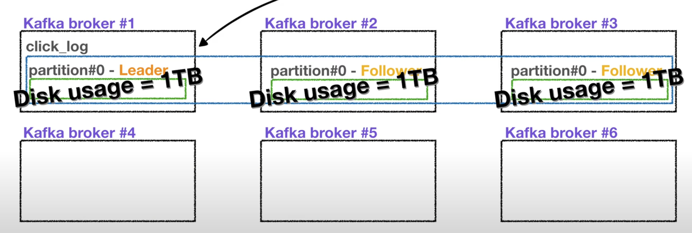

# Begin Kafka

[아파치 카프카 for beginners](https://www.inflearn.com/course/아파치-카프카-입문/dashboard) 강의를 요약한 내용입니다. 

<https://kafka.apache.org/>

# Kafka?

**Before Kafka**

> 소스 애플리케이션, 타겟 애플리케이션 개수가 늘어날 수록 데이터 라인이 많아지게 된다.
- 이 때 배포와 장애 대응이 어려워지고,
- 데이터 전송 시 프로토콜 포맷 파편화가 심해짐
- 추후 데이터 포맷에 변경사항이 있을 경우 유지보수에 어려워진다.

<figure><figcaption></figcaption></figure>

After Kafka

> 소스/타겟 애플리케이션의 커플링을 약하게 하기 위해 출시
> 
- 위와 같은 복잡함을 해결하기 위해 링크드인에서 내부적으로 개발하여 오픈소스로 제공

<figure><figcaption></figcaption></figure>

<figure><figcaption></figcaption></figure>

https://developers.redhat.com/learning/learn:apache-kafka:kafka-101/resource/resources:what-are-partitions

## **Kafka features**

<figure><figcaption></figcaption></figure>

**Source Application (Kakfa Producer)**

- 데이터를 보내는 역할
  - ex. 클릭 로그, 결제 로그
- 여러 데이터 포맷을 지원(json, tsv, avro ..)

**Kafka**

- 각종 데이터를 담는 `토픽`을 가지고 있음
- 유연한 `Queue 역할`을 담당
- 데이터 흐름에 있어서 `fault tolerant`(고가용성)으로
  - 서버 이슈가 생기거나 갑작스럽게 전원이 내려갈 경우에서도 데이터를 손실 없이 복구 가능
- 낮은 지연(`latency`)과 높은 처리량(`Throughput`)을 통해 효과적으로 `대량의 데이터`를 처리

**Target Application (Kakfa Consumer)**

- 데이터를 가져가는 역할
- ex. 로그 적재, 로그 처리

# Topic

> 카프카에는 다양한 데이터가 들어갈 수 있다.
> 
> 여기서 데이터가 들어갈 수 있는 공간을 `Topic` 이라고 부른다.

<figure><figcaption></figcaption></figure>

일반적인 AMQP와는 다소 다르게 동작

- 카프카에서는 여러개의 토픽을 생성 가능
- 토픽은 데이터베이스 테이블이나 파일시스템의 폴더와 유사한 성질을 가짐
- 토픽은 이름을 가질 수 있는데 목적에 따라 설정
    - 어떤 데이터를 담는지 명확하게 명시

## 카프카 토픽의 내부

<figure><figcaption></figcaption></figure>

> 하나의 토픽은 여러개의 파티션으로 구성 가능
- 첫 번째 파티션은 0번 부터 시작
- 하나의 파티션은 큐같이 내부 데이터가 파티션 끝부터 쌓이게 된다.
- 컨슈머는 가장 오래된 순서로 데이터를 가져간다.
    - 데이터가 더이상 들어오지 않으면 컨슈머는 또 다른 데이터가 들어올 때까지 대기
- 컨슈머가 토픽 내부에서 데이터를 가져가더라도 데이터는 삭제되지 않는다.
    - 파티션에 남은 데이터는 새로운 컨슈머가 붙었을 때 다시 0번부터 사용 가능
    - 단, 컨슈머 그룹이 달라야 하고, `auto.offset.reset = earliest` 일 경우
    - **동일 데이터를 두 번 처리**할 수도 있는데 이는 카프카를 사용하는 아주 중요한 이유
        - 엘라스틱서치, 하둡 등 다른 저장소에 데이터를 저장해야 하는 등의 경우

**파티션이 2개 이상인 경우**

<figure><figcaption></figcaption></figure>

> 프로듀서는 데이터를 보낼 때 키 지정이 가능
- 키를 지정하지 않고(null), 기본 파티셔너설정을 사용할 경우 → 라운드 로빈(`Round robin`)으로 할당
- 키가 있고, 기본 파티셔너를 사용할 경우 → `키의 해시 값`을 구하고, 특정 파티션에 할당
- 파티션을 늘리는 것은 가능하지만 줄일 수는 없으므로 주의가 필요
    - 파티션을 늘리면 컨슈머의 개수를 늘려서 데이터 처리 분산이 가능
- 파티션 데이터의 삭제 타이밍은 옵션에 따라 다르다.
    - `log.retention.ms`: 데이터 최대 보존 시간
    - `log.retention.byte`: 데이터 최대 보존 크기

# **Broker, Replication, ISR**

<figure><figcaption></figcaption></figure>

## Kafka **Broker**

> 카프카가 설치되어 있는 서버 단위
- 보통 `3개 이상의 브로커`로 구성하여 사용하는 것을 권장
- 만일, 파티션 1개, Replication 이 1 인 토픽이 존재, 브로커가 3대일 경우
    - 브로커 3대 중 1대에 해당 토픽의 정보가 저장

## Kafka **Replication**

> 파티션의 복제를 뜻함
> 
> 파티션의 고가용성을 위해 사용

Replication

- `Replication = 1` 이라면, 파티션은 1개만 존재한다는 의미
- `Replication = 2` 이라면, 파티션은 원본 1개와 복제본 1개로 존재
- `Replication = 3` 이라면, 파티션은 원본 1개와 복제본 2개로 존재

<figure><figcaption></figcaption></figure>

**ISR(In Sync Replica)**

- 여기서 1개의 원본 파티션은 `Leader partition` 이라고 부르고,
- 나머지 복제본 파티션은 `Follower partition`
    - Leader partition 이 죽게 되면 복제본이 Leader partition 역할을 승계
- Leader + Follower partition 을 합쳐서 `ISR`(In Sync Replica) 이라고 볼 수 있다.

브로커 개수에 따라서 Replication 개수가 제한

- 브로커 개수가 3이면 Replication은 4가 될 수 없다.

## **Replication & Ack**

<figure><figcaption></figcaption></figure>

프로듀서가 토픽의 파티션에 데이터를 전달할 때 전달받는 주체가 `Leader partition`

- 프로듀서에는 ack 라는 상세 옵션을 통해 고가용성 유지 가능
- ack 옵션 중 하나를 선택
    - `0`
        - 프로듀서는 Leader partition에 데이터를 전송하고 응답값은 받지 않음
        - 데이터가 정상적으로 전송되었는지, 나머지 파티션에 정상 복제되었는지 보장할 수 없음
        - 속도는 빠르지만 데이터 유실 가능성 존재
    - `1`
        - 프로듀서는 Leader partition에 데이터를 전송하고, 데이터를 정상적으로 받았는지 응답값 수신
        - 단, 나머지 파티션에 복제되었는지는 알 수 없음
        - Leader partition이 데이터를 받은 즉시 브로커 장애가 발생한다면 데이터 유실 가능성 존재
    - `all`
        - 1 옵션에 추가로 follower partition에 복제가 잘 이루어졌는지 응답을 수신
        - 데이터가 유실될 일은 없지만, 속도가 0, 1 옵션에 비해 현저히 느리다는 단점

## **Replication count**

> replication 개수가 많아지면 그만큼 브로커의 리소스 사용량도 늘어나게 된다.

<figure><figcaption></figcaption></figure>

- 카프카에 들어오는 데이터량과 저장시간을 잘 고려하여 replication 개수 산정이 필요
    - 3개 이상의 브로커 사용 시 replication 은 3으로 설정하는 것을 추천

# Partitioner

> 프로듀서가 데이터를 보내면 무조건 파티셔너를 통해서 브로커로 데이터가 전송
> 
> 파티셔너는 데이터를 토픽의 어떤 파티션에 넣을지 결정하는 역할

**레코드에 포함된 메시지 키/값에 따라서 파티션의 위치가 결정**

- 프로듀서 사용 시 파티셔너를 따로 설정하지 않는다면 `UniformStickyPartitioner` 로 설정
    - 프로듀서에서 배치로 모을 수 있는 최대한의 레코드를 모아서 파티션으로 데이터를 전송
- Partitioner 인터페이스를 통해 커스텀 파티셔너를 생성할 수도 있음
    - 메시지 키/값, 토픽 이름에 따라 어느 파티션에 데이터를 보낼 것인지 설정 가능
    - ex. 특정 고객의 데이터를 더 빠르게 처리해주고 싶을 경우
        - 8개의 파티션에는 VIP 고객 데이터, 2개의 파티션에는 일반 고객 데이터

**메시지 키가 있을 때와 없을 때 다르게 동작**

- 메시지 키가 있는 경우
    - 파티셔너의 의해 특정한 해쉬값이 생성
    - 이 해쉬값을 기준으로 어느 파티션으로 들어갈지 선정
    - 동일한 메시지 키를 가진 레코드들은 동일한 파티션에 들어가므로 순서를 지켜서 데이터 처리할 수 있는 장점
    
    

    
- 메시지 키가 없는 경우
    - 라운드 로빈으로 파티션에 할당 (전통적인 라운드 로빈 방식과는 조금 다르게 동작)
    - 배치단위로 데이터 전송 시 파티션에 적절히 분배