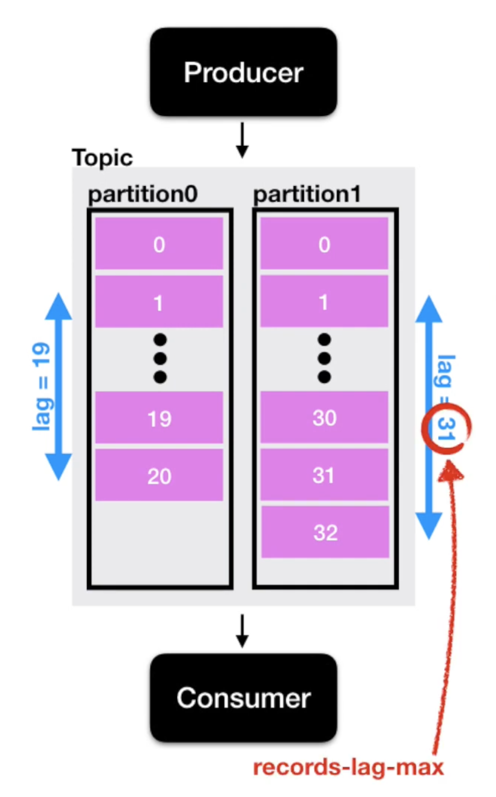

# Begin Kafka

[아파치 카프카 for beginners](https://www.inflearn.com/course/아파치-카프카-입문/dashboard) 강의를 요약한 내용입니다. 

<https://kafka.apache.org/>

# Kafka?

**Before Kafka**

> 소스 애플리케이션, 타겟 애플리케이션 개수가 늘어날 수록 데이터 라인이 많아지게 된다.
- 이 때 배포와 장애 대응이 어려워지고,
- 데이터 전송 시 프로토콜 포맷 파편화가 심해짐
- 추후 데이터 포맷에 변경사항이 있을 경우 유지보수에 어려워진다.

<figure><figcaption></figcaption></figure>


After Kafka

> 소스/타겟 애플리케이션의 커플링을 약하게 하기 위해 출시
> 
- 위와 같은 복잡함을 해결하기 위해 링크드인에서 내부적으로 개발하여 오픈소스로 제공

<figure><figcaption></figcaption></figure>

<figure><figcaption></figcaption></figure>

https://developers.redhat.com/learning/learn:apache-kafka:kafka-101/resource/resources:what-are-partitions

## **Kafka features**

<figure><figcaption></figcaption></figure>

**Source Application (Kakfa Producer)**

- 데이터를 보내는 역할
  - ex. 클릭 로그, 결제 로그
- 여러 데이터 포맷을 지원(json, tsv, avro ..)

**Kafka**

- 각종 데이터를 담는 `토픽`을 가지고 있음
- 유연한 `Queue 역할`을 담당
- 데이터 흐름에 있어서 `fault tolerant`(고가용성)으로
  - 서버 이슈가 생기거나 갑작스럽게 전원이 내려갈 경우에서도 데이터를 손실 없이 복구 가능
- 낮은 지연(`latency`)과 높은 처리량(`Throughput`)을 통해 효과적으로 `대량의 데이터`를 처리

**Target Application (Kakfa Consumer)**

- 데이터를 가져가는 역할
- ex. 로그 적재, 로그 처리

---

# Producer

> 데이터를 카프카에 보내는 역할
> 
> ex) 엄청난 양의 클릭 로그

**역할**

- Topic에 해당하는 메시지 생성
- 특정 Topic으로 데이터를 publish(전송)
- 카프카 브로커로 데이터 전송 시, 전송 성공 여부 확인 가능
  - 실패 시 재시도 가능

카프카 클라이언트인 컨슈머와 프로듀서 사용을 위해 아파치 카프카 라이브러리 추가

- ⚠️ 카프카는 브로커 버전과 클라이언트 버전의 하위호환성이 완벽하게 모든 버전에 대해서 지원하지 않으므로 주의 필요
  - 브로커 버전과 클라이언트 버전의 호환성 확인 필수

```groovy
// https://mvnrepository.com/artifact/org.apache.kafka/kafka-clients
implementation 'org.apache.kafka:kafka-clients:3.8.0'
```

카프카 프로듀서 작성 코드

- `bootstrap.servers`: 카프카 브로커의 주소 목록은 2개 이상의 ip, port 설정 권장
    - 하나의 브로커가 비정상일 경우 다른 브로커에 연결되어 사용 가능
- `key/value.serializer`: key/value 에 대한 StringSerializer 직렬화 설정
    - ByteArray, String, Integer Serializer 사용 가능
- topic: `click_log`
- value: `login`
- `Key`:  메시지를 보내면, 토픽의 파티션이 지정될 때 사용

<figure><figcaption></figcaption></figure>

프로듀서가 토픽의 파티션에 들어가는 과정

- key = null
    
    <figure><figcaption></figcaption></figure>
    
- key ≠ null
    - 키를 사용할 경우 파티션 개수를 고려
    - 추후에 생성하지 않는 것을 권장
    
    <figure><figcaption></figcaption></figure>
    

**데이터 유실, 브로커의 이슈에 대처하기 위한 추가 옵션과 코드가 필요**

참고.

- [아파치 Kafka 개요 및 설명](https://blog.voidmainvoid.net/179)
- [Kafka broker와 java client의 버젼 하위호환성 정리](https://blog.voidmainvoid.net/193)

---

# Consumer

> 다른 메시징 시스템에서는 컨슈머가 ***데이터를 가져가면 큐 내부 데이터가 사라지지만***,
> 
> 카프카에서는 ***컨슈머가 데이터를 가져가더라도 데이터 유지***

이러한 특징은 카프카, 카프카 컨슈머를 데이터 파이프라인트로 운영하는데 핵심적인 역할

<figure><figcaption></figcaption></figure>

- 카프카 컨슈머는 기본적으로 토픽 내부의 파티션에 저장된 데이터를 가져온다.
    - 이렇게 데이터를 가져오는 것을 `polling`

**역할**

- 토픽의 파티션으로부터 데이터를 폴링(polling)
    - 특정 DB에 저장하거나, 또 다른 파이프라인에 전달 가능
- 파티션 오프셋 위치 기록(commit)
- 컨슈머 그룹을 통해 병렬처리
    - 파티션 개수에 따라 컨슈머를 여러개 만들게 되면 병렬처리

**카프카 컨슈머 작성 코드**

- `bootstrap.servers`관련 설정은 프로듀서와 동일
- `group.id` (aka. 컨슈머 그룹) : 컨슈머들의 묶음
- `key/value.deserializer`: key/value 에 대한 StringDeserializer 역직렬화 설정
- consumer group: `click_log_greoup`
- topic: `click_log` → consumer.subscribe()
    - 특정 토픽의 일부 파티션의 데이터만 가져올 경우 consumer.assign()
    - key가 존재하는 데이터라면 이 방식으로 데이터의 순서를 보장하는 데이터처리 가능
        
    <center></center>
        
- 컨슈머는 poll()을 통해 데이터를 가져오는데, 설정 시간 동안 데이터를 대기
    - 0.5초 동안 데이터 도착을 대기하고 이후 코드를 실행
    - 0.5초 동안 데이터가 들어오지 않을 경우 빈값의 records 변수 반환
    - records 변수는 데이터 배치로서 레코드의 묶음 list
    - 실제 카프카에서 데이터를 처리할 때는 가장 작은 단위인 record로 나누어 처리

<figure><figcaption></figcaption></figure>

**데이터가 컨슈머로 전달되는 과정**

- `offset`은 토픽, 파티션별 별개로 지정
- `offset`의 역할은 컨슈머가 ***데이터를 어느 지점까지 읽었는지 확인 용도***
- 컨슈머가 데이터를 읽기 시작하면 `offset` `commit`
    - `offset` 정보는 `__consumer_offsets` 토픽에 저장
    - 컨슈머가 사고로 실행이 중지되어 재실행하면 ***시작 위치부터 다시 복구하여 데이터 처리*** 가능

<figure><figcaption></figcaption></figure>

**컨슈머는 몇개까지 생성 가능❓**

- 컨슈머 1, 파티션 2 → 2개의 파티션에서 데이터 폴링
- 컨슈머 2, 파티션 2 → 각 컨슈머가 각각의 파티션을 할당

> 컨슈머 개수는 파티션 개수보다 작거나 같아야 한다.
> 
> Consumer cnt ≤ partition cnt

<figure><figcaption></figcaption></figure>

여러 파티션을 가진 토픽에 대해서 컨슈머를 병렬처리하고 싶을 경우, 

- 반드시 컨슈머를 파티션 개수보다 적은 개수로 실행시켜야 한다.

**컨슈머 그룹이 다른 컨슈머들의 동작**

- 각기 다른 컨슈머 그룹에 속한 컨슈머들은 다른 컨슈머 그룹에 영향을 미치지 않음
- `__consumer_offsets` 토픽에는 컨슈머 그룹, 토픽별로 `offset`을 나누어 저장

> 이러한 카프카의 특징으로 하나의 토픽으로 들어온 데이터는 다양한 역할을 하는 컨슈머들이 각자 원하는 데이터로 처리가 가능

---

# Topic

> 카프카에는 다양한 데이터가 들어갈 수 있다.
> 
> 여기서 데이터가 들어갈 수 있는 공간을 `Topic` 이라고 부른다.

<figure><figcaption></figcaption></figure>

일반적인 AMQP와는 다소 다르게 동작

- 카프카에서는 여러개의 토픽을 생성 가능
- 토픽은 데이터베이스 테이블이나 파일시스템의 폴더와 유사한 성질을 가짐
- 토픽은 이름을 가질 수 있는데 목적에 따라 설정
    - 어떤 데이터를 담는지 명확하게 명시

## 카프카 토픽의 내부

<figure><figcaption></figcaption></figure>

> 하나의 토픽은 여러개의 파티션으로 구성 가능
- 첫 번째 파티션은 0번 부터 시작
- 하나의 파티션은 큐같이 내부 데이터가 파티션 끝부터 쌓이게 된다.
- 컨슈머는 가장 오래된 순서로 데이터를 가져간다.
    - 데이터가 더이상 들어오지 않으면 컨슈머는 또 다른 데이터가 들어올 때까지 대기
- 컨슈머가 토픽 내부에서 데이터를 가져가더라도 데이터는 삭제되지 않는다.
    - 파티션에 남은 데이터는 새로운 컨슈머가 붙었을 때 다시 0번부터 사용 가능
    - 단, 컨슈머 그룹이 달라야 하고, `auto.offset.reset = earliest` 일 경우
    - **동일 데이터를 두 번 처리**할 수도 있는데 이는 카프카를 사용하는 아주 중요한 이유
        - 엘라스틱서치, 하둡 등 다른 저장소에 데이터를 저장해야 하는 등의 경우

**파티션이 2개 이상인 경우**

<figure><figcaption></figcaption></figure>

> 프로듀서는 데이터를 보낼 때 키 지정이 가능
- 키를 지정하지 않고(null), 기본 파티셔너설정을 사용할 경우 → 라운드 로빈(`Round robin`)으로 할당
- 키가 있고, 기본 파티셔너를 사용할 경우 → `키의 해시 값`을 구하고, 특정 파티션에 할당
- 파티션을 늘리는 것은 가능하지만 줄일 수는 없으므로 주의가 필요
    - 파티션을 늘리면 컨슈머의 개수를 늘려서 데이터 처리 분산이 가능
- 파티션 데이터의 삭제 타이밍은 옵션에 따라 다르다.
    - `log.retention.ms`: 데이터 최대 보존 시간
    - `log.retention.byte`: 데이터 최대 보존 크기

---

# **Broker, Replication, ISR**

<figure><figcaption></figcaption></figure>

## Kafka **Broker**

> 카프카가 설치되어 있는 서버 단위
- 보통 `3개 이상의 브로커`로 구성하여 사용하는 것을 권장
- 만일, 파티션 1개, Replication 이 1 인 토픽이 존재, 브로커가 3대일 경우
    - 브로커 3대 중 1대에 해당 토픽의 정보가 저장

## Kafka **Replication**

> 파티션의 복제를 뜻함
> 
> 파티션의 고가용성을 위해 사용

Replication

- `Replication = 1` 이라면, 파티션은 1개만 존재한다는 의미
- `Replication = 2` 이라면, 파티션은 원본 1개와 복제본 1개로 존재
- `Replication = 3` 이라면, 파티션은 원본 1개와 복제본 2개로 존재

<figure><figcaption></figcaption></figure>

**ISR(In Sync Replica)**

- 여기서 1개의 원본 파티션은 `Leader partition` 이라고 부르고,
- 나머지 복제본 파티션은 `Follower partition`
    - Leader partition 이 죽게 되면 복제본이 Leader partition 역할을 승계
- Leader + Follower partition 을 합쳐서 `ISR`(In Sync Replica) 이라고 볼 수 있다.

브로커 개수에 따라서 Replication 개수가 제한

- 브로커 개수가 3이면 Replication은 4가 될 수 없다.

## **Replication & Ack**

<figure><figcaption></figcaption></figure>

프로듀서가 토픽의 파티션에 데이터를 전달할 때 전달받는 주체가 `Leader partition`

- 프로듀서에는 ack 라는 상세 옵션을 통해 고가용성 유지 가능
- ack 옵션 중 하나를 선택
    - `0`
        - 프로듀서는 Leader partition에 데이터를 전송하고 응답값은 받지 않음
        - 데이터가 정상적으로 전송되었는지, 나머지 파티션에 정상 복제되었는지 보장할 수 없음
        - 속도는 빠르지만 데이터 유실 가능성 존재
    - `1`
        - 프로듀서는 Leader partition에 데이터를 전송하고, 데이터를 정상적으로 받았는지 응답값 수신
        - 단, 나머지 파티션에 복제되었는지는 알 수 없음
        - Leader partition이 데이터를 받은 즉시 브로커 장애가 발생한다면 데이터 유실 가능성 존재
    - `all`
        - 1 옵션에 추가로 follower partition에 복제가 잘 이루어졌는지 응답을 수신
        - 데이터가 유실될 일은 없지만, 속도가 0, 1 옵션에 비해 현저히 느리다는 단점

## **Replication count**

> replication 개수가 많아지면 그만큼 브로커의 리소스 사용량도 늘어나게 된다.

<figure><figcaption></figcaption></figure>

- 카프카에 들어오는 데이터량과 저장시간을 잘 고려하여 replication 개수 산정이 필요
    - 3개 이상의 브로커 사용 시 replication 은 3으로 설정하는 것을 추천

---

# Partitioner

> 프로듀서가 데이터를 보내면 무조건 파티셔너를 통해서 브로커로 데이터가 전송
> 
> 파티셔너는 데이터를 토픽의 어떤 파티션에 넣을지 결정하는 역할

<center></center>

**레코드에 포함된 메시지 키/값에 따라서 파티션의 위치가 결정**

- 프로듀서 사용 시 파티셔너를 따로 설정하지 않는다면 `UniformStickyPartitioner` 로 설정
    - 프로듀서에서 배치로 모을 수 있는 최대한의 레코드를 모아서 파티션으로 데이터를 전송
- Partitioner 인터페이스를 통해 커스텀 파티셔너를 생성할 수도 있음
    - 메시지 키/값, 토픽 이름에 따라 어느 파티션에 데이터를 보낼 것인지 설정 가능
    - ex. 특정 고객의 데이터를 더 빠르게 처리해주고 싶을 경우
        - 8개의 파티션에는 VIP 고객 데이터, 2개의 파티션에는 일반 고객 데이터

**메시지 키가 있을 때와 없을 때 다르게 동작**

- 메시지 키가 있는 경우
    - 파티셔너의 의해 특정한 해쉬값이 생성
    - 이 해쉬값을 기준으로 어느 파티션으로 들어갈지 선정
    - 동일한 메시지 키를 가진 레코드들은 동일한 파티션에 들어가므로 순서를 지켜서 데이터 처리할 수 있는 장점
    
    <center></center>
    
- 메시지 키가 없는 경우
    - 라운드 로빈으로 파티션에 할당 (전통적인 라운드 로빈 방식과는 조금 다르게 동작)
    - 배치단위로 데이터 전송 시 파티션에 적절히 분배

---

# Consumer Lag

> 프로듀서가 넣은 데이터 오프셋과 컨슈머가 가져간 데이터의 오프셋
> 
> 이 두 개의 오프셋 간의 차이가 `Consumer Lag`

<center></center>

`lag`은 적을 수도, 많을 수도 있는데,

- `lag` 를 통해 해당 토픽에 대해 파이프라인으로 연계되어 있는 프로듀서, 컨슈머의 상태에 대해 유추 가능
- 주로 컨슈머의 상태를 볼 때 사용

⭐️ `lag`은 각 파티션의 오프셋 기준으로 ***프로듀서가 넣은 데이터의 오프셋***과 ***컨슈머가 가져가는 데이터의 오프셋***의 차이를 기반

- ⭐️ 토픽에 여러 파티션이 존재할 경우 여러개의 `lag` 존재
    - ex) 컨슈머 그룹 1개, 파티션이 2개인 토픽에서 데이터를 가져간다면, `lag`은 2개가 측정
- 한 개의 토픽과 컨슈머 그룹에 대한 `lag`이 여러개 존재할 수 있을 때,
    - 그 중 높은 숫자의 `lag`를 `records-lag-max` 라고 부름.

<center></center>

---

# **Burrow**

<https://github.com/linkedin/Burrow>

> 카프카 컨슈머 Lag 모니터링 필수 요소

**Before**

`Kafka-client` 라이브러리를 사용해서 Java, Scala와 같은 언어를 통해 카프카 컨슈머 구현

- 구현한 `KafkaConsumer` 객체를 통해 현재 `lag` 정보를 가져올 수 있음
- `lag`을 실시간 모니터링하고 싶을 경우, 데이터를 `Elasticsearch`, `InfluxDB` 와 같은 저장소에 넣은 뒤
    - Grafana 대시보드를 통해 확인 가능
- 단, Consumer 단위에서 lag 을 모니터링하는 것은 위험하고 운영요소가 많이 들어감
    - 컨슈머 로직단에서 lag 을 수집하는 것은 컨슈머 상태에 디펜던시가 걸림
    - 컨슈머가 비정상적으로 종료되면 컨슈머는 lag 정보를 보낼 수 없으므로, 더이상 lag 측정 불가
    - 추가적으로 컨슈머가 개발될 때마다 해당 컨슈머에 lag 정보를 특정 저장소에 저장할 수 있도록 로직 개발 필요
    - 컨슈머 lag 수집 불가 컨슈머라면 모니터링이 어려워 운영이 까다로워짐

**Using Burrow**

> `Burrow`는 오픈소스로 Golang으로 작성
- 컨슈머 lag 모니터링을 도와주는 독립적인 애플리케이션

## Burrow의 특징

1️⃣ 멀티 카프카 클러스터 지원

- 카프카 클러스터가 여러개더라도 Burrow application 1개만 실행해서 연동하면
    - 카프카 클러스터들에 붙은 컨슈머의 lag을 모두 모니터링 가능
    
    <center></center>
    

2️⃣ Sliding window를 통한 consumer status 확인

- ERROR, WARNING, OK 로 표현
- `WARNING`: 데이터양이 일시적으로 많아지면서 컨슈머 오프셋이 증가되고 있을 경우
- `ERROR`: 데이터양이 많이지고 있는데 컨슈머가 데이터를 가져가지 않을 경우

3️⃣ HTTP api 제공

- 정보들을 Burrow API 를 통해 조회 가능

참고.

- [Burrow - kafka consumer의 지연(lag)을 모니터링할 수 있는 효과적인 opensource tool](https://blog.voidmainvoid.net/243)
- [Kafka Burrow에서 consumer의 lag을 정의하는(평가하는) 방법 - Consumer Lag Evaluation Rules](https://blog.voidmainvoid.net/244)
- [Kafka burrow http endpoint 정리](https://blog.voidmainvoid.net/245)

---

# RabbutMQ, Redis Queue, Kafka

메시징 플랫폼의 두 가지 종류

- 메시지 브로커: 이벤트 브로커 역할 수행 ❌
- 이벤트 브로커: 메시지 브로커 역할 수행 ⭕️

## 메시지 브로커

> **대규모 메시지 기반 미들웨어 아키텍처에서 사용**
> 
- 미들웨어? 서비스하는 애플리케이션들의 아키텍처를 효율적으로 연결하는 소프트웨어
    - like) 메시징 플랫폼, 인증 플랫폼, 데이터베이스
- 메시지 브로커에 있는 큐에 데이터를 보내고 받는 프로듀서와 컨슈머를 통해 메시지를 통신하고 네트워크를 맺는 용도로 사용
- ex) `RabbutMQ`, `Redis Queue`

**메시지 브로커의 특징**

- 메시지를 받아서 적절히 처리하고 나면, 즉시 또는 짧은 시간 내에 삭제되는 구조
- 데이터를 보내고, 처리하고, 삭제

---

## 이벤트 브로커

> 메시지 브로커의 특징과 조금 다른 구조

1️⃣ 이벤트 또는 메시지라고도 불리는 레코드를 딱 하나만 보관하고, 인덱스를 통해 개별 엑세스를 관리

2️⃣ 업무상 필요한 시간동안 이벤트 보존 가능

- ex) `Kafka`, `AWS kinesis`

**이벤트 브로커의 특징**

- 딱 한번 일어난 이벤트 데이터를 브로커에 저장하여 단일 진실 공급원으로 사용
- 장애 발생 시 장애가 일어난 지점부터 재처리 가능

---

# Kafka Streams

> 토픽에 있는 데이터를 낮은 지연과 함께 안전하고, 빠른 속도로 데이터 처리

[Kafka Streams](https://kafka.apache.org/documentation/streams/)

**👍🏼 장점**

**1️⃣ 카프카와 완벽 호환**

> 메시지 유실, 중복이 발생하지 않고, 딱 한 번만 처리될 수 있는 강력한 기능을 제공

- 대부분 카프카를 이벤트 저장소로 사용하고, 저장된 데이터를 **Spark**, **Logstash** 같은 툴로 연동
    - 외부 오픈소스 툴은 빠르게 발전하는 카프카 버전에 따라오지 못 하는 단점이 존재
    - 반면, 스트림즈는 카프카 릴리즈 때마다 카프카 클러스터와 완벽하게 호환
- 카프카 보안, ACL 같은 것들이 붙어 있더라도 ***완벽 호환, 성능 개선도 진행***

**2️⃣ 스케줄링 도구 불필요**

- 카프카와 연동하는 스트림 프로세싱 툴로 **Spark Streaming**이 널리 사용
  - 하지만, 스파크 운영을 위해 **yarn**, **messos** 같은 클러스터 관리자 또는 리소스 매니저 같은 것이 필요
  - 클러스터 운영을 위해 대규모 장비 구축이 필요
- 카프카 스트림즈를 사용하면 스케줄링 도구는 불필요
- **스트림즈 애플리케이션**은 컨슈머, WAS 애플리케이션을 배포하는 것처럼 ***원하는 만큼 배포 가능***
  - 적은 양의 데이터를 처리한다면 2개 정도, 데이터를 많이 처리해야 한다면 스케일 아웃(10~20개)

3️⃣ [Streams DSL](https://kafka.apache.org/21/documentation/streams/developer-guide/dsl-api.html)과 [Processor API](https://kafka.apache.org/10/documentation/streams/developer-guide/processor-api.html) 제공

- 스트림즈 구현은 대부분 **DSL**로 해결
  - 이벤트 기반 데이터 처리 시 필요한 다양한 기능들 map, join, window와 같은 메서드를 제공
  - **Streams DSL**만이 제공하는 KStream, KTable, GlobalKTable은 독특한 스트림 처리 개념
      - 카프카를 스트림 데이터 처리뿐 아니라 대규모 key-value 저장소로도 사용 가능
- **Streams DSL**에 없는 기능은 Processor API를 사용해서 로직을 작성
- 카프카의 풍부한 기능을 사용하고 싶다면 `Kafka Streams`가 답!

4️⃣ 로컬 상태 저장소를 사용

- 실시간으로 들어오는 데이터를 처리하는 방식
  - 비상태(`stateless`) 기반 처리
      - ***필터링***이나 ***데이터***를 변환하는 처리
      - 데이터가 들어오는 즉시 바로 처리하고, 프로듀스하여 유실이나 중복이 발생할 염려가 적음
      - 개발을 위한 낮은 허들
  - 상태(`stateful`) 기반 처리
      - (분산 프로세스를) 직접 개발하기 위한 높은 허들
      - window, join, aggregation 같은 처리는 이전에 받은 데이터를 프로세스가 메모리에 저장하고 있으면서 다음 데이터를 참조해서 처리해야 함
- 상태 기반 처리 개발의 어려움을 극복하도록 도와주는 것이 `Kafka Streams`
  - 상태를 로컬 `rocksdb`를 사용해서 저장
  - 이 상태에 대한 변환 정보는 카프카 변경로그(`changelog`) 토픽에 저장
  - 프로세스에 장애가 발생하더라도 상태가 모두 안전하게 저장되어 자연스럽게 장애 복구

**Sample Code**

- payment 토픽에 메시지 키가 unknows 인 데이터를 필터링해서
- unknow-payment 토픽으로 보내는 스트림즈 코드

<figure><figcaption></figcaption></figure>

---

# Kafka Connect

[Kafka Connect](https://docs.confluent.io/platform/current/connect/index.html)

> 반복적인 데이터 파이프 라인을 효과적으로 배포하고, 관리하는 ***데이터 파이프 라인 플랫폼***

`Kafka Connect` 는 `Connect`와 `connector`로 구성

## Kafka Connect

> Connector를 동작하도록 실행해 주는 프로세스

파이프 라인으로 동작하는 Connector를 동작하기 위해 반드시 실행

.

`Connect`**는 크게 두 가지로 구성**

**1️⃣ 단일 실행 모드 커넥트**

- 간단한 데이터 파이프라인을 구성하거나 개발용으로 주로 사용

2️⃣ **분산 모드 커넥트**

- 여러개의 커넥트를 한 개의 클러스터로 묶어서 운영
- 클러스터로 묶은 커넥트는 일부 커넥트에서 장애가 발생하더라도 파이프라인을 자연스럽게 failover(장애 복구 기능)
  - 나머지 실행중인 커넥트에서 데이터를 지속적으로 처리할 수 있도록 지원

## Kafka Connector

> 실질적으로 데이터를 처리하는 코드가 담긴 ***jar 패키지***

일련의 템플릿과 같은 특정 동작을 하는 코드 뭉치

- 커넥터 안에는 파이프라인에 필요한 ***여러 동작들과 설정, 실행 메서드***들이 포함
- 만일, 토픽에서 Oracle DB에 데이터를 저장하고 싶다면
  - 커넥터에 insert 메서드를 구현하고, 커넥터를 실행하는 방식으로 운영
- 직접 구현할 수도 있지만 깃허브, 컨플루언트에 오픈소스로 제공
  - 사용중인 카프카 클러스터와 싱크/소스로 사용하는 DB가 있다면 오픈소스 커넥터를 검색해서 사용 가능

.

**커넥터는 크게 두 가지로 구성**

**1️⃣ Sink Connector**

- 어딘가로 데이터를 싱크한다는 의미
- 특정 토픽에 있는 데이터를 Oracle, mySQL, ES 같이 특정 저장소에 저장을 하는 역할 (like. Consumer)
    - Oracle Sink Connector, mySQL Sink Connector, ..

**2️⃣ Source Connector**

- 데이터 베이스로부터 데이터를 가져와서 토픽에 넣는 역할 (like. Producer)

## Connect & Connector 관계

커넥트를 실행할 때 커넥터가 어디에 위치하는지 config 파일에 그 위치를 지정

- 커넥터 jar 패키지가 있는 디렉토리를 config 파일에 지정
    
    ```bash
    plugin.path=/var/connectors
    ```
    
- 그 후 커넥트를 실행하게 되면 이 jar 파일의 커넥터들을 함께 모아서 커넥터를 실행할 수 있도록 준비 상태에돌입
- 실행중인 커넥트에서 커넥터를 실행하려면 REST API 활용
  - 커넥트를 활용하면 파이프라인 생성 시 추가로 개발, 배포하는 과정 없이 REST API 를 통해 커넥터를 통한 파이프 라인들이 분산해서 생성
  - 예로, 특정 토픽에 있는 데이터를 Oracle DB의 특정 테이블로 보낼 때 JSON 으로 설정을 생성
      - 그리고 이 body를 REST API 를 통해 커넥트에 명령
          
<figure><figcaption></figcaption></figure>
            

> 개발, 배포, 모니터링 구축 과정들이 커넥트에서는 템플릿 형태로 커넥터를 개발하고, 
> 
> REST API를 통해 반복적으로 생성해서 뛰어난 효율을 가짐

***반복적으로 파이프라인 생성이 필요할 때***는 컨슈머로 여러번 만들기보다 `커넥트`를 구축하여 `커넥터`를 반복적으로 실행하는 방식으로 진행하는 것을 권장