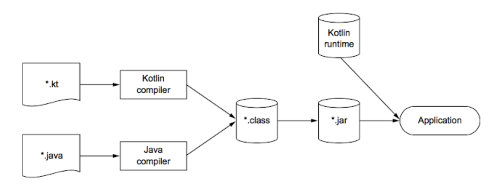

# Kotlin 알아가기

# 코틀린?

- 타입 추론을 지원하는 `정적 타입 지정 언어`
    - 소스 코드의 정확성과 성능을 보장
    - 소스코드를 간결하게 유지
- `객체지향`과 `함수형 프로그래밍` 스타일을 모두 지원
    - 일급 시민 함수를 사용해 수준 높은 추상화가 가능
    - 불변 값 지원을 통해 다중 스레드 애플리케이션 개발과 테스트를더 쉽게 가능
- 서버 애플리케이션 개발에 활용 가능
    - 기존 자바 프레임워크를 완벽하게 지원
    - HTML 생성기나 영속화등의 일반적인 작업을 위한 새로운 도구를 제공
- 실용적이며 안전하고, 간결하며 좋은 상호 운용성
    - NPE 같이 흔히 발생하는 오류를 방지
    - 읽기 쉽고 간결한 코드를 지원
    - 자바와 아무런 제약 없이 통합

## **코틀린의 컴파일러(Kotlin Compiler)**

> 코틀린 컴파일러는 JVM에서 실행될 수 있는 **바이트코드가 포함된 클래스 파일을 생성**
> 

<figure><figcaption></figcaption></figure>

- 코틀린은 자바 컴파일러가 아닌 코틀린 컴파일러에 의해 컴파일되므로 자바를 사용할 때와 다른 부분이 존재
    - ex. 코틀린에서는 모든 예외를 언체크 예외로 인식

---