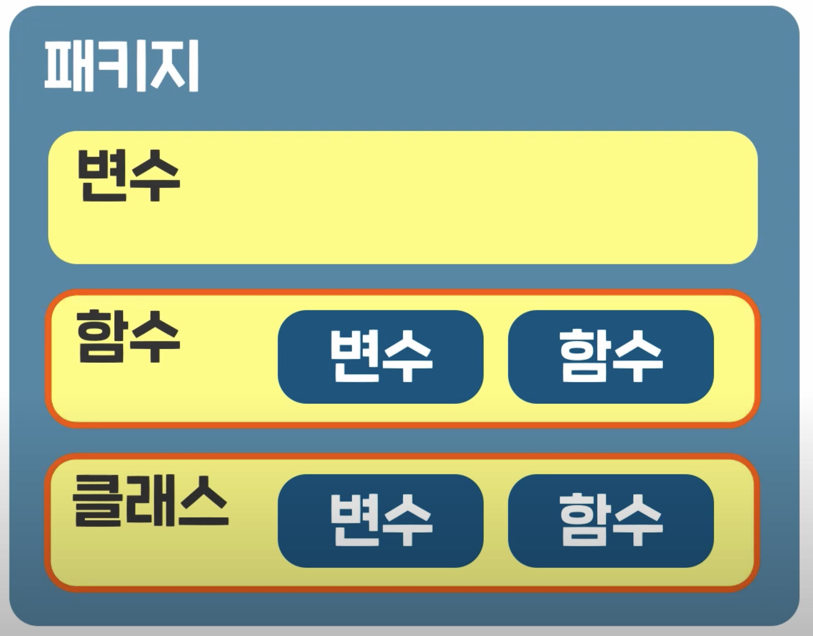

# TDD, Clean Code with Kotlin Preview

[TDD, Clean Code with Kotlin](https://catsbi.oopy.io/5fcea983-4c9c-4580-9876-ac5349e0e3a0) 글을 참고하여 작성한 글입니다.

# Start Kotlin
- [자바 개발자를 위한 코틀린 입문](https://www.inflearn.com/course/java-to-kotlin)
- [DIMO Kotlin 강좌](https://www.youtube.com/watch?v=8RIsukgeUVw&list=PLQdnHjXZyYadiw5aV3p6DwUdXV2bZuhlN)
- [Kotlin in Action](https://www.yes24.com/Product/Goods/55148593)
- [아토믹 코틀린](https://www.yes24.com/Product/Goods/117817486)
- [코틀린 쿡북](https://www.yes24.com/Product/Goods/90452827)
- [객체지향의 사실과 오해](https://www.yes24.com/Product/Goods/18249021)
- [오브젝트](https://www.yes24.com/Product/Goods/74219491)

**Kotlin Web Compiler Site**

<https://play.kotlinlang.org/>

## 변수와 자료형

**✅ 변수의 선언**

> `var`: 일반적으로 통용되는 변수. 언제든지 읽기 쓰기가 가능
`val`: 선언시에만 초기화 가능. 중간에 값 변경 불가
> 

```kotlin
fun main() {
    var a: Int
    a = 123
    println(a) // 123
    
    var b: Int? = null // nallable 변수
    b = null
    println(b) // null
}
```

변수의 선언 위치에 따른 이름

- `Property`: 클래스에 선언된 변수
- `Local Variable`: 이외의 Scope 내에 선언된 변수

| 코틀린은 기본 변수에서 null을 허용하지 않는다.

- 변수에 값을 할당하지 않은채로 사용하게 되면 컴파일 에러

**✅ 코틀린의 기본 자료형**

> 자바와의 호환을 위해 자바와 거의 동일
> 

```kotlin
fun main() {
    // 정수형(8진수 표기는 미지원)
    var intValue:Int = 1234 // 32비트 이내의 10진수
    var longValue:Long = 1234L // 64비트 Long타입 10진수
    var intValueByHex:Int = 0x1af // 16진수
    var intValueByBin:Int = 0b10110110 // 2진수
    
    // 실수형
    var doubleValue:Double = 123.5 // 실수의 기본
    var doubleValueWithExp:Double = 123.5e10 // 필요 시 지수 표기법 추가
    var floatValue:Float = 123.5f // 16비트 float

    // 문자형(내부적으로 문자열을 UTF-16 BE로 관리. 글자 하나가 2bytes 메모리 공간 사용)
    var charValue:Char = 'a'
    var koreanCharValue:Char = '가'
    
    // 논리형
    var booleanValue:Boolean = true
    
    // 문자열
    val stringValue = "one line string test"
    val multiLineStringValue = """multiline
    string
    test"""
}
```

지원되는 특수문자

<center></center>

## 형변환과 배열

**✅ 형변환**

> 코틀린은 형변환 시 발생할 수 있는 오류를 막기 위해 ***암시적 형변환은 미지원***
> 

```kotlin
fun main() {
    // 명시적 형변환
    var a: Int = 54321
    var b: Long = a.toLong()
}
```

**✅ 배열**

> `arrayOf`, `arrayOfNulls`
> 

```kotlin
fun main() {
    // 값이 있는 배열 생성
    var intArr = arrayOf(1, 2, 3, 4, 5)
    
    // 특정 크기를 가진 비어있는 배열 생성
    var nullArr = arrayOfNulls<Int>(5)
    
    intArr[2] = 8
    println(intArr[4])
}
```

## 타입추론과 함수

**✅ 타입추론**

> 변수 함수들을 선언할 때나 연산이 이루어질 때 자료형을 코드에 명시하지 않아도 자동으로 자료형을 추론
> 
- 반드 특정한 자료형으로 지정해야하는 상황이 아니라면 대부분은 코틀린의 타입추론 기능을 이용

**✅ 함수**

> 코틀린에서 함수는 내부적으로 기능을 가진 형태지만, 
외부에서 볼 때는 파라미터를 넣는다는 점 외에는 자료형이 결정된 변수라는 개념으로 접근
> 

```kotlin
fun main() {
	  println(add(5, 6, 7))
    println(add2(5, 6, 7))
}

// 함수
fun add(a: Int, b: Int, c: Int): Int {
    return a + b + c
}

// 단일표현식(반환형 타입 추론)
fun add2(a: Int, b: Int, c: Int) = a + b + c
```

## 조건문과 비교연산자

**✅ 조건문**

`if`

```kotlin
fun main() {
    var a = 11
    if (a < 10) {
        println("a is greater than 10")
    } else {
        println("a is less than or equal to 10")
    }
}

```

`when`

- 등호나 부등호는 사용 불가

```kotlin
fun doWhen (a: Any) {
    when(a) {
        1 -> println("this is number")
        "Hello" -> println("this is string")
        is Long -> println("this is long type")
        !is String -> println("this is not String type")
        else -> println("this is else area")
    }
}

fun doWhenReturn (a: Any) {
    var result = when(a) {
        1 -> "this is number"
        "Hello" -> "this is string"
        is Long -> "this is long type"
        !is String -> "this is not String type"
        else -> "this is else area"
    }
    println(result)
}
```

**✅ 비교연산자**

- 부등호: <, ≤, >, ≥, ≠
- 등호: ==
- 자료형 확인: is, !is
    - 호환 여부를 체크하고 형변환까지 한번에 진행
    
    ```kotlin
    a is Int
    ```
    

## 반복문

다른 언어에서의 반복문과는 약간의 차이가 있다.

```kotlin
fun main() {
	for (i in 0..9) {
        print(i)
    } // 0123456789
    
    println()
    for (i in 0..9 step 3) {
        print(i)
    } // 0369
    
    println()
    for (i in 9 downTo 0) {
        print(i)
    } // 9876543210
    
    println()
    for (i in 9 downTo 0 step 3) {
        print(i)
    } // 9630
    
    println()
    for (i in 'a'..'e') {
        print(i)
    } // abcde
}
```

레이블이 달린 반복문 기준으로 반복문을 종료시켜주는 기능

- 레이블 이름과 @기호로 즉시 반복문 종료

```kotlin
loop@for (i in 1..10) {
    for (j in 1..10) {
        if (i == 1 && j == 2) break@loop
        println("i : $i, j : $j")
    }
}
```

## 클래스

```kotlin
fun main() {
	var a = Person("박보영", 1990)
    var b = Person("전정국", 1997)
    var c = Person("장원영", 2004)
    
    println("안녕하세요. ${a.birthYear}년생 ${a.name}입니다.")
    
    b.introduce()
    c.introduce()
    
    var d = Person("이루다")
    var e = Person("차은우")
    var f = Person("류수정")
}

class Person(var name:String, val birthYear:Int) { // 클래스의 속성들을 선언함과 동시에 생성자를 선언하는 방법
    /** init
     * 생성자를 통해 인스턴스가 만들어질 때 호출되는 함수
     */
    init {
        println("[init] ${this.birthYear}년생 ${this.name}님의 인스턴스가 생성되었습니다.")        
    }
    
    /** 보조 생성자
     * 보조 생성자를 만들 경우 반드시 기본 생성자를 통해 속성을 초기화
     */
    constructor(name:String) : this(name, 1997) {
        println("[constructor] 보조 생성자가 사용되었습니다.")
        
    }
    
    fun introduce() {
        println("[introduce] 안녕하세요. ${birthYear}년생 ${name}입니다.")
    }
}
```

```bash
[init] 1990년생 박보영님의 인스턴스가 생성되었습니다.
[init] 1997년생 전정국님의 인스턴스가 생성되었습니다.
[init] 2004년생 장원영님의 인스턴스가 생성되었습니다.
안녕하세요. 1990년생 박보영입니다.
[introduce] 안녕하세요. 1997년생 전정국입니다.
[introduce] 안녕하세요. 2004년생 장원영입니다.
[init] 1997년생 이루다님의 인스턴스가 생성되었습니다.
[constructor] 보조 생성자가 사용되었습니다.
[init] 1997년생 차은우님의 인스턴스가 생성되었습니다.
[constructor] 보조 생성자가 사용되었습니다.
[init] 1997년생 류수정님의 인스턴스가 생성되었습니다.
[constructor] 보조 생성자가 사용되었습니다.
```

### 상속

```kotlin
fun main() {
	var a = Animal("별이", 5, "개")
    var b = Dog("별이", 5)
    
    a.introduce()
    b.introduce()
    
    b.bark()
    
    var c = Cat("루이", 1)
    
    c.introduce()
    c.meow()
}

/** open
 * 클래스가 상속될 수 있도록 허용하는 키워드
 */
open class Animal (var name:String, var age:Int, var type:String) {
    fun introduce() {
        println("저는 ${type} ${name}이고, ${age}살 입니다.")
    }
}

/** 상속 규칙
 * 1. 서브 클래스는 수퍼 클래스에 존재하는 속성과 같은 이름의 속성을 가질 수 없다.
 * 2. 서브 클래스가 생성될 때 반드시 수퍼클래스의 생성자까지 호출되어야 한다.
 */
 class Dog (name:String, age:Int) : Animal (name, age, "개") {
     fun bark() {
         println("멍멍")
     }
 }
 
class Cat (name:String, age:Int) : Animal (name, age, "고양이") {
     fun meow() {
         println("야옹야옹")
     }
}
```

### 오버라이딩

```kotlin
fun main() {
    var t = Tiger()
    t.eat()
}

/** 
 * 상속이 가능하도록 open 된 클래스
 */
open class Animal () {
    // 수퍼 클래스에서 open 된 함수는 서브 클래스에서 override 가능
    open fun eat() {
        println("음식을 먹습니다")
    }
}

class Tiger : Animal() {
    override fun eat() {
        println("고기를 먹습니다")
    }
}
```

### 추상화

추상 클래스: 추상 함수를 포함하는 클래스

```kotlin
fun main() {
    var r = Rabbit()
    r.eat()
    r.sniff()
}

// 추상 클래스
abstract class Animal () {
    abstract fun eat() // 추상 함수
    fun sniff() {
        println("킁킁")
    }
}

class Rabbit : Animal() {
    override fun eat() {
        println("당근을 먹습니다")
    }
}
```

인터페이스: 속성, 추상함수, 일반함수 포함

- 구현부가 있는 함수 → open 함수로 간주
- 구현부가 없는 함수 → abstract 함수로 간주
- ⚠️ 여러개의 인터페이스나 클래스에서 같은 이름과 형태를 가진 함수를 구현하고 있다면,
    - 서브클래스에서는 혼선이 일어나지 않도록 반드시 오버라이딩하여 재구현 필요

```kotlin
fun main() {
    var d = Dog()
    
    d.run()
    d.eat()
}

interface Runner {
    fun run()
}

interface Eater {
    fun eat() {
        println("음식을 먹습니다")
    }
}

class Dog : Runner, Eater {
    override fun run() {
        println("우다다다 뜁니다")
    }
    
    override fun eat() {
        println("허겁지겁 먹습니다")
    }
}
```

## 프로젝트 구조

- `Project`
    - 모든 내용을 담는 큰 틀
- `Module`
    - 하나의 프로젝트는 여러개의 모듈로 이루어질 수 있다.
        - 모듈은 직접 만들 수도 있고, 필요한 기능을 미리 구현해 둔 라이브러리 모듈을 가져와 사용 가능
    - 모듈 안에는 다수의 폴더(kt, 모듈 관련 설정, 리소스 파일 등)와 파일이 존재
- `Package`
    - 소스 코드의 소속을 지정하기 위한 논리적 단위
    - 일반적으로 패키지 이름을 지을 때 회사 도메인을 거꾸로 해서 프로젝트명과 세부 기능을 붙이는 방식
        - com.youtube.aaron
        - com.youtube.aaron.base
        - com.youtube.aaron.kotlin
        - com.youtube.aaron.talk
    - 코틀린은 자바와 달리 폴더 구조와 패키지 명을 일치시키지 않아도 된다.
        - 단순히 파일 상단에 패키지만 명시해 주면 컴파일러가 알아서 처리

> 코틀린은 클래스명과 파일명이 일치하지 않아도 되며, 
> 
> 하나의 파일에 여러개의 클래스를 넣어도 알아서 컴파일 가능
- 파일이나 폴더 기준으로 구분하지 않고 파일내에 있는 `package` 키워드 기준으로 구분

## 스코프와 접근 제한자

**✅ 스코프**

> 패키지 안에 변수, 함수, 클래스는 모두 하나의 스코프에 있는 멤버
> 
> 함수, 클래스안에 또다른 변수, 함수가 존재한다면 패키지 안에 또다른 하위 스코프로 동작

<center></center>

**스코프에 대한 세 가지 규칙**

- (1) 스코프 외부에서는 스코프 내부의 멤버를 `참조연산자`로만 참조 가능

```kotlin
a.eat()
import com.google.aaron
import com.google.aaron.A
```

- (2) 동일 스코프 내에서는 멤버들을 `공유`할 수 있음
- (3) 하위 스코프에서는 상위 스코프의 멤버를 재정의 가능

✅ 접근 제한자

> 변수, 함수, 클래스 선언 시 맨 앞에 붙여 사용

스코프 외부에서 스코프 내부에 접근할 때 그 권한을 `개발자가 제어`할 수 있는 기능
- public
- internal
- private
- protected

**Package Scope**

| public (default) | 어떤 패키지에서도 접근 가능  |
| ---------------- | ---------------------------- |
| internal         | 같은 모듈 내에서만 접근 가능 |
| private          | 같은 파일 내에서만 접근 가능 |
| protected        | 미사용                       |

**Class Scope**

| public (default) | 클래스 외부에서 항상 접근 가능              |
| ---------------- | ------------------------------------------- |
| private          | 클래스 내부에서만 접근 가능                 |
| protected        | 클래스 자신과 상속받은 클래스에서 접근 가능 |
| internal         | 미사용                                      |

## 고차함수와 람다함수

✅ 고차함수

> 함수를 마치 클래스에서 만들어낸 `인스턴스처럼` 취급하는 방법
- 함수를 `파라미터`로 넘겨줄 수도 있고, `결과값`으로 반환받을 수도 있는 방법

코틀린에서는 모든 함수를 고차함수로 사용 가능

- `::` → 일반 함수를 고차 함수로 변경해 주는 연산자
- 함수를 파라미터로 받을 경우 타입은 함수의 `(파라미터 자료형) -> 반환형 자료형`

```kotlin
fun main() {
    b(::a) // 일반 함수를 고차 함수로 변경
}

fun a (str: String) {
    println("$str 함수 a")
}

// 함수를 파라미터로 받기. (파라미터 자료형) -> 반환형 자료형
fun b (function: (String)->Unit) {
    function("b가 호출한")
}
```

✅ 람다함수

> 람다함수는 일반함수와 달리 그 자체가 고차함수이므로 별도의 연산자 없이 변수에 담을 수 있다.

```kotlin
fun main() {
    /** 자료형 자동 추론으로 축약 사용
     * var c: (String) -> Unit = { str:String -> println("$str 함수 a")}
     * var c: (String) -> Unit = { str -> println("$str 함수 a")}
     */
    var c = { str:String -> println("$str 함수 a")}
    b(c)
}

fun b (function: (String)->Unit) {
    function("b가 호출한")
}
```

ℹ️ 고차함수와 람다함수를 사용하여 함수를 일종의 변수로 사용 가능한 편의성

- 컬렉션 조작이나 스코프 함수에도 도움

## 스코프 함수

> 함수형 언어의 특징을 더 편리하게 사용할 수 있도록 기본 제공하는 함수들

클래스에서 생성한 인스턴스를 스코프 함수에 전달하면, 

- 인스턴스의 속성이나 함수를 좀 더 깔끔하게 불러 쓸 수 있다.

**📦 apply**

> 인스턴스 생성 후 변수에 담기 전 `초기화 과정을 수행`할 때 주로 사용
- apply의 scope 안에서 직접 인스턴스의 속성과 함수를 참조연산자 없이 사용 가능
    - 또한 인스턴스 자신을 다시 반환하므로 생성되자마자 조작된 인스턴스를 변수에 바로 초기화 가능

```kotlin
fun main() {
    var a = Book("코틀린 강의", 10000).apply {
        name = "[초특가] " + name
        discount()
    }
    println(a.name + ", " + a.price) // [초특가] 코틀린 강의, 8000
}

class Book(var name: String, var price: Int) {
    fun discount() {
        price -= 2000
    }
}
```

**📦 run**

> 인스턴스가 만들어진 후에 `인스턴스의 함수나 속성을 스코프 내에서 사용`해야 할 경우 유용
- apply와 동일하게 스코프 안에서 참조연산자를 사용하지 않아도 된다는 점은 같지만, 일반 람다함수처럼 인스턴스대신 결과값을 반환

```kotlin
fun main() {
    var a = Book("코틀린 강의", 10000).apply {
        name = "[초특가] " + name
        discount()
    }
    println(a.name + ", " + a.price) // [초특가] 코틀린 강의, 8000
    
    a.run {
        println("상품명: ${name}, 가격: ${price}원") // 상품명: [초특가] 코틀린 강의, 가격: 8000원
    }
}
```

**📦 with**

- run과 동일한 기능을 가지지만, 인스턴스를 참조연산자 대신 파라미터로 받는다는 차이

```kotlin
a.run { ... }
with(a) { ... }

...

fun main() {
    
    var a = Book("코틀린 강의", 10000).apply {
        name = "[초특가] " + name
        discount()
    }

    with(a) {
        println("상품명: ${name}, 가격: ${price}원") // 상품명: [초특가] 코틀린 강의, 가격: 8000원
    }
}
```

**📦 also**

- apply와 유사하게 처리가 끝나면 인스턴스를 반환하지만, 파라미터로 인스턴스를 넘긴 것과 같이 `it`을 통해 인스턴스를 사용
    - 같은 이름의 변수나 함수가 스코프 바깥에 중복되어 있는 경우 혼란을 방지하기 위함

```kotlin
fun main() {

    var a = Book("코틀린 강의", 10000).also {
        it.name = "[초특가] " + it.name
        it.discount()
    }

    a.run {
        println("상품명: ${name}, 가격: ${price}원") // 상품명: [초특가] 코틀린 강의, 가격: 8000원
    }
}
```

**📦 let**

- run과 유사하게 처리가 끝나면 최종값을 반환하지만, 파라미터로 인스턴스를 넘긴 것과 같이 `it`을 통해 인스턴스를 사용
    - 같은 이름의 변수나 함수가 스코프 바깥에 중복되어 있는 경우 혼란을 방지하기 위함

```kotlin
fun main() {
    
    var price = 5000
    
    var a = Book("코틀린 강의", 10000).apply {
        name = "[초특가] " + name
        discount()
    }

    a.run {
        // main 함수의 price 변수를 우선
        println("상품명: ${name}, 가격: ${price}원") // 상품명: [초특가] 코틀린 강의, 가격: 5000원
    }
    
    a.let {
        println("상품명: ${it.name}, 가격: ${it.price}원") // 상품명: [초특가] 코틀린 강의, 가격: 8000원
    }
}
```

## **Object**

> 단 하나의 객체만으로 공통적인 속성과 함수를 사용해야 하는 경우
> 
> `생성자 없이` 객체를 직접 생성

`object`로 선언된 객체는 최초 사용 시 자동으로 생성되고, 이후에는 코드 전체에서 공용으로 사용될 수 있다.

```kotlin
fun main() {
    // 인스턴스를 생성하지 않고 그 자체로 객체
	  println(Counter.count)
    
    Counter.countUp()
    Counter.countUp()
    
    println(Counter.count)
    
    Counter.clear()
    
  	println(Counter.count)
}

object Counter {
    var count = 0
    
    fun countUp() {
        count++
    }
    
    fun clear() {
        count = 0
    }
}
```

### **Companion Object**

- 기존 클래스 안에 있는 오브젝트(static 멤버와 유사)

```kotlin
fun main() {
    var a = FoodPoll("짜장")
    var b = FoodPoll("짬뽕")
    
    a.vote()
    a.vote()

    b.vote()
    b.vote()
    b.vote()
    
    println("${a.name} : ${a.count}")  // 짜장 : 2
    println("${b.name} : ${b.count}") // 짬뽕 : 3
    println("총계 : ${FoodPoll.total}") // 총계 : 5
}

class FoodPoll (val name: String) {
    companion object {
        var total = 0 // 다른 인스턴스에서 공유하는 자원
    }
    
    var count = 0
    
    fun vote() {
        total++
        count++
    }
}
```

## **익명객체와 옵저버 패턴**

> 이벤트가 발생할 때마다 `즉각적으로 처리`할 수 있도록 만드는 패턴

이벤트를 수신하는 클래스와 이벤트의 발생 및 전달을 담당하는 클래스와 통신을 위해 사용되는 인터페이스를 `Observer`, 코틀린에서는 `listener` 라고 부른다.

- 이벤트를 넘겨주는 행위는 `callback`

```kotlin
fun main() {
    EventPrinter().start()
}

interface EventListener {
    fun onEvent(count: Int)
}

class Counter(var listener: EventListener) {
    fun count() {
        for (i in 1..100) {
            if (i % 5 == 0) listener.onEvent(i)
        }
    }
}

class EventPrinter: EventListener {
    override fun onEvent(count: Int) {
        print("${count}-")
    }
    
    fun start() {
        val counter = Counter(this)
        counter.count()
    }
}
```

익명클래스 활용

- object와 형태는 비슷하지만 이름이 없다는 차이

```kotlin
EventPrinter().start()

...

class EventPrinter {
    fun start() {
        val counter = Counter(object: EventListener {
            override fun onEvent(count: Int) {
                print("${count}-")
            }
        })
        counter.count()
    }
}
```

## 클래스의 다형성

`Up-casting`: 상위 자료형인 수퍼클래스를 변환

```kotlin
var a: Drink = Cola()
```

`Down-casting`: Up-casting된 인스턴스를 다시 하위 자료형으로 변환

- `as`: 변수를 호환되는 자료형으로 변환해주는 캐스팅 연산자
    - 반환값뿐만 아니라 변수 자체도 다운캐스팅

```kotlin
var a: Drink = Cola()

a as Cola // 이후 a는 Cola로 동작
var b = a as Cola // 변환 결과를 반환받아 변수에 초기화
```

- `is`: 변수가 자료형에 호환되는지 체크한 후 변환해주는 캐스팅 연산자 (조건문 내에서 사용)

```kotlin
var a: Drink = Cola()
if (a is Cola) {
    // 해당 영역 안에서만 a가 Cola로 사용
}
```

Example

```kotlin
fun main() {
	var a = Drink()
    a.drink() // 음료를 마십니다.
    
    var b: Drink = Cola()
    b.drink() // 음료중에 콜라를 마십니다.
    
    if (b is Cola) {
        b.washDished() // 콜라로 설거지를 합니다.
    }
    
    var c = b as Cola
    c.washDished() // 콜라로 설거지를 합니다.
    b.washDished()  // 반환값뿐만 아니라 변수 자체도 다운캐스팅
}

open class Drink {
    var name = "음료"
    
    open fun drink() {
        println("${name}를 마십니다.")
    }
}

class Cola: Drink() {
    var type = "콜라"
    
    override fun drink() {
        println("${name}중에 ${type}를 마십니다.")
    }
    
    fun washDished() {
        println("${type}로 설거지를 합니다.")
    }
}
```

## 제너릭

> 클래스나 함수에서 사용하는 자료형을 외부에서 지정할 수 있는 기능

함수나 클래스를 선언할 때 고정적인 자료형 대신 실제 자료형으로 대체되는 타입 파라미터를 받아 사용

- 제네릭을 사용할 경우 자료형을 대체하게 되어 캐스팅을 방지할 수 있고, 성능을 높일 수 있다.

**클래스에 적용**

```kotlin
fun main() {
	UsingGeneric(A()).doShouting()
    UsingGeneric(B()).doShouting()
    UsingGeneric(C()).doShouting()
}

open class A {
    open fun shout() {
        println("A가 소리칩니다")
    }
}

class B: A() {
    override fun shout() {
        println("B가 소리칩니다")
    }
}

class C: A() {
    override fun shout() {
        println("C가 소리칩니다")
    }
}

class UsingGeneric<T: A> (val t: T) {
    fun doShouting() {
        t.shout()
    }
}
```

**함수에 적용**

```kotlin
fun main() {
		...
		
    doShouting(B())
}

fun <T: A> doShouting(t: T) {
    t.shout()
}
```

## 리스트

> 여러 개의 데이터를 원하는 순서로 넣어 관리

리스트에는 두 가지의 종료가 존재

`List<out T>`

- 생성 시 넣은 객체를 대체/추가/삭제 불가
- 전용 함수: listOf(1, 2, 3)

`MutableList<T>`

- 생성 시 넣은 객체를 대체/추가/삭제 가능
- 전용 함수: mutableListOf(1, 2, 3)
- 요소 추가(add), 삭제(remove, removeAt) 기능 외에도
    - 무작위 섞기(shuffle), 정렬(sort) 기능도 제공

```kotlin
fun main() {
  	val a = listOf("사과", "딸기", "배")
    println(a[1]) // 딸기
    
    for (fruit in a) {
        print("${fruit}:")
    }
    println() // 사과:딸기:배:
    
    var b = mutableListOf(6, 3, 1)
    println(b) // [6, 3, 1]
    
    b.add(4)
    println(b) // [6, 3, 1, 4]
    
    b.add(2, 8) // [6, 3, 8, 1, 4]
    println(b)
    
    b.removeAt(1)
    println(b) // [6, 8, 1, 4]
    
    b.shuffle()
    println(b) // [6, 1, 4, 8]
    
    b.sort()
    println(b) // [1, 4, 6, 8]
}
```

## 문자열 다루기

문자열 변형

```kotlin
val test1 = "Test.Kotlin.String"
    
println(test1.length) // 18

println(test1.toLowerCase()) // test.kotlin.string
println(test1.toUpperCase()) // TEST.KOTLIN.STRING

val test2 = test1.split(".")
println(test2) // [Test, Kotlin, String]

println(test2.joinToString()) // Test, Kotlin, String
println(test2.joinToString("-")) // Test-Kotlin-String

println(test1.substring(5..10)) // Kotlin
```

문자열 확인

```kotlin
val nullString: String? = null
val emptyString = ""
val blankString = " "
val normalString = "A"

println(nullString.isNullOrEmpty()) // true
println(emptyString.isNullOrEmpty()) // true
println(blankString.isNullOrEmpty()) // false
println(normalString.isNullOrEmpty()) // false
println()

println(nullString.isNullOrBlank()) // true
println(emptyString.isNullOrBlank()) // true
println(blankString.isNullOrBlank()) // true
println(normalString.isNullOrBlank()) // false
```

문자열 탐색

```kotlin
fun main() {
   	val test3 = "kotlin.kt"
    val test4 = "java.java"
    
    println(test3.startsWith("java")) // false
  	println(test4.startsWith("java")) // true
    
    println(test3.endsWith(".kt")) // true
    println(test4.endsWith(".kt")) // false
    
    println(test3.contains("lin")) // true
    println(test4.contains("lin")) // false
}
```

## Null 처리와 동일성확인

### Null 처리

null을 처리하는 방법들

`?.`  : null safe operator

- 참조연산자 실행 전 먼저 객체가 null인지 확인하고, 객체 null 여부에 따라 뒤에 오는 구문 실행 여부 판단
- sample?.toUpperCase()

`?:` : elvis operator

- 객체가 null이 아니라면 그대로 사용하지만, null이라면 연산자 우측 객체로 대체
- sample?:”default”

`!!.` : non-null assertion operator

- 참조연산자 사용 시 null 여부를 컴파일 시 확인하지 않도록 하여 런타임 시 NPE이 발생하도록 의도적으로 방치
- sample!!.toUpperCase()

```kotlin
var a: String? = null

println(a?.toUpperCase()) // null

println(a?:"default".toUpperCase()) // DEFAULT

println(a!!.toUpperCase()) // NPE!!!
```

null safe 연산자는 스코프 함수와 사용하면 편리

- null 체크를 위해 if 보다 편리한 기능

```kotlin
fun main() {
	var a: String? = null
    
	a?.run { // a가 null이므로 스코프 전체가 미수행
        println(toUpperCase())
        println(toLowerCase())
    }
    
    var b: String? = "Kotlin example"
    
	b?.run { // a가 null이므로 스코프 전체가 미수행
        println(toUpperCase())
        println(toLowerCase())
    }
}
```

### 동일성 확인

내용의 동일성

- 자동으로 판단되는 것이 아닌 코틀린 모든 클래스가 내부적으로 상속받는 `Any` 최상위 클래스의 equals() 함수가 반환하는 Boolean 값으로 판단
- a == b

객체의 동일성

- a === b

```kotlin
fun main() {
    var a = Product("콜라", 1000)
    var b = Product("콜라", 1000)
    var c = a
    var d = Product("사이다", 1000)
    
    println(a == b) // true
    println(a === b) // false

    println(a == c) // true
    println(a === c) // true
    
    println(a == d) // false
    println(a === d) // false
}

class Product(val name: String, val price: Int) {
    override fun equals(other: Any?): Boolean {
        if (other is Product) {
            return other.name == name && other.price == price
        } 
        return false
    }
}
```

## **함수의 argument를 다루는 방법과 infix 함수**

**✅ default arguments**

> 파라미터를 받아야 하는 함수이지만 파라미터가 없더라도 기본값으로 동작해야 할 경우 사용

```kotlin
fun main() {
    deliveryItem("짬뽕") // 짬뽕, 1개를 집에 배달하였습니다.
    deliveryItem("책", 3) // 책, 3개를 집에 배달하였습니다.
    deliveryItem("노트북", 30, "학교") // 노트북, 30개를 학교에 배달하였습니다.
}

fun deliveryItem(name: String, count: Int = 1, destination: String = "집") {
    println("${name}, ${count}개를 ${destination}에 배달하였습니다.")
}
```

단, 파라미터의 중간을 비우면 동작하지 않는다.

- 이 경우에는 **`named arguments` 사용**
- 파라미터의 순서와 관계없이 파라미터 이름을 사용하여 직접 파라미터 값을 할당

```kotlin
deliveryItem("노트북", destination = "학교")
```

✅ variable number of arguments (`vararg`)

> 같은 자료형을 개수에 상관없이 파라미터로 받고 싶을 경우 사용

```kotlin
fun main() {
	sum(1, 2, 3, 4)
}

fun sum(vararg numbers: Int) {
    var sum = 0
    
    for (n in numbers) {
        sum += n
    }
    
    print(sum)
}
```

개수가 지정되지 않은 파라미터라는 특징이 있으므로 다른 파라미터와 같이 사용할 경우에는 맨 마지막에 선언

- fun sample(text: String, vararg x: Int)

✅ **infix 함수**

- 함수 정의 시 앞에 `infix` 를 붙인 후, 함수 이름을 infix 함수가 적용될 `자료형.이름`으로 지정

```kotlin
fun main() {
    /**
     * 6: infix 함수가 적용되는 객체 자신(this)
     * 4: 파라미터인 x
     */
	println(6 multiply 4)
    // 동일하게 동작
    println(6 multiply(4))
}

infix fun Int.multiply(x: Int): Int = this * x
```

참고로, 클래스 안에서 infix 함수 선언 시 적용 클래스가 자기 자신이므로 클래스 이름은 생략 가능

- infix fun multiply(x: Int): Int = this * x

## 중첩 클래스와 내부 클래스

`Nested Class`(중첩 클래스)

> 형태만 내부에 존재할 뿐, 외부 클래스의 내용을 공유할 수 없는 ***별개의 클래스***

`Inner Class` (내부 클래스)

> 외부 클래스 객체 안에서 사용되는 클래스로 외부 클래스의 속성과 함수 사용 가능
- 혼자서 객체를 만들 수는 없고, 외부 클래스의 객체가 있어야만 생성과 사용이 가능

```kotlin
fun main() {
  	Outer.Nested().introduce() // Nested Class
    val nested = Outer.Nested() // Nested Class 
    nested.introduce()
    
    val outer = Outer()
    val inner = outer.Inner()
    
    inner.introduceInner() // Inner Class
    inner.introduceOuter() // Outer Class
    
    outer.text = "Changed Outer Class"
    inner.introduceOuter() // Changed Outer Class
}

class Outer {
    var text = "Outer Class"
    
    class Nested {
        fun introduce() {
            println("Nested Class")
        }
    }
    
    inner class Inner {
        var text = "Inner Class"
        
        fun introduceInner() {
            println(text)
        }
        
        fun introduceOuter() {
            println(this@Outer.text)
        }
    }
}
```

## Data Class & Enum Class

✅ **Data Class**

> 데이터를 다루는데 최적화된 클래스

5가지 기능을 내부적으로 자동 생성

- equals(): 내용의 동일성 판단
- hashcode(): 객체 내용에서 고유한 코드를 생성
- toString(): 포함된 속성을 보기 쉽게 표현
- copy()
    
    ```kotlin
    // 파라미터가 없는 경우 똑같은 내용으로 생성
    val a = Data("A", 7)
    val b = a.copy()
    
    // 파라미터가 있으면 해당 파라미터로 교체하여 생성
    val a = Data("A", 7)
    val b = a.copy("B")
    ```
    

Example

```kotlin
fun main() {
  	val a = General("보영", 212)
    
    println(a == General("보영", 212)) // false
    println(a.hashCode()) // 20132171
    println(a) // General@133314b
    
    val b = Data("루다", 306)

    println(b == Data("루다", 306)) // true
    println(b.hashCode()) // 46909878
    println(b) // Data(name=루다, id=306)
    
    println(b.copy()) // Data(name=루다, id=306)
    println(b.copy("아린")) // Data(name=아린, id=306)
    println(b.copy(id = 618)) // Data(name=루다, id=618)
}

class General(val name: String, val id: Int)

data class Data(val name: String, val id: Int)
```

**✅ componentX(): 속성을 순서대로 반환**

```kotlin
Data("A", 7)
component1() -> "A"
component2() -> 7

listOf(Data("A", 7), Data("B", 1))
component1() -> Data("A", 7)
component2() -> Data("B", 1)
```

Example

```kotlin
fun main() {
	val list = listOf(Data("보영", 212),
                     Data("루다", 306),
                     Data("아린", 618))
    
    for ((a, b) in list) {
        // 내부적으로 component1(), component2() 함수 사용
        println("${a}, ${b}")
    }
}

class General(val name: String, val id: Int)

data class Data(val name: String, val id: Int)

```

**✅ Enum Class**

> enumerated type (열거형)

enum 클래스 안의 객체들은 관행적으로 상수를 나타낼 때 사용하는 대문자로 기술

- enum의 객체들은 고유한 속성을 가질 수 있음

```kotlin
fun main() {
	var state = State.SING
    println(state) // SING (toString을 통해 상태 객체의 이름이 출력)
    
    state = State.SLEEP
    println(state.isSleeping()) // true
    
    state = State.EAT
    println(state.message) // 밥을 먹습니다
}

enum class State(val message: String) {
    SING("노래를 부릅니다"),
    EAT("밥을 먹습니다"),
    SLEEP("잠을 잡니다");
    
   fun isSleeping() = this == State.SLEEP
}
```

## Set & Map