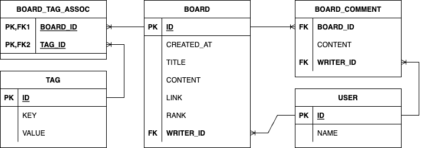

# TDD, Clean Code with Kotlin Preview

[TDD, Clean Code with Kotlin](https://catsbi.oopy.io/5fcea983-4c9c-4580-9876-ac5349e0e3a0) 글을 참고하여 작성한 글입니다.

# Start Kotlin
- [자바 개발자를 위한 코틀린 입문](https://www.inflearn.com/course/java-to-kotlin)
- [DIMO Kotlin 강좌](https://www.youtube.com/watch?v=8RIsukgeUVw&list=PLQdnHjXZyYadiw5aV3p6DwUdXV2bZuhlN)
- [Kotlin in Action](https://www.yes24.com/Product/Goods/55148593)
- [아토믹 코틀린](https://www.yes24.com/Product/Goods/117817486)
- [코틀린 쿡북](https://www.yes24.com/Product/Goods/90452827)
- [객체지향의 사실과 오해](https://www.yes24.com/Product/Goods/18249021)
- [오브젝트](https://www.yes24.com/Product/Goods/74219491)

**Kotlin Web Compiler Site**

<https://play.kotlinlang.org/>

---

## 변수와 자료형

**✅ 변수의 선언**

> `var`: 일반적으로 통용되는 변수. 언제든지 읽기 쓰기가 가능
`val`: 선언시에만 초기화 가능. 중간에 값 변경 불가
> 

```kotlin
fun main() {
    var a: Int
    a = 123
    println(a) // 123
    
    var b: Int? = null // nallable 변수
    b = null
    println(b) // null
}
```

변수의 선언 위치에 따른 이름

- `Property`: 클래스에 선언된 변수
- `Local Variable`: 이외의 Scope 내에 선언된 변수

| 코틀린은 기본 변수에서 null을 허용하지 않는다.

- 변수에 값을 할당하지 않은채로 사용하게 되면 컴파일 에러

**✅ 코틀린의 기본 자료형**

> 자바와의 호환을 위해 자바와 거의 동일
> 

```kotlin
fun main() {
    // 정수형(8진수 표기는 미지원)
    var intValue:Int = 1234 // 32비트 이내의 10진수
    var longValue:Long = 1234L // 64비트 Long타입 10진수
    var intValueByHex:Int = 0x1af // 16진수
    var intValueByBin:Int = 0b10110110 // 2진수
    
    // 실수형
    var doubleValue:Double = 123.5 // 실수의 기본
    var doubleValueWithExp:Double = 123.5e10 // 필요 시 지수 표기법 추가
    var floatValue:Float = 123.5f // 16비트 float

    // 문자형(내부적으로 문자열을 UTF-16 BE로 관리. 글자 하나가 2bytes 메모리 공간 사용)
    var charValue:Char = 'a'
    var koreanCharValue:Char = '가'
    
    // 논리형
    var booleanValue:Boolean = true
    
    // 문자열
    val stringValue = "one line string test"
    val multiLineStringValue = """multiline
    string
    test"""
}
```

지원되는 특수문자

<center></center>

---

## 형변환과 배열

**✅ 형변환**

> 코틀린은 형변환 시 발생할 수 있는 오류를 막기 위해 ***암시적 형변환은 미지원***
> 

```kotlin
fun main() {
    // 명시적 형변환
    var a: Int = 54321
    var b: Long = a.toLong()
}
```

**✅ 배열**

> `arrayOf`, `arrayOfNulls`
> 

```kotlin
fun main() {
    // 값이 있는 배열 생성
    var intArr = arrayOf(1, 2, 3, 4, 5)
    
    // 특정 크기를 가진 비어있는 배열 생성
    var nullArr = arrayOfNulls<Int>(5)
    
    intArr[2] = 8
    println(intArr[4])
}
```

---

## 타입추론과 함수

**✅ 타입추론**

> 변수 함수들을 선언할 때나 연산이 이루어질 때 자료형을 코드에 명시하지 않아도 자동으로 자료형을 추론
> 
- 반드 특정한 자료형으로 지정해야하는 상황이 아니라면 대부분은 코틀린의 타입추론 기능을 이용

**✅ 함수**

> 코틀린에서 함수는 내부적으로 기능을 가진 형태지만, 
외부에서 볼 때는 파라미터를 넣는다는 점 외에는 자료형이 결정된 변수라는 개념으로 접근
> 

```kotlin
fun main() {
	  println(add(5, 6, 7))
    println(add2(5, 6, 7))
}

// 함수
fun add(a: Int, b: Int, c: Int): Int {
    return a + b + c
}

// 단일표현식(반환형 타입 추론)
fun add2(a: Int, b: Int, c: Int) = a + b + c
```

---

## 조건문과 비교연산자

**✅ 조건문**

`if`

```kotlin
fun main() {
    var a = 11
    if (a < 10) {
        println("a is greater than 10")
    } else {
        println("a is less than or equal to 10")
    }
}

```

`when`

- 등호나 부등호는 사용 불가

```kotlin
fun doWhen (a: Any) {
    when(a) {
        1 -> println("this is number")
        "Hello" -> println("this is string")
        is Long -> println("this is long type")
        !is String -> println("this is not String type")
        else -> println("this is else area")
    }
}

fun doWhenReturn (a: Any) {
    var result = when(a) {
        1 -> "this is number"
        "Hello" -> "this is string"
        is Long -> "this is long type"
        !is String -> "this is not String type"
        else -> "this is else area"
    }
    println(result)
}
```

**✅ 비교연산자**

- 부등호: <, ≤, >, ≥, ≠
- 등호: ==
- 자료형 확인: is, !is
    - 호환 여부를 체크하고 형변환까지 한번에 진행
    
    ```kotlin
    a is Int
    ```
    
---

## 반복문

다른 언어에서의 반복문과는 약간의 차이가 있다.

```kotlin
fun main() {
	for (i in 0..9) {
        print(i)
    } // 0123456789
    
    println()
    for (i in 0..9 step 3) {
        print(i)
    } // 0369
    
    println()
    for (i in 9 downTo 0) {
        print(i)
    } // 9876543210
    
    println()
    for (i in 9 downTo 0 step 3) {
        print(i)
    } // 9630
    
    println()
    for (i in 'a'..'e') {
        print(i)
    } // abcde
}
```

레이블이 달린 반복문 기준으로 반복문을 종료시켜주는 기능

- 레이블 이름과 @기호로 즉시 반복문 종료

```kotlin
loop@for (i in 1..10) {
    for (j in 1..10) {
        if (i == 1 && j == 2) break@loop
        println("i : $i, j : $j")
    }
}
```

---

## 클래스

```kotlin
fun main() {
	var a = Person("박보영", 1990)
    var b = Person("전정국", 1997)
    var c = Person("장원영", 2004)
    
    println("안녕하세요. ${a.birthYear}년생 ${a.name}입니다.")
    
    b.introduce()
    c.introduce()
    
    var d = Person("이루다")
    var e = Person("차은우")
    var f = Person("류수정")
}

class Person(var name:String, val birthYear:Int) { // 클래스의 속성들을 선언함과 동시에 생성자를 선언하는 방법
    /** init
     * 생성자를 통해 인스턴스가 만들어질 때 호출되는 함수
     */
    init {
        println("[init] ${this.birthYear}년생 ${this.name}님의 인스턴스가 생성되었습니다.")        
    }
    
    /** 보조 생성자
     * 보조 생성자를 만들 경우 반드시 기본 생성자를 통해 속성을 초기화
     */
    constructor(name:String) : this(name, 1997) {
        println("[constructor] 보조 생성자가 사용되었습니다.")
        
    }
    
    fun introduce() {
        println("[introduce] 안녕하세요. ${birthYear}년생 ${name}입니다.")
    }
}
```

```bash
[init] 1990년생 박보영님의 인스턴스가 생성되었습니다.
[init] 1997년생 전정국님의 인스턴스가 생성되었습니다.
[init] 2004년생 장원영님의 인스턴스가 생성되었습니다.
안녕하세요. 1990년생 박보영입니다.
[introduce] 안녕하세요. 1997년생 전정국입니다.
[introduce] 안녕하세요. 2004년생 장원영입니다.
[init] 1997년생 이루다님의 인스턴스가 생성되었습니다.
[constructor] 보조 생성자가 사용되었습니다.
[init] 1997년생 차은우님의 인스턴스가 생성되었습니다.
[constructor] 보조 생성자가 사용되었습니다.
[init] 1997년생 류수정님의 인스턴스가 생성되었습니다.
[constructor] 보조 생성자가 사용되었습니다.
```

### 상속

```kotlin
fun main() {
	var a = Animal("별이", 5, "개")
    var b = Dog("별이", 5)
    
    a.introduce()
    b.introduce()
    
    b.bark()
    
    var c = Cat("루이", 1)
    
    c.introduce()
    c.meow()
}

/** open
 * 클래스가 상속될 수 있도록 허용하는 키워드
 */
open class Animal (var name:String, var age:Int, var type:String) {
    fun introduce() {
        println("저는 ${type} ${name}이고, ${age}살 입니다.")
    }
}

/** 상속 규칙
 * 1. 서브 클래스는 수퍼 클래스에 존재하는 속성과 같은 이름의 속성을 가질 수 없다.
 * 2. 서브 클래스가 생성될 때 반드시 수퍼클래스의 생성자까지 호출되어야 한다.
 */
 class Dog (name:String, age:Int) : Animal (name, age, "개") {
     fun bark() {
         println("멍멍")
     }
 }
 
class Cat (name:String, age:Int) : Animal (name, age, "고양이") {
     fun meow() {
         println("야옹야옹")
     }
}
```

### 오버라이딩

```kotlin
fun main() {
    var t = Tiger()
    t.eat()
}

/** 
 * 상속이 가능하도록 open 된 클래스
 */
open class Animal () {
    // 수퍼 클래스에서 open 된 함수는 서브 클래스에서 override 가능
    open fun eat() {
        println("음식을 먹습니다")
    }
}

class Tiger : Animal() {
    override fun eat() {
        println("고기를 먹습니다")
    }
}
```

### 추상화

추상 클래스: 추상 함수를 포함하는 클래스

```kotlin
fun main() {
    var r = Rabbit()
    r.eat()
    r.sniff()
}

// 추상 클래스
abstract class Animal () {
    abstract fun eat() // 추상 함수
    fun sniff() {
        println("킁킁")
    }
}

class Rabbit : Animal() {
    override fun eat() {
        println("당근을 먹습니다")
    }
}
```

인터페이스: 속성, 추상함수, 일반함수 포함

- 구현부가 있는 함수 → open 함수로 간주
- 구현부가 없는 함수 → abstract 함수로 간주
- ⚠️ 여러개의 인터페이스나 클래스에서 같은 이름과 형태를 가진 함수를 구현하고 있다면,
    - 서브클래스에서는 혼선이 일어나지 않도록 반드시 오버라이딩하여 재구현 필요

```kotlin
fun main() {
    var d = Dog()
    
    d.run()
    d.eat()
}

interface Runner {
    fun run()
}

interface Eater {
    fun eat() {
        println("음식을 먹습니다")
    }
}

class Dog : Runner, Eater {
    override fun run() {
        println("우다다다 뜁니다")
    }
    
    override fun eat() {
        println("허겁지겁 먹습니다")
    }
}
```

---

## 프로젝트 구조

- `Project`
    - 모든 내용을 담는 큰 틀
- `Module`
    - 하나의 프로젝트는 여러개의 모듈로 이루어질 수 있다.
        - 모듈은 직접 만들 수도 있고, 필요한 기능을 미리 구현해 둔 라이브러리 모듈을 가져와 사용 가능
    - 모듈 안에는 다수의 폴더(kt, 모듈 관련 설정, 리소스 파일 등)와 파일이 존재
- `Package`
    - 소스 코드의 소속을 지정하기 위한 논리적 단위
    - 일반적으로 패키지 이름을 지을 때 회사 도메인을 거꾸로 해서 프로젝트명과 세부 기능을 붙이는 방식
        - com.youtube.aaron
        - com.youtube.aaron.base
        - com.youtube.aaron.kotlin
        - com.youtube.aaron.talk
    - 코틀린은 자바와 달리 폴더 구조와 패키지 명을 일치시키지 않아도 된다.
        - 단순히 파일 상단에 패키지만 명시해 주면 컴파일러가 알아서 처리

> 코틀린은 클래스명과 파일명이 일치하지 않아도 되며, 
> 
> 하나의 파일에 여러개의 클래스를 넣어도 알아서 컴파일 가능
- 파일이나 폴더 기준으로 구분하지 않고 파일내에 있는 `package` 키워드 기준으로 구분

---

## 스코프와 접근 제한자

**✅ 스코프**

> 패키지 안에 변수, 함수, 클래스는 모두 하나의 스코프에 있는 멤버
> 
> 함수, 클래스안에 또다른 변수, 함수가 존재한다면 패키지 안에 또다른 하위 스코프로 동작

<center></center>

**스코프에 대한 세 가지 규칙**

- (1) 스코프 외부에서는 스코프 내부의 멤버를 `참조연산자`로만 참조 가능

```kotlin
a.eat()
import com.google.aaron
import com.google.aaron.A
```

- (2) 동일 스코프 내에서는 멤버들을 `공유`할 수 있음
- (3) 하위 스코프에서는 상위 스코프의 멤버를 재정의 가능

✅ 접근 제한자

> 변수, 함수, 클래스 선언 시 맨 앞에 붙여 사용

스코프 외부에서 스코프 내부에 접근할 때 그 권한을 `개발자가 제어`할 수 있는 기능
- public
- internal
- private
- protected

**Package Scope**

| public (default) | 어떤 패키지에서도 접근 가능  |
| ---------------- | ---------------------------- |
| internal         | 같은 모듈 내에서만 접근 가능 |
| private          | 같은 파일 내에서만 접근 가능 |
| protected        | 미사용                       |

**Class Scope**

| public (default) | 클래스 외부에서 항상 접근 가능              |
| ---------------- | ------------------------------------------- |
| private          | 클래스 내부에서만 접근 가능                 |
| protected        | 클래스 자신과 상속받은 클래스에서 접근 가능 |
| internal         | 미사용                                      |

---

## 고차함수와 람다함수

✅ 고차함수

> 함수를 마치 클래스에서 만들어낸 `인스턴스처럼` 취급하는 방법
- 함수를 `파라미터`로 넘겨줄 수도 있고, `결과값`으로 반환받을 수도 있는 방법

코틀린에서는 모든 함수를 고차함수로 사용 가능

- `::` → 일반 함수를 고차 함수로 변경해 주는 연산자
- 함수를 파라미터로 받을 경우 타입은 함수의 `(파라미터 자료형) -> 반환형 자료형`

```kotlin
fun main() {
    b(::a) // 일반 함수를 고차 함수로 변경
}

fun a (str: String) {
    println("$str 함수 a")
}

// 함수를 파라미터로 받기. (파라미터 자료형) -> 반환형 자료형
fun b (function: (String)->Unit) {
    function("b가 호출한")
}
```

✅ 람다함수

> 람다함수는 일반함수와 달리 그 자체가 고차함수이므로 별도의 연산자 없이 변수에 담을 수 있다.

```kotlin
fun main() {
    /** 자료형 자동 추론으로 축약 사용
     * var c: (String) -> Unit = { str:String -> println("$str 함수 a")}
     * var c: (String) -> Unit = { str -> println("$str 함수 a")}
     */
    var c = { str:String -> println("$str 함수 a")}
    b(c)
}

fun b (function: (String)->Unit) {
    function("b가 호출한")
}
```

ℹ️ 고차함수와 람다함수를 사용하여 함수를 일종의 변수로 사용 가능한 편의성

- 컬렉션 조작이나 스코프 함수에도 도움

---

## 스코프 함수

> 함수형 언어의 특징을 더 편리하게 사용할 수 있도록 기본 제공하는 함수들

클래스에서 생성한 인스턴스를 스코프 함수에 전달하면, 

- 인스턴스의 속성이나 함수를 좀 더 깔끔하게 불러 쓸 수 있다.

**📦 apply**

> 인스턴스 생성 후 변수에 담기 전 `초기화 과정을 수행`할 때 주로 사용
- apply의 scope 안에서 직접 인스턴스의 속성과 함수를 참조연산자 없이 사용 가능
    - 또한 인스턴스 자신을 다시 반환하므로 생성되자마자 조작된 인스턴스를 변수에 바로 초기화 가능

```kotlin
fun main() {
    var a = Book("코틀린 강의", 10000).apply {
        name = "[초특가] " + name
        discount()
    }
    println(a.name + ", " + a.price) // [초특가] 코틀린 강의, 8000
}

class Book(var name: String, var price: Int) {
    fun discount() {
        price -= 2000
    }
}
```

**📦 run**

> 인스턴스가 만들어진 후에 `인스턴스의 함수나 속성을 스코프 내에서 사용`해야 할 경우 유용
- apply와 동일하게 스코프 안에서 참조연산자를 사용하지 않아도 된다는 점은 같지만, 일반 람다함수처럼 인스턴스대신 결과값을 반환

```kotlin
fun main() {
    var a = Book("코틀린 강의", 10000).apply {
        name = "[초특가] " + name
        discount()
    }
    println(a.name + ", " + a.price) // [초특가] 코틀린 강의, 8000
    
    a.run {
        println("상품명: ${name}, 가격: ${price}원") // 상품명: [초특가] 코틀린 강의, 가격: 8000원
    }
}
```

**📦 with**

- run과 동일한 기능을 가지지만, 인스턴스를 참조연산자 대신 파라미터로 받는다는 차이

```kotlin
a.run { ... }
with(a) { ... }

...

fun main() {
    
    var a = Book("코틀린 강의", 10000).apply {
        name = "[초특가] " + name
        discount()
    }

    with(a) {
        println("상품명: ${name}, 가격: ${price}원") // 상품명: [초특가] 코틀린 강의, 가격: 8000원
    }
}
```

**📦 also**

- apply와 유사하게 처리가 끝나면 인스턴스를 반환하지만, 파라미터로 인스턴스를 넘긴 것과 같이 `it`을 통해 인스턴스를 사용
    - 같은 이름의 변수나 함수가 스코프 바깥에 중복되어 있는 경우 혼란을 방지하기 위함

```kotlin
fun main() {

    var a = Book("코틀린 강의", 10000).also {
        it.name = "[초특가] " + it.name
        it.discount()
    }

    a.run {
        println("상품명: ${name}, 가격: ${price}원") // 상품명: [초특가] 코틀린 강의, 가격: 8000원
    }
}
```

**📦 let**

- run과 유사하게 처리가 끝나면 최종값을 반환하지만, 파라미터로 인스턴스를 넘긴 것과 같이 `it`을 통해 인스턴스를 사용
    - 같은 이름의 변수나 함수가 스코프 바깥에 중복되어 있는 경우 혼란을 방지하기 위함

```kotlin
fun main() {
    
    var price = 5000
    
    var a = Book("코틀린 강의", 10000).apply {
        name = "[초특가] " + name
        discount()
    }

    a.run {
        // main 함수의 price 변수를 우선
        println("상품명: ${name}, 가격: ${price}원") // 상품명: [초특가] 코틀린 강의, 가격: 5000원
    }
    
    a.let {
        println("상품명: ${it.name}, 가격: ${it.price}원") // 상품명: [초특가] 코틀린 강의, 가격: 8000원
    }
}
```

---

## **Object**

> 단 하나의 객체만으로 공통적인 속성과 함수를 사용해야 하는 경우
> 
> `생성자 없이` 객체를 직접 생성

`object`로 선언된 객체는 최초 사용 시 자동으로 생성되고, 이후에는 코드 전체에서 공용으로 사용될 수 있다.

```kotlin
fun main() {
    // 인스턴스를 생성하지 않고 그 자체로 객체
	  println(Counter.count)
    
    Counter.countUp()
    Counter.countUp()
    
    println(Counter.count)
    
    Counter.clear()
    
  	println(Counter.count)
}

object Counter {
    var count = 0
    
    fun countUp() {
        count++
    }
    
    fun clear() {
        count = 0
    }
}
```

### **Companion Object**

- 기존 클래스 안에 있는 오브젝트(static 멤버와 유사)

```kotlin
fun main() {
    var a = FoodPoll("짜장")
    var b = FoodPoll("짬뽕")
    
    a.vote()
    a.vote()

    b.vote()
    b.vote()
    b.vote()
    
    println("${a.name} : ${a.count}")  // 짜장 : 2
    println("${b.name} : ${b.count}") // 짬뽕 : 3
    println("총계 : ${FoodPoll.total}") // 총계 : 5
}

class FoodPoll (val name: String) {
    companion object {
        var total = 0 // 다른 인스턴스에서 공유하는 자원
    }
    
    var count = 0
    
    fun vote() {
        total++
        count++
    }
}
```

---

## **익명객체와 옵저버 패턴**

> 이벤트가 발생할 때마다 `즉각적으로 처리`할 수 있도록 만드는 패턴

이벤트를 수신하는 클래스와 이벤트의 발생 및 전달을 담당하는 클래스와 통신을 위해 사용되는 인터페이스를 `Observer`, 코틀린에서는 `listener` 라고 부른다.

- 이벤트를 넘겨주는 행위는 `callback`

```kotlin
fun main() {
    EventPrinter().start()
}

interface EventListener {
    fun onEvent(count: Int)
}

class Counter(var listener: EventListener) {
    fun count() {
        for (i in 1..100) {
            if (i % 5 == 0) listener.onEvent(i)
        }
    }
}

class EventPrinter: EventListener {
    override fun onEvent(count: Int) {
        print("${count}-")
    }
    
    fun start() {
        val counter = Counter(this)
        counter.count()
    }
}
```

익명클래스 활용

- object와 형태는 비슷하지만 이름이 없다는 차이

```kotlin
EventPrinter().start()

...

class EventPrinter {
    fun start() {
        val counter = Counter(object: EventListener {
            override fun onEvent(count: Int) {
                print("${count}-")
            }
        })
        counter.count()
    }
}
```

---

## 클래스의 다형성

`Up-casting`: 상위 자료형인 수퍼클래스를 변환

```kotlin
var a: Drink = Cola()
```

`Down-casting`: Up-casting된 인스턴스를 다시 하위 자료형으로 변환

- `as`: 변수를 호환되는 자료형으로 변환해주는 캐스팅 연산자
    - 반환값뿐만 아니라 변수 자체도 다운캐스팅

```kotlin
var a: Drink = Cola()

a as Cola // 이후 a는 Cola로 동작
var b = a as Cola // 변환 결과를 반환받아 변수에 초기화
```

- `is`: 변수가 자료형에 호환되는지 체크한 후 변환해주는 캐스팅 연산자 (조건문 내에서 사용)

```kotlin
var a: Drink = Cola()
if (a is Cola) {
    // 해당 영역 안에서만 a가 Cola로 사용
}
```

Example

```kotlin
fun main() {
	var a = Drink()
    a.drink() // 음료를 마십니다.
    
    var b: Drink = Cola()
    b.drink() // 음료중에 콜라를 마십니다.
    
    if (b is Cola) {
        b.washDished() // 콜라로 설거지를 합니다.
    }
    
    var c = b as Cola
    c.washDished() // 콜라로 설거지를 합니다.
    b.washDished()  // 반환값뿐만 아니라 변수 자체도 다운캐스팅
}

open class Drink {
    var name = "음료"
    
    open fun drink() {
        println("${name}를 마십니다.")
    }
}

class Cola: Drink() {
    var type = "콜라"
    
    override fun drink() {
        println("${name}중에 ${type}를 마십니다.")
    }
    
    fun washDished() {
        println("${type}로 설거지를 합니다.")
    }
}
```

---

## 제너릭

> 클래스나 함수에서 사용하는 자료형을 외부에서 지정할 수 있는 기능

함수나 클래스를 선언할 때 고정적인 자료형 대신 실제 자료형으로 대체되는 타입 파라미터를 받아 사용

- 제네릭을 사용할 경우 자료형을 대체하게 되어 캐스팅을 방지할 수 있고, 성능을 높일 수 있다.

**클래스에 적용**

```kotlin
fun main() {
	UsingGeneric(A()).doShouting()
    UsingGeneric(B()).doShouting()
    UsingGeneric(C()).doShouting()
}

open class A {
    open fun shout() {
        println("A가 소리칩니다")
    }
}

class B: A() {
    override fun shout() {
        println("B가 소리칩니다")
    }
}

class C: A() {
    override fun shout() {
        println("C가 소리칩니다")
    }
}

class UsingGeneric<T: A> (val t: T) {
    fun doShouting() {
        t.shout()
    }
}
```

**함수에 적용**

```kotlin
fun main() {
		...
		
    doShouting(B())
}

fun <T: A> doShouting(t: T) {
    t.shout()
}
```

---

## 리스트

> 여러 개의 데이터를 원하는 순서로 넣어 관리

리스트에는 두 가지의 종료가 존재

`List<out T>`

- 생성 시 넣은 객체를 대체/추가/삭제 불가
- 전용 함수: listOf(1, 2, 3)

`MutableList<T>`

- 생성 시 넣은 객체를 대체/추가/삭제 가능
- 전용 함수: mutableListOf(1, 2, 3)
- 요소 추가(add), 삭제(remove, removeAt) 기능 외에도
    - 무작위 섞기(shuffle), 정렬(sort) 기능도 제공

```kotlin
fun main() {
  	val a = listOf("사과", "딸기", "배")
    println(a[1]) // 딸기
    
    for (fruit in a) {
        print("${fruit}:")
    }
    println() // 사과:딸기:배:
    
    var b = mutableListOf(6, 3, 1)
    println(b) // [6, 3, 1]
    
    b.add(4)
    println(b) // [6, 3, 1, 4]
    
    b.add(2, 8) // [6, 3, 8, 1, 4]
    println(b)
    
    b.removeAt(1)
    println(b) // [6, 8, 1, 4]
    
    b.shuffle()
    println(b) // [6, 1, 4, 8]
    
    b.sort()
    println(b) // [1, 4, 6, 8]
}
```

---

## 문자열 다루기

문자열 변형

```kotlin
val test1 = "Test.Kotlin.String"
    
println(test1.length) // 18

println(test1.toLowerCase()) // test.kotlin.string
println(test1.toUpperCase()) // TEST.KOTLIN.STRING

val test2 = test1.split(".")
println(test2) // [Test, Kotlin, String]

println(test2.joinToString()) // Test, Kotlin, String
println(test2.joinToString("-")) // Test-Kotlin-String

println(test1.substring(5..10)) // Kotlin
```

문자열 확인

```kotlin
val nullString: String? = null
val emptyString = ""
val blankString = " "
val normalString = "A"

println(nullString.isNullOrEmpty()) // true
println(emptyString.isNullOrEmpty()) // true
println(blankString.isNullOrEmpty()) // false
println(normalString.isNullOrEmpty()) // false
println()

println(nullString.isNullOrBlank()) // true
println(emptyString.isNullOrBlank()) // true
println(blankString.isNullOrBlank()) // true
println(normalString.isNullOrBlank()) // false
```

문자열 탐색

```kotlin
fun main() {
   	val test3 = "kotlin.kt"
    val test4 = "java.java"
    
    println(test3.startsWith("java")) // false
  	println(test4.startsWith("java")) // true
    
    println(test3.endsWith(".kt")) // true
    println(test4.endsWith(".kt")) // false
    
    println(test3.contains("lin")) // true
    println(test4.contains("lin")) // false
}
```

---

## Null 처리와 동일성확인

### Null 처리

null을 처리하는 방법들

`?.`  : null safe operator

- 참조연산자 실행 전 먼저 객체가 null인지 확인하고, 객체 null 여부에 따라 뒤에 오는 구문 실행 여부 판단
- sample?.toUpperCase()

`?:` : elvis operator

- 객체가 null이 아니라면 그대로 사용하지만, null이라면 연산자 우측 객체로 대체
- sample?:”default”

`!!.` : non-null assertion operator

- 참조연산자 사용 시 null 여부를 컴파일 시 확인하지 않도록 하여 런타임 시 NPE이 발생하도록 의도적으로 방치
- sample!!.toUpperCase()

```kotlin
var a: String? = null

println(a?.toUpperCase()) // null

println(a?:"default".toUpperCase()) // DEFAULT

println(a!!.toUpperCase()) // NPE!!!
```

null safe 연산자는 스코프 함수와 사용하면 편리

- null 체크를 위해 if 보다 편리한 기능

```kotlin
fun main() {
	var a: String? = null
    
	a?.run { // a가 null이므로 스코프 전체가 미수행
        println(toUpperCase())
        println(toLowerCase())
    }
    
    var b: String? = "Kotlin example"
    
	b?.run { // a가 null이므로 스코프 전체가 미수행
        println(toUpperCase())
        println(toLowerCase())
    }
}
```

### 동일성 확인

내용의 동일성

- 자동으로 판단되는 것이 아닌 코틀린 모든 클래스가 내부적으로 상속받는 `Any` 최상위 클래스의 equals() 함수가 반환하는 Boolean 값으로 판단
- a == b

객체의 동일성

- a === b

```kotlin
fun main() {
    var a = Product("콜라", 1000)
    var b = Product("콜라", 1000)
    var c = a
    var d = Product("사이다", 1000)
    
    println(a == b) // true
    println(a === b) // false

    println(a == c) // true
    println(a === c) // true
    
    println(a == d) // false
    println(a === d) // false
}

class Product(val name: String, val price: Int) {
    override fun equals(other: Any?): Boolean {
        if (other is Product) {
            return other.name == name && other.price == price
        } 
        return false
    }
}
```

---

## **함수의 argument를 다루는 방법과 infix 함수**

**✅ default arguments**

> 파라미터를 받아야 하는 함수이지만 파라미터가 없더라도 기본값으로 동작해야 할 경우 사용

```kotlin
fun main() {
    deliveryItem("짬뽕") // 짬뽕, 1개를 집에 배달하였습니다.
    deliveryItem("책", 3) // 책, 3개를 집에 배달하였습니다.
    deliveryItem("노트북", 30, "학교") // 노트북, 30개를 학교에 배달하였습니다.
}

fun deliveryItem(name: String, count: Int = 1, destination: String = "집") {
    println("${name}, ${count}개를 ${destination}에 배달하였습니다.")
}
```

단, 파라미터의 중간을 비우면 동작하지 않는다.

- 이 경우에는 **`named arguments` 사용**
- 파라미터의 순서와 관계없이 파라미터 이름을 사용하여 직접 파라미터 값을 할당

```kotlin
deliveryItem("노트북", destination = "학교")
```

✅ variable number of arguments (`vararg`)

> 같은 자료형을 개수에 상관없이 파라미터로 받고 싶을 경우 사용

```kotlin
fun main() {
	sum(1, 2, 3, 4)
}

fun sum(vararg numbers: Int) {
    var sum = 0
    
    for (n in numbers) {
        sum += n
    }
    
    print(sum)
}
```

개수가 지정되지 않은 파라미터라는 특징이 있으므로 다른 파라미터와 같이 사용할 경우에는 맨 마지막에 선언

- fun sample(text: String, vararg x: Int)

✅ **infix 함수**

- 함수 정의 시 앞에 `infix` 를 붙인 후, 함수 이름을 infix 함수가 적용될 `자료형.이름`으로 지정

```kotlin
fun main() {
    /**
     * 6: infix 함수가 적용되는 객체 자신(this)
     * 4: 파라미터인 x
     */
	println(6 multiply 4)
    // 동일하게 동작
    println(6 multiply(4))
}

infix fun Int.multiply(x: Int): Int = this * x
```

참고로, 클래스 안에서 infix 함수 선언 시 적용 클래스가 자기 자신이므로 클래스 이름은 생략 가능

- infix fun multiply(x: Int): Int = this * x

---

## 중첩 클래스와 내부 클래스

`Nested Class`(중첩 클래스)

> 형태만 내부에 존재할 뿐, 외부 클래스의 내용을 공유할 수 없는 ***별개의 클래스***

`Inner Class` (내부 클래스)

> 외부 클래스 객체 안에서 사용되는 클래스로 외부 클래스의 속성과 함수 사용 가능
- 혼자서 객체를 만들 수는 없고, 외부 클래스의 객체가 있어야만 생성과 사용이 가능

```kotlin
fun main() {
  	Outer.Nested().introduce() // Nested Class
    val nested = Outer.Nested() // Nested Class 
    nested.introduce()
    
    val outer = Outer()
    val inner = outer.Inner()
    
    inner.introduceInner() // Inner Class
    inner.introduceOuter() // Outer Class
    
    outer.text = "Changed Outer Class"
    inner.introduceOuter() // Changed Outer Class
}

class Outer {
    var text = "Outer Class"
    
    class Nested {
        fun introduce() {
            println("Nested Class")
        }
    }
    
    inner class Inner {
        var text = "Inner Class"
        
        fun introduceInner() {
            println(text)
        }
        
        fun introduceOuter() {
            println(this@Outer.text)
        }
    }
}
```

---

## Data Class & Enum Class

✅ **Data Class**

> 데이터를 다루는데 최적화된 클래스

5가지 기능을 내부적으로 자동 생성

- equals(): 내용의 동일성 판단
- hashcode(): 객체 내용에서 고유한 코드를 생성
- toString(): 포함된 속성을 보기 쉽게 표현
- copy()
    
    ```kotlin
    // 파라미터가 없는 경우 똑같은 내용으로 생성
    val a = Data("A", 7)
    val b = a.copy()
    
    // 파라미터가 있으면 해당 파라미터로 교체하여 생성
    val a = Data("A", 7)
    val b = a.copy("B")
    ```
    

Example

```kotlin
fun main() {
  	val a = General("보영", 212)
    
    println(a == General("보영", 212)) // false
    println(a.hashCode()) // 20132171
    println(a) // General@133314b
    
    val b = Data("루다", 306)

    println(b == Data("루다", 306)) // true
    println(b.hashCode()) // 46909878
    println(b) // Data(name=루다, id=306)
    
    println(b.copy()) // Data(name=루다, id=306)
    println(b.copy("아린")) // Data(name=아린, id=306)
    println(b.copy(id = 618)) // Data(name=루다, id=618)
}

class General(val name: String, val id: Int)

data class Data(val name: String, val id: Int)
```

**✅ componentX(): 속성을 순서대로 반환**

```kotlin
Data("A", 7)
component1() -> "A"
component2() -> 7

listOf(Data("A", 7), Data("B", 1))
component1() -> Data("A", 7)
component2() -> Data("B", 1)
```

Example

```kotlin
fun main() {
	val list = listOf(Data("보영", 212),
                     Data("루다", 306),
                     Data("아린", 618))
    
    for ((a, b) in list) {
        // 내부적으로 component1(), component2() 함수 사용
        println("${a}, ${b}")
    }
}

class General(val name: String, val id: Int)

data class Data(val name: String, val id: Int)

```

**✅ Enum Class**

> enumerated type (열거형)

enum 클래스 안의 객체들은 관행적으로 상수를 나타낼 때 사용하는 대문자로 기술

- enum의 객체들은 고유한 속성을 가질 수 있음

```kotlin
fun main() {
	var state = State.SING
    println(state) // SING (toString을 통해 상태 객체의 이름이 출력)
    
    state = State.SLEEP
    println(state.isSleeping()) // true
    
    state = State.EAT
    println(state.message) // 밥을 먹습니다
}

enum class State(val message: String) {
    SING("노래를 부릅니다"),
    EAT("밥을 먹습니다"),
    SLEEP("잠을 잡니다");
    
   fun isSleeping() = this == State.SLEEP
}
```

---

## Set & Map

**✅ Set**

> 순서가 정렬되지 않으며, 중복이 허용되지 않는 컬렉션

```kotlin
fun main() {
	  val a = mutableSetOf("귤", "바나나", "키위")
    
    for (item in a) {
        println("${item}") // 귤 바나나 키위
    }
    
    a.add("자몽")
    println(a) // [귤, 바나나, 키위, 자몽]
    
    a.remove("바나나")
    println(a) // [귤, 키위, 자몽]
    
    println(a.contains("귤")) // true
}
```

**✅ Map**

> 객체를 넣을 때 그 객체를 찾아낼 수 있는 Key를 쌍으로 넣어주는 컬렉션

```kotlin
fun main() {
	val a = mutableMapOf("레드벨벳" to "음파음파",
                         "트와이스" to "FANCY",
                         "ITZY" to "ICY")
    
    for (entry in a) {
        println("${entry.key} : ${entry.value}") // 레드벨벳 : 음파음파, 트와이스 : FANCY, ITZY : ICY
    }
    
    a.put("오마이걸", "번지")
    println(a) // {레드벨벳=음파음파, 트와이스=FANCY, ITZY=ICY, 오마이걸=번지}
    
    a.remove("ITZY")
    println(a) // {레드벨벳=음파음파, 트와이스=FANCY, 오마이걸=번지}
    
    println(a["레드벨벳"]) // 음파음파
}
```

---

## 컬렉션 함수

`forEach`

- 컬렉션 안에서 모든 원소를 it 을 통해 참조
- collection.forEach { println(it) }

`filter`

- 컬렉션 안에서 조건에 맞는 원소를 모아서 다시 컬렉션으로 반환
- collection.filter { it < 4 }

`map`

- 수식을 통해 연산된 결과를 컬렉션으로 반환
- collection.map { it * 2 }

`any`

- 하나라도 조건에 맞으면 true
- collection.any { it == 0 }

`all`

- 모두 조건에 맞으면 true
- collection.all { it == 0 }

`none`

- 하나라도 조건에 맞지 않으면 true
- collection.none { it == 0 }

`first`

- collection.first(): 컬렉션의 첫 번째 아이템 반환
- collection.first{ it > 3 } : 조건에 맞는 첫번째 아이템 반환
- `find` 함수로 대체 가능

`last`

- collection.last{ it > 3 } : 조건에 맞는 마지막 아이템 반환
- `findLast` 함수로 대체 가능

⚠️ first, last 함수는 조건에 맞는 객체가 없는 경우 NoSuchElementException 발생

- 이 경우 firstOrNull, lastOrNull 활용

`count`

- collection.count() : 컬렉션의 모든 아이템 개수 반환
- collection.count { it > 7 } : 조건에 맞는 아이템 개수 반환

```kotlin
fun main() {
	val nameList = listOf("박수영", "김지수", "김다현", "신유나", "김지우")
    
    nameList.forEach { print(it + " ") } // 박수영 김지수 김다현 신유나 김지우 
    println()
    
    println(nameList.filter { it.startsWith("김") }) // [김지수, 김다현, 김지우]
    println(nameList.map { "이름 : " + it }) // [이름 : 박수영, 이름 : 김지수, 이름 : 김다현, 이름 : 신유나, 이름 : 김지우]

    println(nameList.any { it == "김지연" } ) // false
    println(nameList.all { it.length == 3 } ) // true
    println(nameList.none { it.startsWith("이") }) // true
    
    println(nameList.first { it.startsWith("김") }) // 김지수
    println(nameList.last { it.startsWith("김") }) // 김지우
    println(nameList.count { it.contains("지") }) // 2
}
```

`associateBy`

- list의 아이템에서 key를 추출하여 map 으로 변환하는 함수
- collection.associateBy { it.name }

`groupBy`

- key가 같은 아이템끼리 배열로 묶어 map으로 만드는 함수
- collection.groupBy { it.birthYear }

`partition`

- 아이템에 조건을 걸어 두 개의 컬렉션으로 나누는 함수
- collection.partition { it.birthYear > 2002 }
- val (over2002, under2002) = collection.partition { it.birthYear > 2002 }

```kotlin
fun main() {
  	data class Person(val name: String, val birthYear: Int)
    
    val personList = listOf(Person("유나", 1992),
                            Person("조이", 1996),
                            Person("츄", 1999),
                            Person("유나", 2003))
    
    // {1992=Person(name=유나, birthYear=1992), 1996=Person(name=조이, birthYear=1996), 1999=Person(name=츄, birthYear=1999), 2003=Person(name=유나, birthYear=2003)}
    println(personList.associateBy{ it.birthYear })
    // {유나=[Person(name=유나, birthYear=1992), Person(name=유나, birthYear=2003)], 조이=[Person(name=조이, birthYear=1996)], 츄=[Person(name=츄, birthYear=1999)]}
    println(personList.groupBy{ it.name })
    
    val (over98, under98) = personList.partition { it.birthYear > 1998 }
    println(over98) // [Person(name=츄, birthYear=1999), Person(name=유나, birthYear=2003)]
    println(under98) // [Person(name=유나, birthYear=1992), Person(name=조이, birthYear=1996)]
}
```

`flatMap`

- 아이템마다 만들어진 컬렉션을 합쳐서 반환하는
- collection.flatMap { listOf(it * 3, it * 3 }

`getOrElse`

- 인덱스 위치에 아이템이 있으면 아이템을 반환하고, 아닌 경우 지정한 기본값을 반환
- collection.getOrElse(1) { 50 }

`zip`

- 컬렉션 두 개의 아이템을 1:1로 매칭하여 새 컬렉션으로 생성
- 결과 리스트의 아이템 개수는 더 작은 컬렉션을 따라감

```kotlin
fun main() {
	val numbers = listOf(-3, 7, 2, -10, 1)
    
    println(numbers.flatMap { listOf(it * 10, it + 10) }) // [-30, 7, 70, 17, 20, 12, -100, 0, 10, 11]
    
    println(numbers.getOrElse(1) { 50 }) // 7
    println(numbers.getOrElse(10) { 50 }) // 50
    
    val names = listOf("A", "B", "C", "D")
    println(names zip numbers) // [(A, -3), (B, 7), (C, 2), (D, -10)]
}
```

---

## 변수의 고급 기술

**✅ 상수**

> 컴파일 시점에 결정되어 바꿀 수 없는 값

```kotlin
const val CONST_A = 1234
```

상수로 선언될 수 있는 값은 기본 자료형만 가능

- 런타임에 생성될 수 있는 일반적인 다른 클래스의 객체들은 담을 수 없다.
- 클래스의 속성이나 지역변수로는 사용 불가

반드시 `companion object` 안에 선언하여 객체의 생성과 관계없이 클래스와 관계된 고정적인 값으로만 사용 가능

- 변수의 경우 런타임 시 객체 생성에 시간이 더 소요되어 성능 하락이 있어 이를 막고자 상수를 사용

Example

```kotlin
fun main() {
	val foodCourt = FoodCourt()
    
    foodCourt.searchPrice(FoodCourt.FOOD_CREAM_PASTA) // 크림파스타의 가격은 13000원 입니다.
    foodCourt.searchPrice(FoodCourt.FOOD_STEAK) // 스테이크의 가격은 25000원 입니다.
    foodCourt.searchPrice(FoodCourt.FOOD_PIZZA) // 피자의 가격은 15000원 입니다.
}

class FoodCourt {
    fun searchPrice(foodName: String) {
        val price = when(foodName) {
            FOOD_CREAM_PASTA -> 13000
            FOOD_STEAK -> 25000
            FOOD_PIZZA -> 15000
            else -> 0
        }
        
        println("${foodName}의 가격은 ${price}원 입니다.")
    }
    
    companion object {
        const val FOOD_CREAM_PASTA = "크림파스타"
        const val FOOD_STEAK = "스테이크"
        const val FOOD_PIZZA = "피자"
    }
}
```

**✅ lateinit**

> 일반 변수만 선언하고 초기값의 할당은 나중에 할 수 있도록 하는 키워드
- 초기값 할당 전까지 변수를 사용할 수 없음(에러 발생)
- 기본 자료형에는 사용 불가

```kotlin
lateinit var a: Int
```

lateinit 변수의 초기화 여부 확인

```kotlin
::a.isInitialized
```

Example

```kotlin
fun main() {
	val a = LateInitSample()
    
    println(a.getLateInitText()) // 기본값
    a.text = "새로 할당한 값"
    println(a.getLateInitText()) // 새로 할당한 값
}

class LateInitSample {
    lateinit var text: String
    
    fun getLateInitText(): String {
        if (::text.isInitialized) {
            return text
        }
        return "기본값"
    }
}
```

**✅ lazy delegate properties**

> 변수를 사용하는 시점까지 초기화를 자동으로 늦춰주는 지연 대리자 속성
- 코드상으로는 즉시 객체를 생성 및 할당하여 변수를 초기화하는 형태를 갖지만
- 실제 실행시에는 val 변수 사용 시점에 초기화

```kotlin
val a: Int by lazy { 7 }
...
println(a) // 이 시점에 7로 초기화
```

Example

```kotlin
fun main() {
	val number: Int by lazy {
        println("초기화 진행")
        7
    }	
    
    println("코드 시작")
    println(number)
    println(number)
    /**
     * 코드 시작
     * 초기화 진행
     * 7
     * 7
     */
}
```

---

## 코루틴을 통한 비동기 처리

✅ 코루틴의 Scope

> 코루틴은 제어범위 및 실행범위 지정 가능
- GlobalScope
    - 프로그램 어디서나 제어, 동작이 가능한 기본 범위
- CoroutineScope
    - 특정한 목적의 Dispatcher를 지정하여 제어 및 동작이 가능한 범위

✅ CoroutineScope Dispatcher

- `Dispatchers.Default`: 기본적인 백그라운드 동작
- `Dispatchers.IO`: I/O에 최적화 된 동작
- `Dispatchers.Main` : 메인(UI) 스레드에서 동작

모든 플랫폼에서 지원되지는 않으니 지원되는 플랫폼에 따라 사용

코루틴은 이러한 Scope에서 제어되도록 생성될 수 있음

```kotlin
// 생성된 스코프에서
val scope = CoroutineScope(Dispatcher.Defaunt)
// 새로운 코루틴 생성
val coroutineA = scope.launch {}
val coroutineB = scope.async {}
```

- launch vs. async : 반환값이 있는지의 여부
    - `launch`: 반환값이 없는 Job 객체
        
        ```kotlin
        import kotlinx.coroutines.*
        
        fun main() {
        	
            val scope = GlobalScope
        
            runBlocking { // 코루틴이 종료될 때까지 메인 루틴을 잠시 대기
                // Job 객체의 코루틴 생성
                scope.launch {
                    for (i in 1..5) {
                        println(i)
                    }
                }
                
                // launch를 직접 생성
                launch {
                    for (i in 6..10) {
                        println(i)
                    }
                }
        	}
        }
        ```
        
    - `async`: 반환값이 있는 Deffered 객체
        
        ```kotlin
        async {
            var sum = 0
            for (i in 1..10) {
                sum++
            }
            sum // 이 값이 반환
        }
        ```
        

✅ 루틴의 대기를 위한 추가적인 함수들

> 코루틴 내부 또는 runBlocking 같은 루틴의 대기가 간으한 구문 안에서만 동작 가능
- `delay`(milisecond: Long): ms 단위로 루틴을 잠시 대기시키는 함수
- Job.`join`(): Job의 실행이 끝날때까지 대기하는 함수
- Deferred.`await`(): Deferred의 실행이 끝날때까지 대기하는 함수
    - Deferred 결과도 반환

```kotlin
import kotlinx.coroutines.*

fun main() {
    
    runBlocking {
        val a = launch {
            for (i in 1..5) {
                println(i)
                delay(10)
            }
        }
        
        val b = async {
            "async 종료"
        }
        
        println("async 대기")
        println(b.await()) // Deferred의 실행이 끝날때까지 대기
        
				println("launch 대기")
        a.join() // Job의 실행이 끝날때까지 대기
        println("launch 종료")
	}
    /**
     * async 대기
     * 1
     * async 종료
     * launch 대기
     * 2
     * 3
     * 4
     * 5
     * launch 종료
     */
}
```

✅ 코루틴 실행 도중 중단하기

> 코루틴에 `cancel`()을 걸어주면 다음 두 가지 조건이 발생하며 코루틴을 중단 가능
- 코루틴 내부의 delay() 함수 또는 yield() 함수가 사용된 위치까지 수행된 뒤 종료
- cancel()로 인해 속성인 isActive가 false 되므로 이를 확인하여 수동으로 종료

```kotlin
import kotlinx.coroutines.*

fun main() {
    
    runBlocking {
        val a = launch {
            for (i in 1..5) {
                println(i)
                delay(10)
            }
        }
        
        val b = async {
            "async 종료"
        }
        
        println("async 대기")
        println(b.await())
        
		println("launch 취소")
        a.cancel()
        println("launch 종료")
	}
    /**
     * async 대기
     * 1
     * async 종료
     * launch 취소
     * launch 종료
     */
}
```

✅ 제한시간 내에 수행되면 결과값을 아닌 경우 null 반환하는 `withTimeoutOrNull()`

```kotlin
import kotlinx.coroutines.*

fun main() {
    
    runBlocking {
        var result = withTimeoutOrNull(50) {
            for (i in 1..10) {
                println(i)
                delay(10)
            }
            "Finish"
        }
        println(result)
        /*
         * 1
         * 2
         * 3
         * null
         */
	}
}
```

# Kotlin Steps

## **JPA Entity 코틀린스럽게 사용하기**

[Kotlin에서 JPA Entity 설계하기](https://catsbi.oopy.io/ecfb2d3a-4095-41a9-ae21-0d36a93f552c)

**🤷🏻‍♂️ Data Calss 활용?**

> Entity의 동등성 체크는 모든 프로퍼티를 비교하는게 아니라 식별자를 통해서만 비교
- `equals`와 `hashCode`를 따로 재정의를 하지 않으면 참조 비교를 통해 동일성 확인을 하므로
    - 식별자를 통한 동등성 판단을 제공하려면 `equals`와 `hashCode` 재정의 필요

**🤷🏻‍♂️ lateinit 을 사용한 초기화 미루기?**

> 초기화를 최대한 뒤로 늦춰서 성능 및 효율성을 높히려는 용도로 사용
- 일반적으로 연관관계 없이 Column만 존재하는 경우 `lateinit`**를 사용하지 않음**
- 하지만, 연관관계를 정의하는 경우 `lateinit` 정의가 필요한데
    - 영속화된 엔티티를 조회할 때는 JPA가 lateinit 필드를 초기화해 주지만
    - 이제 막 생성한 Entity는 JPA가 lateinit 필드를 초기화 해주지 않았으므로 엔티티 그래프 탐색 시점에 오류가 발생

🙆🏻‍♂️ **lateinit을 사용하지 않고 Java처럼 연관관계를 정의하려면?**

**엔티티 자체를 넣어주기**

```kotlin
@Entity
class Board(
  title: String,
  writer: User, // 생성 시점에 생성자 파라미터로 작성자를 받아서 초기화
) {
  @Id
  var id: UUID = UUID.randomUUID()

  @Column
  var title: String = title

  @ManyToOne(fetch = FetchType.LAZY, optional = false)
  var writer: User = writer
}
```

### Example

<details>
<summary> Entity</summary>
    
**PrimaryKeyEntity.kt**

```kotlin
@MappedSuperclass
abstract class PrimaryKeyEntity : Persistable<UUID> {
    @Id
    @Column(columnDefinition = "uuid")
    private val id: UUID = UlidCreator.getMonotonicUlid().toUuid()

    @Transient
    private var _isNew = true

    override fun getId(): UUID = id
        
        /**
            * Persistable 인터페이스를 구현한 Entity를 영속화 하려하면, 
            * JpaPersistableEntityInformation.isNew 함수가 호출되며 
            * 내부적으로 Persistable.isNew 함수를 호출
            */
    override fun isNew(): Boolean = _isNew
        
        // PrimaryKeyEntity 상속받은 엔티티들이 공통으로 사용할 수 있는 
        // equals, hashCode 재정의
    override fun equals(other: Any?): Boolean {
        if (other == null) {
            return false
        }
                
                // 지연 조회로 인해 Entity가 실행되기 전까지는 Proxy 객체를 미리 생성하므로 
                // 프록시 타입까지 같이 고려
        if (other !is HibernateProxy && 
                        this::class != other::class) {
            return false
        }

        return id == getIdentifier(other)
    } 

    private fun getIdentifier(obj: Any): Serializable {
        return if (obj is HibernateProxy) {
            // 프록시 객체일 경우 식별자 정보가 존재하는 곳에서 식별자를 가져옴
            obj.hibernateLazyInitializer.identifier
        } else {
            (obj as PrimaryKeyEntity).id
        }
    }

    override fun hashCode() = Objects.hashCode(id)

    /**
        * JPA delete 메서드에서는 새로운 엔티티라면 return 처리하다 보니
        * 엔티티가 영속화 이후에는 isNew가 false를 반환하도록 설정
        */
    @PostPersist // 영속화 이후 실행 애노테이션
    @PostLoad // 영속화한 데이터 조회 이후 실행 애노테이션
    protected fun load() {
        _isNew = false
    }
}
```

**User.kt**

```kotlin
@Entity
@Table(name = "`user`")
class User(
    name: String,
) : PrimaryKeyEntity() {
    @Column(nullable = false, unique = true)
    var name: String = name
        protected set // User Entity 자신이나 상속 Entity에서만 이름 변경 가능

    @OneToMany(fetch = FetchType.LAZY, cascade = [CascadeType.ALL], mappedBy = "writer")
    protected val mutableBoards: MutableList<Board> = mutableListOf()
    val boards: List<Board> get() = mutableBoards.toList()

    fun writeBoard(board: Board) {
        mutableBoards.add(board)
    }
}
```

Tag.kt

```kotlin
@Entity
@Table(uniqueConstraints = [UniqueConstraint(name = "tag_key_value_uk", columnNames = ["`key`", "`value`"])])
class Tag(
    key: String,
    value: String,
) : PrimaryKeyEntity() {
    @Column(name = "`key`", nullable = false)
    var key: String = key
        protected set

    @Column(name = "`value`", nullable = false)
    var value: String = value
        protected set
}
```

**Board.kt**

```kotlin
@Entity
class Board(
    title: String,
    content: String,
    information: BoardInformation,
    writer: User,
    tags: Set<Tag>,
) : PrimaryKeyEntity() {
    @Column(nullable = false)
    var createdAt: LocalDateTime = LocalDateTime.now()
        protected set

    @Column(nullable = false)
    var title: String = title
        protected set

    @Column(nullable = false, length = 3000)
    var content: String = content
        protected set

    @Embedded
    var information: BoardInformation = information
        protected set

    @ManyToOne(fetch = FetchType.LAZY, optional = false)
    @JoinColumn(nullable = false)
    var writer: User = writer
        protected set

    @ManyToMany(fetch = FetchType.LAZY, cascade = [CascadeType.PERSIST, CascadeType.MERGE])
    @JoinTable(
        name = "board_tag_assoc",
        joinColumns = [JoinColumn(name = "board_id")],
        inverseJoinColumns = [JoinColumn(name = "tag_id")],
    )
    protected val mutableTags: MutableSet<Tag> = tags.toMutableSet()
    val tags: Set<Tag> get() = mutableTags.toSet()

    @ElementCollection
    @CollectionTable(name = "board_comment")
    private val mutableComments: MutableList<Comment> = mutableListOf()
    val comments: List<Comment> get() = mutableComments.toList()

    fun update(data: BoardUpdateData) {
        title = data.title
        content = data.content
        information = data.information
    }

    fun addTag(tag: Tag) {
        mutableTags.add(tag)
    }

    fun removeTag(tagId: UUID) {
        mutableTags.removeIf { it.id == tagId }
    }

    fun addComment(comment: Comment) {
        mutableComments.add(comment)
    }

    init {
        writer.writeBoard(this)
    }
}

@Embeddable
data class BoardInformation(
    @Column
    val link: String?,

    @Column(nullable = false)
    val rank: Int,
)

@Embeddable
data class Comment(
    @Column(length = 3000)
    val content: String,

    @ManyToOne(fetch = FetchType.LAZY, optional = false)
    @JoinColumn(nullable = false)
    val writer: User,
)
```

<center></center>

</details>

<details>
<summary> Tip</summary> 

### (1) allopen

> 코틀린에서는 JPA Entity 설계시 `allopen`, `no-args constructor` 옵션 필요

`JPA`에서는 클래스 확장 및 프록시를 만들기 위해 클래스를 상속하려 하는데 클래스가 final class라면 확장이 불가능하기 때문에 문제가 발생

- JPA 플러그인은 JPA 관련 클래스 생성에 문제가 없도록 생성자 매개변수가 없는 No-arg plugin도 포함되는데, 이는 JPA에서 엔티티 매핑 방식이 리플렉션을 이용한 프로퍼티 주입이기 때문
- 그래서 보통 코틀린으로 JPA 프로젝트를 설정할 때, 플러그인을 추가해서 클래스들이 자동으로 `open`될 수 있도록 설정 필요

```kotlin
kotlin("plugin.spring") version "1.7.0"
kotlin("plugin.jpa") version "1.7.0"
```

⚠️ 하지만, 플러그인을 추가하더라도 Entity Decompile을 해보면 final 키워드가 있다.

- 그래서 Hibernate 사용을 위해 Entity, Entity의 인스턴스 변수는 final이 아니어야 하므로 추가 설정이 필요

```kotlin
allOpen {
    annotation("javax.persistence.Entity")
    annotation("javax.persistence.MappedSuperclass")
    annotation("javax.persistence.Embeddable")
}
```

### (2) **PrimaryKeyEntity**

**✅ 엔티티 공통 식별자**

> 모든 Entity가 `PrimaryKeyEntity`를 상속받아 사용하도록 하면 공통된 PrimaryKey 를 사용
- Integer, Long 타입은 Entity 간에도 키 값이 중복될 수 있고 MAX_VALUE의 차이도 있어서 `UUID`를 많이 선택하는 추세
- 하지만, `UUID` 또한 정렬불가능하다는 단점과 Long보다 크기나 생성비용도 크다는 단점 존재
    - 정렬은 `ULID`를 사용해서 해결할 수 있고
    - 크기는 고려할 정도의 시스템이라면 ORM 사용 자체를 고려해 보아야 할 것이다.

`ULID`는 UUID와 호환성을 가지며 시간순으로 정렬할 수 있다는 특징

- `ULID` 구현 라이브러리는 [ULID Creator](https://github.com/f4b6a3/ulid-creator)를 주로 사용
    - Monotinic 함수를 제공해줘서 기존 ULID가 밀리초까지만 제공되는데, 동일한 밀리초가 있을 경우 다음 생성 ULID의 밀리초를 1증가시켜 생성

✅ **Nullable 타입을 방지**

> 기존 자바에서는 JPA 엔티티의 New 여부를 식별자(null or 0)로 판단하지만
> 
> PrimaryKeyEntity는 `Persistable` 인터페이스를 구현하여 `Persistable.isNew` 함수 활용

✅ 공통 동일성 보장

> Entity는 같은 식별자를 가질 경우 동일한 객체로 판단해야 하기므로 `equals`, `hashCode` 재정의가 필요한데 
> 
> PrimaryKeyEntity 에서 `equals`, `hashCode`를 재정의 한 뒤 공통으로 사용한다면 이런 불편함을 없앨 수 있다.

### (3) **채번 유발을 방지**

기존 JPA에서의 ID 생성 방법은 `@GeneratedValue`의  `auto_increment`, `sequence`, `sequence table` 등의 전략을 사용

- 하지만, 이 방식은 모두 데이터베이스에 책임을 전가하고 부하를 유발하여 트래픽이 큰 서비스에서는 이런 채번 활동이 상당한 부하로 작용

해결책으로 **`PrimaryKeyEntity`** 같은 클래스를 이용해 Entity 생성시 Primary Key도 함께 생성

- `ULID`는 항상 중복되지 않는다.

⚠️ **PrimaryKeyEntity** 를 이용해서 영속화 전 Key를 생성해주는 방식의 주의점

- null인 경우에만 새로운 Entity로 판단하여, 영속화 되지않은 엔티티에 Key가 할당되면 persist 되는게 아닌 merge 동작
- 그러다보니 한 번 조회 후 저장하는 불필요한 쿼리를 실행
- 🙆🏻‍♂️ 이것은 **`Persistable`** 인터페이스를 구현해서 불필요한 쿼리를 방지
    - getId, isNew(새로운 엔티티 파악) 함수 제공
    - Persistable 인터페이스를 구현한 Entity를 영속화 하려하면
    - JpaPersistableEntityInformation.isNew 함수가 호출되며 내부적으로 Persistable.isNew 함수 호출

### (4) **Property 접근 제어**

**✅ 프로퍼티의 변경을 최소화**

> `protected set`을 통한 setter의 접근 제한

Entity 자신이나 상속 Entity에서만 이름 변경 가능

- *Entity에 대해 allOpen 옵션을 추가*했기 때문에, *open property*의 경우 *private setter* 미허용

```kotlin
@Entity
@Table(name = "`user`")
class User(
    name: String,
) : PrimaryKeyEntity() {
    @Column(nullable = false, unique = true)
    var name: String = name
        protected set
}
```

**✅ 생성일, 수정일과 같이 변경이 필요 없는 프로퍼티**

- 다른 프로퍼티처럼 setter의 접근제어를 protected로 선언
- 내부적으로만 변경을 열어뒀기에 직접 객체 내부에서 변경을 하지 않는 한 안전
- 객체 자체에서 변경을 시도할 수 있지만, 불변 프로퍼티(immutable)도 개발자가 변경 프로퍼티(mutable)로 바꿀 수 있는 것은 동일하다고 판단

```kotlin
@Entity
@Table(name = "`user`")
class User(
    name: String,
) : PrimaryKeyEntity() {
    @Column(nullable = false, unique = true)
    var name: String = name
        protected set
    
    @Column(nullable = false)
    var createdAt: LocalDateTime = LocalDateTime.now()
        protected set
}
```

### (5) **nullable**

데이터베이스와 Entity의 스키마가 불일치 하는 경우 타입이 다른건 JPA에서 잡아서 빌드 시점에 알려줄 수 있지만,  

- nullable한 Column을 Entity에 non-nullable하게 선언한 경우 Column에 값이 null이라면 런타임 오류가 발생

이 경우 `@Column` 애노테이션의 `nullable` 속성을 명시하여 프로퍼티의 속성 타입을 알려주면, 위와 같은 런타임 오류를 막아주고, 파악하기 쉬워질 수 있다

```kotlin
@Column(nullable = false)
var title: String = title
    protected set
```

### (6) 외부에 노출하는 연관관계는 **Immutable Collection을 노출**

> JPA에서 연관관계의 요소 변경은 데이터베이스의 변경을 유발하여 프로퍼티를 불변(val)으로 선언해도 위/변조가 가능

```kotlin
// 위변가 가능한 MutableList
@OneToMany(fetch = FetchType.LAZY, cascade = [CascadeType.ALL], mappedBy = "writer")
val mutableBoards: MutableList<Board> = mutableListOf()
```

하지만, 연관관계를 변경하는것은 Entity의 특성상 필요하기 때문에 MutableList를 List로 바꿀 순 없다.  그렇기에 내부 조작용 프로퍼티와 외부 노출용 프로퍼티를 별도로 두어 관리할 수 있다. 

```kotlin
@OneToMany(fetch = FetchType.LAZY, cascade = [CascadeType.ALL], mappedBy = "writer")
protected val mutableBoards: MutableList<Board> = mutableListOf()
val boards: List<Board> get() = mutableBoards // 외부 노출용 프로퍼티
```

boards를 조회하는 시점에 참조 주소값을 가지고 있으므로 이후 게시판을 추가했을때 내용이 연동

```kotlin
@OneToMany(fetch = FetchType.LAZY, cascade = [CascadeType.ALL], mappedBy = "writer")
protected val mutableBoards: MutableList<Board> = mutableListOf()
val boards: List<Board> get() = mutableBoards.toList()

// boards에 영향을 끼치지 않도록 추가
fun writeBoard(board: Board) {
    mutableBoards.add(board)
}
```

</details>

---

## **Kotest**

[코틀린의 테스트도구 Kotest](https://catsbi.oopy.io/c670a8b6-019d-4640-bdb0-9c80321722d0)

> Junit과 Kotest의 차이점 중 가장 큰 부분은 `간결함`

[JUnit 5 vs Kotest. Part 1: Is it the new way we test?](https://test-architect.dev/junit-5-vs-kotest-part-1/)

```kotlin
class RacingServiceTest : BehaviorSpec({
    Given("유효한 횟수와 자동차 참가자가 제공된다.") {
        val info = RacingGameRequest(numberOfRound = 5, carNames = listOf("a", "b", "c", "d", "e"))

        And("전진 전략이 항상 전진을 반환한다.") {
            val racingService = RacingService { DirectionType.STRAIGHT }

            When("경주를 진행 했을 경우") {
                val actual = racingService.racing(info)

                Then("전달받은 자동차 대수만큼 자동차를 생성하고 결과를 반환한다.") {
                    actual.racingHistories shouldHaveSize 5
                    actual.racingHistories.mapIndexed { idx, info ->
                        info.records.forEach {
                            it.value shouldBe Distance(idx + 1L)
                        }
                    }
                    actual.winners shouldBe arrayOf(Name("a"), Name("b"), Name("c"), Name("d"), Name("e"))
                }
            }
        }
    }
})
```

### Get Start

build.gradle.kts

```kotlin
tasks.withType<Test>().configureEach {
   useJUnitPlatform()
}

...

val version = "5.4.0"

testImplementation 'io.kotest:kotest-runner-junit5:$version'

// 검증 라이브러리
testImplementation 'io.kotest:kotest-assertions-core:$version'
testImplementation 'io.kotest:kotest-property:$version'
```

IntelliJ 플러그인

- Preference → Plugins → Kotest

### Kotest 장점들

**✅ 유연성**

- 다양한 테스트 스타일을 지원
- 행위 주도 테스트(BDD)뿐 아니라 `WordSpec`, `FunSpec`, `AnnotationSpec`, `FreeSpec` 등 다양한 스타일 지원

**✅ 강력하고 다양한 검증 라이브러리**

- 복잡한 표현식이나, 컬렉션, 예외 등을 검증하는데 사용할 수 있는 검증 라이브러리(assertion) 제공

**✅ 프로퍼티 기반 테스트**

- 프로퍼티 기반 테스트를 지원
- 임의의 입력값을 만들어 코드의 유효성을 검사하는 방식으로 다양한 경우의 수를 체계적으로 테스트

```kotlin
class MyTests : PropertySpec({
  forAll { a: Int, b: Int ->
    (a + b) should beGreaterThan(a)
    (a + b) should beGreaterThan(b)
  }
})
```

**✅ 반복 및 중첩 테스트**

- 반복 및 중첩 테스트를 지원하여 여러 복잡한 테스트 케이스를 더 쉽고 간결하게 관리

```kotlin
class MyTests : FunSpec({
  context("Some context") {
    test("Test 1") { /*...*/ }
    test("Test 2") { /*...*/ }
  }
})
```

### Testing Style

https://kotest.io/docs/framework/testing-styles.html

✅ **StringSpec**

```kotlin
class StringTest: StringSpec({
		// 문자열은 JUnit의 @DisplayName을 대체
		"strings.length should return size of string" {
	            "hello".length shouldBe 5
	  }
})
```

✅ **FunSpec**

```kotlin
class FunSpecTest: FunSpec ({
    test("문자열 길이 테스트") {
        val actual = "abcdefg   "
      
        actual.length shouldBe 10
    }
})
```

✅ **AnnotationSpec**

- JUnit 테스트 방식과 유사

```kotlin
class AnnotationSpecTest: AnnotationSpec () {
    @BeforeEach
    fun beforeEach() {
        println("start beforeEach")
    }

    @Test
    fun stringTest() {
        val actual = "abcdefg   "

        actual.length shouldBe 10
    }
}
```

✅ **DescribeSpec**

- `describe`가 테스트 대상을 지칭
- 내부적으로 조건이나 상황을 설명할 때는 `context` 사용
- 테스트 본체에는 `it` 을 사용해서 테스트 스토리텔링

```kotlin
class MyTests : DescribeSpec({
    describe("score") { // 테스트 대상
        it("start as zero") {
            // test here
        }
        describe("with a strike") { // 내부 조건이나 상황
            it("adds ten") {
                // test here
            }
            it("carries strike to the next frame") {
                // test here
            }
        }

        describe("for the opposite team") {
            it("Should negate one score") {
                // test here
            }
        }
    }
})
```

- 만일 테스트 대상 `disabled`를 적용하고 싶을 경우 `xdescribe` 사용

```kotlin
class MyTests : DescribeSpec({
    describe("this outer block is enabled") {
        xit("this test is disabled") {
            // test here
        }
    }
    xdescribe("this block is disabled") {
        it("disabled by inheritance from the parent") {
            // test here
        }
    }
})
```

✅ **BehaviorSpec**

- 행위 주도 테스트 방식
- JUnit Nested 애노테이션을 활용한 계층 구조 테스트 방식과 유사하지만 더 편하게 사용 가능

```kotlin
class NameTest : BehaviorSpec({
    Given("Name 객체를 생성할 때") {
        When("5글자 이내의 문자열을 전달하면") {
            val actual = Name("12345")

            Then("정상적으로 생성된다") {
                actual shouldBe Name("12345")
            }
        }

        When("5글자 이상의 문자열을 전달하면") {
            Then("예외를 던진다") {
                assertThrows<IllegalArgumentException> {
                    Name("123456")
                }
            }
        }
    }
})
```

### Assertion

https://kotest.io/docs/assertions/assertions.html

검증 라이브러리에서 제공하는 여러 검증 함수

```kotlin
class MatcherTest : StringSpec() {
    init {
        -----------------------String Matchers -------------------------
        // 'shouldBe'는 동일함을 체크하는 Matcher
        "hello world" shouldBe haveLength(11) // length가 11이어야 함을 체크
        "hello" should include("ll") // 파라미터가 포함되어 있는지 체크
        "hello" should endWith("lo") // 파라미터가 끝의 포함되는지 체크
        "hello" should match("he...") // 파라미터가 매칭되는지 체크
        "hello".shouldBeLowerCase() // 소문자로 작성되었는지 체크

        -----------------------Collection Matchers -------------------------
        val list = emptyList<String>()
        val list2 = listOf("a", "b", "c")
        val map = mapOf<String, String>(Pair("a", "1"))

        list should beEmpty() // 원소가 비었는지 체크 합니다.
        list2 shouldBe sorted<String>() // 해당 자료형이 정렬 되었는지 체크
        map should contain("a", "1") // 해당 원소가 포함되었는지 체크
        map should haveKey("a") // 해당 key가 포함되었는지 체크
        map should haveValue("1") // 해당 value가 포함되었는지 체크

				
    }
}
```

---

## 코틀린 기초, 단위 테스트

> 코틀린은 자바 플랫폼에서 동작하는 새로운 프로그래밍 언어.
>
> 그리고 정적 타입 지정 언어

**Person class**

```java
/**
 *  Java
 */
public class Person {
    private final String name;
    private final int age;
    private String nickname;

    public Person(final String name, final int age, final String nickname) {
        this.name = name;
        this.age = age;
        this.nickname = nickname;
    }

    public String getName() {
        return name;
    }

    public int getAge() {
        return age;
    }

    public String getNickname() {
        return nickname;
    }

    public void setNickname(final String nickname) {
        this.nickname = nickname;
    }
}

/**
 *  Kotlin
 */
class Person(val name: String, val age: Int, var nickname: String)
```

.

**Person Test**

```kotlin
@Test
fun `이름 붙인 인자`() {
    // 클래스의 속성들을 선언함과 동시에 생성자를 선언
    class Person(val name: String, val age: Int, var nickname: String)

    val person = Person("aaron", 30, "park")
    assertEquals("aaron", person.name)
    assertEquals(30, person.age)
    assertEquals("park", person.nickname)

    person.nickname = "new nickname"
    assertEquals("new nickname", person.nickname)
}

@Test
fun `널 타입`() {
    // nickname 필드는 nallable
    class Person(val name: String, val age: Int, var nickname: String?)

    val person = Person("aaron", 30, null)
    assertEquals("aaron", person.name)
    assertEquals(30, person.age)
    assertEquals(null, person.nickname)
}

@Test
fun `데이터 클래스`() {
    // 데이터 클래스는 equals, hashcode, toString, copy 기능을 제공
    data class Person(val name: String, val age: Int, var nickname: String)

    val person1 = Person("aaron", 30, "park")
    val person2 = Person("aaron", 30, "park")
    assertEquals(person1, person2)

    val person3 = person1.copy(nickname = "kim")
    assertEquals("aaron", person3.name)
    assertEquals(30, person3.age)
    assertEquals("kim", person3.nickname)
}
```

---

## TDD

> 테스트 주도 개발(Test-Driven development, TDD)
> 
> 짧은 개발 사이클을 반복하는 SW 개발 프로세스 중 하나
> 
> aka. TFD(Test First Development) + 리팩터링

**TDD의 프로그래밍 순서**

```sh
[Red] Write a failing test
 ➡️ [Green] Make the test pass
 ➡️ [Blue] Refactor
 🔁
```

1. [Red] : 실패하는 작은 테스트 작성(컴파일 에러 무시)
2. [Green] : 테스트가 통과되도록 수정. 어떠한 클린코드도 고려하지 않음
3. [Blue] : Green 과정에서 발생한 업보들을 모두 청산. 여기서 클린코드를 진행

.

**Why TDD ❓**

(1) 기능을 원자적으로 만들게 된다. 
- 단위 테스트는 프로그래밍에서 가장 작은 단위를 가지다 보니 테스트의 범위도 좁다. 
- 하나의 메서드가 여러 동작을 수행하지 않게 될 확률이 높아진다.

(2) 제어할 수 있는 범위를 늘릴 수 있다. 
- 기능 명세를 상세하게 하고 단위 테스트를 작성하면서 테스트가 성공하도록 만들기 위해서는 메서드가 내가 제어할 수 있도록 만들어야 하는데
- 이 과정을 통해 내가 제어할 수 없는 영역을 최소화할 수 있다. 

(3) 유지보수성을 높일 수 있다.
- 프로젝트가 5년 이상 유지가 되고, 관련 소스코드만 수백 개가 넘어가는 상황이 되었을 때 하나의 페이지를 구성하기 위해 사용되는 클래스가 수십 개가 넘을 것이다.
- 수십/수백 개중 하나의 클래스의 특정 메서드가 문제가 생겼다고 할 때 이 에러를 찾는 시간이 짧을 땐 몇 분일 수 있지만 길 때는 며칠로도 부족할 수 있다. 
- 이때 해당 클래스에 대한 테스트 코드가 작성되어 있다면, 배포 전 테스트 빌드 사이클을 통해 찾아낼 수 있다. 

---

## FP, 코틀린 DSL

### 함수형 프로그래밍

> Why FP❓

**동시성 이슈**
- 데이터의 상태를 변경하는 객체 지향 프로그래밍 방식으로 동시성 문제를 해결하는 데는 한계 존재

**데이터 관리에 따른 부담**
- 대용량 데이터 처리 시 데이터를 객체로 변환하는데 큰 부담
- 대용량 데이터를 처리할 수 있는 효츌적인 데이터 구조와 데이터 연산이 필요

**함수형 프로그래밍의 모듈화**
- 함수형 프로그래밍의 함수를 모듈화할 경우 수 많은 곳에서 재사용 가능
- 더 유용하고, 재사용이 편리하고, 구성이 용이하고, 테스트하기 더 간편한 추상화를 제공

**더 빠르게 작업해야 한다.**
- 객체에 대한 모델링에 많은 시간을 투자하기보다 사용자 요구 사항에 대해서 최소한으로 충분한 수준을 유지하면서
- 동시에 변화에 대해서도 유연하게 대응하는데 도움

**단순함**
- 함수형 프로그래밍 방식을 통해 프로그래밍 스타일을 개선해 더 깔끔한 코드로 구현

### 명령형 프로그래밍 vs 선언형 프로그래밍

**명령형 프로그래밍**
- 프로그래밍의 상태와 상태를 변경시키는 구문의 관점으로 접근하는 프로그래밍 방식.
- 컴퓨터가 실행할 명령들을 실행 순서대로 구현
  - 대부분의 객체 지향 프로그래밍 언어가 명령형 프로그래밍 언어
  - 알고리즘 처리 작업에 적합한 언어

**선언형 프로그래밍**
- 선언으로만 프로그램을 동작시키는 방식
- 프로그램을 실행하기 위해 구체적인 작동 순서를 나열하지 않음
- 완전하지 않지만 함수형 프로그래밍을 활용해 일정 수준의 선언형 프로그래밍 가능
  - 함수형 프로그래밍은 선언형 프로그래밍의 한 종류

```kotlin
/**
 * 명령형 프로그래밍 스타일
 */
fun getPoint(customer:Customer): Int {
    for (i in 0..customers.size) {
        val c = customers[i]
        if (customer == c) {
            return c.point
        }
    }
    return NO_DATA
}

/**
 * 선언형 프로그래밍 스타일
 */
fun getPoint(customer:Customer): Int {
    if (isRegisteredCustomer(customer)) {
        return findCustomer(customer).point
    }
    return NO_DATA
}
```

### 함수형 프로그래밍의 특징

- 작업을 어떻게 수행할 것인지, How에 집중
- 구체적인 작업 방식은 라이브러리가 결정하고, 무엇(What)을 수행할 것인지에 집중
- side-effect가 발생하지 않음

**변경 불가능한 값을 활용**
- 값이 변경되는 것을 허용하면 멀티 스레드 프로그래밍이 어렵다.
- 값을 변경할 수 없는 경우 프로그램의 정확성을 높여 버그의 발생 가능성을 줄인다.

**일급 객체로서의 함수**
- 함수형 프로그래밍에서는 함수가 일급 객체(first-class citizen)의 역할을 수행
- 함수를 일급 객체로 활용이 가능할 경우 함수를 함수의 인자로 받거나 함수의 반환 값으로 활용하는 것이 가능

**람다**
- 람다는 익명 함수의 다른 표현
- 즉, 함수는 함수인데 이름이 없는 경우를 의미

**함수형 프로그래밍을 연습하는 방법**
- 프로그래밍의 기본 틀은 `객체 지향 프로그래밍`
- 함수 내부 구현은 `함수형 프로그래밍`을 지향
- 객체의 상태 관리는 `불변`을 지향

### 시퀀스

> 코틀린 컬렉션의 함수는 결과 컬렉션을 즉시 생성

컬렉션 함수를 연쇄하면 매 단계마다 계산 중간 결과를 새로운 컬렉션에 임시로 보관
- 아래 연쇄 호출은 리스트를 2개 생성(map의 결과와 filter의 결과)

```kotlin
people.map(Person::name).filter { it.startWith("A") }
```

시퀀스를 사용하면 중간 임시 컬렉션을 사용하지 않고도 컬렉션 연산을 연쇄
- 원소가 많은 경우 성능이 눈에 띄게 향상
- 자바 스트림과 동일한 개념

```kotlin
people.asSequence()
    .map(Person::name)
    .filter { it.startWith("A") }
    .toList()
```

💡 큰 컬렉션에 대해서 연산을 연쇄시킬 때는 `시퀀스`를 사용하는 것을 규칙으로 삼자.

💡 시퀀스 원소를` 인덱스`를 사용해 접근하는 등의 다른 API 메서드가 필요하다면 시퀀스를 `리스트로 반환`하자.

**Example**

**익명 클래스를 람다로 전환하기**

```kotlin
/**
 * AS-IS
 */
interface MoveStrategy {
    val isMovable: Boolean
}

data class Car(val name: String, val position: Int) {
    fun move(moveStrategy:MoveStrategy): Car {
        if (moveStrategy.isMovable) {
            return copy(position = position + 1)
        }
        return this
    }
}

@Test
fun 이동() {
    val car = Car("jason", 0)
    val actual: Car = car.move(object : MoveStrategy {
        override val isMovable: Boolean = true
    })
    assertEquals(Car("jason", 1), actual)
}

@Test
fun 정지() {
    val car = Car("jason", 0)
    val actual: Car = car.move(object : MoveStrategy {
        override val isMovable: Boolean = false
    })
    assertEquals(Car("jason", 0), actual)
}

/**
 * TO-BE
 */
 // 람다 적용을 위해 함수형 인터페이스로 변경
fun interface MoveStrategy {
    fun isMovable(): Boolean
}

data class Car(val name: String, val position: Int) {
    fun move(moveStrategy: MoveStrategy): Car {
        if (moveStrategy.isMovable()) {
            return copy(position = position + 1)
        }
        return this
    }
}

@Test
fun 이동() {
    val car = Car("jason", 0)
    val actual: Car = car.move { true }
    assertEquals(Car("jason", 1), actual)
}

@Test
fun 정지() {
    val car = Car("jason", 0)
    val actual: Car = car.move { false }
    assertEquals(Car("jason", 0), actual)
}
```

**람다를 활용해 중복 제거하기**

```kotlin
/**
 * AS-IS
 */
val numbers: List<Int> = listOf(1, 2, 3, 4, 5, 6)

fun sumAll(numbers:List<Int>): Int {
    var total = 0
    for (number in numbers) {
        total += number
    }
    return total
}

fun sumAllEven(numbers:List<Int>): Int {
    var total = 0
    for (number in numbers) {
        if (number % 2 == 0) {
            total += number
        }
    }
    return total
}

fun sumAllOverThree(numbers:List<Int>): Int {
    var total = 0
    for (number in numbers) {
        if (number > 3) {
            total += number
        }
    }
    return total
}

/**
 * TO-BE
 */
 val numbers: List<Int> = listOf(1, 2, 3, 4, 5, 6)

fun sumByCondition(
    numbers: List<Int>, condition: (Int) -> Boolean): Int {
    var total = 0
    for (number in numbers) {
        if (condition(number)) {
            total += number
        }
    }
    return total
}

fun sumAll(numbers: List<Int>): Int {
    return sumByCondition(numbers) { true }
}

fun sumAllEven(numbers: List<Int>): Int {
    return sumByCondition(numbers) { it % 2 == 0 }
}

fun sumAllOverThree(numbers: List<Int>): Int {
    return sumByCondition(numbers) { it > 3 }
}
```