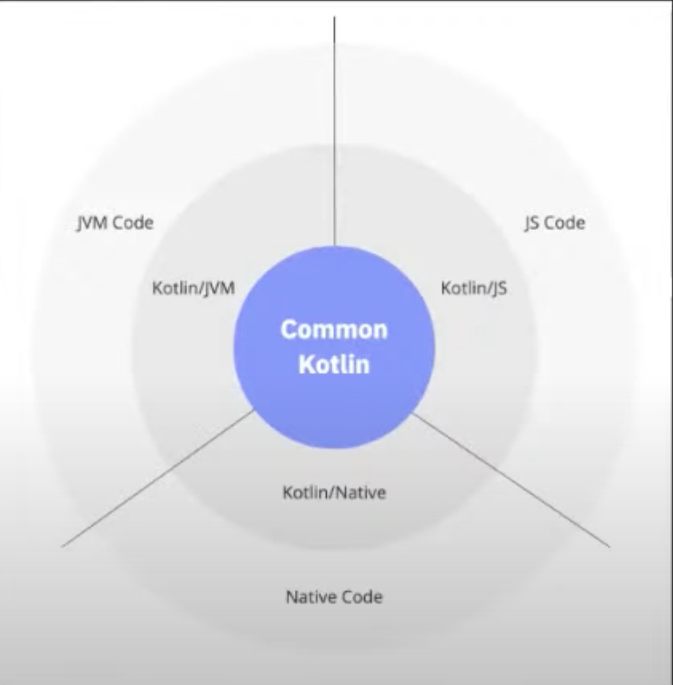
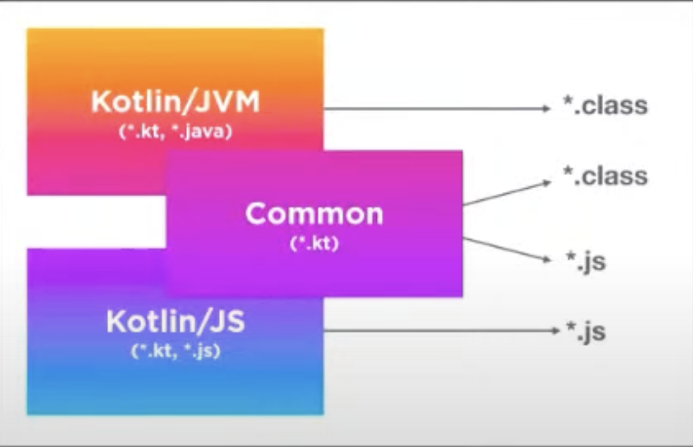
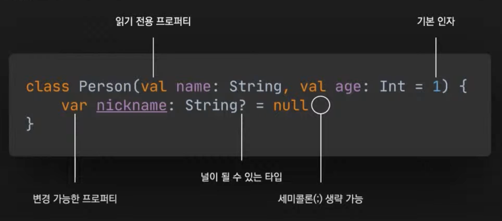
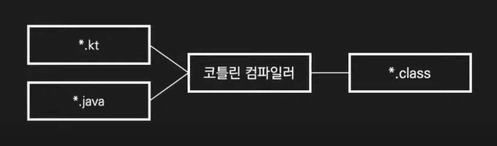
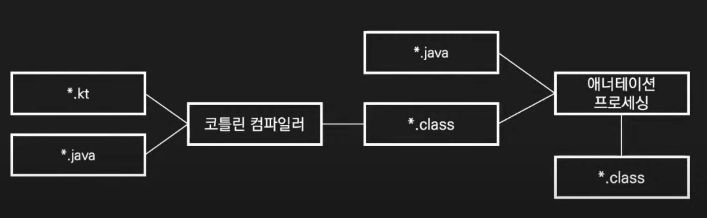
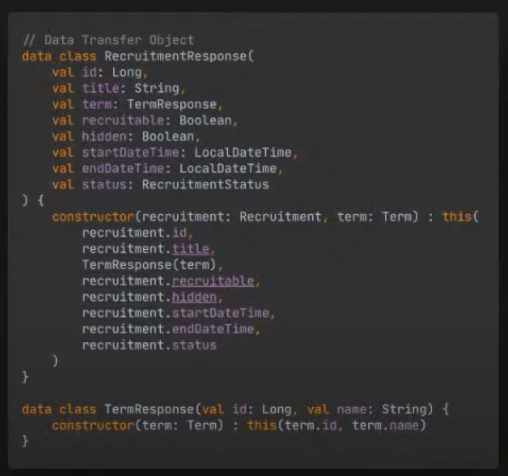
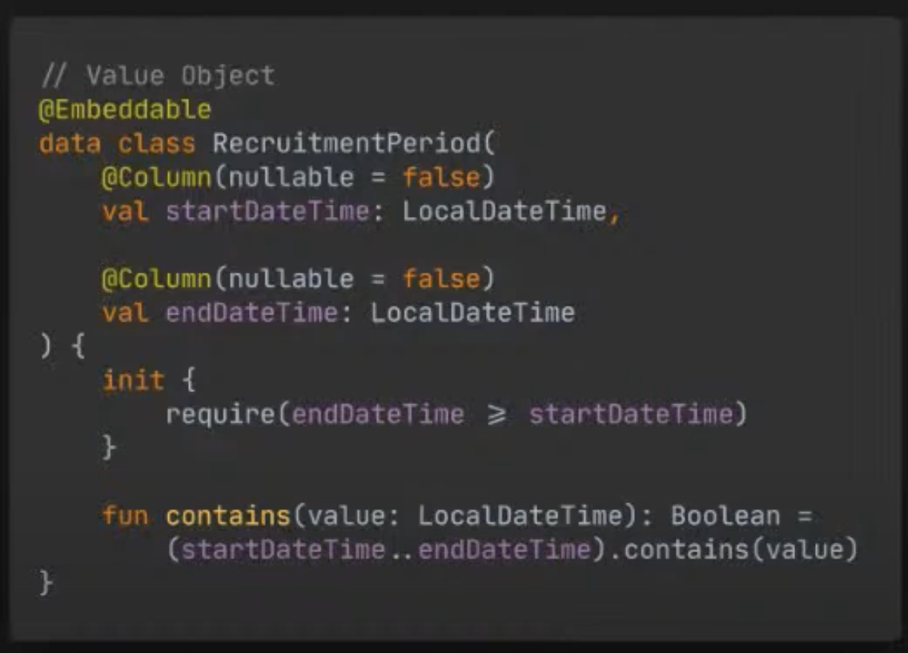
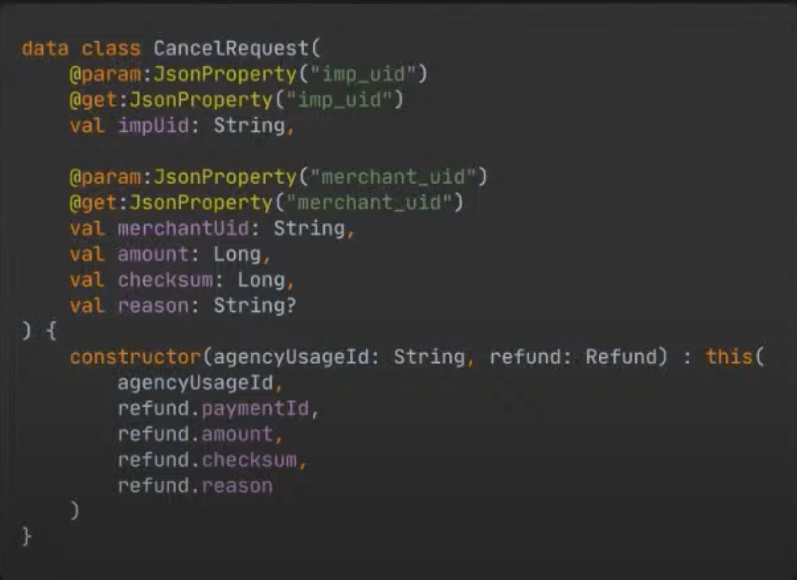

# 코프링 매우 알은 체하기

아래 테크 세미나 내용을 요약한 내용입니다.
- [어디 가서 코프링 매우 알은 체하기!](https://www.youtube.com/watch?v=ewBri47JWII)
- [고품격 Kotlin 개발: 테스트 코드를 우아하게 작성하는 방법](https://www.youtube.com/watch?v=PqA6zbhBVZc)

Kopring Sample Repository

- [woowacourse/service-apply](https://github.com/woowacourse/service-apply)

# Kotlin?

코틀린은 멀티 플랫폼 언어

<p align="center" width="100%">
    
    
</p>

**코딩 컨벤션**

- [Coding conventions](https://kotlinlang.org/docs/coding-conventions.html)
- [Kotlin 스타일 가이드](https://developer.android.com/kotlin/style-guide?hl=ko)

**커밋 메세지**

- [Commit Message Conventions](https://gist.github.com/stephenparish/9941e89d80e2bc58a153)

## ktlint

코드의 컨벤션 규약

- ktlint는 `Kotlin Coding Convention`과 `Android Kotlin Style Guide`를 기본으로 따르고 있다.

```kotlin
plugins {
    ...
    id("org.jlleitschuh.gradle.ktlint") version "10.3.0" // Kotlin 코드 스타일을 자동으로 검사하고 포맷팅하는 도구   
}
```

ktlint: 코틀린 style, convention 가이드 적용

- ⭐️ IntelliJ IDEA formatter를 ktlint에 맞게 설정(해당 프로젝트만):
    - `$ ./gradlew ktlintApplyToIdea`
- IntelliJ 사용 모든 프로젝트에 formatter 적용(모든 IDEA 프로젝트에):
    - `$ ./gradlew ktlintApplyToIdeaGlobally`
- 수동으로 ktlint를 이용하여 스타일 체크: `$ ./gradlew clean ktlintCheck`
    - ktlInt Check: `Tasks  → verification → ktlintCheck`
- ⭐️ Git hook을 통해 ktlint 설정: 커밋 전에 ktlintCheck 테스트 실행
    
    ```bash
    $ mkdir .git/hooks
    $ ./gradlew addKtlintCheckGitPreCommitHook
    ```
    

# Kotlin/JVM

## **Basic**

<figure><figcaption></figcaption></figure>

코틀린은 안전하게 코딩하도록 의식하지 않아도 안전하게 코딩되도록 지원

- @NotNull, @Nullable, final 자동 적용
- 안전하게 코딩하고 싶지 않을 경우 의식적으로 코딩

---

## 코틀린 컴파일

코틀린 코드만 사용할 경우

<figure><figcaption></figcaption></figure>

코틀린, 자바 코드를 함께 사용할 경우

- 롬복에서 생성된 자바 코드는 코틀린 코드에서 접근 불가

<figure><figcaption></figcaption></figure>

---

## **Item 1. 코틀린 표준 라이브러리**

**코틀린 표준 라이브러리를 익히고 사용하기**

> 코틀린에서 자바와 관련된 import를 최대한 제거하려고 노력하자
> 

표준 라이브러리를 사용하면 그 코드를 작성한 전문가의 지식과 여러분보다 앞서 사용한 다른 프로그래머들의 경험을 활용할 수 있다.

- AS-IS
    
    ```kotlin
    import java.util.Random
    import java.util.concurrent.ThreadLocalRandom
    
    Random.nextInt()
    ThreadLocalRandom.current().nextInt()
    ```
    
- TO-BE
    
    ```kotlin
    import kotlin.random.Random
    
    Random.nextInt() // thread safe
    ```
    

코틀린은 읽기 전용 컬렉션과 변경 가능한 컬렉션을 구별해 제공

- 인터페이스를 만족하는 실제 컬렉션이 반환
- 따라서 플랫폼별 컬렉션을 사용 가능

---

## **Item 2. 자바로 역컴파일**

**자바로 역컴파일하는 습관 들이기**

> 코틀린 숙련도를 높이는 가장 좋은 방법은 코틀린으로 작성한 코드가 자바로 어떻게 표현되는지 확인하기
> 
- 역컴파일로 예기치 않은 코드 생성을 방지
- 기존 자바 라이브러리와 프레임워크를 사용하며 문제가 발생할 때 빠르게 확인 가능

Kotlin to Java

- Tool > Kotlin > Show Kotlin Bytecode > Decompile

Java to Kotlin

- Convert Java File to Kotlin File

---

## **Item 3. 롬복대신 데이터 클래스**

롬복 대신 데이터 클래스 사용하기

- 데이터 클래스를 사용하면 컴파일러가 `equals()`, `hashCode()`, `toString()`, `copy()` 등을 자동 생성
    - 주 생성자의 매개변수를 기준으로 생성하고, 주 생성자에는 하나 이상의 매개변수가 있어야 함
    - 매개변수는 val 또는 var로 표시
- 데이터 클래스에 property 를 선언하는 순간 해당 property 는 field, Getter, Setter, 생성자 파라미터 역할
    
    ```kotlin
    val person = Person(name = "Aaron", age = 29)
    val person2 = person.copy(age = 25)
    
    data class Person(val name: String, val age: Int)
    ```

<p align="center" width="100%">
    
    
</p>

---

## plugins

```groovy
plugins {
    val kotlinVersion = "1.6.21"
    id("org.springframework.boot") version "2.3.3.RELEASE" // 스프링 부트를 사용하기 위한 플러그인
    id("io.spring.dependency-management") version "1.0.10.RELEASE" // 스프링 부트 프로젝트에서 의존성 관리를 쉽게 할 수 있도록 지원하는 플러그인
    kotlin("jvm") version kotlinVersion // Kotlin JVM을 사용하는 프로젝트를 위한 플러그인
    kotlin("plugin.spring") version kotlinVersion
    kotlin("plugin.jpa") version kotlinVersion
    id("org.jlleitschuh.gradle.ktlint") version "10.3.0" // Kotlin 코드 스타일을 자동으로 검사하고 포맷팅하는 도구
    id("org.asciidoctor.jvm.convert") version "3.3.2" // Asciidoctor를 사용해서 문서를 생성하고 변환할 수 있도록 지원하는 플러그인
    id("org.flywaydb.flyway") version "7.12.0" // Flyway를 사용하여 데이터베이스 마이그레이션을 자동으로 관리할 수 있게 해주는 플러그인
}
```

---

# Spring Boot

## **final 클래스**

- `@SpringBootApplication`은 `@Configuration`을 포함하고, 스프링은 기본적으로 CGLIB을 사용해서 `@Configuration` 클래스에 대한 프록시를 생성
- 하지만, final 클래스는 상속이나 오버라이드가 불가하므로 프록시 생성이 불가
- 상속을 허용하고 오버라이드를 허용하려면 `open` 변경자 추가 필요
- Spring Framework 5.2 부터는 `@Configuration` 의 proxyBeanMethod 옵션을 통해 프록시 생성 비활성화 가능

## **All-open 컴파일러 플러그인**

- 코틀린은 다양한 컴파일러 플러그인을 제공
- `all-open` 컴파일러 플러그인은 지정한 애너테이션이 있는 클래스와 모든 멤버에 open 변경자를 추가
- 스프링을 사용할 경우 `all-open` 컴파일러 플러그인을 래핑한 `kotlin-spring` 컴파일러 플러그인을 사용 가능
    - `@Component`, `@Transactional`, `@Async` 등이 기본적으로 지정
- File > Project Structure > Project Settings > Modules > Kotlin > Compiler Plugins 에서 지정된 애너테이션 확인 가능

```groovy
plugins {
    kotlin('plugins.spring') version "1.5.21"
}

allOpen {
    annotation("com.my.Annotation")
}
```

---

## **Item 4. 지연 초기화**

필드 주입이 필요하면 지연 초기화를 사용하자

> 코틀린에서 `lateinit` 변경자를 붙이면 프로퍼티를 나중에 초기화할 수 있다.
나중에 초기화하는 프로퍼티는 항상 var
> 

```kotlin
@Autowired
private lateinit var objectMapper: ObjectMapper
```

---

## jackson-module-kotlin

- **jackson은 기본적으로 역직렬화 과정을 위해 매개변수가 없는 생성자가 필요하지만**
    - 코틀린에서 매개변수가 없는 생성자를 만들기 위해 모든 매개변수에 기본 인자가 필요
- `jackson-module-kotlin`은 매개변수가 없는 생성자가 없더라도 직렬화와 역직렬화를 지원
    - 코틀린은 매개변수가 없는 생성자를 만들기 위해 생성자의 모든 매개변수에 기본 인자가 필요
        
        ```kotlin
        // Unit Test의 경우 ObjectMapper 직접 호출 필요
        val mapper1 = jacksonObjectMapper()
        val mapper2 = ObjectMapper().registerKotlinModule()
        ```
        
        ```
        dependencies {
            implementation("com.fasterxml.jackson.module:jackson-module-kotlin")
        }
        ```
        

---

## Kotlin Annotation

<figure><figcaption></figcaption></figure>

데이터 클래스에 property를 선언하는 순간 `field`, `Getter`, `Setter`, `생성자 파라미터` 역할 수행

- `@param.JsonProperty` : parameter에 사용될 이름
- `@get.JsonProperty` : getter에 사용될 이름

---

## **Item 5. 변경 가능성 제한**

변경 가능성을 제한하자

> 코틀린 클래스와 멤버가 final인 것처럼 일단 val로 선언하고 필요 시 var로 변경하자.
> 
- 생성자 바인딩을 사용하려면 `@EnableConfigurationProperties`
    - 또는 `@ConfigurationPropertiesScan`  사용
    
    ```kotlin
    @ConfigurationProperties("application")
    @ConstructorBinding
    data class ApplicationProperties(val url: String)
    
    @ConfigurationPropertiesScan
    @SpringBootApplication
    class Application
    ```
    
- private property and backing property
    - 공개 API 와 구현 세부 사항 프로퍼티로 나눌 경우
    - private 프로퍼티 이름의 접두사로 밑줄을 사용(backing property)
- JVM에서는 기본 getter, setter가 있는 private 프로퍼티에 대해 함수 호출 오버헤드를 방지하도록 최적화
    
    ```kotlin
    @OneToMany(cascade = [CascadeType.PERSIST, CascadeType.MERGE], orphanRemoval = true)
    @JoinColumn(name = "session_id", nullable = false)
    private val _students: MutableSet<Student> = students.toMutableSet() //backing property
    val student: Set<Student> // public
        get() = _students
    ```
    

---

# Persistence

## No-arg 컴파일러 플러그인

- JPA에서 엔티티 클래스를 생성하려면 ***매개변수가 없는 생성자가 필요***
- `no-arg` 컴파일러 플러그인은 지정한 애너테이션이 있는 클래스에 ***매개변수가 없는 생성자를 추가***
    - JPA, Kotlin에서 직접 호출할 수 없지만 리플랙션을 사용하여 호출 가능
- `kotlin-spring Compiler Plugin`과 마찬가지로 JPA를 사용하는 경우 no-arg 컴파일러 플러그인을 래핑한 `kotlin-jpa Compiler Plugin` 사용 가능
    - JPA, Kotlin 사용 시 자동으로 `kotlin-jpa Compiler Plugin`  추가
    - `@Entity`, `@Embeddable`, `@MappedSuperclass` 가 기본적으로 지정

```groovy
plugins {
    kotlin('plugins.spring') version "1.5.21"
    kotlin('plugins.jpa') version "1.5.21"
}

allOpen { // JPA 지연로딩 적용을 위해 프록시 생성 목적으로 설정
    annotation("javax.persistence.Entity")
    annotation("javax.persistence.MappedSuperclass")
}
```

---

## **Item 6. 엔티티**

엔티티에 데이터 클래스 사용을 피하자.

> 양방향 연관 관계의 경우 `toString()`, `hashcode()` 로 무한 순환 참조가 발생
> 

---

## **Item 7. 사용자 지정 getter**

사용자 지정 getter를 사용하자.

> JPA 에 의해 인스턴스화 될 때, 초기화 블록이 호출되지 않으므로, 영속화하지 않는 필드는 사용자 지정 getter를 사용하자.
> 

```kotlin
/**
 * AS-IS: 초기화된 프로퍼티
 * 영속화하지 않을 목적이었지만, JPA 에 의해 인스턴스화 될 때
 * null을 허용하지 않았음에도 불구하고, 초기화 블록이 호출되지 않으므로 null이 들어가게 된다.
 */
@Transient
val fixed: Boolean = startDate.until(endDate).year < 1

---

/**
 * TO-BE: 사용자 지정 getter
 * 따라서, 사용자 지정 getter 를 정의해서 프로퍼티에 접근할 때마다 호출되도록 하자.
 * 뒷받침하는 필드(backing property)가 존재하지 않으므로 AccessType.FIELD 라도 @Transient 불필요
 */
val fixed: Boolean
  get() = startDate.until(endDate).year < 1 // 일종의 메서드로 생각하자
```

---

## **Item 8. Null 타입 제거**

Null이 될 수 있는 타입은 빠르게 제거하자.

> Null이 될 수 있는 타입을 사용하면 Null 검사나 !! 연산자가 필요하다.
> 
- 엔티티 클래스의 id를 0 또는 빈 문자열로 초기화해서 Null이 될 수 있는 타입을 제거하자.
- Optional 보다 Nullable 한 타입을 사용해서 불필요한 java import 를 줄이자.
    
    ```kotlin
    interface ArticleRepository : CrudRepository<Article, Long> {
        fun findBySlug(slug: String): Article? // nullable Article
        fun findAllByOrderByAddedAtDesc(): Iterable<Atricle>
    }
    
    interface UserRepository : CrudRepository<User, Long> {
        fun findByLogin(login: String): User?
    }
    ```
    
- 확장 함수를 사용해 반복되는 Null 검사를 제거할 수 있다.
    
    ```kotlin
    fun MemberRepository.getById(id: Long): Member {
        if (id == 0L) {
            return Member.SINGLE
        }
        return findByIdOrNull(id) ?: throw NoSuchElementException("존재하지 않는 아이디 입니다. id: $id")
    }
    
    interface MemberRepository : JpaRepository<Member, Long>
    ```
    
