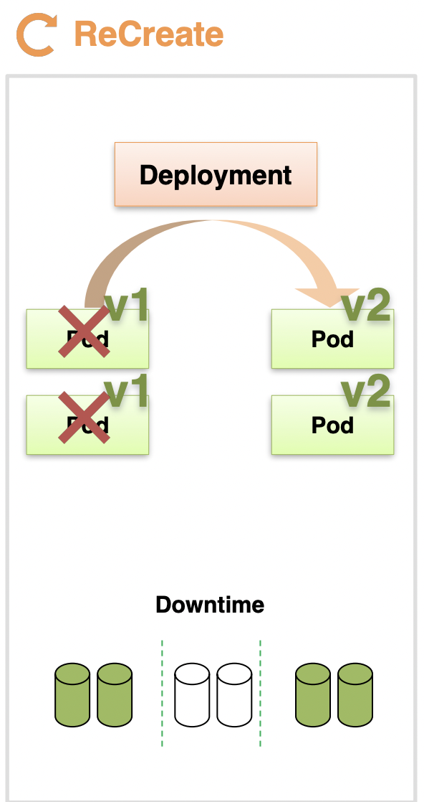

# Begin Kubernetes

[대세는 쿠버네티스](https://inf.run/yW34) 강의를 요약한 내용입니다.
- [K8S 실습 자료실](https://kubetm.github.io/k8s/)
- [Install v1.27 (mac m series)](https://kubetm.github.io/k8s/02-beginner/cluster-install-case7/)
- [ Kubernetes](https://kubernetes.io/)

<figure><figcaption></figcaption></figure>

<figure><figcaption></figcaption></figure>

# Why Kubernetes?

<figure><figcaption></figcaption></figure>

**AS-IS**
- 서버 개수
  - 운영중인 각 서버가 시간에 따라 접속량이 달라질 경우에도 서비스마다 최대치의 서버 개수가 필요
- 장애 대비
  - 서버 장애 상황을 대비하여 한 대의 백업 서버도 추가로 필요
- 서비스 버전 업데이트
  - 서비스 중단이 허용되는 경우 모든 서버를 내리고, 업데이트 후 실행
  - 무중단 서비스가 필요할 경우 한 서버씩 내렸다가 업데이트 후 실행

**TO-BE**
- 서버 개수
  - 하루 각 서비스의 평균 트래픽을 계산하여 적절한 개수의 자원을 할당
- 장애 대비
  - `Auto scaling` 기능을 통해 트래픽 양에 따라 서비스 자원량을 변경
  - `Auto Healing` 기능을 통해 장애가 난 서버 위에 있는 서비스들을 다른 서버로 자동으로 이동
    - 한 서버에 장애가 나더라도 여분의 서버 한 대로 서비스 유지
- 서비스 버전 업데이트
  - Deployment 오브젝트를 통해 업데이트 방식에 대해 자동적으로 처리되도록 지원
- 그밖에도 여러 운영 자동화를 지원

> Kubernetes를 사용하면 운영 환경이 더욱 편리해지고, 서비스 효율이 증가
>
> - 서비스 효율로 서버가 적어지면 그만큼 유지보수 비용이 감소

---

# VM vs Container

**🔎 시스템 구조의 차이**

<figure><figcaption></figcaption></figure>

**VM**
> 각각의 OS를 띄워야 하는 구조
- Host OS 위에 VM 가상화를 위해 여러 하이퍼바이저가 존재

**Container**
> 한 OS 를 공유하는 구조
- Host OS 위에 컨테이너 가상화를 시켜주는 여러 소프트웨어가 존재 (보통 `Docker`를 가장 많이 사용)
  - 도커를 통해 컨테이너 이미지를 만들게 되는데, 이미지에는 *한 서비스와 그 서비스에 필요한 라이브러리*가 존재
  - 여러 컨테이너들 간에 호스트 자원을 분리해서 사용하도록 지원 (리눅스 Namespace, Cgroup을 사용한 격리)
    - Namespace: 커널에 관련된 영역을 분리
    - Cgroup: 자원에 대한 영역을 분리
- 컨테이너 가상화 솔루션은 OS에서 제공하는 자원 격리 기술을 이용해 컨테이너 단위로 서비스를 분리할 수 있도록 지원
- 개발 환경에 대한 걱정 없이 배포가 가능

**🔎 시스템 개발 사상적인 차이**

<figure><figcaption></figcaption></figure>

**VM**
- 일반적으로 한 가지의 언어로 개발된 여러 모듈들로 하나의 서비스가 동작
- 특정 모듈에 부하가 몰릴 경우 VM을 하나 너 생성
  - C 모듈만 확장을 하고 싶더라도 A, B 모듈이 같이 확장

**Container**
- 한 서비스를 만들 때 모듈별로 분리해서 컨테이너에 담는 것을 권장
  - 그 모듈에 맞는 최적화된 개발 언어를 사용
- 쿠버네티스는 여러 컨테이너들을 한 파드에 묶거나, 한 컨테이너만 파드에 담을 수 있음
  - 한 파드가 하나의 배포 단위이므로 필요한 파드만 확장 가능
- 시스템을 모듈별로 분리해서 개발했을 때 큰 효과를 발휘

<details>
<summary> Getting-Started</summary>

<figure><figcaption></figcaption></figure>

## Linux

**Install nodejs in CentOS**

```sh
yum install epel-release
yum -y install nodejs
```

**hello.js**

```js
var http = require('http');
var content = function(req, resp) {
 resp.end("Hello Kubernetes!" + "\n");
 resp.writeHead(200);
}
var w = http.createServer(content);
w.listen(8000);
```

**run hello.js**

```sh
node hello.js
```

## Docker

[docker hub](https://hub.docker.com/)

Dockerfile
```sh
FROM node:slim # docker hub 에서 가져올 이미지:버전
EXPOSE 8000 # 노출시킬 포트
COPY hello.js . # 현재 디렉토리의 hello.js 파일 복사
CMD node hello.js # 컨테이너 구동 시 실행시킬 명령어
```

**Run Docker Container**

```sh
# 이미지 빌드
# -t : 레파지토리/이미지명:버전 디렉토리
# . : Dockerfile 위치 (다른 이름으로 지정 시 파일 이름)
docker build -t kubetm/hello .

# 생성한 이미지 확인
docker images

# 컨테이너 구동
# -d : 백그라운드 모드
# -p : 포트변경 (노출:구동)
docker run -d -p 8100:8000 kubetm/hello

# 컨테이너 접속
docker ps
docker exec -it c403442e8a59 /bin/bash
```

**Push Docker Image**

```sh
docker login
docker push kubetm/hello
```

## Kubernetes

**Generate Pod**

```sh
apiVersion: v1
kind: Pod # 생성할 리소스의 종류
metadata:
  name: hello-pod # 파드 이름
  labels:
    app: hello # 라벨
spec:
  containers:
  - name: hello-container # 컨테이너 이름
    image: kubetm/hello # docker hub에서 가져올 이미지
    ports:
    - containerPort: 8000 # 노출 포트
```

**Generate Service**

```sh
apiVersion: v1
kind: Service # 생성할 리소스의 종류
metadata:
  name: hello-svc # 서비스 이름
spec:
  selector:
    app: hello # pod metadata.name.labels.app과 매칭하여 pod에 연결
  ports:
    - port: 8200 # 노출 포트
      targetPort: 8000 # 컨테이너 포트
  externalIPs:
  - 192.168.56.30 # 접속 IP
```
</details>

---

# Overview Kubernetes

<figure><figcaption></figcaption></figure>

## Object

쿠버네티스에서 서버 한 대는 `Master`로 사용하고, 다른 서버(`Node`)는 마스터에 연결
- 이것이 하나의 쿠버네티스 클러스터라는 개념에 묶임
- `Master`: 쿠버네티스의 전반적인 기능들을 컨트롤하는 역할
- `Node`: 자원을 제공하는 역할. 클러스터의 전체 자원을 늘리고 싶다면 노드를 계속 추가

`Namespace`
- 쿠버네티스 오브젝트들을 독립된 공간으로 분리
- 쿠버네티스 최소 배포 단위인 `Pod`가 존재
  - `Pod` 안에는 여러개의 컨테이너가 존재
  - `Pod`에서는 여러 앱(`Container`)이 동작
  - `Pod`에 문제가 생겨서 재성성되면 그 안에 데이터는 날라가므로, `Volume`을 `Pod`에 연결하여 데이터를 관리
- `Pod`들에게 외부로부터 연결이 가능하도록 `IP`를 할당해주는 `Service`가 존재
  - 서로 다른 `Namespace`에 있는 파드에는 연결 불가
- `ResourceQuota`, `LimitRange`를 달아서 한 `Namespace`에서 사용할 수 있는 자원의 양 한정
  - `Pod` 개수 제한, CPU/Memory 제한 등..
- `ConfigMap`, `Secret`을 통해 `Pod` 생성 시 `Container` 안에 환경 변수 값이나 파일을 만운팅

## Controller

> `Pod`들을 관리
>
> - 사용 용도에 따라 다양한 컨트롤러 제공

**Replication Controller, ReplicaSet**
- 가장 기본적인 컨트롤러
- `Pod`가 죽으면, 감지해서 다시 살려줌
- `Pod`의 개수를 늘리거나 줄임 (Scale In/Out)

**Deployment**
- 배포 후에 `Pod`들을 새 버전으로 업그레이드
- 업그레이드 중 문제 발생 시 쉬운 롤백 제공

**DemonSet**
- 한 노드에 `Pod`가 하나씩만 유지되도록 지원

**CronJob**
- 특정 작업을 주기적으로 수행하고 종료되도록 `Pod`에 `Job` 적용

---

# Object

## Pod

<figure><figcaption></figcaption></figure>

...

### Container

<center></center>

`Pod`
- Pod 안에는 하나의 독립적인 서비스를 구동할 수 있는 컨터이너들이 존재
  - 컨테이너들은 서비스가 연결될 수 있도록 포트를 보유
  - 한 컨테이너가 하나 이상의 포트를 가질 수 있지만, 한 Pod 내에서 컨테이너들끼리 중복 불가
  - Pod 안의 컨테이너는 한 호스트로 묶여있는 개념
- Pod 생성 시 고유 IP 주소 할당
  - 쿠버네티스 클러스터 내에서만 해당 IP를 통해 해당 Pod에 접근 가능
  - 외부에서는 해당 IP로 접근 불가
  - 만일 Pod에 문제가 생기면 시스템이 감지하여 Pod를 삭제시키고 다시 재생성하는데, 이때 IP 주소는 변경
- Pod 생성 스크립트
  
  ```sh
  apiVersion: v1
  kind: Pod # 생성하려는 리소스 종류
  metadata:
   name: pod-1 # 파드 이름 지정
  spec: # 파드 세부 구성
  containers: # 파드에 포함될 컨테이너 목록
   - name: container1 # 컨테이너 이름
     image: tmkube/p8000 # 컨테이너에서 실행할 도커 이미지
     ports:
     - containerPort: 8000 # 컨테이너가 외부로 노출할 포트
   - name: container2
     image: tmkube/p8080
     ports:
     - containerPort: 8080
  ```

- ReplicationController 생성 스크립트

  ```sh
  apiVersion: v1
  kind: ReplicationController # 생성하려는 쿠버네티스 리소스의 종류
  metadata:
    name: replication-1 # ReplicationController의 이름
  spec: # ReplicationController의 세부 구성을 정의
    replicas: 1 # 원하는 파드의 복제 수
    selector: # 어떤 파드를 ReplicationController가 관리할지를 정의
      app: rc # 이 레이블을 가진 파드를 대상으로 관리
    template: # 파드의 템플릿을 정의(ReplicationController가 관리하는 파드의 스펙)
      metadata: # 새로 생성될 파드의 메타데이터
        name: pod-1 # 생성될 파드의 이름
        labels: # 파드에 적용될 레이블
          app: rc
      spec: # 파드의 세부 구성
        containers: # 파드에 포함될 컨테이너
        - name: container # 컨테이너의 이름
          image: kubetm/init # 컨테이너에서 실행할 도커 이미지
  ```

...

### Label

<center></center>

Label은 Pod 뿐 아니라 모든 오브젝트에 달 수 있는데, Pod에서 가장 많이 사용
- 목적에 따라 오브젝트들을 분류하고, 분류된 오브젝트만 따로 골라서 연결
- key/value 가 한 쌍으로 이루어짐
- 한 Pod에는 여러개의 Label을 달 수 있음
- ex) web, db, server 타입이 한 쌍으로 개발/상용 환경으로 나뉘어 구성

Service Example
- 특정 타입의 Pod만 사용할 경우, type:web인 Label이 달린 Pod들을 서비스에 연결하여 해당 서비스 정보를 전달
- 상용 환경을 담당하는 운영자라면, lo:product인 Label이 달린 Pod들을 서비스에 연결하여 해당 서비스 정보를 전달

Label 활용 스크립트
- Pod 생성 시 Label 등록

```sh
apiVersion: v1
kind: Pod # 쿠버네티스 리소스의 유형
metadata:
  name: pod-2 # 파드의 이름
  labels: # 파드에 레이블을 추가
    type: web # key (파드의 용도)
    lo: dev # value (파드의 배포 환경)
spec: # 파드의 스펙
  containers:
  - name: container # 컨테이너의 이름
    image: tmkube/init # 컨테이너에서 실행할 도커 이미지
```

- Service 생성 시 특정 라벨이 붙어있는 Pod 연결

```sh
apiVersion: v1
kind: Service # 쿠버네티스 리소스의 유형
metadata:
  name: svc-1 # 서비스의 이름
spec: # 서비스의 스펙
  selector: # 대상 파드를 선택하는 기준
    type: web # 레이블이 type: web인 파드를 선택
  ports:
  - port: 8080 # 서비스가 노출할 포트
```

...

### Node Schedule

<center></center>

Pod는 결국 여러 노드들 중에 한 노드에 올라가야 한다.
- 이 방법이 대해 직접 노드를 선택하는 방식과 쿠버네티스가 자동으로 지정해주는 방식이 존재

1️⃣ 직접 선택하는 방식
- 노드에 Label 등록 후, Pod 생성 시 노드를 지정

```sh
apiVersion: v1
kind: Pod # 쿠버네티스 리소스의 유형
metadata:
  name: pod-3 # 파드의 이름
spec: # 파드의 스펙
  nodeSelector: # 파드가 배치될 노드를 선택하기 위한 조건
    kubernetes.io/hostname: k8s-node1 # 노드에 설정된 레이블과 매칭
  containers: # 파드 내에 포함될 컨테이너
  - name: container # 컨테이너의 이름
    image: kubetm/init # 컨테이너에서 실행할 도커 이미지
```

2️⃣ 쿠버네티스의 스케줄러가 판단해서 지정하는 방식
- ex) Pod 생성 시 Pod에서 요구될 리소스의 사용량을 명시하여 메모리 사용량에 맞게 Pod 스케줄링
  
```sh
apiVersion: v1
kind: Pod
metadata:
  name: pod-4
spec:
  containers:
  - name: container
    image: kubetm/init
    resources: # 컨테이너에 할당할 리소스 요청 및 제한을 정의
      requests: # 컨테이너가 실행되기 위해 필요한 최소한의 리소스
        memory: 2Gi # 컨테이너가 요청하는 최소 메모리 양을 2GiB로 설정
      limits: # 컨테이너가 사용할 수 있는 최대 리소스 양
        # memory: 초과 시 Pod 종료.
        # cpu: 초과 시 request 수치로 낮추고, 종료되진 않음.
        memory: 3Gi # 컨테이너가 사용할 수 있는 최대 메모리 양을 3GiB로 설정
```

...

Controller + Label + Node Schedule 스크립트

```yaml
apiVersion: v1
kind: Pod
metadata:
  name: pod-4
  labels:
    type: web                           
    lo: dev  
spec:
  nodeSelector: # 파드를 특정 노드에 배치하기 위한 조건
    # 노드에 설정된 레이블과 매칭되어 파드를 특정 노드에 배치
    kubernetes.io/hostname: k8s-node1 
  containers:
  - name: container
    image: kubetm/init
    ports:
    - containerPort: 8080 # 컨테이너가 외부에 노출할 포트
    resources: # 컨테이너에 할당할 자원 사용량
      requests: # 컨테이너가 실행되기 위해 필요한 최소 자원
        memory: 1Gi # 컨테이너가 요청하는 최소 메모리 양을 1GiB로 설정
      limits: # 컨테이너가 사용할 수 있는 최대 자원 양
        memory: 1Gi # 컨테이너가 사용할 수 있는 최대 메모리 양을 1GiB로 설정
```

<details>
<summary> 📖 참고. kubectl</summary>

**Create**
- 같은 이름의 Pod가 존재할 경우 생성이 안됨

```sh
# 파일이 있을 경우
kubectl create -f ./pod.yaml

# 내용과 함께 바로 작성할 경우
kubectl create -f - <<END
apiVersion: v1
kind: Pod
metadata:
  name: pod1
spec:
  containers:
  - name: container
    image: kubetm/init
END
```

**Apply**
- 기존에 같은 이름의 Pod가 존재하면 업데이트

```sh
kubectl apply -f ./pod.yaml
```

**Get**

```sh
# 기본 Pod 리스트 조회 (Namepsace 포함)
kubectl get pods -n defalut

# 더 많은 내용 출력
kubectl get pods -o wide

# Pod 이름 지정
kubectl get pod pod1

# Json 형태로 출력
kubectl get pod pod1 -o json
```

**Describe**

```sh
# 상세 출력
kubectl describe pod pod1
```

**Delete**

```sh
# 파일이 있을 경우 생성한 방법 그대로 삭제
kubectl delete -f ./pod.yaml

# 내용과 함께 바로 작성한 경우 생성한 방법 그대로 삭제
kubectl delete -f - <<END
apiVersion: v1
kind: Pod
metadata:
  name: pod1
spec:
  containers:
  - name: container
    image: kubetm/init
END

# Pod 이름 지정
kubectl delete pod pod1
```

**Exec**

```sh
# Pod 이름이 pod1인 Container로 들어가기 (나올땐 exit)
kubectl exec pod1 -it /bin/bash

# (Pod에 Container가 두 개 이상 있을 경우) pod1의 con1 Container로 들어가기 
kubectl exec pod1 -c con1 -it /bin/bash
```
</details>

---

## Service

<figure><figcaption></figcaption></figure>

...

### Cluster Ip

<center></center>

1️⃣ 서비스는 기본적으로 자신의 `클러스터 IP`를 보유
- 해당 서비스를 Pod에 연결시키면 *서비스의 IP를 통해서도 파트에 접근* 가능
- Pod는 장애가 발생하면 IP가 재생성되어 변하므로, Pod IP로 직집 접근하지 않고 서비스를 통해 접근
  - 서비스는 사용자가 직접 지우지 않는 한, 삭제되거나 재생성되지 않음
  - 해당 서비스 IP로 접근 시 항상 연결되어있는 Pod로 접근 가능

2️⃣ 서비스는 여러 종류가 존재하는데, 그 종류에 따라 Pod에 접근하는 방식에 차이
- 가장 기본적인 방식이 `클러스터 IP` 방식
  - 해당 IP는 쿠버네티스 클러스터에서만 접근이 가능한 IP (외부에서는 접근 불가)
  - 여러개의 Pod 연결 시 트래픽을 분산해서 Pod에 전달

⚒️ 적용 사례

> 클러스터 IP는 외부에서 접근할 수 없고, 클러스터 내에서만 사용하는 IP

- 인가된 사용자(운영자)만 접근
- 쿠버네티스 대시보드 관리
- Pod 서비스 상태 디버깅

**Pod**

```sh
apiVersion: v1
kind: Pod
metadata:
  name: pod-1
  labels:
     app: pod
spec:
  nodeSelector: # 파드를 특정 노드에 배치하기 위한 조건
    kubernetes.io/hostname: k8s-node1 # 노드의 레이블과 매칭
  containers:
  - name: container
    image: kubetm/app
    ports: # 컨테이너에서 노출할 포트
    - containerPort: 8080
```

**Service**

```sh
apiVersion: v1
kind: Service
metadata:
  name: svc-1
spec:
  selector: # 서비스가 트래픽을 전달할 파드를 선택하는 기준
    app: pod # app 레이블의 값이 pod인 모든 파드를 대상으로 지정
  ports:
      # 클라이언트가 이 서비스에 접근할 때 사용할 포트
    - port: 9000 # 9000 포트로 서비스에 접근하면
      # 서비스가 선택한 파드에 트래픽을 전달할 때 사용할 포트
      targetPort: 8080 # 타겟이 되는 Pod에 8080 포트로 연결
  # 서비스의 종류를 지정(클러스터 내부에서만 접근 가능한 IP 주소를 제공)
  type: ClusterIP # 서비스 타입. default: ClusterIP
```

```sh
curl 10.104.103.107:9000/hostname

kubectl get service svc-1
```

...

### Node Port

<center></center>

1️⃣ NodePort 타입으로 생성해도 서비스에는 기본적으로 `클러스터 IP` 할당
- 클러스터 IP와 같은 기능이 포함

2️⃣ 쿠버네티스 클러스터에 연결되어 있는 모든 `노드`에게 똑같은 `포트`가 할당
- 외부로부터 어느 노드건 그 IP의 포트로 접속하면 해당 서비스에 연결
- 서비스는 기본 역할인 자신과 연결되어 있는 Pod에게 트래픽을 전달

3️⃣ 서비스 입장에서는 어떤 노드한테 들어온 트래픽인지 상관없이 자신과 연결된 Pod에게 트래픽을 전달
- ex) 1번 노드의 IP로 접근하더라도, 2번 노드의 Pod에게 트래픽을 전달
- 특정 노드의 IP로 접근하는 트래픽을 해당 노드의 Pod한테만 트래픽을 전달하도록 설정도 가능
  - `externalTrafficPolicy: Local` 옵션 추가

⚒️ 적용 사례

> 물리적인 Host IP를 통해 Pod에 접근
>
> 대부분 Host IP는 보안적으로 내부망에서만 접근 가능하므로, 클러스터 밖에는 있지만 내부망 안에서 접근이 필요할 경우 사용

- 내부망 연결
- 일시적인 외부 연동 용도

**Service**

```sh
apiVersion: v1
kind: Service
metadata:
  name: svc-2
spec:
  selector: # 서비스가 트래픽을 전달할 파드를 선택하는 기준
    app: pod # 레이블이 app: pod인 모든 파드를 대상으로 지정
  ports:
  - port: 9000 # 클러스터 내에서 노출할 포트
    targetPort: 8080 # 서비스가 선택한 파드의 컨테이너에 전달할 포트
    # 노드에서 외부로 노출할 포트
    nodePort: 30000 # 노드 포트 지정(30000~32767 사이로 할당 가능). default. 자동 할당
  type: NodePort # 서비스의 종류를 지정
  externalTrafficPolicy: Local # 요청을 받은 노드의 Pod로 트래픽을 전달
```

```sh
kubectl get service svc-2
```

...

### Load Balancer

<center></center>

1️⃣ 기본적으로 NodePort 타입의 기능을 포함

2️⃣ `Load Balancer`가 생겨서 각 노드의 트래픽을 분산
- 단, Load Balancer에 접근하기 위한 외부 접속 IP 주소는 쿠버네티스를 설치했을 때 기본적으로 생기지 않음
- 별도로 외부 접속 ip를 할당해주는 플러그인 설치가 되어야 IP가 생성
- Google Cloud Platform, AWS Kubernetes Platform 등 사용 시 자체적으로 플러그인이 포함되어 IP 생성

⚒️ 적용 사례

> 내부 IP를 노출시키지 않고, 외부 IP를 통해 안정적으로 서비스를 노출

- 외부에 시스템 노출용

**Service**

```sh
apiVersion: v1
kind: Service
metadata:
  name: svc-3
spec:
  selector:
    app: pod
  ports:
  - port: 9000 # 외부에 노출할 포트
    targetPort: 8080 # 서비스가 선택한 파드의 컨테이너에 전달할 포트
  type: LoadBalancer # 외부 로드 밸런서를 자동으로 생성
```

```sh
kubectl get service svc-3
```

---

## Volume

<figure><figcaption></figcaption></figure>

...

### emptyDir

<center></center>

컨테이너들끼리 데이터를 공유하기 위해 `Volume`을 사용
- 최초 `Volume` 생성 시 해당 `Volume` 안에는 내용이 비어있다보니 `emptyDir` 이라는 명칭
- 각 컨테이너가 `Volume`을 마운트 해두면, 서버들이 `Volume`을 자신의 로컬에 있는 파일처럼 사용

Pod에 문제가 생겨 Pod가 재생성이 될 경우 `Volume` 데이터도 초기화
- 일시적인 활용을 위한 목적으로 사용되는 데이터를 넣는 것을 권장

**Pod**

```sh
apiVersion: v1
kind: Pod
metadata:
  name: pod-volume-1
spec:
  containers:
  - name: container1
    image: kubetm/init
    volumeMounts: # 컨테이너에 볼륨을 마운트하는 경로 지정
    - name: empty-dir # 마운트할 볼륨의 이름
      mountPath: /mount1 # 볼륨을 마운트할 경로
  - name: container2
    image: kubetm/init
    volumeMounts: # 컨테이너에 볼륨을 마운트하는 경로 지정
    - name: empty-dir # 마운트할 볼륨의 이름
      mountPath: /mount2 # 볼륨을 마운트할 경로
  volumes: # 파드에 사용될 볼륨을 정의
  - name : empty-dir # 볼륨의 이름(두 컨테이너는 동일한 볼륨을 마운트해서 데이터를 공유)
    emptyDir: {} # 볼륨 타입(파드가 생성될 때 빈 디렉토리로 시작)
```

```sh
mount | grep mount1 # 마운트 상태 확인
echo "file context" >> file.txt # 테스트 파일 생성
```

...

### hostPath

<center></center>

한 호스트(Pod들이 올라가져 있는 노드)의 경로를 볼륨으로 사용
- 자신의 Pod가 올라가져있는 노드의 불륨만 사용 가능
- emptyDir과 다른 점은
  - 이 경로를 각 Pod가 마운트해서 사용하므로, Pod가 죽어도 해당 노드에 있는 데이터는 사라지지 않음
- 좋아보일 수 있지만, Pod 입장에서 한 가지 큰 문제를 보유
  - Pod가 죽은 후 재생성될 때 같은 노드에 재생성될 것이라는 보장은 없음
  - 재생성되는 순간에 스케줄러가 자원 상황에 따라 다른 노드에 Pod를 생성할 수 있음
  - 또는, 노드 장애로 다른 노드로 Pod가 옮겨질 수도 있음
- 대안으로 노드가 추가될 때마다 동일한 이름의 Volumne 경로를 만들어서 노드에 있는 경로끼리 마운트를 시켜줄 수 있다.
  - 하지만, 쿠버네티스의 역할은 아니고 운영자가 직접 리눅스 별도 마운트 기술로 구성 필요

각 노드에는 기본적으로 노드를 위한 파일들(시스템 파일, 여러 설정 파일..)이 존재하는데, 
- Pod 자신이 할당되어 있는 **호스트(노드)의 데이터를 읽거나 사용해야 할 때 활용**
- Pod의 데이터를 저장하는 용도가 아닌 **노드에 있는 데이터들을 Pod에서 사용하기 위한 용도**

**Pod**

```sh
apiVersion: v1
kind: Pod
metadata:
  name: pod-volume-3
spec:
  nodeSelector: # 노드 지정
    kubernetes.io/hostname: k8s-node1 # node1에 생성
  containers:
  - name: container
    image: kubetm/init
    volumeMounts: # 볼륨을 마운트할 경로를 지정
    - name: host-path # 마운트할 볼륨의 이름
      mountPath: /mount1 # 볼륨이 마운트될 경로
  volumes: # 파드에 사용될 볼륨을 정의
  - name : host-path # 볼륨의 이름
    hostPath: # 노드의 파일 시스템을 볼륨으로 마운트할 때 사용되는 속성
      path: /node-v # 마운트할 디렉토리의 경로
      type: DirectoryOrCreate # 지정한 경로가 존재하지 않을 경우, 해당 경로를 자동으로 생성
```

...

### PVC / PV

<center></center>

> Pod에 영속성있는 `Volume`을 제공하기 위한 개념

다양한 형태의 볼륨(git, AWS, NFS ..)을 각 `PV`(Persistent Volume)을 정의하고 연결
- Pod는 PV에 바로 연결하지 않고 `PVC`(Persistent Volume Claim)를 통해 `PV`와 연결
  - 한 번 바인딩 된 `PV`는 다른 `PVC`에서 사용 불가
  - 요구된 스펙과 적합한 볼륨이 없다면 Pending 상태
- 볼륨의 종류는 많고 각 볼륨들과 연결하기 위한 설정들도 다르기 때문
  
  ```sh
  apiVersion: v1
  kind: PersistentVolume
  metadata:
    name: pv-01
  spec: # 각 볼륨 연결을 위한 설정의 차이
    nfs:
      server: 192.168.0.xxx
      path: /sda/data
    iscsi:
      targetPortal: 163.180.11
      iqn: iqn.200.qnap:...
      lun: 0
      fsType: ext4
      readOnly: no
      chapAuthSession: true
    gitRepo:
      repository: github.com...
      revision: master
      directory: .
  ``` 

볼륨 사용에 User 영역과 Admin 영역으로 분리
- User: Pod의 서비스를 만들고 배포를 관리하는 서비스 담당자
- Admin: 쿠버네티스를 담당하는 운영자

전체 흐름
- (1) 최초 Admin이 PV 생성
- (2) User가 PVC를 생성
- (3) 쿠버네티스가 PVC 내용에 맞는 적절한 PV에 연결
- (3) 이후 Pod 생성 시 해당 PVC 마운팅

.

**`PV`(Persistent Volume) 정의**

```sh
apiVersion: v1
kind: PersistentVolume
metadata:
  name: pv-01
spec: # PVC가 PV 연결 시 해당 내용을 기반으로 쿠버네티스가 자동으로 연결
  capacity:
    storage: 2G # 스토리지 용량
  accessModes: # 접근할 수 있는 모드
    - ReadWriteOnce # 볼륨이 단일 노드에서 읽기 및 쓰기로 마운트될 수 있음
  local:
    path: /node-v # 호스트의 로컬 볼륨 경로
  nodeAffinity: # 특정 노드에만 연결할 수 있도록 제약을 설정
    required: # 노드 셀렉터 조건을 지정
      nodeSelectorTerms: # 노드 선택 조건을 지정
      - matchExpressions: # 노드를 선택하는 데 사용되는 표현식의 목록
        - {key: kubernetes.io/hostname, operator: In, values: [k8s-node1]}
        # key: 노드의 레이블을 기준으로 선택
        # operator: 지정된 키의 값이 목록에 포함되어 있는지 확인
        # values: 노드의 레이블 값이 k8s-node1인 경우에만 이 PV를 사용
```

**`PVC`(Persistent Volume Claim) 생성**

```sh
apiVersion: v1
kind: PersistentVolumeClaim
metadata:
  name: pvc-01
spec: # 요구하는 PV 정보
  accessModes: # PVC가 요청하는 스토리지를 어떤 방식으로 액세스할 수 있는지
  - ReadWriteOnce # 읽기 및 쓰기로 마운트
  resources: # PVC에 요청되는 스토리지 용량
    requests:
      storage: 2G # 최소 2GB의 스토리지
  storageClassName: "" # PVC가 특정 스토리지 클래스를 사용할지 여부
  # 빈 문자열일 경우 스토리지 클래스를 사용하지 않는 PV와 연결
```

**Pod**

```sh
apiVersion: v1
kind: Pod
metadata:
  name: pod-volume-3
spec:
  containers:
  - name: container
    image: kubetm/init
    volumeMounts: # 컨테이너에 볼륨을 마운트하는 경로를 지정
    - name: pvc-pv # 마운트할 볼륨의 이름
      mountPath: /mount3 # 컨테이너 내에서 볼륨을 마운트할 경로
  volumes: # 파드에서 사용할 볼륨을 정의
  - name : pvc-pv # 볼륨의 이름을 지정
    persistentVolumeClaim: # PVC를 통해 파드에 영구 스토리지를 연결할 때 사용
      claimName: pvc-01 # 연결할 PVC의 이름
```

---

## ConfigMap, Secret

### 두 오브젝트를 사용해야 하는 상황

<figure><figcaption></figcaption></figure>

개발/상용 환경이 존재
- A라는 서비스는 일반 접근과 보안 접근을 지원
  - 개발 환경에서는 일반 접근 (SSH: false, User: Dev, Key: xxx 세팅 ..) 
  - 상용 환경으로 배포 시 보안 접근으로 수정 (SSH: true, User: Prod, Key: yyy 세팅 ..)
- 컨테이너 안에 있는 서비스 이미지 내부 값을 변경하기 위해서는 이미지를 별도로 관리해야 하는 큰 작업 발생
- 이때 `ConfigMap`, `Secret` 적용이 필요

**ConfigMap & Secret**

> 환경에 따라 변하는 값들을 외부에서 결정할 수 있도록 지원

분리해야하는 상수들을 모아서 `configMap`을 만들고, 키와 같이 보안적인 관리가 필요한 값을 모아서 `secret`을 생성
- `Pod` 생성 시 `configMap`, `secret` 오브젝트를 연결하게 되면 환경변수에 해당 값들이 적용
  - 환경변수를 불러서 적용하는 이미지를 별도로 생성해서 개발/상용에 모두 활용 가능
- `configMap`, `secret` 데이터만 변경하여 환경에 맞는 서비스를 실행

...

### 사용 방법

<figure><figcaption></figcaption></figure>

`configMap`, `secret` 생성 시 데이터로 상수, 파일을 넣을 수 있다.
- 파일을 넣을 때는 환경 변수로 세팅하는 것이 아닌 볼륨을 마운팅해서 사용 가능

...

### Literal

<center></center>

`configMap`, `secret` 공통
- `Key`와 `Value`로 고정
- 필요한 상수 정의 후 Pod 생성 시 ConfigMap을 가져와서 컨테이너 안 환경변수에 세팅
- 쿠버네티스의 etcd라는 분산 키-값 저장소에 저장

`ConfigMap`
- Key/Value 리스트를 무한히 선언 가능

```sh
apiVersion: v1
kind: ConfigMap
metadata:
  name: cm-dev
data: # ConfigMap에 포함될 데이터의 키-값 쌍을 정의
  SSH: 'false'
  User: dev
```

`Secret`
- 보안적인 요소의 값들을 저장하는 용도로 사용(ex. 패스워드, 인증키 ..)
- Value를 넣을 시 Base64 Encoding 필요, Pod로 주입 시에는 자동으로 Decoding
- Key/Value 리스트를 1MB 까지만 선언 가능

```sh
apiVersion: v1
kind: Secret
metadata:
  name: sec-dev
data: # key: value(Base64 Encoded) 형태의 상수
  Key: MTIzNA==
```

Pod 생성 시 사용

```sh
apiVersion: v1
kind: Pod # 생성할 리소스 유형
metadata:
  name: pod-1 # 파드 이름
spec: # 파드의 세부 구성
  containers: # 파드에 포함될 컨테이너
  - name: container # 컨테이너 이름
    image: kubetm/init # 컨테이너에서 실행할 도커 이미지
    envFrom: # 외부 소스(ConfigMap)의 모든 키/값 쌍을 환경 변수로 컨테이너에 일괄 설정
    - configMapRef: # 특정 ConfigMap의 모든 키-값 쌍을 환경 변수로 가져오기
        name: cm-dev # 가져올 ConfigMap의 이름
    - secretRef: # 특정 Secret의 모든 키-값 쌍을 환경 변수로 가져오기
        name: sec-dev # 참조할 Secret의 이름
```

**kubectl**

```sh
# key1:value1 라는 상수로 cm-file라는 이름의 ConfigMap 생성
kubectl create configmap cm-file --from-literal=key1=value1
# 여러 key:value로 cm-file라는 이름의 ConfigMap 생성 
kubectl create configmap cm-file --from-literal=key1=value1 --from-literal=key2=value2

# key1:value1 라는 상수로 sec-file라는 이름의 Secret 생성
kubectl create secret generic sec-file --from-literal=key1=value1
```

...

### File

<center></center>

파일을 `configMap`에 Key/Value 형태로 담을 수 있다.
- Key(파일 이름):Value(파일 내용)
- ✅ Pod 생성 후 ConfigMap 내용 변경 시 Pod 환경변수 값에는 영향이 없음
  - 해당 Pod가 죽어서 재생성되어야 변경된 값을 다시 받아와서 수정

.

**ConfigMap**

```sh
echo "Content" >> file-c.txt
kubectl create configmap cm-file --from-file=./file-c.txt 
                         # 파일 이름            # 넣을 파일
```

**Secret**
- secret 명령을 통해 파일 내용이 Base64로 인코딩
- 파일 내용이 이미 Base64 인코딩된 상태라면, 두 번 인코딩되는 점 주의 

```sh
echo "Content" >> file-s.txt
kubectl create secret generic sec-file --from-file=./file-s.txt
```

**Pod**

```sh
apiVersion: v1
kind: Pod # 생성할 리소스 유형
metadata:
  name: pod-file # 파드 이름
spec: # 파드 세부 구성
  containers:
  - name: container # 컨테이너 이름
    image: kubetm/init # 컨테이너에서 실행할 도커 이미지
    env: # 컨테이너에 전달할 환경변수
    - name: file-c # 환경변수 이름
      valueFrom: # 외부 소스로부터 환경 변수의 값을 가져오기
        configMapKeyRef: # 환경 변수 값을 특정 ConfigMap에서 가져오기
          name: cm-file # 사용될 ConfigMap의 이름
          key: file-c.txt # ConfigMap 내의 특정 키를 지정
    - name: file-s # 두 번째 환경 변수의 이름
      valueFrom: # 외부 소스로부터 환경 변수의 값을 가져오기
        secretKeyRef: # 환경 변수 값을 Secret에서 가져오기
          name: sec-file # 참조할 Secret의 이름
          key: file-s.txt # Secret 내의 특정 키
```

**kubectl**

```sh
# file-c.txt 라는 파일로 cm-file라는 이름의 ConfigMap 생성
kubectl create configmap cm-file --from-file=./file-c.txt

# file-s.txt 라는 파일로 sec-file라는 이름의 Secret 생성
kubectl create secret generic sec-file --from-file=./file-s.txt
```



**secret의 보안적 요소**

secret은 평문으로 쿠버네티스 DB(etcd)에 저장

secret의 보안적 요소는 secret를 pod에 파일로 마운팅해서 사용할 때 Pod 내부에서는 파일이 보이지만 이런 기능을 구현하기 위해서 쿠버네티스 입장에서는 workernode에 secret 파일을 만들어 놓고, Pod에 이 파일을 마운팅

이때, workernode에 secret 파일을 인메모리 파일시스템(tmpfs)영역에 올려놓고 있다가 Pod가 삭제되면 지우는데, 이렇게 민감한 데이터를 디스크에 저장해 놓지 않기 때문에 configmap보다 보안에 유리



...

### File Volume Mount

<center></center>

파일을 `configMap`에 Key/Value 형태로 파일을 마운팅할 수 있다.
- Key(파일 이름):Value(파일 내용)
- Pod 생성 시 컨테이너 안에 마운트 경로를 정의하고, 해당 경로 안에 파일을 마운팅
- ✅ Pod 생성 후 ConfigMap 내용 변경 시 Pod에 마운팅된 내용도 변경
  - File Env, File Volume Mount 방식의 각 특성을 활용하여 상황에 맞게 적용 가능

```sh
apiVersion: v1
kind: Pod # 생성할 리소스 종류
metadata:
  name: pod-mount # 파드 이름
spec: # Pod 구성
  containers:
  - name: container # 컨테이너 이름
    image: kubetm/init # 컨테이너가 실행할 도커 이미지
    volumeMounts: # 컨테이너 내에 볼륨을 마운트할 경로 지정
    - name: file-volume # 마운트할 볼륨의 이름
      mountPath: /mount # ConfigMap이 컨테이너 내에 마운트될 경로
  volumes: # Pod에서 사용될 볼륨 정의
  - name: file-volume # 볼륨 이름
    configMap: # 이 볼륨이 ConfigMap을 기반으로 생성
      name: cm-file # ConfigMap의 이름
```

---

## Namespace, ResourceQuota, LimitRange

<figure><figcaption></figcaption></figure>

Kubernetes Cluster에는 전체 사용할 수 있는 자원이 존재
- 일반적으로 메모리, CPU..
- 클러스터 안에는 여러 `namespace`들을 생성할 수 있고,
- `namespace` 안에는 여러 Pod들을 생성 가능

여기서 각 Pod는 필요한 자원을 클러스터 자원을 공유해서 사용하는데
- 만일 한 `namespace` 안에 있는 Pod가 이 클러스터에 남은 자원을 모두 사용해 버리면
- 다른 Pod 입장에서는 더 이상 쓸 자원이 없어서 자원이 필요할 때 문제가 발생

이런 문제를 해결하기 위해 `ResourceQuota`가 존재
- `namespace` 마다 설정하면 최대 한계를 설정해서
- Pod 자원이 설정한 한계를 넘을 수 없다.
- Pod 입장에서 자원이 부족해서 문제가 되더라도 다른 `namespace`에 있는 Pod들에는 영향을 끼치지 않음

한 Pod가 자원 사용량을 너무 크게 해버리면 다른 파드들이 해당 `namespace`에 더 이상 들어올 수 없게 되는 문제는
- `Limit Range`를 통해 `namespace`에 들어오는 Pod 크기를 제한
- 한 Pod의 자원 사용량이 `Limit Range` 설정값보다 낮아야 해당 `namespace`에 들어올 수 있고
- 이보다 클 경우에는 해당 Pod가 namespace 안에 들어갈 수 없다.

`ResourceQuota`, `LimitRange` 는 `namespace` 뿐만 아니라 클러스터에도 달아서 전체 자원에 대한 제한을 걸 수도 있다.

.

<figure><figcaption></figcaption></figure>

...

### Namespace

<center></center>

1️⃣ 한 `Namespace` 안에서 같은 타입의 오브젝트들은 이름이 중복될 수 없다.
- 같은 Pod의 이름을 중복해서 만들 수 없다.
- 한 `Namespace` 안에서는 같은 종류의 오브젝트라면 이름 또한 UUID 같이 유일한 키 역할

2️⃣ 다른 `Namespace`에 있는 자원과 분리되어 관리가 된다.
- 오브젝트들끼리의 연결은 같은 `Namespace` 안에서만 가능
  - 서비스 생성 시 다른 `Namespace`에 있는 Pod는 연결되지 않는다.
- ⚠️ 기본적으로 제공되는 `Namespace` 분리 기능이 있는 반면, 제공하지 못하는 분리 기능이 존재
  - 이는, 추가적인 오브젝트를 통해 직접 분리 설정이 필요
- ⭕️ 기본적으로 제공되는 분리 기능
  - 노드나 PV 같은 모든 `Namespace`에서 공용으로 사용되는 오브젝트는 제외
- ❌ 제공되지 않는 분리 기능
  - Service를 **NodePort** 타입으로 생성 시 `Namespace` 별로 나눌 수 없다.
  - Pod를 **hostPath**로 생성 시 다른 `Namespace`의 파일을 공유
    - 기본적으로 Pod 권한이 root로 사용하므로 
    - Pod Security Admission 기능을 통해 유저 권한 제한이 필요

3️⃣ `Namespace`를 지우게 되면 그 안에 있는 자원들도 모두 지워진다.
- `Namespace`를 지울 때는 유의가 필요

4️⃣ `Namespace`가 기본적으로 IP 트래픽을 막아주지 않는다.
- 다른 `Namespace` 간의 Pod를 통한 IP 접근이 가능
- Network Policies 오브젝트를 통해 제한 가능

.

**Namespace**
- `Namespace` 생성은 이름 외에 특별한 설정이 없으

```sh
apiVersion: v1
kind: Namespace
metadata:
  name: nm-1

...

apiVersion: v1
kind: Namespace
metadata:
  name: nm-2
```

**Pod**

```sh
apiVersion: v1
kind: Pod
metadata:
  name: pod-1
  namespace: nm-1 # 파드가 생성될 네임스페이스
  labels: # 라벨 설정
    app: pod1
spec:
  containers:
  - name: container
    image: kubetm/app
    ports:
    - containerPort: 8080 # 컨테이너에서 노출할 포트
```

**Service**

```sh
apiVersion: v1
kind: Service
metadata:
  name: svc-1
  namespace: nm-2 # 파드가 생성될 네임스페이스
spec:
  selector: # 대상 파드를 선택하는 기준
    app: pod1 # 라벨이 app: pod1인 파드 선택
  ports:
  - port: 9000 # 클러스터 내에서 노출할 포트
    targetPort: 8080 # 노드에서 외부로 노출할 포트
```

Pod, Service 생성 시 할당할 `Namespace` 지정 가능
- 두 오브젝트의 `Namespace`가 서로 다를 경우
- 서비스의 *spec.selector* 값과, Pod의 *labels.app* 값이 일치하더라도 연결되지 않는다.

...

### ResourceQuota

<center></center>

> Namespace에 자원 한계를 설정하는 오브젝트

1️⃣ Namespace에 제한하고 싶은 자원을 명시
- `ResourceQuota`가 지정되어 있는 Namespace에 Pod 생성 시, Pod는 무조건 해당 스펙을 명시해야 한다.
  - *must specify limits.memory, requests.memory*
- Pod에 스펙이 없으면 해당 Namespace에 만들어지지 않음

⚠️ `ResourceQuota` 생성 전 해당 Namespace에 Pod가 존재하지 않도록 해야 한다.
- Pod가 이미 존재하는 상태에서 `ResourceQuota` 생성 시 제한이 제대로 적용되지 않을 수 있다.

.

**Namespace**

```sh
apiVersion: v1
kind: Namespace
metadata:
  name: nm-3
```

**ResourceQuota**
- Compute Resource: memory, cpu, storage
- Objects count: Pod, Service, ConfigMap, PVC, ...

```sh
apiVersion: v1
kind: ResourceQuota
metadata:
  name: rq-1 # ResourceQuota의 이름
  namespace: nm-3 # ResourceQuota를 적용할 네임스페이스의 이름
spec: # ResourceQuota의 세부 설정
  hard: # 네임스페이스 내에서 사용할 수 있는 리소스의 상한선을 정의
    requests.memory: 1Gi # 네임스페이스 내의 모든 파드가 요청할 수 있는 메모리의 총합을 1Gi로 제한
    limits.memory: 1Gi # 네임스페이스 내의 모든 파드가 사용할 수 있는 메모리의 총합을 1Gi로 제한
    pods: 2 # Pod 개수 제한
```

**ResourceQuota Check Command**

```sh
kubectl describe resourcequotas --namespace=nm-3
```

**Pod**

```sh
apiVersion: v1
kind: Pod
metadata:
  name: pod-3
spec:
  containers:
  - name: container
    image: kubetm/app
    resources:
      requests:
        memory: 0.5Gi
      limits:
        memory: 0.5Gih
```

...

### LimitRange

<center></center>

> 각 Pod마다 Namespace에 들어올 수 있는지 자원을 확인

```sh
min: 
  memory: 1Gi
max: 
  memory: 4Gi
maxLimitRequestRatio: 
  memory: 3

...

# Pod1 (max.memory를 초과하여 할당 불가)
limits.memory: 5G

# Pod2 (maxLimitRequestRatio 설정값인 3배를 초과하여 할당 불가)
requests.memory: 1Gi
limits.memory: 4Gi
```

- `min.memory`: Pod에서 설정되는 메모리의 limit 값이 1Gi가 넘어야 한다.
- `max.memory`: Pod에서 설정되는 메모리의 limit 값이 4Gi를 초과할 수 없다.
- `maxLimitRequestRatio`: request, limit 값 비율이 최대 3배를 넘으면 안 된다.

Pod에 스펙 설정을 하지 않았을 경우 자동으로 명시되도록 디폴트 설정도 가능
  - `defaultRequest.memory`
  - `default.memory`

⚠️ 한 Namespace에 여러개의 `LimitRange`를 지정하게 되면 애매한 정의로, 예상치 못한 동작이 발생하이 Pod 생성이 실패

.

**Namespace**

```sh
apiVersion: v1
kind: Namespace
metadata:
  name: nm-1
```

**LimitRange**
- limits.type 에는 Pod, PVC 등의 단위에 대한 설정이 있다.
- 각 타입마다 지원되는 옵션의 종류가 다르므로 확인이 필요

```sh
apiVersion: v1
kind: LimitRange
metadata:
  name: lr-1 # LimitRange의 이름
  namespace: nm-1 # LimitRange를 적용할 네임스페이스
spec:
  limits: # 리소스 제한을 정의
  - type: Container # 컨테이너 수준에서 적용
    min:
      memory: 1Gi # 컨테이너는 최소 1Gi의 메모리를 요청
    max:
      memory: 4Gi # 컨테이너는 최대 4Gi의 메모리를 사용
    defaultRequest:
      memory: 1Gi # 컨테이너가 명시적으로 메모리 요청(requests.memory)을 지정하지 않았을 경우 기본적으로 1Gi로 설정
    default:
      memory: 2Gi # 컨테이너가 명시적으로 메모리 제한(limits.memory)을 지정하지 않았을 경우 기본적으로 2Gi로 설정
    maxLimitRequestRatio:
      memory: 3 # 컨테이너의 메모리 제한(limits.memory)이 요청(requests.memory)의 3배를 초과할 수 없음을 지정
```

**LimitRange Check Command**

```sh
kubectl describe limitranges --namespace=nm-1
```

---

# Controller

> 서비스를 관리하고 운영하는 데 도움을 주는 역할

<figure><figcaption></figcaption></figure>

**Auto Healing**
- Pod가 갑자기 다운되거나, 스케줄링되어있는 노드가 다운되면 
- 해당 Pod에서 돌아가던 서비스가 장애가 발생하지 않도록, 컨트롤러는 즉각적으로 인지하고 Pod를 다른 노드에 새로 생성

**Auto Scaling**
- Pod의 리소스가 limit 상태가 되었을 때, 컨트롤러는 이 상태를 파악하고 Pod를 하나 더 생성하여 부하를 분산
- Pod가 죽지 않도록 하여 서비스 성능에 장애 없이 안정적인 서비스 운영

**Software Update**
- 여러 Pod에 대한 업그레이드가 필요할 경우 컨트롤러를 통해 한 번에 쉽게 처리
- 업그레이드 도중 문제가 생기면 롤백 기능 제공

**Job**
- 일시적인 작업이 필용할 경우 컨트롤러가 필요한 순간에만 Pod를 만들어서 해당 작업을 이행하고 삭제
- 필요 시에만 자원이 사용되고 작업 후에 다시 반환하여 효율적인 자원 활용 가능

## Replication Controller, ReplicaSet

> Replication Controller is Deprecated
>
> ReplicaSet is replaced

<figure><figcaption></figcaption></figure>

### Template

> 컨트롤러와 Pod는 서비스와 Pod처럼 라벨과 셀렉터로 연결

<center></center>

라벨이 붙어있는 Pod와 매핑되는 셀렉터를 컨트롤러에 생성
- 컨트롤러 생성 시 템플릿으로 Pod의 내용을 넣게 되는데, 컨트롤러는 Pod가 죽으면 재생성
  - Pod가 다운되면 안에 있는 템플릿 정보로 Pod를 새로 생성

템플릿의 특성으로 버전 업그레이드에 활용 가능
- 버전 업그레이드 후 기존에 연결되어 있는 Pod를 다운시키면, 컨트롤러는 템플릿 정보로 Pod를 재생성
  - 새로 업그레이드된 Pod가 생성되어 버전 업그레이드를 수동으로 가능

컨트롤러 삭제 시 연결된 Pod들도 모두 삭제
- Pod들은 유지시키고 컨트롤러만 삭제하려면 아래 명령어를 실행

```sh
               # 컨트롤러 종류           # 컨트롤러 이름
kubectl delete replicationcontrollers replication1 --cascade=false
```

.

**Pod**

```sh
apiVersion: v1
kind: Pod
metadata:
  name: pod-1
  labels: # Pod의 라벨 설정
    type: web
spec:
  containers:
  - name: container
    image:
        tmkube/app:v1
```

**ReplicationController**

```sh
apiVersion: v1
kind: ReplicationController
metadata:
 name: replication-1
spec:
 replicas: 1 # ReplicationController가 관리할 파드의 복제본 수
 selector: # ReplicationController가 관리할 파드를 선택
   type: web # 레이블이 type: web인 파드를 관리 대상으로 지정
 template: # 새로운 파드를 생성할 때 사용할 파드 템플릿을 정의
   metadata:
     name: pod-1 # 생성될 파드의 이름
     labels: # 파드에 레이블을 지정
       type: web
   spec:
     containers: # 파드에 포함될 컨테이너
     - name: container
       image: tmkube/app:v2
```

**ReplicaSet**

```sh
apiVersion: apps/v1
kind: ReplicaSet
metadata:
  name: replica1
spec:
  replicas: 1
  selector:
    matchLabels:
      type: web
  template:
    metadata:
      name: pod1
      labels:
        type: web
    spec:
      containers:
      - name: container
        image: kubetm/app:v1
```

...

### Replicas

> `spec.replicas` 설정값만큼 Pod의 개수 관리

<center></center>

scale in/out
- `spec.replicas` 값을 증가시키면 그 수만큼 Pod가 생성
  - Pod를 삭제하더라도 `spec.replicas` 값만큼 Pod를 재생성
- 반대로 수치를 내리면 스케일인

Template, Replicas 기능을 통해 Controller, Pod를 한 번에 생성 가능
- replicas, template 정보를 담아서 컨트롤러 생성 시
- template 정보로 Pod를 replicas 값만큼 생성

.

**ReplicationController**

```sh
apiVersion: v1
kind: ReplicationController
metadata:
 name: replication-1
spec:
 replicas: 1 # ReplicationController가 관리할 파드의 복제본 수
 selector: # ReplicationController가 관리할 파드를 선택
   type: web # 레이블이 type: web인 파드를 관리 대상으로 지정
 template: # 새로운 파드를 생성할 때 사용할 파드 템플릿을 정의
   metadata:
     name: pod-1 # 생성될 파드의 이름
     labels: # 파드에 레이블을 지정
       type: web
   spec:
     containers: # 파드에 포함될 컨테이너
     - name: container
       image: tmkube/app:v2
```

...

### Selector 

<center></center>

**Replication Controller's** Selector
- label이 같은 Pod들과 연결
- key/value 중 하나라도 다르면 연결을 하지 않음

**ReplicaSet's** Selector
- 두 가지 추가적인 속성이 존재
- `matchLabels`: label의 key/value 가 모두 같은 Pod만 연결
- `matchExpression`: label의 key/value 를 좀 더 디테일하게 컨트롤
  - key:ver 이고, operator:Exists 로 할 경우, 
  - value는 다르지만 해당 label key가 동일한 모든 Pod를 선택
  - 일반적으로 잘 사용되지는 않고, 명시적으로 matchLabels을 주로 사용
  - `matchExpression` 의 옵션들
    - **Exists**: Key를 정하고 그에 맞는 Key를 가진 Pod들을 연결
    - **DoesNotExist**: Key를 정하고 해당 Key를 가지지 않는 Pod들을 연결
    - **In**: key/value를 지정해서 해당 Key의 value에 해당하는 Pod만 선택
    - **NotIn**: key/value를 지정해서 해당 Key의 value에 해당하지 않는 Pod만 선택

<center></center>

.

**ReplicaSet**

```sh
apiVersion: apps/v1
kind: ReplicaSet
metadata:
  name: replica1
spec:
  replicas: 1 # ReplicaSet이 관리할 파드의 복제본 수
  selector: # ReplicaSet이 관리할 파드를 선택하는 기준
    matchLabels: # 지정된 키-값 쌍의 레이블을 가진 파드를 선택
      type: web
      ver: v1
    matchExpressions: # 보다 유연한 셀렉터 표현을 사용하여 파드를 선택
    - {key: type, operator: In, values: [web]}
    - {key: ver, operator: Exists}
  template:
    metadata:
      labels:
        type: web
        ver: v1
        location: dev
    spec:
      containers:
      - name: container
        image: kubetm/app:v1
      terminationGracePeriodSeconds: 0
```

⚠️ `selector`에 있는 내용이 `template.metadata.labels` 내용에 포함되어야 한다.
- 일치하지 않을 경우 selector does not match template labels error

⚠️ `selector.matchLabels`, `selector.matchExpressions` 동시 사용이 가능하지만, 이 모든 조건이 `template.metadata.labels` 내용에 포함되어야 한다.
- 일치하지 않을 경우 selector does not match template labels error

## Deployment

> 운영중인 서비스를 업데이트해서 재배포할 때 사용되는 컨트롤러

### Version Upgrade Method

**쿠버네티스에서 사용되는 일반적인 업그레이드 방식**

<figure><figcaption></figcaption></figure>

**ReCreate**

> 다운 타임이 발생하므로 일시적인 정지가 가능한 서비스일 경우에만 사용 가능한 방식

<center></center>

- (1) Deployment는 먼저 **v1 Pod들을 삭제**
  - 서비스에 대한 다운 타입이 발생하고, 자원 사용량도 없어짐
- (2) 업데이트된 버전의 **v2 Pod를 생성**

**Rolling Update**

> 배포 중간에 추가적인 자원을 요구하지만, 다운 타임이 없는 장점 (Default)

<center></center>

- (1) Deployment는 먼저 v2 Pod 하나를 생성
  - 추가로 생성하는 Pod에 대한 자원 사용량을 요구
  - v1, v2 Pod가 모두 서비스 중인 상태
- (2) v1 Pod 하나를 삭제하고, 남은 v2 Pod 생성
- (3) 마지막으로 남은 v1 Pod 삭제

**Blue/Green**

> 많이 사용되는 안정적인 배포 방식이지만, 자원이 두 배 필요한 단점 존재

<center></center>

Deployment 자체 제공 기능은 아니고, ReplicaSet과 같은 replicas를 관리하는 모든 컨트롤러를 이용해서 적용 가능

- (1) 컨트롤러를 만들어서 v1 Pod가 생성되면 Pod의 라벨(ver:v1)에 대한 서비스의 셀렉터에 연결
- (2) 운영 상태에서 컨트롤러를 새로 생성하고, v2 Pod를 생성(labels ver:v2)
  - 이때 자원 사용량은 기존의 두 배
- (3) 서비스에 있는 라벨만 변경해 주면 기존 Pod와의 관계는 끊어내고, 새로운 버전의 Pod와 바로 연결
  - 라벨은 순간적으로 변경되므로 서비스에 대한 다운 타임은 없음
  - 롤백 필요 시 라벨만 이전 버전으로 변경해주면 되므로 쉬운 롤백 지원
  - 문제가 없을 시 기존 버전은 삭제

**Canary**

> 다운 타운이 없지만, 자원 사용량은 테스트할 Pod 개수와
> 
> v2 Pod를 얼마나 생성하고 v1 Pod를 다운시킬 것인지에 따라 필요한 자원량이 증가

실험체를 통해 위험을 검증하고, 위험이 없다는게 확인되면 정식으로 배포하는 방식

<p align="center" width="100%">
    
    
</p>

**불특정 다수에 대한 테스트 진행 시**
- (1) 라벨(ty:app)을 가진 v1 Pod를 서비스에 연결
- (2) 운영중인 상태에서 replicas:1인 테스트용 컨트롤러를 통해 라벨(ty:app)을 가진 v2 Pod가 하나 더 생성되면 이전 버전과 동일한 서비스에 연결
  - 해당 서비스로 들어오는 트래픽 중 일부는 v2 버전의 Pod로 접근이 되어 새로운 버전에 대한 테스트 가능
  - 문제 발생 시 v2 버전의 컨트롤러의 replicas를 0으로 수정

**특정 타겟에 대한 테스트 진행 시**
- (1) v1, v2 각 서비스를 생성하고 Ingress Controller를 통해 유입되는 트래픽을 URL Path에 따라 서비스를 분기
  - 경로에 v2를 붙인 사용자는 새 버전에 대한 서비스를 사용
- (2) 테스트 기간 종료 후 문제가 없을 경우 v2 Pod 추가 후, Ingress Controller 설정 변경 및 v1 Pod 삭제

...

### ReCreate

<p align="center" width="100%">
    
    
</p>

- (1) Deployment 생성 시 ReplicaSet 설정 값(selector, replicas, template)을 지정
- (2) Deployment는 설정에 맞는 ReplicaSet 및 Pod 자동 생성
- (3) 서비스를 생성하여 라벨에 매칭되는 Pod를 연결하고, 해당 서비스를 통해 Pod에 접근

ReCreate Upgrade
- (1) Deployment template 버전 수정(v2)
- (2) Deployment는 ReplicaSet의 replicas를 0으로 변경하고, ReplicaSet는 Pod들을 제거
  - 서비스의 연결 대상(Pod)이 없어지므로 Downtime 발생
- (3) 이후 Deployment는 v2 버전을 템플릿으로 갖는 ReplicaSet 및 v2 Pod 생성
- (4) 서비스는 생성된 Pod들의 라벨을 보고 자동으로 연결

**Deployment**

```sh
apiVersion: apps/v1
kind: Deployment
metadata:
  name: deployment-1
spec:
  selector: # 관리할 파드를 선택하는 기준을 정의합니다
    matchLabels: # 레이블이 type: app인 파드를 관리 대상으로 지정
      type: app
  replicas: 2 # Deployment가 유지할 파드의 복제본 수
  strategy: # 파드를 업데이트할 때 사용할 전략
    type: Recreate
  revisionHistoryLimit: 1 # Deployment가 유지할 이전 파드 설정(리비전)의 개수
  template:
    metadata:
      labels:
        type: app
    spec:
      containers:
      - name: container
        image: kubetm/app:v1
```

- revisionHistoryLimit:1 (default = 10)
  - 업그레이드 시 새로운 ReplicaSet이 생성되면서 기존 replicas는 0으로 변경
  - 1일 경우, replicas가 0인 ReplicaSet을 하나만 유지
    - 이전 버전으로 되돌아가고 싶을 경우 사용

**Service**

```sh
apiVersion: v1
kind: Service
metadata:
  name: svc-1
spec:
  selector:
    type: app
  ports:
  - port: 8080
    protocol: TCP
    targetPort: 8080
```

**Kubectl**
- 이전 버전으로 롤백 시 사용하는 명령어

```sh
# revision history
kubectl rollout history deployment deployment-1
# rollback
kubectl rollout undo deployment deployment-1 --to-revision=2
                                # 롤백 대상    # revision=2 ReplicaSet으로 롤백
```

...

### Rolling Update

<p align="center" width="100%">
    
    
</p>

- (1) 새로운 버전으로 Deployment template 버전(v2)을 교체하면서 롤링 업데이트가 시작
- (2) replicas:1 인 ReplicaSet 생성되고 서비스와 연결되어 v1, v2 트래픽이 분사
- (3) v1 ReplicaSet의 replicas를 1로 변경하여 Pod 한 개 삭제처리
- (4) v2 ReplicaSet의 replicas를 2로 변경하여 Pod 한 개 추가
- (5) v1 ReplicaSet의 replicas를 0로 변경하여 남은 Pod 삭제

**Deployment**

```sh
apiVersion: apps/v1
kind: Deployment
metadata:
  name: deployment-2
spec:
  selector:
    matchLabels: # type: app2인 파드를 관리 대상으로 지정
      type: app2
  replicas: 2 # Deployment가 유지할 파드의 복제본 수
  strategy: # 파드를 업데이트할 때 사용할 전략
    type: RollingUpdate
  minReadySeconds: 10 # 새로 생성된 파드가 준비 상태에 도달한 후, 최소 10초 동안 대기
  template:
    metadata:
      labels:
        type: app2
    spec:
      containers:
      - name: container
        image: kubetm/app:v1
```

**Service**

```sh
apiVersion: v1
kind: Service
metadata:
  name: svc-2
spec:
  selector:
    type: app2
  ports:
  - port: 8080
    protocol: TCP
    targetPort: 8080
```