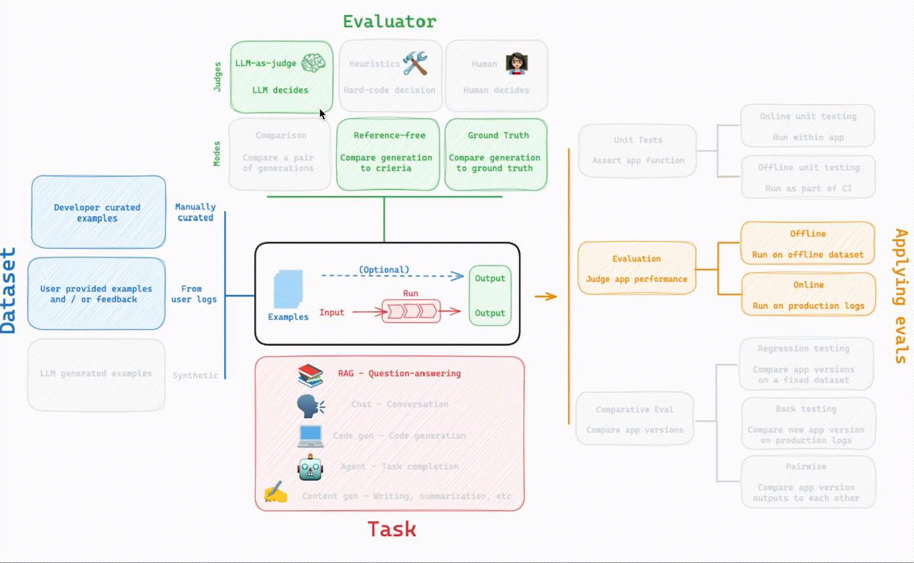

# ChatBot

[streamlit](https://streamlit.io/)을 활용한 ChatBot 구현하기

# streamlit

[streamlit api reference](https://docs.streamlit.io/develop/api-reference/text)를 보면서 쉽게 UI를 그릴 수 있는 장점

## Install Streamlit

[Install Streamlit](https://docs.streamlit.io/get-started/installation)

```shell
 $ mkdir streamlit
 $ cd streamlit
 $ pyenv virtualenv 3.11 streamlit
 $ pyenv local streamlit

 $ pip install streamlit
 $ streamlit hello
```

## Write User Message

**코드 작성**
- Streamlit은 React 기반으로 돌아가고, 자체적으로 최적화가 되어 DOM을 비교한 후 변경된 사항들만 UI를 그리도록 되어 있습니다.

```python
import streamlit as st

st.set_page_config(page_title="소득세 챗봇", page_icon="🤖")
st.title("🤖 소득세 챗봇")
st.caption("소득세에 관련된 모든것을 답해드립니다!")

# Session State 적용
# https://docs.streamlit.io/develop/api-reference/caching-and-state/st.session_state
if 'message_list' not in st.session_state:
    st.session_state.message_list = []

# Session State 에 저장된 메시지들을 화면에 렌더링
for message in st.session_state.message_list:
    with st.chat_message(message["role"]):
        st.write(message["content"])

if user_question := st.chat_input(placeholder="소득세에 관련된 궁금한 내용들을 말씀해주세요!"):
    with st.chat_message("user"):
        st.write(user_question)
    # Session State에 메시지 저장
    st.session_state.message_list.append({"role": "user", "content": user_question})
```

**streamlit 실행**

```shell
streamlit run chat.py 
```

## LangChain ChatBot & Chat History 추가하기

LangChain으로 작성한 코드를 활용한 LLM 답변 생성

<figure><figcaption></figcaption></figure>

<https://github.com/jihunparkme/study-ai/tree/main/4-chatbot>

## Few Shot을 활용한 답변 정확도 향상과 포맷 수정

`Few Shot`을 제공하면 LLM의 답변 정확도가 올라감
- [Few-shot examples](https://docs.langchain.com/langsmith/prompt-template-format#few-shot-examples)
- [Language Models are Few-Shot Learners](https://arxiv.org/abs/2005.14165)

## LangSmith를 활용한 LLM Evaluation

> `LLM Evaluation`의 중요성
>
> 사용자가 환각(할루시네이션)이 없는 정확한 정보를 받도록 서비스를 안정적으로 운영하기 위해

[LangSmith](https://www.langchain.com/langsmith/observability)를 활용한 Large Language Model (LLM) 평가
- `LangChain`에서 만든 평가 tool
- 대시보드를 제공해서 트렌드를 보기 수월
- LLM Evaluation을 통해서 쉬운 검증과 롤백이 가능

<center></center>

**Dataset**
- 도메인 전문가가 작성한 정답지
- 특정 질문이 들어오면 이러한 답변을 해야 한다는 공식을 제공

[source code](https://github.com/jihunparkme/study-ai/blob/main/5-etc/1_LangSmith%EB%A5%BC%20%ED%99%9C%EC%9A%A9%ED%95%9C_LLM_Evaluation.ipynb)

## 이제는 AI Agent의 시대

[What are AI Agents?](https://aws.amazon.com/ko/what-is/ai-agents/)

AI 에이전트는 사람이 설정한 목표를 달성하기 위해 환경과 상호작용하며 최적의 조치를 스스로 결정하고 실행하는 자기 주도형 지능형 소프트웨어

**핵심 포인트**

✅ **자율성**: 사람이 일일이 명령하지 않아도 `독립적`으로 `판단`하여 작업을 수행

✅ **상호작용**: 데이터 수집 및 환경 분석을 통해 `실시간`으로 대응

✅ **협업 가능**: 여러 에이전트가 `오케스트레이터`의 조정 아래 데이터를 교환하며 복잡한 워크플로를 완성

> AI 에이전트는 파운데이션 모델을 기반으로 환경을 인지(Perception)하고, 설정된 목표를 위해 스스로 계획(Planning) 및 추론(Reasoning)하여 최적의 도구를 실행(Action)하는 자율적 소프트웨어

## HuggingFace 오픈소스 언어모델 활용방법

[Hugging Face local pipelines integration](https://docs.langchain.com/oss/python/integrations/llms/huggingface_pipelines)

[google colab](https://colab.research.google.com/drive/1xAj9U42GWKcTY4XGjE4HSgdF8qOd4HpS?usp=sharing)

# 📚 Reference.

- [streamlit-lecture](https://github.com/jasonkang14/inflearn-streamlit-lecture)
- [rag-notebook](https://github.com/jasonkang14/inflearn-rag-notebook/tree/main)
- [DeepLearning.AI](https://www.deeplearning.ai/courses/)


TIGRT S&P500 (20%)
TIGRT 나스닥100 (20%)
ACE 글로벌반도체TOP4 PLUS (20%)