# EDA 기반 Microservice 구현

# 아키텍처 구성도

```
회원관리
- 회원을 등록한다.
- 특정 회원은 관리자의 역할을 부여 받는다.
- 회원은 시스템 사용을 위해 로그인하거나 로그아웃 할 수 있다.
도서 관리
- 관리자는 도서분류정보를 등록/수정/삭제한다.
- 사내 도서관은 판교,정자에 위치한다.
- 도서는 도서공급사가 공급하거나 기부될 수 있다.
- 입고된 도서는 사서에 의해 분류된다.
- 사서는 분류한 도서의 상태(초기값: 대여 가능)를 설정하여 대여 가능토록 한다.
- 대여/반납에 의해 도서의 상태(대여 가능,대여 중) 조정된다.
도서 대여 및 반납
- 사용자는 도서를 검색할 수 있다.
- 사용자는 베스트 대여 목록을 조회할 수 있다.
- 사용자는 대여가능한 도서를 대여 할 수 있다.(대여 조건은 2주, 1인당 5권 이내이다.)
- 반납되지 않고 대여 기간이 지난 도서는 연체된다. 연체 시 연체 포인트가 1일 10포인트 부여된다.
- 1권이라도 연체되면 사용자는 대여 불가 상태가 된다.
- 사용자는 대여한 도서를 반납할 수 있다.
- 반납시 연체료가 계산된다.
- 사용자는 대여한 도서 이력을 볼 수 있다.
- 사용자가 도서를 대여하거나 반납 시 사용자에게 10 포인트가 적립된다.
- 연체가 있으면 대여할 수 없다.
- 대여된 도서는 모두 반납이 되어야지 대여 정지를 해제할 수 있다.
- 포인트를 활용하여 대여 정지를 해제할 수 있다.
- 포인트는 연체료를 감면할 수 있다.
- 연체포인트를 0으로 만들면 대출 가능 상태가 된다.
```

.

**이벤트 스토밍 결과**

<figure>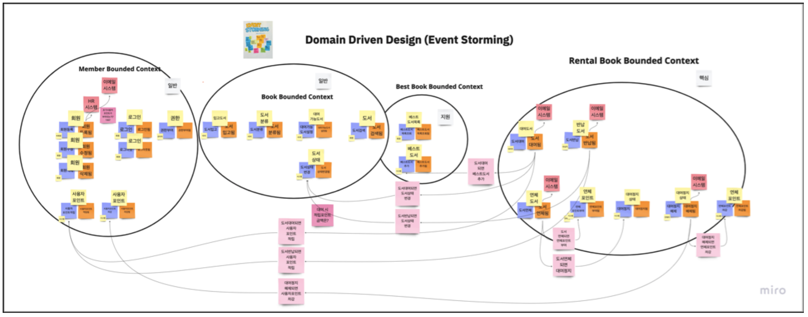<figcaption></figcaption></figure>

.

**서비스 매핑도**

<figure>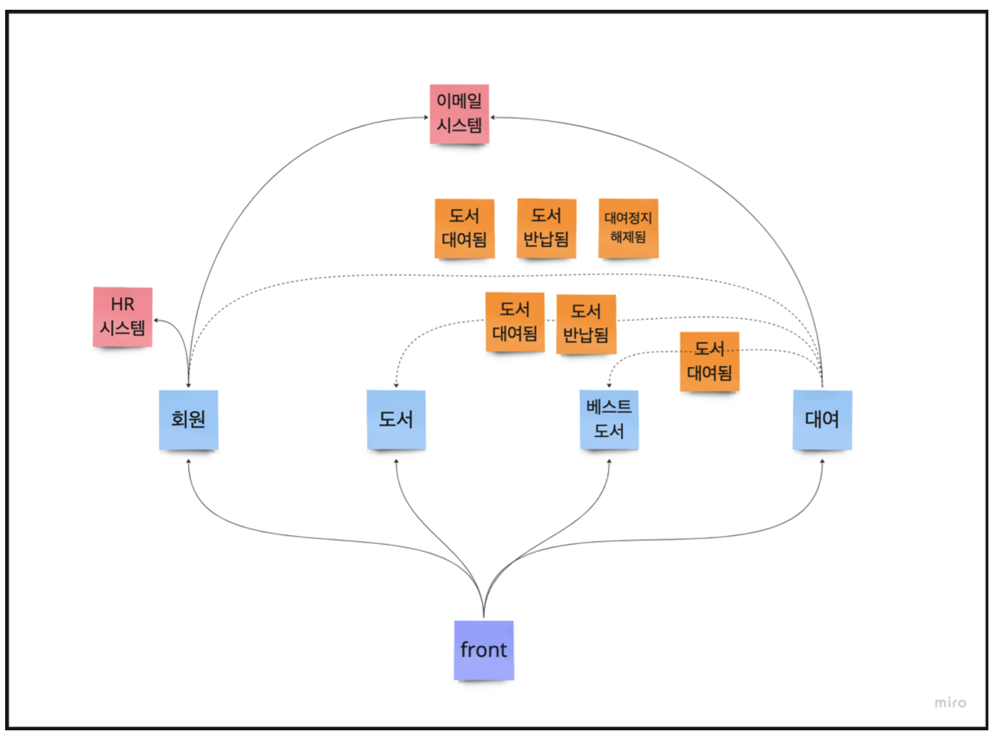<figcaption></figcaption></figure>

.

**아키텍처 구성도**

<figure>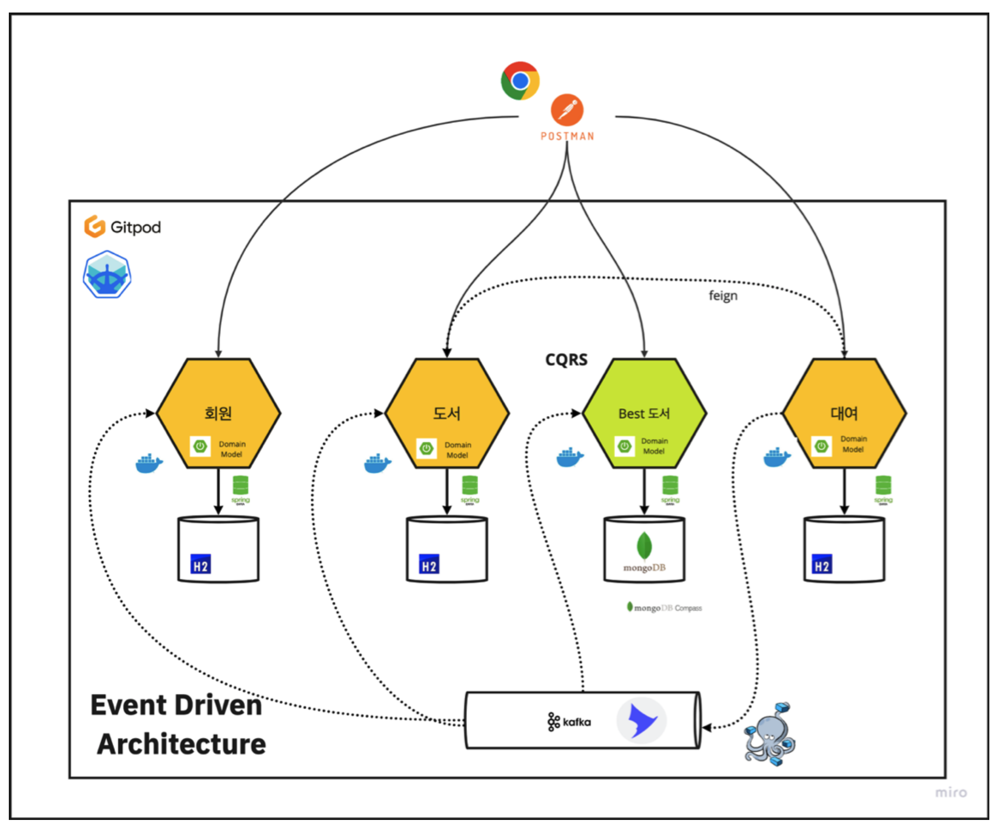<figcaption></figcaption></figure>

.

**전술적 설계(구현 전략)**

서브시스템 유형
- `핵심(Core)`: 회사가 경쟁업체와 다르게 수행하고 있는 시스템
  - 사내에서 직접 구현
  - 핵심 숙련 인재 할당
  - 가장 진보된 엔지니어링 기술 적용
- `일반(Generic)`: 모든 회사가 같은 방식으로 수행하는 비지니스 활동
  - 이미 만들어진 제품(오픈 소스 솔루션)
- `지원(Supporting)`: 회사 비지니스 지원 활동
  - 사내 구현 X
  - 고급 엔지니어링 기술 불필요

MSA 내부 아키텍처 스타일
- 헥사고날 아키텍처, 클린 아키텍처
- 레이어드 아키텍처
- CQRS

비지니스 로직 구현 스타일
- `Transaction Script`: 간단한 비지니스 로직구현, 절차지향, 트랜젝션간 비즈니스 로직 중복, 핵심 도메인 X
- `Active Record`: 자료 holding 전용 객체 사용(자료구조 외에도 CRUD 구현), Anemic Domain Model(빈약한 도메인 모델), 지원/일반 도메인
- `Domain Model`: 비지니스 로직을 POJO로 구성(인프라/기술적 관심사 분리), 응용서비스 업무 흐름 제어, 대부분의 비즈니스 로직은 도메인 모델에 위임, 핵심 도메인

<figure>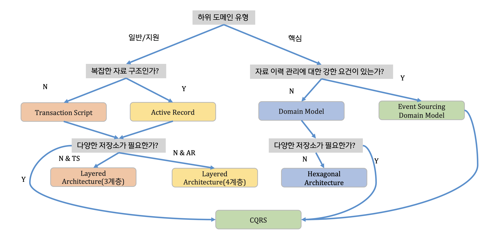<figcaption></figcaption></figure>

> 핵심 도메인 (대여)
> - Type1: 헥사고날 아키텍처, Domain Model 중심, Spring MVC, Spring DATA JPA, RDB
> 
> 일반 도메인(회원,도서)
> - Type1: 헥사고날 아키텍처, Domain Model 중심, Spring MVC, Spring DATA JPA, RDB
> 
> 지원 도메인(Best도서)
> - Type2: 레이어드 아키텍처 + CQRS, Domain Model, Spring MVC, Spring DATA, MogoDB, NoSQL

.

**Hexagonal MSA**

<figure>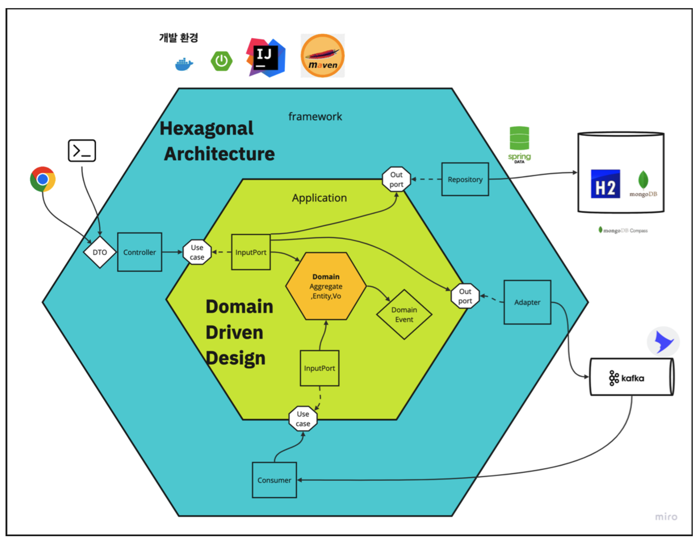<figcaption></figcaption></figure>

헥사고날 아키텍처는 도메인, 어플리케이션, 프레임워크 헥사곤으로 구성

<p align="center" width="100%">
    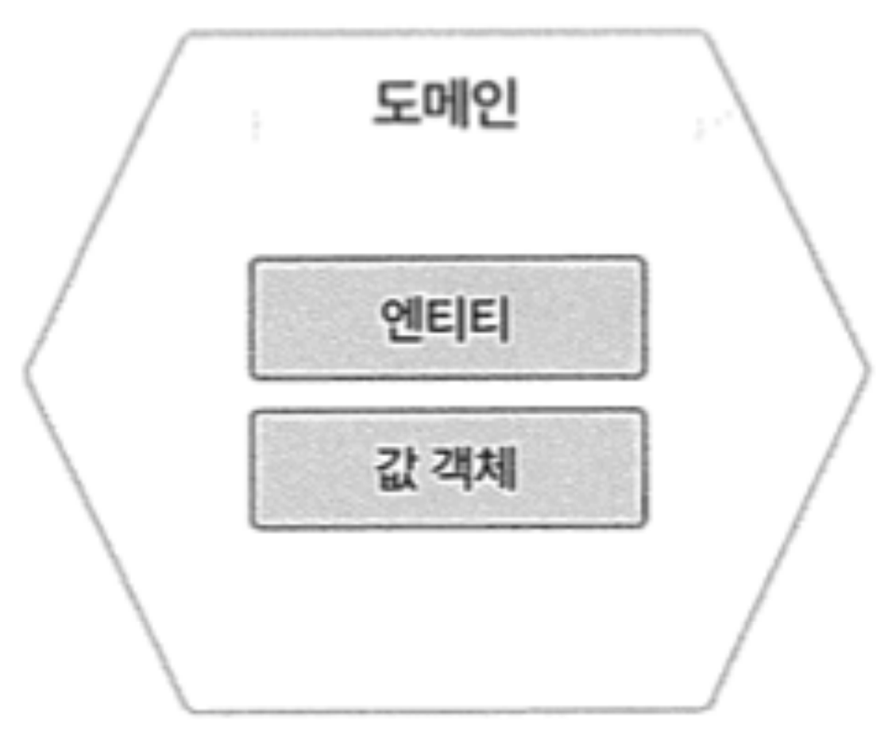
    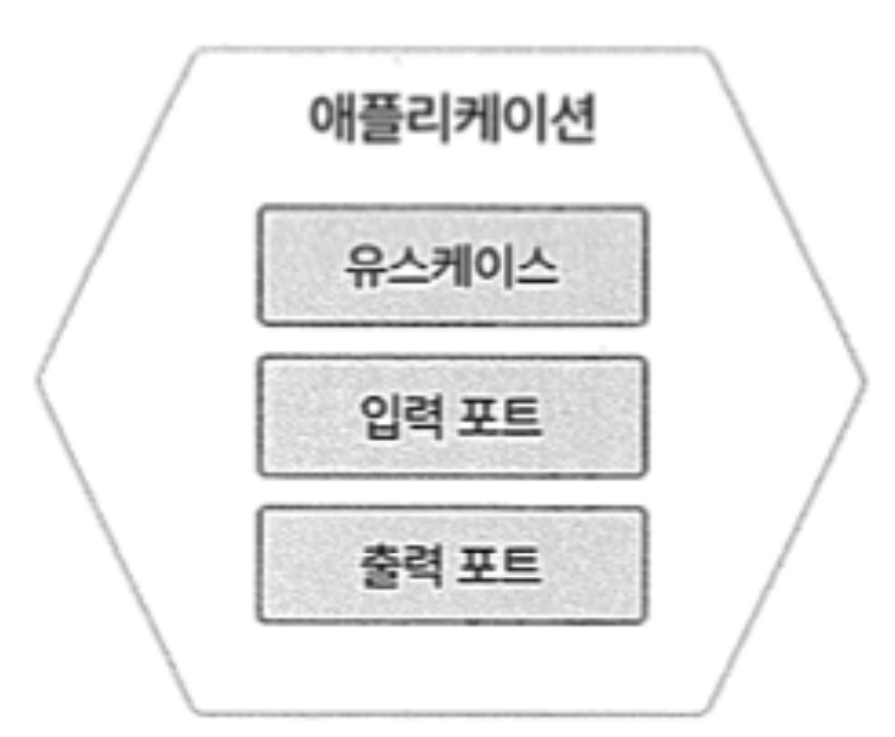
    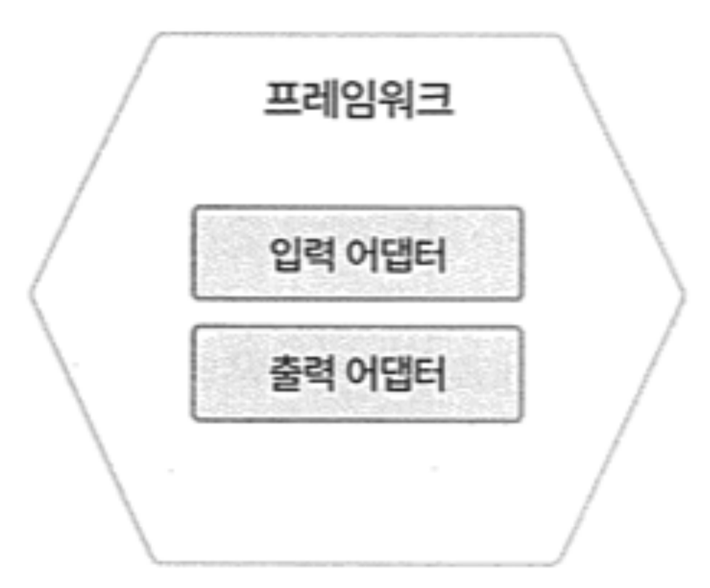
</p>

**Domain Hexagon**
- `aggregate`, `entity`, `VO`, `Enum`, `Domain Event` 로 구성
- 비지니스 로직 구현 

**Application Hexagon**
- `유스케이스(I/F)`, `입력 포트`, `출력포트(I/F)` 로 구성
- 트랜잭션 처리, 흐름 제어, 유스케이스 구현
- 유스케이스
  - 유스케이스의 입출력 매개 변수인 DTO는 애플리케이션 헥사곤 내에서 활동(framework.web 패키지에 위치)
  - DTO는 유스케이스마다 달라야 한다. (재사용을 위해 하나의 큰 DTO를 만들어 사용 X)
  - 모델을 DTO로 변경하여 사용

**Framework Hexagon**
- `입력/출력 어댑터` 로 구성
- 데이터 입/출력, 메시지 생산(발행)/소비(가입)
- API 제공

<figure>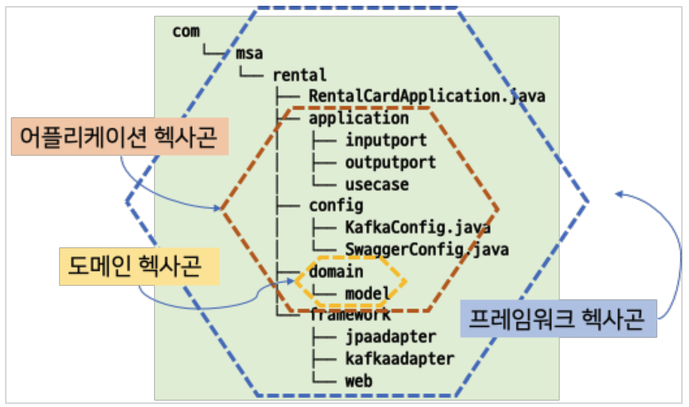<figcaption></figcaption></figure>

## 대여

[RentMS Repository](https://github.com/jihunparkme/msa-example/tree/main/RentMS)

<figure>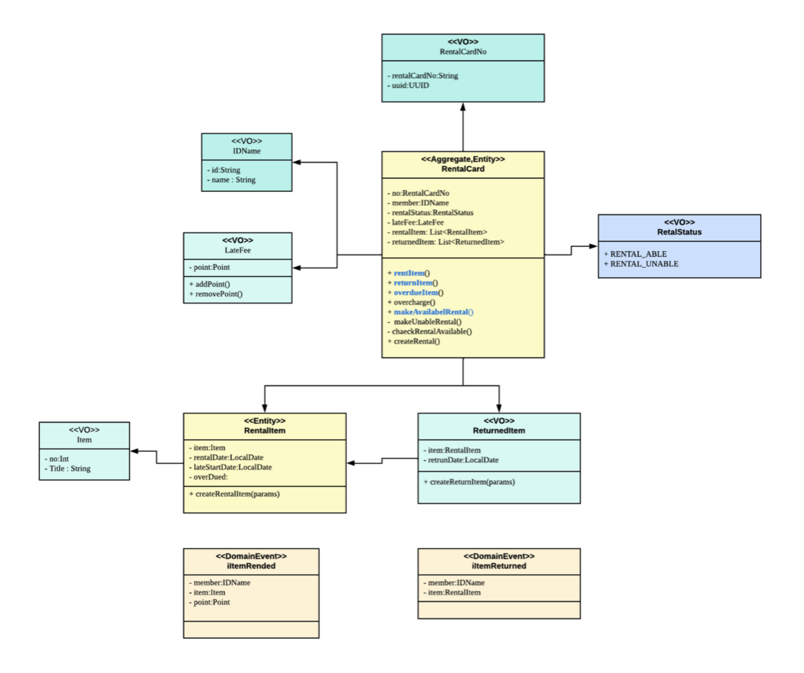<figcaption></figcaption></figure>

## 도서

[RentMS Repository](https://github.com/jihunparkme/msa-example/tree/main/BookMS)

<figure>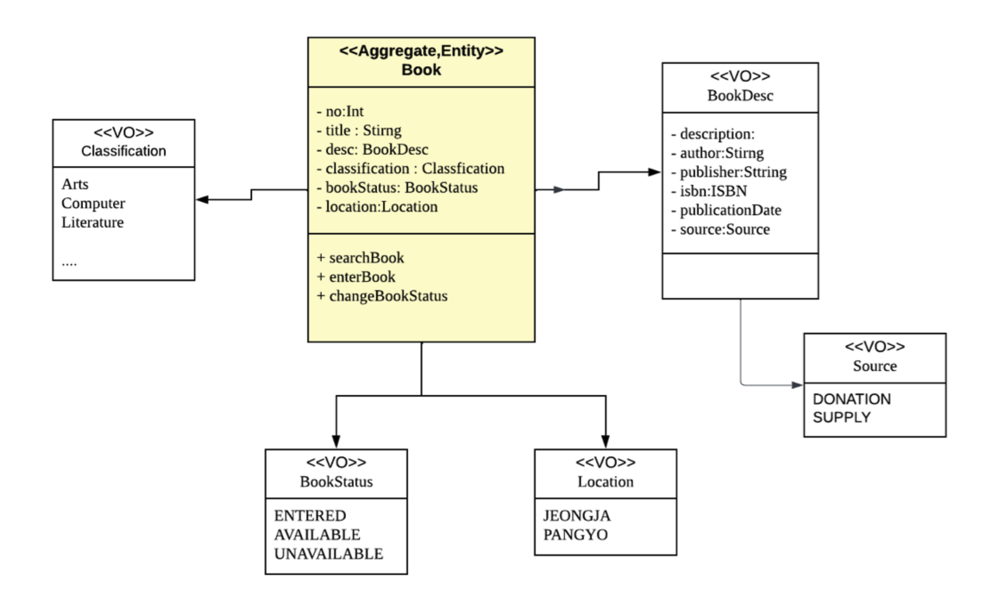<figcaption></figcaption></figure>

## 사용자

## Best 서적

## EDA