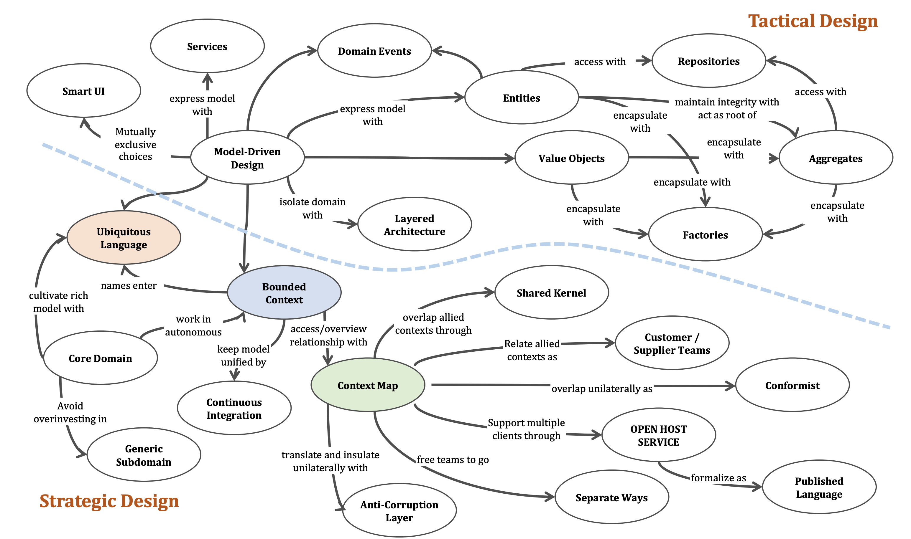
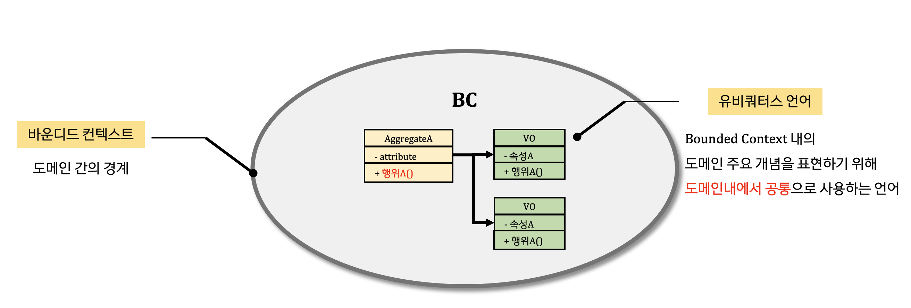

# Domain Driven Design

## DDD & Micro Service

**마이크로서비스 설계에서 도메인 주도 설계 활용**

<figure><figcaption></figcaption></figure>

`전략적 설계`를 이용한 마이크로서비스 `식별`
- 마이크로서비스을 어떤 기준으로 분리할 것인가?
  - Bounded	Context, Ubiquitous Language
- 서비스 간은 어떻게 연계할 것인가?
  - Context	Mapping
- 어떤 이벤트에 의해 마이크로서비스는 서로 반응하는가?
  - Domain Event

> 참고 도서. 
> 
> [도메인 주도 설계 핵심](https://www.yes24.com/Product/Goods/48577718)

`전술적 설계`와 미이크로서비스 `내부 설계`
- 마이크로서비스 내부는 어떻게 설계 할 것인가?
  - Domain Model

> 참고 도서. 
> 
> [도메인 주도 개발 시작하기](https://www.yes24.com/Product/Goods/108431347)
>
> [도메인 주도 설계 첫걸음](https://www.yes24.com/Product/Goods/109708596)
>
> [도메인 주도 설계 철저 입문](https://www.yes24.com/Product/Goods/93384475)

## 도메인 주도 설계

구축해야 하는 소프트웨어와 시스템을 위해서는 문제를 이해
- `Problem`: 그 조직의 비즈니스 전략과 소프트웨어를 통해서 얻고자 하는 가치
- `Business Domain`: 기업의 주요 활동 영역, 회사가 제공하는 서비스
- `Sub domain`: 비즈니스 활동의 세분화된 영역, 제공하는 서비스 단위
  - ex. 회원, 고객, 상품, 주문, 배송..

> Problem -> Business -> Domain -> Sub Domain
>
> 시스템에서 사용하는 모든 개념들이 비즈니스 도메인을 표현해야 한다.

.

### Sub Domain

핵심(Core)
- 회사만의 차별성. 복잡성이 높지만 경쟁력 제공
- 핵심 인재 할당과 진보된 엔지니어링 기술 적용
- ex) 우버의 손님 매칭 서비스, 구글의 검색 순위 알고리즘 ..

일반(Generic)
- 모든 회사가 같은 방식으로 수행하는 비지니스 활동
- 복잡하고 구현하기 어려우나 주로 오픈 소스를 사용하고, 경쟁력을 제공하지는 않음
- ex) 인증, 권한 부여 ..

지원(Supporting)	
- 회사 비지니스 지원 활동
- 간단한 기능으로 경쟁우위 제공하지 않음
- ex) CRUD, ETL

### Ubiquitous Language

도메인 지식(멘탈 모델)을 코드로 구현하기 위해 여러 변환 과정을 거치는 대신 그대로 코드로 표현
- 도메인을 코드로 설명하기 위한 단일화된 체계
- 기술 용어 대신 유비쿼터스 언어를 사용
- 유비쿼터스 언어: 동의어와 같이 모호하지 않고, 정확하고 일관성있는 언어
  - ex. 정책 -> 규제 규칙 / 보험계약, 사용자 -> 방문자, 비회원, 회원

### Domain Model

- 특정 도메인을 개념적으로 표현한 것
- 효과적인 모델은 그 목적을 달성하는 데 **필요한 세부사항만 포함**(목적에 필요한 정보만 제공)
  - ex. 지하철 노선도
- 모델은 본질적으로 **추상화의 결과**. 모델로 실세계의 복잡성을 관리
- 도메인 모델링: 유비쿼터스 언어로 비즈니스 도메인 모델 구축

### Bounded Context (BC)

<figure><figcaption></figcaption></figure>

- BC는 유비쿼터스 언어(모델)의 일관성이 유지되는 경계
- 유비쿼터스 언어를 여러 개의 작은 언어로 나눈 다음, 각 언어를 적용할 수 있는 명시적인 bounded Context에 할당
  - 유비쿼터스 언어의 용어, 원칙, 비지니스 규칙은 해당 바운디드 컨텍스트 내에서만 일관성

  ```bash
  ├── Order
  │   └── Customer: 주문하는 사람 -> Buyer
  │
  ├── Accounting
  │   └── Customer: 시스템 고객 -> Member
  │
  ├── Delivery
  │   └── Customer: 배송 받는 사람 -> Recipient
  └── 
  ```

- BC는 컴포넌트 개발의 수명주기를 분리할 필요가 있거나 기능이 독립적으로 확장되어야 할 경우 세분화될 수 있음
- 각 BC의 수명 주기는 독립적

Sub Domain 과의 차이
- 하위 도메인은 비지니스 전략에 의해 정의되는 반면 바운디드 컨텍스트는 소프트웨어 엔지니어에 의해 설계
- 하위 도메인은 발견, 바운디드 컨텍스트는 설계

### Context Mapping

- BC는 독립적으로 발전할 수 있지만 **서로 상호작용**을 해야 한다. 
  - **각 BC는 접점**이 있는데 이것이 **contract**
- BC의 연동/통합 : 각 바운디드 컨텍스트에서 작업하는 팀간의 관계를 의미
  - 협력형 패턴 그룹
    - 파트너십
    - 공유 영역
  - 사용자-제공자
  - 분리형 노선
