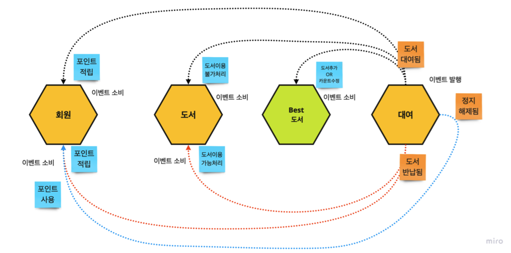
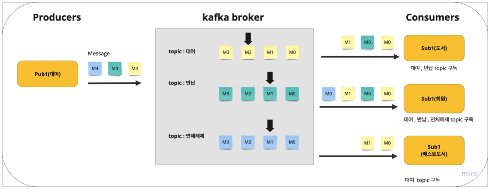

# EDA 구현

## EDA

**이벤트 기반 통신**
- 데이터 생산/소유와 데이터 접근 행위가 철저히 분리
- 이벤트 스트림은 [단일 진실 공급원(SSOT; Single Source Of Truth)](https://experience.dropbox.com/ko-kr/resources/source-of-truth)

**이벤트 브로커 vs 메시지 브로커**
- `이벤트 브로커`는 모든 컨슈머가 전체 사본 획득 가능
- `메시지 브로커`는 큐로 가져가면 사라짐

**이벤트 브로커 주요 특징**
- `확장성`: 여러 노드로 클러스터 단위 구성
- `보존성` : 노드 간 데이터 복제
- `고가용성`: 장애 분산
- `고성능`: 여러 노드 생산/소비 분담

**이벤트 보관 및 처리**
- `파티셔닝`(portioning) : 이벤트 스트림을 여러 하위 이벤트 스트림으로 파티셔닝
- `순서보장`: 스트림 파티션 내에서 데이터 순서 보장
- `불변성` : 한번 발행되면 수정 불가
- `인덱싱`: 이벤트 스트림에 기록되는 시점에 인덱스(오프셋, offset) 할당
  - 컨슈머는 다음에 읽기 시작 할 위치를 이 오프셋으로 특정하여 데이터 소비
- `무기한 보존`: 이벤트 스트림은 이벤트를 무기한 보존
- `재연성`: 필요한 데이터를 골라서 읽을 수 있도록 재연 가능

## 도메인 헥사곤 구현

**도메인 이벤트**

- 도메인의 상태를 변화시킨 시점의 사건 이력
- 결과적 일관성을 만족시키기 위해 생산/소비
- 어떤 시점의 엔티티 속성 및 상태
- 헥사고날의 내부영역, 도메인 모델에 위치

**이벤트 흐름 설계**

<figure><figcaption></figcaption></figure>

- 이벤트 설계
  - 스트림당 이벤트는 하나만 정의
  - 이벤트는 하나의 목적만 보유(대여, 반납 ..)
  - 이벤트 크기는 최소화하기
- 이벤트 흐름 설계
  - 대여(도서대여됨 Event) -> 도서, 회원, 베스트도서
  - 대여(도서반납됨 Event) -> 도서, 회원
  - 대여(대여정지해제됨 Event) -> 회원

## 카프카 토픽 설계

<figure><figcaption></figcaption></figure>

- `클러스터`: 여러 가지 노드를 묶은 상태
- `토픽`: 하나의 이벤트 스트림
- `메시지`: 이벤트 스트림으로 흘러가는 도메인 이벤트
- `오프셋`: 컨슈머가 어디까지 읽었는지 표시
- `커넥트 소스`: 카프카에서 데이터를 보내는 쪽
- `커넥트 싱크`: 어답터?
- `파티션`: 컨슈머에 따라 토픽들이 파티셔닝
- `컨슈머 그룹`: 
- `주키퍼`: 노드 관리, 각 토픽마다 컨슈머가 몇번의 오프셋을 처리했는지 기억, 특정 노드가 죽으면 어디로 가야 하는지 안내
