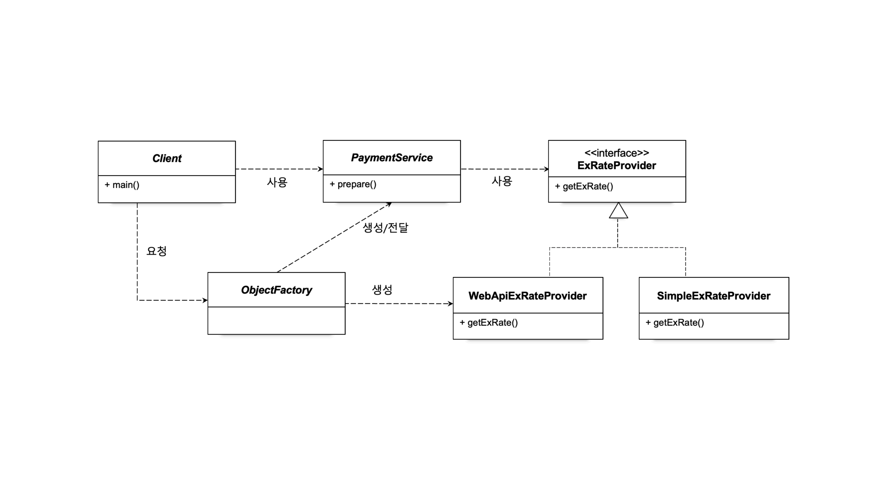
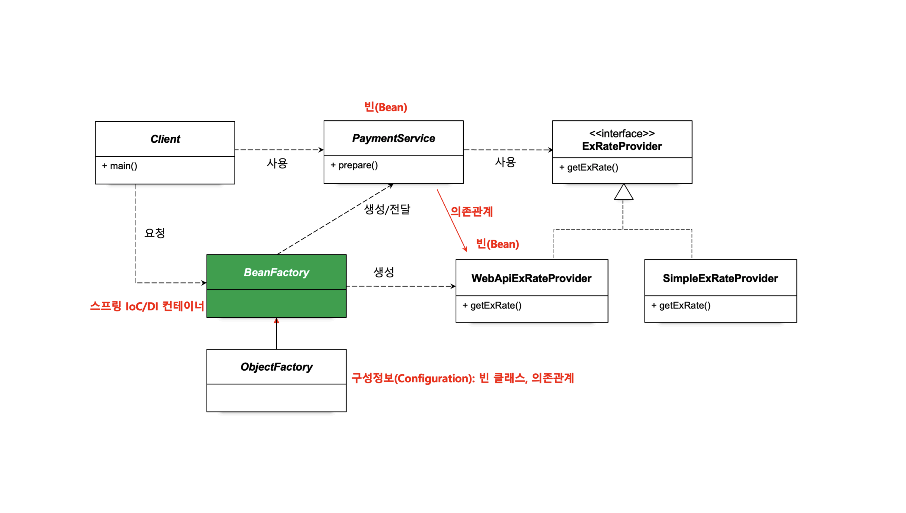
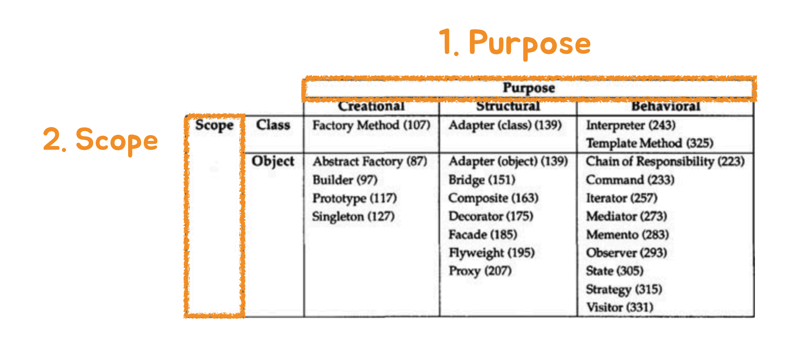
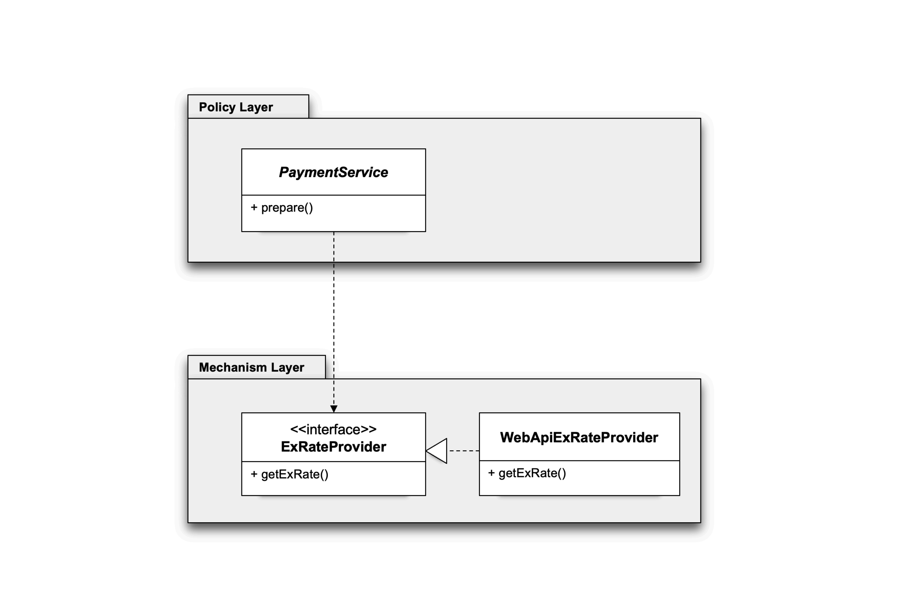
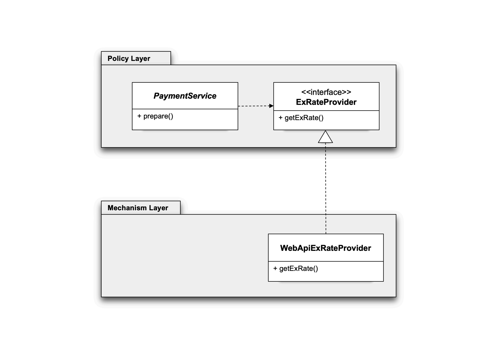
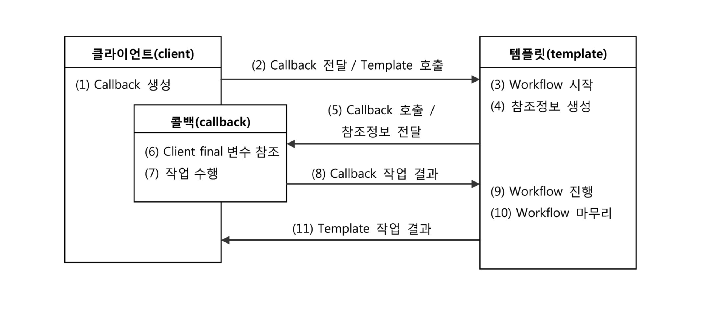
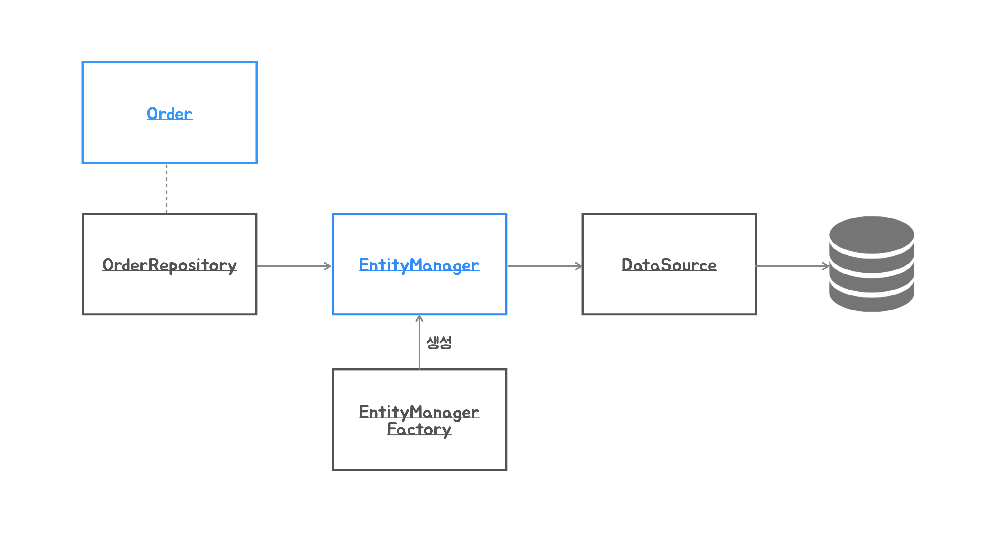
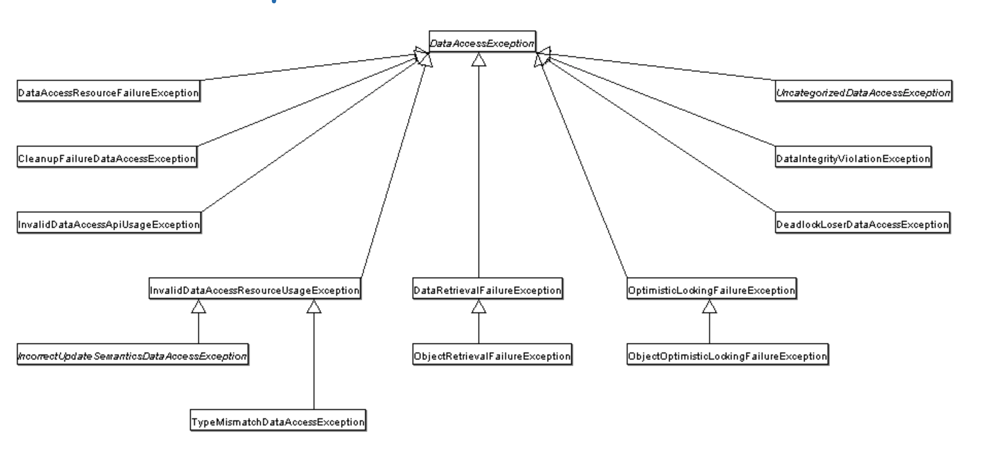

# Toby Spring Boot

토비님의 [토비의 스프링 6 - 이해와 원리](https://www.inflearn.com/course/%ED%86%A0%EB%B9%84%EC%9D%98-%EC%8A%A4%ED%94%84%EB%A7%816-%EC%9D%B4%ED%95%B4%EC%99%80-%EC%9B%90%EB%A6%AC/dashboard) 강의를 요약한 내용입니다.

[Github](https://github.com/tobyspringboot/hellospring)

[MY Project](https://github.com/jihunparkme/inflearn-toby-spring-6)

# Intro

JDK
- [Amazon corretto](https://aws.amazon.com/corretto/)
- [Eclipse Temurin](https://adoptium.net/en-GB/temurin/releases/)
- [SDK Man](https://sdkman.io/)
    ```bash
    $ sdk # sdk man 터미널 열기
    > sdk list java # java 관련 모든 설치 가능한 버전 확인
    > sdk list java | grep installed # 설치된 버전만 확인
    > sdk install java [jdk name] # 자바 설치
    > sdk use java [jdk name] # 폴더에서 해당 버전 사용
    > sdk env init # 프로젝트 폴더의 사용 JDK 저장
    > sdk env # 프로젝트 폴더의 사용 JDK 복구
    ```

API
- [httpie](https://httpie.io/)

# 오브젝트와 의존관계

### 오브젝트
- 프로그램을 실행하면 만들어져서 움직이는 것(=객체)
- 오브젝트는 일을 하며 우리가 원하는 기능을 수행
- 자바의 오브젝트는 클래스의 인스턴스 또는 배열

**클래스**
- 우리가 작성하는 코드
- 오브젝트를 만들어내기 위해 필요한 상세한 정보(설계도, 프로토타입, 모델 ..)

**인스턴스**
- 추상적인 것(ex. 클래스)에 대한 실체

.

### 의존관계
- 반드시 **두 개 이상의 대상이 존재**
  - 하나가 다른 하나를 **사용**, **호출**, **생성**, **인스턴스화**, **전송** 등을 할 때 의존관계에 있다고 이야기
- 클래스 사이에 의존관계가 있을 때 의존 대상이 변경되면 이를 사용하는 클래스의 코드도 영향을 받는다.
- 오브젝트 사이에 의존관계는 실행되는 런타임에 의존관계가 만들어지고 실행 기능에 영향을 받지만, 클래스 레벨의 의존관계와는 다를 수 있다.

.

### 관심사의 분리(Separation of Concerns)
- 관심사는 **동일한 이유로 변경되는 코드의 집합**
- API로 정보를 가져와서 JSON을 오브젝트에 매핑하는 관심과 응답 객체를 준비하는 로직은 관심이 다르다.
- 변경의 이유와 시점을 살펴보고 이를 분리하자.

> [관심사의 분리](https://github.com/jihunparkme/inflearn-toby-spring-6/commit/2c818d5bfb4a966432fa8e643e3235355d1dbeb9)

.

### 상속을 통한 확장
- 객체의 변경 없이 정보를 가져오는 방법을 확장하게 만들려면 **상속**을 이용할 수 있다.
- 어떻게 객체를 준비할 것이가와 어떻게 정보를 가져올 것인가라는 **관심사가 클래스 레벨에서 분리**된다.
- 정보를 담은 오브젝트인 ExRate를 생성하는 **책임을 서브 클래스에게 위임**하는 방식이다.
  - 객체지향 디자인 패턴에 나오는 **팩토리 메소드 패턴을 이용**한다.
- 하지만, 자바는 **다중 상속을 허용하지 않**으므로 다른 관심사를 분리할 경우 확장을 이용하기 어렵다.
  - 또한 상위 클래스의 변경에 따라 하위 클래스를 모두 변경해야 하므로 **상속을 통한 확장은 관심사를 분리하기에 한계**가 있다.

> [상속을 통한 확장](https://github.com/jihunparkme/inflearn-toby-spring-6/commit/184f5ed5d1eb4c84b2e1e08273fe18223398d7f4)

.

### 클래스의 분리
- **관심사에 따라 클래스를 분리**해서 각각 독립적으로 구성할 수 있다.
  - 결과적으로 클래스 레벨에 사용 의존관계가 만들어지기 때문에 **강한 코드 수준의 결합**이 생긴다. 
  - 실제로 사용할 클래스가 변경되면 이를 이용하는 쪽의 코드도 따라서 변경이 되어야 한다.
- 상속을 통한 확장처럼 **유연한 변경도 불가능**해진다.
- 상속한 것이 아니기 때문에 사용하는 클래스의 메소드 이름과 구조도 제각각일 수 있다. 
  - 그래서 클래스가 변경되면 많은 코드가 따라서 변경되어야 한다.
- 클래스가 다르다는 것을 제외하면 관심사의 분리가 잘 된 방법이 아니다.

> [클래스의 분리](https://github.com/jihunparkme/inflearn-toby-spring-6/commit/639866635f4865340f6ddfb0f869849fa40aafb1)

.

### 인터페이스 도입
- 독립적인 인터페이스를 정의하고 서비스가 사용할 메소드 이름을 정해둔다. 
  - 이를 각 클래스가 구현하게 만들면 이를 사용하는 쪽에서 의존하는 클래스가 변경되더라도 사용하는 메소드 이름의 변경이 일어나지 않는다.
- 하지만, 클래스의 인스턴스를 만드는 생성자를 호출하는 코드에는 클래스 이름이 등장하기 때문에 정보를 가져오는 클래스가 변경되면 서비스 코드도 일부분이지만 따라서 변경되어야 한다.
- 여전히 상속을 통한 확장만큼의 유연성도 가지지 못한다.

> [인터페이스 도입](https://github.com/jihunparkme/inflearn-toby-spring-6/commit/fe8c44bbe8450ece4c0c1754fd47835c50b2957a)

.

### 관계설정 책임의 분리
- 인터페이스 도입으로 인터페이스를 사용하도록 작성했지만 구현 클래스에 대한 정보를 가지고 있다면 서비스는 여전히 인터페이스를 구현한 특정 클래스에 의존하는 코드가 된다.
  - 자신이 어떤 클래스의 오브젝트를 사용할지를 결정한다면 관계설정 책임을 직접 가지고 있는 것이다.
  - 이 관계설정 책임을 자신을 호출하는 앞의 오브젝트에게 넘길 수 있다. 
  - 이렇게 되면 코드 레벨의 의존관계에서 자유로워진다.
- 이후에는 오직 인터페이스에만 의존하는 코드가 되기 때문에 어떤 구현 클래스의 오브젝트를 사용하게 되더라도 서비스의 코드가 변경되지 않는다.
- 관계설정 책임을 가진 앞의 클래스(Client)는 생성자를 통해서 어떤 클래스의 오브젝트를 사용할지 결정한 것을 전달해주면 된다.

> [관계설정 책임의 분리](https://github.com/jihunparkme/inflearn-toby-spring-6/commit/4b5201cf47dcd0f5ffac94ff2cce0e414c477015)

### 오브젝트 팩토리
- Client는 클라이언트로서의 책임과 서비스와 인터페이스 오브젝트 사이의 관계설정 책임을 두 가지를 가지고 있다. → 관심사의 분리가 필요하다.
- 클라이언트의 관계설정 책임을 가진 코드를 ObjectFactory라는 이름으로 분리한다. 
  - ObjectFactory는 사용할 클래스를 선정하고 오브젝트를 만들면서 의존관계가 있다면 이를 생성자에 전달해서 만드는 기능을 담당한다.

> [오브젝트 팩토리](https://github.com/jihunparkme/inflearn-toby-spring-6/commit/f52f8f5b2828786cfa276351eb39eade595a44bf)

<figure><figcaption></figcaption></figure>

## 원칙과 패턴

객체지향 설계원칙과 객체지향 디자인 패턴

**개방-폐쇄 원칙(Open-Closed Principle)**
- 클래스나 모듈은 확장에는 열려 있어야 하고 변경에는 닫혀 있어야 한다.
- 클래스가 기능을 확장할 때 클래스의 코드는 변경되지 않아야 한다.
- [TheOpenClosedPrinciple](https://blog.cleancoder.com/uncle-bob/2014/05/12/TheOpenClosedPrinciple.html)

**높은 응집도와 낮은 결합도(High Coherence and low coupling)**
- `응집도`가 높다는 것은 하나의 모듈이 하나의 책임 또는 관심사에 집중되어 있다는 뜻. 
  - 변화가 일어날 때 해당 모듈에서 변하는 부분이 크다.
- 책임과 관심사가 다른 모듈과는 낮은 `결합도`, 즉 느슨하게 연결된 형태를 유지하는 것이 바람직하다.

**전략 패턴(Strategy Pattern)**
- 자신의 기능 맥락(Context)에서, 필요에 따라서 변경이 필요한 알고리즘을 인터페이스를 통해 통째로 외부로 분리시키고, 이를 구현한 구체적인 알고리즘 클래스를 필요에 따라서 바꿔서 사용할 수 있게 하는 디자인 패턴.
- Collections.sort()는 정렬에 사용할 전략 오브제트를 전달 받아서 사용한다.
- [strategy](https://refactoring.guru/ko/design-patterns/strategy)

**제어의 역전(Inversion of Control)**
- 제어권 이전을 통한 제어관계 역전 - 프레임워크의 기본 동작 원리
- 제어권이 서비스 → 클라이언트 → ObjectFactory 로 이전
- [InversionOfControl](https://www.martinfowler.com/bliki/InversionOfControl.html)
- [Spring IoC Container and Beans](https://docs.spring.io/spring-framework/reference/core/beans/introduction.html)

## 스프링 컨테이너와 의존관계 주입

Dependency Injection

[Introduction to the Spring IoC Container and Beans](https://docs.spring.io/spring-framework/reference/core/beans/introduction.html)

**BeanFactory**
- 스프링의 BeanFactory가 앞에서 만든 ObjectFactory가 제공하던 기능을 대체한다. 
- BeanFactory는 ObjectFactory의 구성 정보를 참고해서 동작하게 만든다.
- [The BeanFactory API](https://docs.spring.io/spring-framework/reference/core/beans/beanfactory.html#page-title)

**Bean**
- 스프링 컨테이너는 빈(bean)이라고 불리는 애플리케이션을 구성하는 오브젝트를 관리하는 기능을 담당한다.
- [Bean Overview](https://docs.spring.io/spring-framework/reference/core/beans/definition.html)

<figure><figcaption></figcaption></figure>

**의존관계 주입(Dependency Injection)**

- IoC는 스프링의 동작원리를 정확하게 설명하기에는 너무 일반적인 프레임워크 동작원리를 설명하는 용어이다.
- 그래서 스프링과 같이 오브젝트의 의존관계에 대한 책임을 스프링과 같은 외부 오브젝트가 담당하도록 만드는 것을 설명하는, 의존관계 주입(`Dependency Injection`) 패턴, 줄여서 `DI`라고 불리는 용어가 마틴 파울러에 의해서 제안되었고 스프링 개발자들 사이에서, 또 이 원칙을 따라서 프레임워크를 만들거나 개발 방식을 셜명하는 다른 언어와 기술에서도 넓게 사용되고 있다.
- 스프링이 처음 등장했던 시기에는 IoC라는 용어를 주로 사용했기 때문에 이후에 DI를 사용하면서도 IoC라는 용어도 같이 쓰이기도 한다. 
- 스프링은 IoC/DI 컨테이너라는 식으로 설명하는 문서도 많이 있다. 
- [Inversion of Control Containers and the Dependency Injection pattern](https://martinfowler.com/articles/injection.html)

> [스프링 컨테이너와 의존관계 주입](https://github.com/jihunparkme/inflearn-toby-spring-6/commit/f32e4577d35f9cde56af818dc66f0c302c47a0f5)

**컨테이너**
- 애플리케이션을 구성하는 오브젝트를 만들어서 담아두고 필요할 때 사용하도록 제공하는 기능을 담당
- 보통 오브젝트를 보관하는 것뿐 아니라 생명주기(lifecycle)까지 담당
- 스프링 컨테이너는 빈이라고 부르는 오브젝트를 생성하고 의존관계를 설정하는 것까지 담당
  - 빈 오브젝트의 생명주기를 담당하는 기능도 제공

**구성정보를 가져오는 다른 방법**
- @Configuration, @Bean 애노테이션이 붙은 구성정보 클래스와 메소드를 통해서 만들어질 오브젝트와 의존관계를 정의하는 코드는, 같은 구성정보를 제공 받을 수 있다면 다양한 다른 방법으로 정의할 수 있다.
- 예전에 많이 사용하던 XML을 이용하는 방법과 @Component 애노테이션이 붙은 클래스를 모두 찾아보는 빈 스캐닝 방식과 생성자 파라미터를 보고 의존 빈 오브젝트를 선택하는데 필요한 타입 정보를 가져오는 방식을 사용할 수도 있다. 
- 빈 정보를 스캐닝에 의해서 동적으로 만들어내는 경우에는 @ComponentScan 애노테이션이 사용된다.
- 실제로는 빈 스캐닝 방식과 @Configuration/@Bean을 가진 구성정보 클래스 두 가지 방식을 혼합해서 사용한다.

> [구성정보를 가져오는 다른 방법](https://github.com/jihunparkme/inflearn-toby-spring-6/commit/585e05e625b0645be0e30c69b0b92553d978929c)

## 싱글톤 레지스트리(Singleton Registry)

싱글톤 패턴은 다음과 같은 단점을 가진다.
- private 생성자를 가지고 있기 때문에 상속할 수 없다
- 싱글톤은 테스트하기 힘들다
- 서버 환경에서는 싱글톤이 하나만 만들어지는 것을 보장하지 못한다
- 싱그톤의 사용은 전역 상태를 만들 수 있기 때문에 바람직하지 못하다

스프링은 하나의 오브젝트만 만들어져야 한다는 필요를 충족하면서도 싱글톤 패턴을 사용해서 만들었을 때의 단점을 가지지않도록 컨테이너 레벨에서 하나의 오브젝트만 만들어지는 것을 보장하는 기능을 제공한다. 
- 이렇게 싱글톤 오브젝트를 만들고 관리하는 스프링 컨테이너를 싱글톤을 등록하고 관리한다는 의미에서 싱글톤 레지스트리라고 부르기도 한다.
- 스프링의 빈이 생성되고 적용되는 범위를 빈의 스코프(scope)라고 부른다. 
- 스프링은 기본적으로 빈 오브젝트가 싱글톤 스코프를 가지도록 한다.
- 필요에 따라 여러 개의 빈 오브젝트가 만들어지도록 할 수도 있다. 

## DI와 디자인 패턴

디자인 패턴을 구분하는 두 가지 방식
- 사용 목적(purpose)
- 스코프(scope)
 
스코프에 의해서 분류하면 확장성을 가진 클래스 패턴과 오브젝트 패턴으로 나눌 수 있다.
- 클래스 패턴: 상속(inheritance)을 이용
- 오브젝트 패턴: 합성(composition)을 이용
  
<figure><figcaption></figcaption></figure>

대부분의 디자인 패턴은 오브젝트 패턴이다. 
- 가능하면 오브젝트 합성을 상속보다 더 선호하라는 디자인 패턴의 기본 객체지향 원리를 따른 것이다.
- [전략 패턴](https://refactoring.guru/design-patterns/strategy)은 오브젝트 합성을 이용
- [데코레이터 패턴](https://refactoring.guru/design-patterns/decorator) : 오브젝트에 부가적인 기능/책임을 동적으로 부여하는 디자인 패턴

> [design-patterns](https://github.com/jihunparkme/inflearn-toby-spring-6/commit/ea6552ae0031abc3dfe60fac16923b6d4fb44772)

## 의존성 역전 원칙(Dependency Inversion Principle)

- (1). 상위 수준의 모듈(ex. package)은 하위 수준의 모듈에 의존해서는 안 된다. 
  - 둘 모두 `추상화`에 의존해야 한다.
- (2). 추상화는 구체적인 사항에 의존해서는 안 된다. 
  - 구체적인 사항은 `추상화`에 의존해야 한다.

DIP는 먼저 `인터페이스`를 통해서 추상화에 의존하도록 코드를 만들어야 한다.
- 그리고 인터페이스 소유권의 역전도 필요하다

**Separate Interface Pattern**
- 인터페이스와 그 구현을 별개의 패키지에 위치시키는 패턴
- 인터페이스를 이를 구현한 클래스와 같은 패키지가 아닌 이 **인터페이스를 사용하는 클라이언트와 같은 패키지에 위치**하게 한다. 
- 만약 이를 사용하는 클래스가 여럿인 경우에는 별개의 패키지로 인터페이스 구분해둘 수 있다.
- [separatedInterface](https://martinfowler.com/eaaCatalog/separatedInterface.html)

<p align="center" width="100%">
    
    
</p>

> 의존성 역전 원칙을 잘 따르는 코드를 만드는 방법.
>
> (1) 인터페이스를 만들어서 추상화하기.
>
> (2) 모든 코드가 추상화에만 의존하도록 만들기.
>
> (3) 인터페이스를 사용하는 코드가 있는 모듈로 이전(역전)시키기.
>
> [의존성 역전 원칙(DIP)](https://github.com/jihunparkme/inflearn-toby-spring-6/commit/61fd849e5f17e40aaf686869acb5603427e6478a)

# 테스트

**자동으로 수행되는 테스트(Automated Test)**
- 수동으로 개발한 코드를 테스트하는 방법은 번거롭고 활용하는데 한계
- 코드로 만들어져 언제든 실행해서 테스트할 수 있는 자동으로 수행되는 테스트가 필요
  - 이를 통해서 지속적인 개선과 점진적인 개발이 가능

**개발자가 만드는 테스트**
- 테스트를 코드로 만들고 자동으로 수행되는 테스트를 실행해서 작성한 코드에 대한 피드백
- 테스트 작성과 실행이 개발을 하는 과정의 일부
- 테스팅 프레임워크를 이용해서 테스트 작성과 실행 과정을 효율적으로 진행

.

## JUnit 테스트
- JUnit은 켄트 벡과 에릭 감마가 처음 개발한 가장 대표적인 자동화된 테스트 수행 도구
- 자바 외의 다른 언어로도 유사하게 개발되어지면서 이를 통틀어 xUnit이라고 불림

JUnit 5
- 스프링 프레임워크 자체 테스트에 사용되고, 스프링을 이용해서 개발하는 프로젝트에서도 가장 많이 사용
- Junit은 기본적인 동작방식으로 각 테스트를 실행할 때마다 매번 새로운 인스턴스를 생성
  - 모든 테스트가 다른 테스트에 영향을 받지 않고, 독립적으로 실행되도록
- [JUnit 5](https://junit.org/junit5/)
- [JUnit 5 User Guide](https://junit.org/junit5/docs/current/user-guide/)

> [JUnit 테스트 작성](https://github.com/jihunparkme/inflearn-toby-spring-6/commit/967910b5e928ac41b3cf3eeea0d52bd9f49ee0bb)

.

**PaymentService 테스트**
- 자동화된 테스트는 언제든 실행할 수 있고 항상 동일한 테스트 결과를 얻어야 한다.
- 때로는 외부 시스템에 대한 테스트, 현재 시간과 같이 코드에서 쉽게 제어할 수 없는 값을 이용하는 테스트를 작성해야 하는데, 이런 경우에 일관된 결과를 보장하는 테스트 코드를 작성하기가 쉽지 않다.
- [System Under Test(SUT)](http://xunitpatterns.com/SUT.html)

> [PaymentServiceTest](https://github.com/jihunparkme/inflearn-toby-spring-6/commit/0d75d41c123feb4560d7c4ef5596eb5ff80ba3e7)

## 테스트와 DI

테스트 대역(`Test Double`, Imposter), 스텁(`Stub`), 목(`Mock`)
- [Test Double](https://martinfowler.com/bliki/TestDouble.html)
- [Mocks Aren't Stubs](https://martinfowler.com/articles/mocksArentStubs.html)

> [Stub Test](https://github.com/jihunparkme/inflearn-toby-spring-6/commit/0f3552b0d8d7a33fca0a7029f001b39450936c6e)

.

**스프링 DI를 이용하는 테스트**
- 스프링 컨테이너를 구성하고 여기서 테스트에 필요한 대상과 의존 오브젝트를 설정하거나 테스트에서 참고할 빈 오브젝트를 가져오게 할 수 있다.
- 스프링은 방대한 양의 테스팅 지원 기술을 제공한다.
  - [Spring Testing](https://docs.spring.io/spring-framework/reference/testing.html)

.

JUnit에서 스프링 컨테이너를 만들어 테스트를 수행할 때 `@ExtendWith`과 `@ContextConfiguration`을 이용한다.

**`@ExtendedWith`**
- JUnit5 테스트 클래스가 스프링 테스팅 기능을 사용하도록 지정
- `@ContextConfiguration`과 결합된 합성 애노테이션인 `@SpringJUnitConfig`을 이용할 수도 있다.
- [@SpringJUnitConfig](https://docs.spring.io/spring-framework/reference/testing/annotations/integration-junit-jupiter.html#integration-testing-annotations-junit-jupiter-springjunitconfig)

**`@ContextConfiguration`**
- [@ContextConfiguration](https://docs.spring.io/spring-framework/reference/testing/annotations/integration-spring/annotation-contextconfiguration.html#page-title)

**`Autowired`**
- 테스트 코드에 @Autowired가 붙은 인스턴스 변수를 선언하며 스프링 테스트에 의해서 인스턴스 변수의 타입과 일치하는 스프링 컨테이너의 빈 오브젝트를 주입해준다.
- @Autowired 외에도 스프링에서 지원하는 여러가지 종류의 애노테이션을 지원한다.
- [Standard Annotation Support](https://docs.spring.io/spring-framework/reference/testing/annotations/integration-standard.html#pagetitle)

> [Spring Test](https://github.com/jihunparkme/inflearn-toby-spring-6/commit/8470fb491faa1484a353048ecd253132db96b603)

.

**학습 테스트(Learning Test)**
- 켄트 벡의 테스트주도개발이라는 책에서 소개된 테스트 방법의 한 가지
- 학습 테스트는 내가 만들지 않은 코드, 라이브러리, API 등에 대한 테스트
- 학습 테스트의 목적은 사용할 API나 프레임워크의 기능을 테스트로 작성하고 실행해보면서 사용방법을 바르게 이해했는지 확인
- 학습 테스트는 켄트 벡의 테스트 주도 개발과 로버트 마틴의 클린 코드에서 소개

> [Learning Test](https://github.com/jihunparkme/inflearn-toby-spring-6/commit/c6e073ed49b2cdb69168f08c50815896ecb0b9fc)
>
> [Clock을 이용한 시간 테스트](https://jihunparkme.gitbook.io/docs/)

.

**도메인 모델 아키텍처 패턴**
- 도메인 로직, 비즈니스 로직을 어디에 둘 지 결정하는 패턴
  - (1) 트랜잭션 스크립트 - 서비스 메소드(PaymentService.prepare)
  - (2) 도메인 모델 - 도메인 모델 오브젝트(Payment)

> [도메인 오브젝트 테스트](https://github.com/jihunparkme/inflearn-toby-spring-6/commit/fd74eb03f48aad8bc86f8c4076db846488e1d5a6)

.

**개발자가 만드는 테스트**
- 개발한 코드에 대한 검증 기능을 코드로 작성
- 자동으로 테스트를 수행하고 결과를 확인
- 테스팅 프레임워크를 활용
- 테스트 작성과 실행도 개발 과정의 일부이다

# 템플릿

**템플릿(Template)**
- 고정된 작업 흐름 안에 변경할 수 있는 코드를 콜백 형태로 전달해서 사용할 수 있도록 만들어진 오브젝트

**템플릿 메소드 패턴(Template Method Pattern)**
- 상속을 이용해서 고정된 템플릿과 변경 가능한 훅 메소드 등으로 분리하는 패턴
- 고정된 틀의 로직을 가진 템플릿 메소드를 슈퍼클래스에 두고, 바뀌는 부분을 서브클래스의 메소드에 두는 구조
- 하나의 메소드를 가진 인터페이스 타입(SAM)의 오브젝트 또는 람다 오브젝트

**콜백(Callback)**
- 실행되는 것을 목적으로 다른 오브젝트의 메소드에 전달되는 오브젝트
- 파라미터로 전달되지만 값을 참조하기 위한 것이 아니라 특정 로직을 담은 메소드를 실행시키는 것이 목적
- 템플릿에 메소드 주입 방식으로 전달

**메소드 호출 주입(method call injection)**
- DI의 일종으로 컨테이너의 구성 정보에 포함되지 않고 메소드 실행 시점에 의존 오브젝트를 파라미터로 주입하는 방식으로 동작
- 스프링의 룩업 메소드 주입(lookup method injection)과는 다르고, 런타임 상속을 통해서 메소드의 구현 코드를 직접 주입하는 방식

**템플릿 콜백 패턴(Template Callback Pattern)**
- 코드 중에서 변경이 거의 일어나지 않으며 일정한 패턴으로 유지되는 특성을 가진 부분(`템플릿`)을 자유롭게 변경되는 성질을 가진 부분(`콜백`)으로부터 독립시켜서 효과적으로 활용할 수 있도록 하는 방법
- 템플릿과 콜백을 사용하는 방식은 프레임워크에 적용되는 제어의 역전으로 설명 가능
  - 컨텍스트에 전략(콜백)을 교체해서 쓰는 **전략 패턴의 특별한 케이스**로 볼 수도 있음
  - 콜백은 인터페이스로 만들어지고 대부분 하나의 메소드만 가짐
- 콜백을 이용해서 확장성을 추구하는 방식은 스프링을 만든 로드 존슨이 쓴 J2EE Design And Development에서 처음 소개
  - 책에서 예로든 템플릿은 JDBC를 다루는 코드에 적용하도록 만들어진 JdbcTemplate이고, 후에 스프링 프레임워크가 만들어질 때 포함

<figure><figcaption></figcaption></figure>

> 패턴 적용 전 리펙토링
> - [WebApiExRateProvider](https://github.com/jihunparkme/inflearn-toby-spring-6/commit/c10ca6966ded0515d659a70a39b91d257f55791a)
> - [변하는 코드 분리하기 / 메소드 추출](https://github.com/jihunparkme/inflearn-toby-spring-6/commit/67a4843d1797e46833f8f829e67d7a52a5826ffc)
> - [변하지 않는 코드 분리하기 / 메소드 추출](https://github.com/jihunparkme/inflearn-toby-spring-6/commit/18435175527e930ef8658c43f8604208cd6b3e9d)
> - [ApiExecutor 분리 / 인터페이스 도입과 클래스 분리](https://github.com/jihunparkme/inflearn-toby-spring-6/commit/bc868838c1345774365681379abbbaa22d15f75a)
>
> 패턴 적용
> - [ApiExecutor 콜백과 메소드 주입](https://github.com/jihunparkme/inflearn-toby-spring-6/commit/45e49607778011c98ddf40ba2637563147dd3dc2)
> - [ExRateExtractor 콜백](https://github.com/jihunparkme/inflearn-toby-spring-6/commit/cea96e69f4a4a8b4c97c06a0316acbe3f29bf1be)
> - [ApiTemplate 분리](https://github.com/jihunparkme/inflearn-toby-spring-6/commit/d2fabeb718af150eee587552bbab7cf68daf016b)
>
> 디폴트 콜백과 템플릿 빈 적용
> - [디폴트 콜백과 템플릿 빈](https://github.com/jihunparkme/inflearn-toby-spring-6/commit/31cb20d8130890a4d44090b669b905b73fafe7b6)

## 스프링 제공 템플릿

### RestTemplate

[RestTemplate](https://docs.spring.io/spring-framework/reference/integration/rest-clients.html#rest-resttemplate) 는  HTTP API 요청을 처리하는 템플릿

- 가장 전형적인 스프링의 템플릿과 콜백 기술을 사용한 기술
- 스프링이 제공하는 가장 오래된 동기 방식의 REST 클라이언트 기술의 하나
- GET, POST 메소드를 사용하는 간단한 HTTP API를 호출할 때 사용하기에 편리
- 다양한 HTTP API 기술을 이용하도록 만들 수 있다.
- 최근에 스프링에 추가된 RestClient을 이용하면 모던한 API 스타일로 된 HTTP API를 호출하는 코드를 만들 수 있고, 여러가지 콜백 오브젝트를 지원

**HTTP Client 라이브러리 확장** : [ClientHttpRequestFactory](https://docs.spring.io/spring-framework/docs/current/javadoc-api/org/springframework/http/client/ClientHttpRequestFactory.html)
  - HTTP Client 기술을 사용해서 ClientHttpRequest를 생성하는 전략
    - SimpleClientHttpRequest (HttpURLConnection)
    - JdkClientHttpRequest (HttpClient)
    - NettyClientRequest
    - JettyClientRequest
    - OkHttp3ClientReque

**Message Body 변환 전략** : [HttpMessageConverter](https://docs.spring.io/spring-framework/docs/current/javadoc-api/org/springframework/http/converter/HttpMessageConverter.html)

**RestTemplate.doExecute()**

```java
protected <T> T doExecute(URI url, @Nullable String uriTemplate, @Nullable HttpMethod method, @Nullable RequestCallback requestCallback, @Nullable ResponseExtractor<T> responseExtractor) throws RestClientException {
```

- HTTP API 호출 workflow를 가지고 있는 템플릿 메소드로 두 개의 콜백을 받음
- `RequestCallback`
  - void doWithRequest㏗ClientHttpRequest request㏘ throws IOException;
- `ResponseExtractor`
  - T extractData㏗ClientHttpResponse response㏘ throws IOException;
- `execute()`, `getForObject()`, `postForEntity()` 등 편리한 메소드 제공

> [RestTemplate 활용](https://github.com/jihunparkme/inflearn-toby-spring-6/commit/25d41edb30ee6b5b4ef984c2cd83d692d1e3d5ce)

### In addition

**JdbcTemplate**
- SQL 쿼리를 수행하거나 등록, 수정, 프로시저 호출을 할 때 사용할 수 있는 템플릿
- [Using JdbcTemplate](https://docs.spring.io/spring-framework/reference/data-access/jdbc/core.html#jdbc-JdbcTemplate)

**JdbcClient**
- 스프링 6에는 JdbcTemplate을 좀 더 모던하게 만든 JdbcClient가 추가
- [Unified JDBC Query/Update Operations: JdbcClient](https://docs.spring.io/spring-framework/reference/data-access/jdbc/core.html#jdbc-JdbcClient)
- JdbcTemplate에서 사용하는 RowMapper와 같은 콜백 사용 가능

**TransactionTemplate**
- 스프링의 트랜잭션 추상화 기술과 함께 사용 가능한 데이터 트랜잭션 작업용 템플릿
- @Transactional이 제공하는 트랜잭션 경계설정 기능을 TransactionTemplate으로도 모두 적용 가능
- JDBC, JPA, MyBatis, Hibernate 등의 다양한 데이터 기술에 모두 사용 가능
- [Programmatic Transaction Management](https://docs.spring.io/spring-framework/reference/data-access/transaction/programmatic.html#tx-progtemplate)

**JmsTemplate**

**HibernateTemplate**

**SqlSessionTemplate**

# 예외

[The Java Tutorials Exceptions](https://docs.oracle.com/javase/tutorial/essential/exceptions/index.html)

예외는 정상적인 흐름의 진행을 어렵게 만드는 이벤트
- 예외적인 상황에서만 사용
- 많은 경우 프로그램 오류, 버그로 발생
- 재시도, 대안을 통해 예외 상황을 복구해서 정상 흐름으로 전환을 대비

**Error**
- 시스템에 `비정상적인 상황`이 발생했을 때 사용되고 주로 JVM에서 발생
- 일반적으로 애플리케이션에서 `복구를 기대할 수 없는 종류`의 예외의 슈퍼 클래스
- OutOfMemoryError, ThreadDeath

**Exception (checked exception)**
- Exception은 애플리케이션이 `복구를 기대할 수도 있는 모든 예외`의 슈퍼 클래스
  - 복구할 수 없다면 RuntimeException이나 적절한 추상화 레벨의 예외로 전환해서 던지기
- 언체크 예외/런타임 예외가 아닌 `애플리케이션에서 발생되는 예외`는 체크 예외로 분류
- 체크 예외는 `catch`를 사용해서 잡아내든가, 메소드에서 `throws`를 정의해서 메소드 밖으로 던져야 함

**RuntimeException (unchecked exception)**
- 명시적인 `예외처리가 강제되지 않음`
- catch/throws를 쓰지 않아도 문제 없이 컴파일

## JPA

자바에서 RDB를 사용하는 모든 기술(JDBC, JPA, MyBatis..)은 DB와의 연결 정보를 관리하는 DataSource를 사용
- [Connecting with DataSource Objects](https://docs.oracle.com/javase/tutorial/jdbc/basics/sqldatasources.html)

**EmbeddedDatabaseBuilder**
- 애플리케이션 내장형 DB(H2, HSQL, Derby)를 빠르게 셋업하고 DataSource를 생성하는데 사용하는 빌더
- [Class EmbeddedDatabaseBuilder](https://docs.spring.io/spring-framework/docs/current/javadoc-api/org/springframework/jdbc/datasource/embedded/EmbeddedDatabaseBuilder.html)

**LocalContainerEntityManagerFactoryBean**
- EntityManagerFactory를 XML 없이 스프링의 빈 설정용 팩토리 메소드에서 간단히 생성하는데 사용
- [Using LocalContainerEntityManagerFactoryBean](https://docs.spring.io/spring-framework/reference/data-access/orm/jpa.html#orm-jpa-setup-lcemfb)

JPA의 EntityManager는 EntityManagerFactory가 있어야 만들 수 있다.

<figure><figcaption></figcaption></figure>

- `Repository`, `EntityManagerFactory`, `DataSource` 는 Bean으로 등록되어 관리
- 스프링 부트의 자동 구성 방식을 이용해 JPA 사용 시 `EntityManagerFactory`, `DataSource` 빈을 자동으로 등록

> [JPA를 이용한 Order 저장](https://github.com/jihunparkme/inflearn-toby-spring-6/commit/52b34841d2c7ffe8670af5b47e2e149ce4a02304)

### EntityManager와 트랜잭션

코드에 의해서 엔티티 매니저를 생성하고 트랜잭션을 가져와 JPA의 기능을 사용하는 기본 코드는 다음과 같은 구조를 가진다.
- [Database transaction demarcation](https://docs.jboss.org/hibernate/stable/entitymanager/reference/en/html/transactions.html#transactions-demarcation)

```java
// Non-managed environment idiom
EntityManager em = emf.createEntityManager();
EntityTransaction tx = null;
try {
    tx = em.getTransaction();
    tx.begin();

    // do some work
    ...

    tx.commit();
}
catch (RuntimeException e) {
    if ( tx != null && tx.isActive() ) tx.rollback();
    throw e; // or display error message
}
finally {
    em.close();
}
```

### Order 리포지토리와 예외

JDBC를 수행중에 발생하는 예외는 `SQLException`으로 만들어져서 던져진다.
- [Handling SQLExceptions](https://docs.oracle.com/javase/tutorial/jdbc/basics/sqlexception.html)

JPA를 이용하는 코드에서 예외가 발생하면 주로 JDBC의 SQLException을 랩핑해서 `JPA의 표준 예외`로 만들어서 던져진다.
- [jakarta.persistence.PersistenceException](https://jakarta.ee/specifications/persistence/2.2/apidocs/javax/persistence/persistenceexception) 표준 JPA의 예외 안에 JPA의 구현 기술(Hibernate 등)의 예외가 다시 랩핑되어서 던져진다

> [Order 리포지토리와 예외](https://github.com/jihunparkme/inflearn-toby-spring-6/commit/520cc76f7d38b40ffa1b6c1ff1f50767d567b0ea)

### DataAccessException 추상화

**JDBC SQLException**
- JDBC를 기반으로 하는 모든 기술에서 발생하는 예외
  - JDBC, MyBatis, JPA ...
- DB 에러코드에 의존하거나, 데이터 기술에 의존적인 예외처리

**DataAccessException**
- DB의 에러코드와 데이터 액세스 기술에 독립적인 예외 구조
- 적절한 예외 번역(exception translation) 도구를 제공
- [Uses of Class org.springframework.dao.DataAccessException](https://docs.spring.io/spring-framework/docs/current/javadoc-api/org/springframework/dao/class-use/DataAccessException.html)

<figure><figcaption></figcaption></figure>

스프링의 데이터 예외 추상화가 적용되면 JDBC의 SQLException, JPA의 예외 등이 스프링이 정의한 예외 계층구조의 예외로 번역되고, 실제 발생한 예외는 래핑된 형태로 전달

- [Consistent Exception Hierarchy](https://docs.spring.io/spring-framework/reference/data-access/dao.html#dao-exceptions)

> 기술의 변화가 예외 처리하는 코드에 영향을 주지 않도록 만들자.
>
> -[DataAccessException과 예외 추상화](https://github.com/jihunparkme/inflearn-toby-spring-6/commit/70b990fbbb05967cda370f8f1d86fd7c807f47f6)

# 서비스 추상화

자바 서버 기술(J2Ee/JavaEE)은 여러 계층으로 구분해서 개발하는 레이어 아키텍처를 이용
- [Java Designing Applications](https://docs.oracle.com/cd/E19644-01/817-5448/dgdesign.html)
- [Create Web Applications Efficiently With the Spring Boot MVC Framework](https://openclassrooms.com/en/courses/5684146-create-web-applications-efficiently-with-the-spring-boot-mvc-framework/6156961-organize-your-application-code-in-three-tier-architecture)

보통 애플리케이션의 **비즈니스 로직/도메인 로직의 코드가 위치하는 계층**을 `서비스 계층`이라고 부른다. 그 외에도 다양한 이름으로 불린다.
- [Service Layer](https://martinfowler.com/eaaCatalog/serviceLayer.html)

## 트랜잭션 서비스 추상화

스프링의 트랜잭션 관리 기술의 핵심은 트랜잭션 추상화
- [Understanding the Spring Framework Transaction Abstraction](https://docs.spring.io/spring-framework/reference/data-access/transaction/strategies.html#page-title)

데이터 액세스 기술에 상관없이 공통적으로 적용되는 트랜잭션 인터페이스인 `PlatformTransactionManager` 제공

```java
public interface PlatformTransactionManager extends TransactionManager {
    TransactionStatus getTransaction(@Nullable TransactionDefinition definition) throws TransactionException;

    void commit(TransactionStatus status) throws TransactionException;

    void rollback(TransactionStatus status) throws TransactionException;
}
```

.

**JDBC 데이터 액세스 기술**

JdbcClient를 이용하면 SQL을 사용하는 간단한 코드로 안전하고, 트랜잭션 추상화가 적용된 DB 액세스 코드를 작성 가능
- [Unified JDBC Query/Update Operations: JdbcClient](https://docs.spring.io/spring-framework/reference/data-access/jdbc/core.html#jdbc-JdbcClient)

JDBC를 직접 사용하는 코드를 이용할 때는 `JdbcTransactionManager`를 `Transaction Manager Object`로 등록해서 사용

.