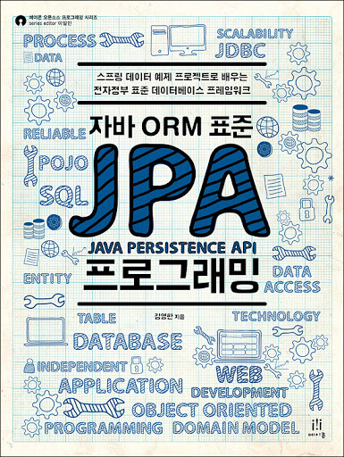

# 자바 ORM 표준 JPA 프로그래밍

[자바 ORM 표준 JPA 프로그래밍](https://product.kyobobook.co.kr/detail/S000000935744) 책을 요약한 내용입니다.

<figure><figcaption></figcaption></figure>

[\[JPA\] JPA(Java Persistence API)가 뭐지!?](https://data-make.tistory.com/608)

[\[JPA\] 영속성(persistence)이란?](https://data-make.tistory.com/609)

[\[JPA\] 엔티티와 매핑. @Entity, @Table, @Id, @Column..](https://data-make.tistory.com/610)

[\[JPA\] 연관관계 매핑이란.?](https://data-make.tistory.com/611)

[\[JPA\] 다양한 연관관계 매핑](https://data-make.tistory.com/612)

[\[JPA\] 고급 매핑(상속관계, 복합키, 식별/비식별, 조인 테이블)](https://data-make.tistory.com/613)

[\[JPA\] JPQL Query 정리](https://data-make.tistory.com/614)

[\[JPA\] QueryDSL 정리](https://data-make.tistory.com/615)

[\[JPA\] 네이티브 SQL 정리](https://data-make.tistory.com/616)

[\[JPA\] 벌크 연산이란?](https://data-make.tistory.com/617)

[\[Spring + JPA\] Make Web Application (1)](https://data-make.tistory.com/618)

[\[Spring + JPA\] Make Web Application (2)](https://data-make.tistory.com/619)

[\[Spring + JPA\] Spring Data JPA 란? (1)](https://data-make.tistory.com/621)

[\[Spring + JPA\] Spring Data JPA 란? (2)](https://data-make.tistory.com/622)

[\[Spring Data JPA\] Make Web Application (3)](https://data-make.tistory.com/626)

[\[JPA\] 영속성(persistence) 관리 (OSIV)](https://data-make.tistory.com/627)

[\[JPA\] 엔티티 그래프 (Entity Graph)](https://data-make.tistory.com/628)

[\[JPA\] 엔티티 비교, 프록시, 성능 최적화](https://data-make.tistory.com/629)
